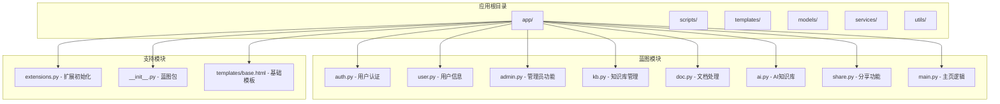
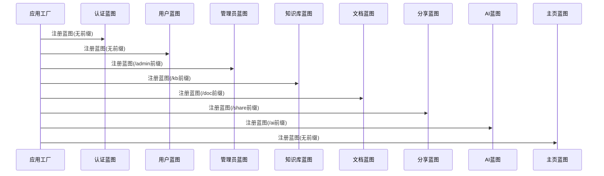
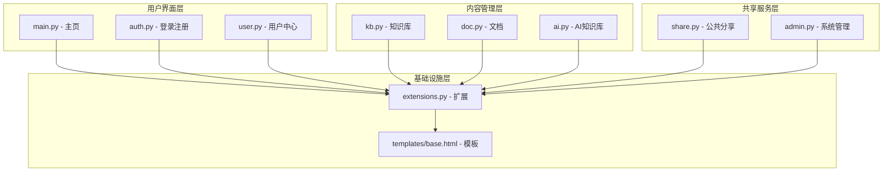
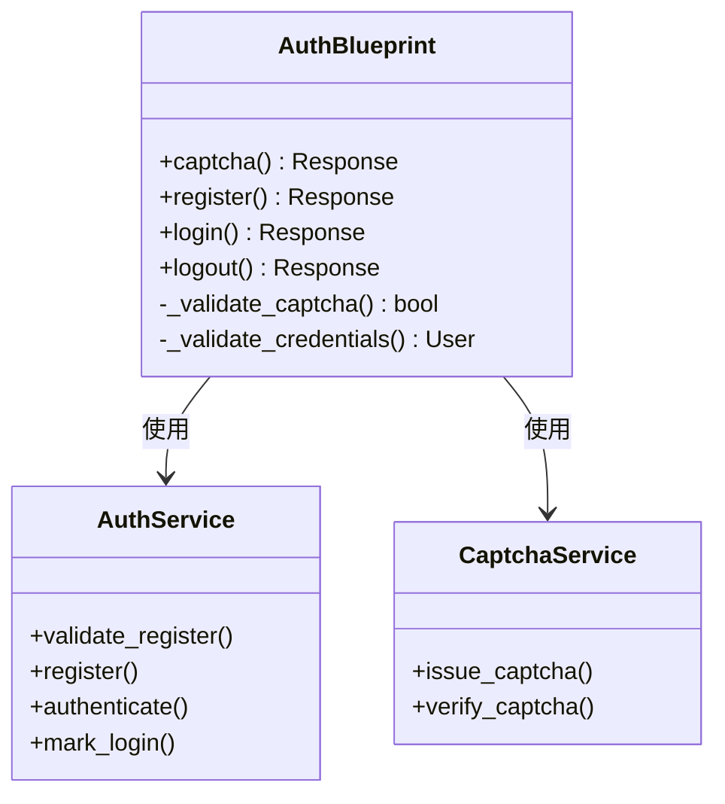
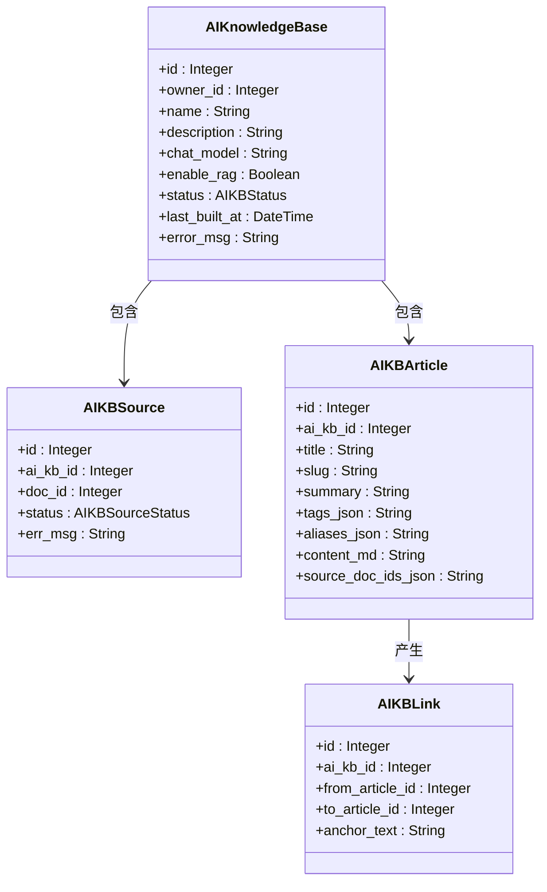
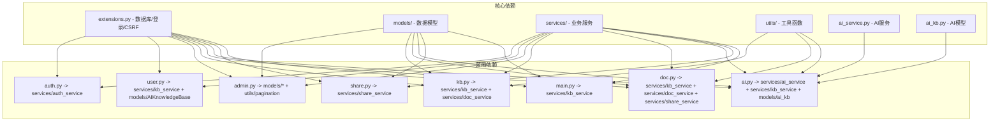
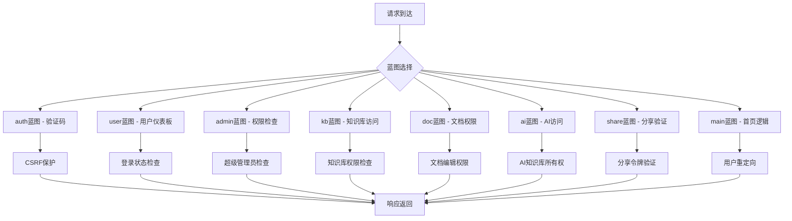
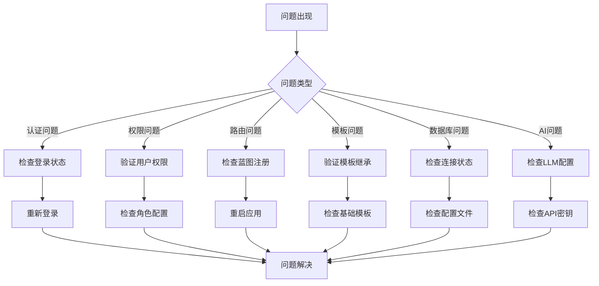

# 蓝图系统设计

<cite>
**本文档引用的文件**
- [app/__init__.py](file://app/__init__.py)
- [app/blueprints/__init__.py](file://app/blueprints/__init__.py)
- [app/blueprints/admin.py](file://app/blueprints/admin.py)
- [app/blueprints/ai.py](file://app/blueprints/ai.py)
- [app/blueprints/auth.py](file://app/blueprints/auth.py)
- [app/blueprints/doc.py](file://app/blueprints/doc.py)
- [app/blueprints/kb.py](file://app/blueprints/kb.py)
- [app/blueprints/main.py](file://app/blueprints/main.py)
- [app/blueprints/share.py](file://app/blueprints/share.py)
- [app/blueprints/user.py](file://app/blueprints/user.py)
- [app/extensions.py](file://app/extensions.py)
- [app/templates/base.html](file://app/templates/base.html)
- [app/models/ai_kb.py](file://app/models/ai_kb.py)
- [app/services/ai_service.py](file://app/services/ai_service.py)
</cite>

## 更新摘要
**变更内容**
- 新增AI知识库蓝图的详细设计分析
- 完善蓝图系统架构的模块化设计说明
- 增强AI知识库功能的技术实现细节
- 补充AI知识库与现有系统的集成模式

## 目录
1. [简介](#简介)
2. [项目结构](#项目结构)
3. [核心组件](#核心组件)
4. [架构概览](#架构概览)
5. [详细组件分析](#详细组件分析)
6. [依赖关系分析](#依赖关系分析)
7. [性能考虑](#性能考虑)
8. [故障排除指南](#故障排除指南)
9. [结论](#结论)

## 简介

My Wiki是一个基于Flask的维基系统，采用蓝图（Blueprint）架构进行模块化组织。蓝图系统将应用功能划分为独立的功能模块，每个模块负责特定的业务领域，实现了良好的代码分离和可维护性。

本设计文档深入解析了My Wiki的蓝图系统，包括Flask蓝图的工作原理、URL前缀规则、路由组织策略、模板继承机制，以及各蓝图的功能职责和交互模式。特别关注新增的AI知识库蓝图，该模块实现了基于大语言模型的知识库功能，采用了Karpathy LLM Wiki方法论，为用户提供智能化的知识管理和问答体验。

## 项目结构

My Wiki采用分层的项目结构，蓝图作为核心功能模块位于`app/blueprints/`目录下：

**图表来源**
- [app/__init__.py:56-74](file://app/__init__.py#L56-L74)
- [app/blueprints/__init__.py:1-2](file://app/blueprints/__init__.py#L1-L2)

**章节来源**
- [app/__init__.py:11-28](file://app/__init__.py#L11-L28)
- [app/blueprints/__init__.py:1-2](file://app/blueprints/__init__.py#L1-L2)

## 核心组件

### Flask蓝图工作原理

Flask蓝图是Flask应用的核心架构组件，它将路由、模板、静态文件等组织成可复用的功能模块。在My Wiki中，每个蓝图代表一个独立的功能域：

- **模块化设计**：每个蓝图独立管理自己的路由和视图函数
- **命名空间隔离**：通过蓝图名称避免路由冲突
- **延迟注册**：蓝图在应用工厂中动态注册
- **中间件支持**：支持before_request等全局中间件

### 蓝图注册流程

应用通过工厂模式创建Flask实例，并在其中注册所有蓝图：

**图表来源**
- [app/__init__.py:56-74](file://app/__init__.py#L56-L74)

**章节来源**
- [app/__init__.py:56-74](file://app/__init__.py#L56-L74)

## 架构概览

My Wiki的蓝图系统采用分层架构设计，每个蓝图都有明确的职责边界：

**图表来源**
- [app/__init__.py:56-74](file://app/__init__.py#L56-L74)
- [app/extensions.py:1-17](file://app/extensions.py#L1-L17)

## 详细组件分析

### 认证蓝图 (auth.py)

认证蓝图负责用户身份验证相关功能，是整个应用安全的基础模块。

#### 功能职责
- 用户注册与登录
- 验证码生成与验证
- 会话管理
- 权限控制

#### 路由组织策略
- `/auth/captcha` - 验证码接口
- `/auth/register` - 用户注册
- `/auth/login` - 用户登录
- `/auth/logout` - 用户登出

**图表来源**
- [app/blueprints/auth.py:1-85](file://app/blueprints/auth.py#L1-L85)

**章节来源**
- [app/blueprints/auth.py:1-85](file://app/blueprints/auth.py#L1-L85)

### 知识库蓝图 (kb.py)

知识库蓝图管理知识库的创建、编辑和成员管理功能。

#### 功能职责
- 知识库创建与配置
- 成员权限管理
- 可见性控制
- 文档树导航

#### 路由组织策略
- `/kb/` - 知识库列表
- `/kb/new` - 创建新知识库
- `/kb/<int:kb_id>` - 知识库详情
- `/kb/<int:kb_id>/edit` - 编辑知识库
- `/kb/<int:kb_id>/members` - 成员管理

**章节来源**
- [app/blueprints/kb.py:1-141](file://app/blueprints/kb.py#L1-L141)

### 文档蓝图 (doc.py)

文档蓝图处理文档的创建、编辑、删除和分享功能。

#### 功能职责
- 文档创建与编辑
- 内容保存与版本控制
- 文档删除与归档
- 分享链接管理

#### 路由组织策略
- `/doc/new` - 新建文档
- `/doc/<int:doc_id>` - 查看文档
- `/doc/<int:doc_id>/edit` - 编辑文档
- `/doc/<int:doc_id>/save` - 保存文档
- `/doc/<int:doc_id>/delete` - 删除文档
- `/doc/<int:doc_id>/share` - 分享文档

**章节来源**
- [app/blueprints/doc.py:1-139](file://app/blueprints/doc.py#L1-L139)

### AI知识库蓝图 (ai.py)

AI知识库蓝图实现基于大语言模型的知识库功能，采用Karpathy LLM Wiki方法论。

#### 功能职责
- AI知识库创建与管理
- 文档源管理
- 知识库构建与维护
- 智能问答功能
- 双向链接解析
- 图谱可视化

#### 路由组织策略
- `/ai/` - AI知识库列表
- `/ai/new` - 创建AI知识库
- `/ai/<int:ai_kb_id>` - AI知识库详情
- `/ai/<int:ai_kb_id>/sources` - 源文档管理
- `/ai/<int:ai_kb_id>/build` - 构建知识库
- `/ai/<int:ai_kb_id>/wiki` - 维基浏览
- `/ai/<int:ai_kb_id>/wiki/<slug>` - 文章详情
- `/ai/<int:ai_kb_id>/graph` - 关系图谱
- `/ai/<int:ai_kb_id>/chat` - 智能问答

**图表来源**
- [app/models/ai_kb.py:22-121](file://app/models/ai_kb.py#L22-L121)

**章节来源**
- [app/blueprints/ai.py:1-279](file://app/blueprints/ai.py#L1-L279)

### 用户蓝图 (user.py)

用户蓝图提供用户个人中心和仪表板功能。

#### 功能职责
- 用户仪表板
- 个人资料管理
- 最近活动展示
- 统计数据汇总
- AI知识库统计

#### 路由组织策略
- `/user/dashboard` - 用户仪表板
- `/user/profile` - 个人资料
- `/user/profile/change-password` - 修改密码

**章节来源**
- [app/blueprints/user.py:1-51](file://app/blueprints/user.py#L1-L51)

### 管理员蓝图 (admin.py)

管理员蓝图提供系统管理功能，仅超级管理员可访问。

#### 功能职责
- 用户管理
- 角色权限管理
- 系统统计
- 公共内容审核
- AI知识库内容管理

#### 路由组织策略
- `/admin/` - 管理员首页
- `/admin/users` - 用户管理
- `/admin/roles` - 角色管理
- `/admin/public-kbs` - 公共知识库审核
- `/admin/public-docs` - 公共文档审核

**章节来源**
- [app/blueprints/admin.py:1-217](file://app/blueprints/admin.py#L1-L217)

### 分享蓝图 (share.py)

分享蓝图处理公共分享功能，支持密码保护和访问控制。

#### 功能职责
- 分享链接生成
- 密码保护验证
- 访问统计
- 内容安全控制

#### 路由组织策略
- `/share/<token>` - 分享内容查看

**章节来源**
- [app/blueprints/share.py:1-42](file://app/blueprints/share.py#L1-L42)

### 主页蓝图 (main.py)

主页蓝图处理应用的入口页面和重定向逻辑。

#### 功能职责
- 首页展示
- 登录后重定向
- 公共知识库展示

#### 路由组织策略
- `/` - 应用首页

**章节来源**
- [app/blueprints/main.py:1-16](file://app/blueprints/main.py#L1-L16)

## 依赖关系分析

### 蓝图间依赖关系

**图表来源**
- [app/__init__.py:56-74](file://app/__init__.py#L56-L74)
- [app/extensions.py:1-17](file://app/extensions.py#L1-L17)

### 中间件使用模式

My Wiki使用多种中间件来增强应用功能：

**图表来源**
- [app/blueprints/admin.py:15-22](file://app/blueprints/admin.py#L15-L22)
- [app/blueprints/ai.py:18-25](file://app/blueprints/ai.py#L18-L25)
- [app/blueprints/doc.py:13-18](file://app/blueprints/doc.py#L13-L18)
- [app/blueprints/kb.py:14-19](file://app/blueprints/kb.py#L14-L19)

**章节来源**
- [app/blueprints/admin.py:15-22](file://app/blueprints/admin.py#L15-L22)
- [app/blueprints/ai.py:18-25](file://app/blueprints/ai.py#L18-L25)
- [app/blueprints/doc.py:13-18](file://app/blueprints/doc.py#L13-L18)
- [app/blueprints/kb.py:14-19](file://app/blueprints/kb.py#L14-L19)

## 性能考虑

### 路由优化策略

1. **懒加载模式**：蓝图按需加载，减少启动时间
2. **查询优化**：使用分页和过滤减少数据库负载
3. **缓存策略**：对频繁访问的数据实施缓存
4. **并发处理**：异步任务处理耗时操作

### 安全最佳实践

1. **CSRF保护**：全局启用CSRF保护
2. **权限验证**：每路由都进行权限检查
3. **输入验证**：严格的参数验证和清理
4. **会话管理**：安全的会话存储和过期机制

### AI知识库性能优化

1. **异步构建**：使用线程池处理LLM调用
2. **增量更新**：支持仅处理待处理源文档
3. **内存管理**：合理管理LLM客户端实例
4. **文件缓存**：Markdown文件本地缓存

## 故障排除指南

### 常见问题诊断

### 调试技巧

1. **日志记录**：启用详细的请求日志
2. **错误监控**：设置异常捕获和报告
3. **性能分析**：监控慢查询和高延迟请求
4. **单元测试**：为关键功能编写测试用例

**章节来源**
- [app/__init__.py:76-87](file://app/__init__.py#L76-L87)

## 结论

My Wiki的蓝图系统设计体现了现代Web应用的最佳实践，通过清晰的功能划分和严格的权限控制，实现了高度模块化的架构。各蓝图之间的协作通过统一的服务层和工具函数实现，确保了代码的可维护性和扩展性。

AI知识库蓝图的引入进一步完善了系统的智能化水平，采用Karpathy LLM Wiki方法论，为用户提供了现代化的知识管理和智能问答体验。该模块不仅增强了应用的功能完整性，也为未来的AI集成奠定了坚实基础。

该设计的优势包括：
- **模块化程度高**：每个功能域独立管理
- **安全性强**：多层权限验证机制
- **智能化增强**：AI知识库提供智能问答
- **可扩展性好**：易于添加新的功能模块
- **维护成本低**：清晰的职责分离

未来可以考虑的改进方向：
- 实施更细粒度的权限控制
- 添加更多的异步处理能力
- 增强API接口的一致性
- 优化前端与后端的交互模式
- 扩展AI知识库的RAG功能
- 增加更多AI模型的支持