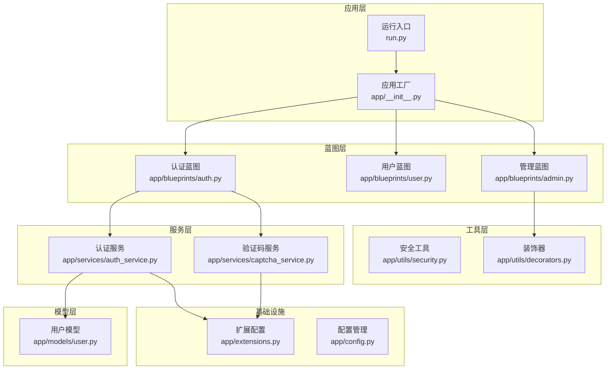
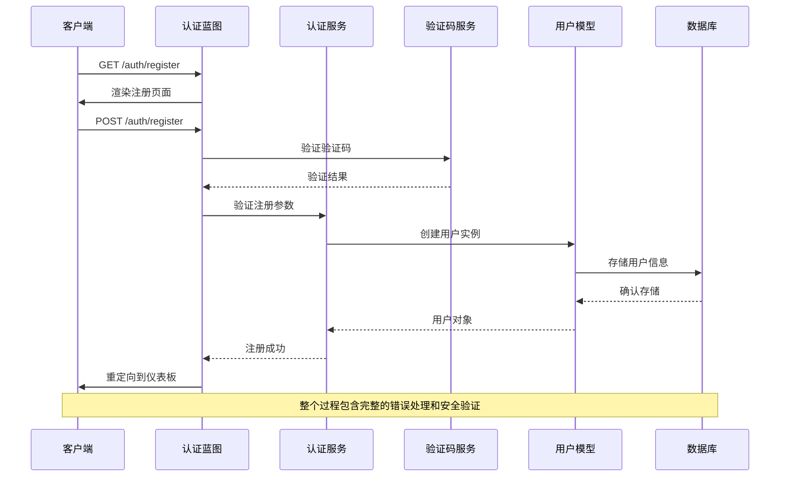
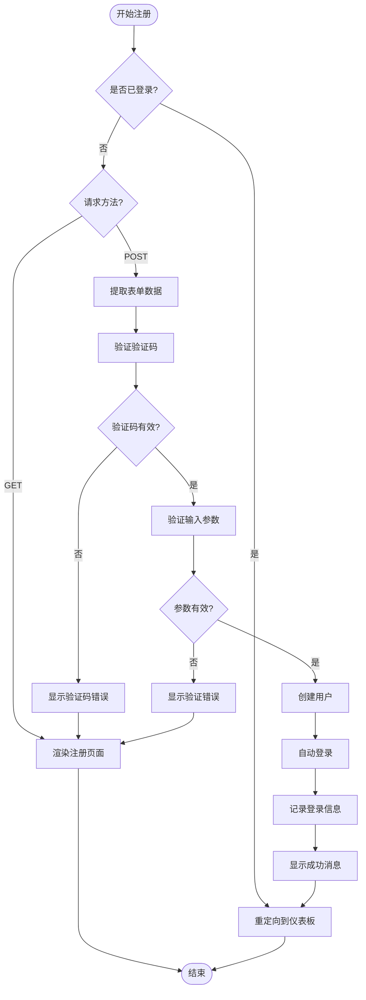
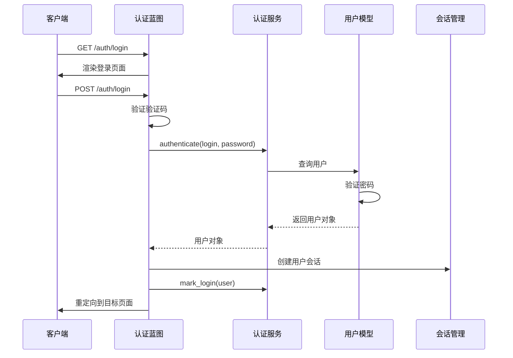
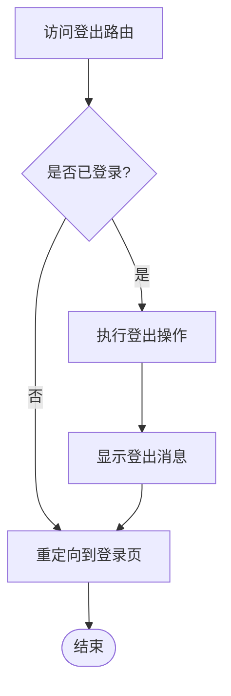
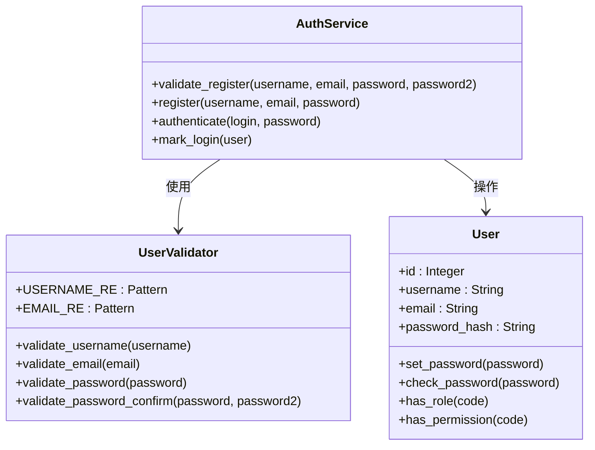
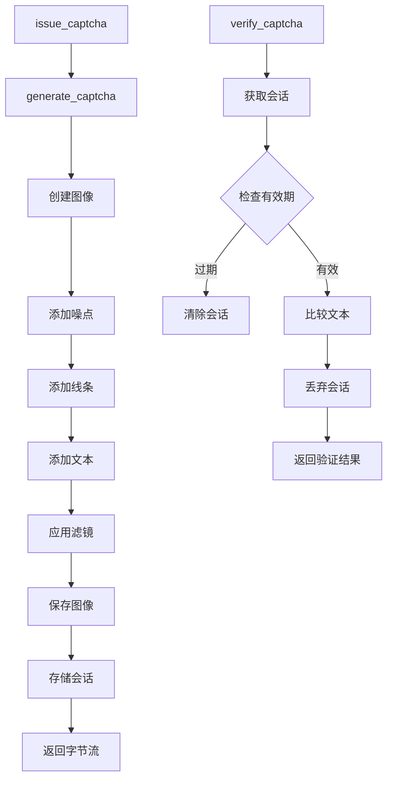
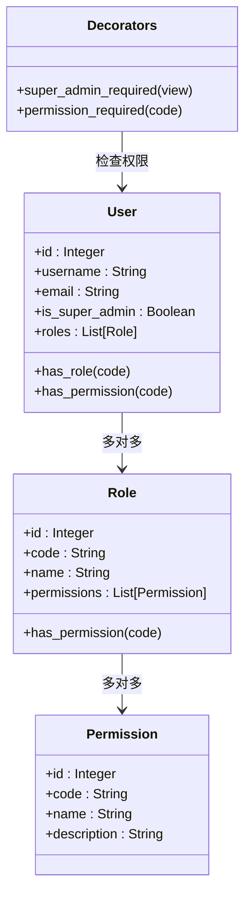
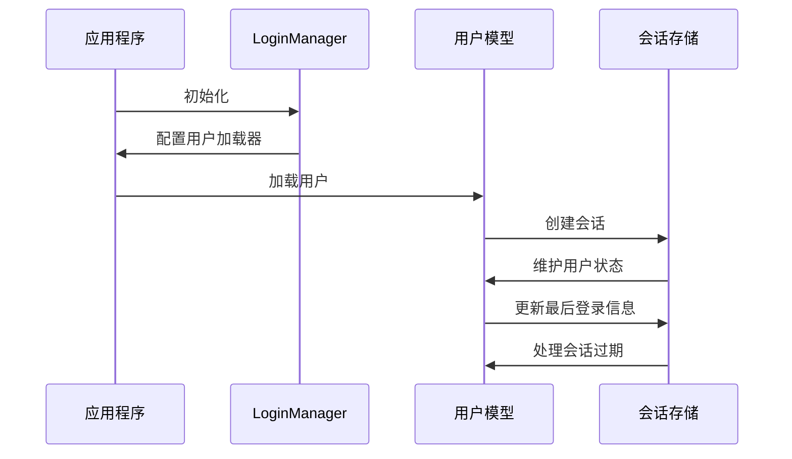
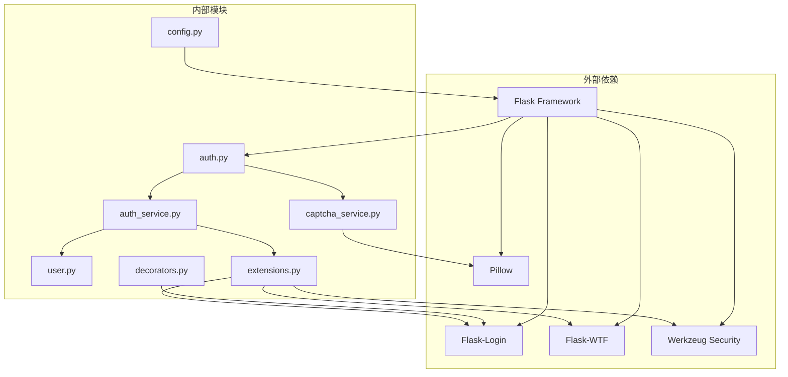

# 认证蓝图 (Auth Blueprint)

<cite>
**本文档引用的文件**
- [app/blueprints/auth.py](file://app/blueprints/auth.py)
- [app/services/auth_service.py](file://app/services/auth_service.py)
- [app/services/captcha_service.py](file://app/services/captcha_service.py)
- [app/models/user.py](file://app/models/user.py)
- [app/utils/security.py](file://app/utils/security.py)
- [app/utils/decorators.py](file://app/utils/decorators.py)
- [app/extensions.py](file://app/extensions.py)
- [app/__init__.py](file://app/__init__.py)
- [app/config.py](file://app/config.py)
- [run.py](file://run.py)
</cite>

## 目录
1. [简介](#简介)
2. [项目结构](#项目结构)
3. [核心组件](#核心组件)
4. [架构概览](#架构概览)
5. [详细组件分析](#详细组件分析)
6. [依赖关系分析](#依赖关系分析)
7. [性能考虑](#性能考虑)
8. [故障排除指南](#故障排除指南)
9. [结论](#结论)
10. [附录](#附录)

## 简介

认证蓝图是本项目的核心安全模块，负责处理用户身份验证和授权相关的所有功能。该蓝图实现了完整的用户生命周期管理，包括用户注册、登录、登出以及验证码验证机制。系统采用基于Flask-Login的会话管理，结合自定义的RBAC（基于角色的访问控制）权限体系，提供了多层次的安全防护。

本认证系统的主要特点：
- 基于Flask-Login的会话管理
- 自定义验证码服务，防止自动化攻击
- 完整的RBAC权限控制
- 多层次的安全防护措施
- 用户友好的错误处理和反馈机制

## 项目结构

认证蓝图在项目中的组织结构如下：



**图表来源**
- [app/__init__.py:11-74](file://app/__init__.py#L11-L74)
- [app/blueprints/auth.py:1-85](file://app/blueprints/auth.py#L1-L85)
- [app/services/auth_service.py:1-57](file://app/services/auth_service.py#L1-L57)
- [app/services/captcha_service.py:1-90](file://app/services/captcha_service.py#L1-L90)

**章节来源**
- [app/__init__.py:11-74](file://app/__init__.py#L11-L74)
- [app/blueprints/auth.py:1-85](file://app/blueprints/auth.py#L1-L85)

## 核心组件

认证蓝图由以下核心组件构成：

### 蓝图路由定义
- **验证码路由** (`/auth/captcha`): 生成并返回图形验证码
- **注册路由** (`/auth/register`): 处理用户注册请求
- **登录路由** (`/auth/login`): 处理用户登录请求  
- **登出路由** (`/auth/logout`): 处理用户登出请求

### 服务层组件
- **认证服务**: 验证用户凭据，执行密码验证
- **验证码服务**: 生成图形验证码，验证用户输入
- **用户服务**: 提供用户相关的业务逻辑

### 模型层组件
- **用户模型**: 包含用户基本信息、密码哈希、权限等
- **角色模型**: 支持多角色分配
- **权限模型**: 细粒度权限控制

**章节来源**
- [app/blueprints/auth.py:10-84](file://app/blueprints/auth.py#L10-L84)
- [app/services/auth_service.py:21-56](file://app/services/auth_service.py#L21-L56)
- [app/models/user.py:55-104](file://app/models/user.py#L55-L104)

## 架构概览

认证系统的整体架构采用分层设计，确保关注点分离和代码可维护性：



**图表来源**
- [app/blueprints/auth.py:19-48](file://app/blueprints/auth.py#L19-L48)
- [app/services/auth_service.py:36-41](file://app/services/auth_service.py#L36-L41)
- [app/services/captcha_service.py:75-89](file://app/services/captcha_service.py#L75-L89)

## 详细组件分析

### 认证蓝图路由实现

#### 注册流程分析

注册流程包含完整的输入验证、验证码验证和用户创建过程：



**图表来源**
- [app/blueprints/auth.py:19-48](file://app/blueprints/auth.py#L19-L48)
- [app/services/auth_service.py:21-41](file://app/services/auth_service.py#L21-L41)

#### 登录流程分析

登录流程实现了标准的身份验证模式：



**图表来源**
- [app/blueprints/auth.py:51-76](file://app/blueprints/auth.py#L51-L76)
- [app/services/auth_service.py:44-56](file://app/services/auth_service.py#L44-L56)

#### 登出路由实现

登出路由使用Flask-Login的`@login_required`装饰器确保只有已认证用户才能访问：



**图表来源**
- [app/blueprints/auth.py:79-84](file://app/blueprints/auth.py#L79-L84)

**章节来源**
- [app/blueprints/auth.py:19-84](file://app/blueprints/auth.py#L19-L84)

### 认证服务实现

#### 用户验证逻辑

认证服务提供了完整的用户验证功能：



**图表来源**
- [app/services/auth_service.py:21-56](file://app/services/auth_service.py#L21-L56)
- [app/models/user.py:81-96](file://app/models/user.py#L81-L96)

#### 密码安全机制

系统采用Werkzeug的密码哈希函数确保密码安全存储：

- 使用`generate_password_hash`进行密码哈希
- 使用`check_password_hash`进行密码验证
- 支持密码强度验证（最小长度6位）

**章节来源**
- [app/services/auth_service.py:36-41](file://app/services/auth_service.py#L36-L41)
- [app/models/user.py:81-85](file://app/models/user.py#L81-L85)

### 验证码服务实现

#### 图形验证码生成

验证码服务实现了完整的图形验证码生成功能：



**图表来源**
- [app/services/captcha_service.py:65-89](file://app/services/captcha_service.py#L65-L89)

#### 验证码安全特性

- **时间限制**: 默认5分钟有效期（可通过配置调整）
- **一次性使用**: 验证后立即清除会话
- **字符集限制**: 排除易混淆字符（O, I）
- **防暴力破解**: 限制验证码输入尝试次数

**章节来源**
- [app/services/captcha_service.py:14-89](file://app/services/captcha_service.py#L14-L89)

### 权限控制系统

#### RBAC权限模型

系统实现了完整的基于角色的访问控制：



**图表来源**
- [app/models/user.py:55-96](file://app/models/user.py#L55-L96)
- [app/utils/decorators.py:8-32](file://app/utils/decorators.py#L8-L32)

#### 权限检查逻辑

- **超级管理员**: 拥有所有权限，绕过其他权限检查
- **角色权限**: 用户通过角色继承权限
- **直接权限**: 支持直接赋予用户特定权限
- **权限组合**: 复杂权限需求可通过角色组合实现

**章节来源**
- [app/models/user.py:87-96](file://app/models/user.py#L87-L96)
- [app/utils/decorators.py:8-32](file://app/utils/decorators.py#L8-L32)

### 会话管理策略

#### Flask-Login集成

系统深度集成了Flask-Login，提供完整的会话管理：



**图表来源**
- [app/__init__.py:48-54](file://app/__init__.py#L48-L54)
- [app/extensions.py:14-16](file://app/extensions.py#L14-L16)

#### Cookie配置策略

系统采用安全的Cookie配置：

- **HttpOnly**: 防止XSS攻击
- **SameSite=Lax**: 防止CSRF攻击
- **Remember Me**: 支持长期会话保持
- **自动过期**: 会话超时自动清理

**章节来源**
- [app/config.py:28-31](file://app/config.py#L28-L31)
- [app/extensions.py:14-16](file://app/extensions.py#L14-L16)

## 依赖关系分析

### 组件间依赖关系



**图表来源**
- [app/blueprints/auth.py:1-7](file://app/blueprints/auth.py#L1-L7)
- [app/services/auth_service.py:1-11](file://app/services/auth_service.py#L1-L11)
- [app/services/captcha_service.py:1-11](file://app/services/captcha_service.py#L1-L11)

### 关键依赖注入

系统通过应用工厂模式实现依赖注入：

1. **数据库连接**: 通过SQLAlchemy统一管理
2. **会话管理**: 通过LoginManager集中处理
3. **CSRF保护**: 通过Flask-WTF提供
4. **配置管理**: 通过Config类统一配置

**章节来源**
- [app/__init__.py:39-54](file://app/__init__.py#L39-L54)
- [app/extensions.py:8-11](file://app/extensions.py#L8-L11)

## 性能考虑

### 缓存策略

- **验证码缓存**: 使用Session存储验证码，避免数据库压力
- **用户会话缓存**: Flask-Login自动管理用户会话
- **静态资源缓存**: 通过HTTP头控制缓存策略

### 数据库优化

- **索引优化**: 用户名、邮箱字段建立唯一索引
- **查询优化**: 使用过滤器减少数据库查询
- **连接池**: 配置连接池参数提高并发性能

### 安全性能平衡

- **验证码频率限制**: 防止暴力破解同时不影响用户体验
- **密码哈希成本**: 平衡安全性与性能
- **会话超时**: 合理设置会话过期时间

## 故障排除指南

### 常见问题及解决方案

#### 验证码相关问题

**问题**: 验证码无法显示
- 检查Pillow库安装
- 验证字体文件可用性
- 确认Session配置正确

**问题**: 验证码验证失败
- 检查验证码有效期（默认5分钟）
- 确认大小写不敏感验证
- 验证Session存储正常

#### 用户认证问题

**问题**: 登录失败但密码正确
- 检查用户是否被禁用
- 验证密码哈希存储
- 确认用户模型配置

**问题**: 会话丢失频繁
- 检查Cookie配置
- 验证Session存储后端
- 确认服务器重启影响

#### 权限控制问题

**问题**: 权限检查异常
- 检查用户角色分配
- 验证权限代码正确性
- 确认装饰器使用正确

**章节来源**
- [app/services/captcha_service.py:75-89](file://app/services/captcha_service.py#L75-L89)
- [app/models/user.py:87-96](file://app/models/user.py#L87-L96)

### 错误处理机制

系统实现了多层次的错误处理：

1. **表单验证错误**: 友好的用户提示
2. **业务逻辑错误**: 具体的错误描述
3. **系统异常**: 统一的错误页面
4. **安全异常**: 适当的HTTP状态码

**章节来源**
- [app/blueprints/auth.py:31-40](file://app/blueprints/auth.py#L31-L40)
- [app/__init__.py:76-87](file://app/__init__.py#L76-L87)

## 结论

认证蓝图提供了完整、安全、可扩展的用户身份验证解决方案。系统通过以下关键特性确保了高安全性：

1. **多层次安全防护**: 从输入验证到会话管理的全方位保护
2. **灵活的权限控制**: 基于角色的细粒度权限管理
3. **用户友好体验**: 完善的错误处理和反馈机制
4. **可维护性设计**: 清晰的分层架构和依赖管理

推荐的最佳实践包括：
- 定期更新密码哈希算法
- 监控异常登录行为
- 定期清理过期会话
- 实施额外的双因素认证

## 附录

### API使用示例

#### 注册API调用示例

```python
# 基本注册流程
response = requests.post('/auth/register', data={
    'username': 'testuser',
    'email': 'test@example.com',
    'password': 'securepassword',
    'password2': 'securepassword',
    'captcha': 'user_input'
})
```

#### 登录API调用示例

```python
# 登录请求
response = requests.post('/auth/login', data={
    'login': 'username_or_email',
    'password': 'user_password',
    'captcha': 'captcha_input',
    'remember': 'checked'  # 可选，启用记住我功能
})
```

#### 获取验证码API

```python
# 获取验证码图片
captcha_response = requests.get('/auth/captcha')
with open('captcha.png', 'wb') as f:
    f.write(captcha_response.content)
```

### 配置选项

| 配置项 | 默认值 | 描述 |
|--------|--------|------|
| CAPTCHA_TTL_SECONDS | 300 | 验证码有效期（秒） |
| SESSION_COOKIE_HTTPONLY | True | 是否启用HttpOnly Cookie |
| SESSION_COOKIE_SAMESITE | "Lax" | SameSite Cookie策略 |
| REMEMBER_COOKIE_DURATION | 604800 | 记住我功能持续时间（秒） |

### 安全最佳实践

1. **密码安全**: 强制使用复杂密码，定期更换
2. **会话安全**: 合理设置会话超时，启用HTTPS
3. **输入验证**: 严格验证所有用户输入
4. **日志监控**: 记录重要安全事件
5. **定期审计**: 定期检查权限配置和访问日志