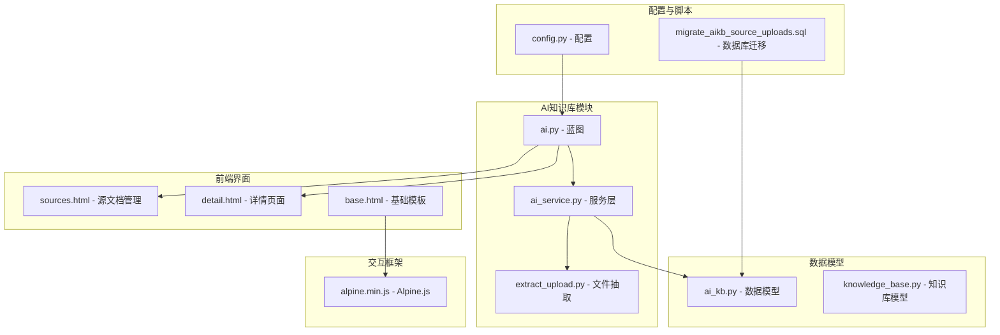
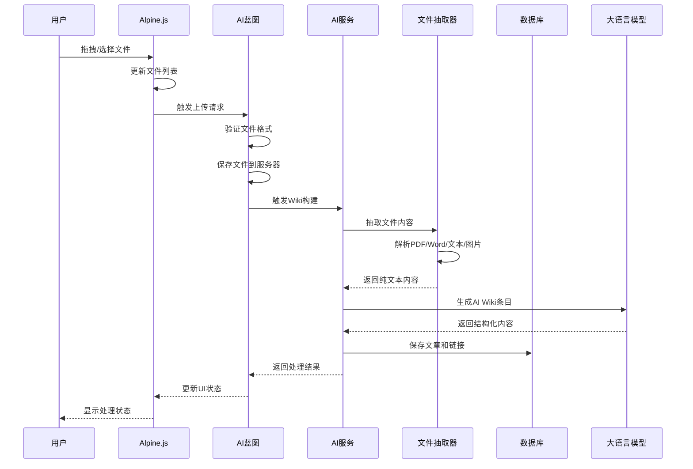
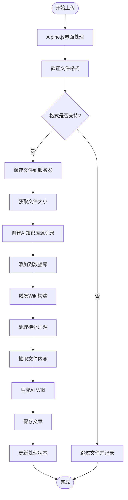
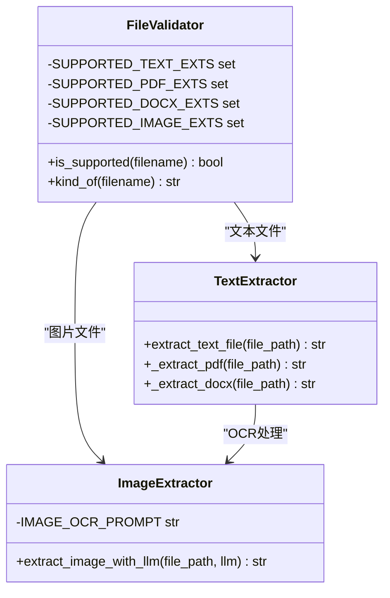
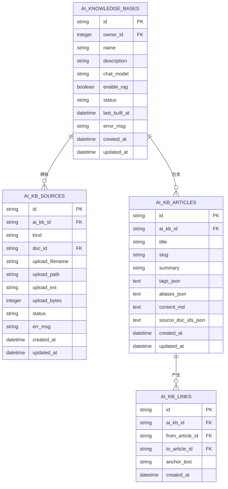
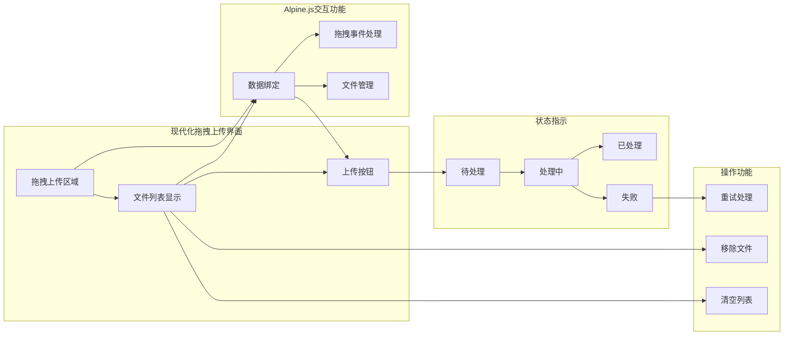
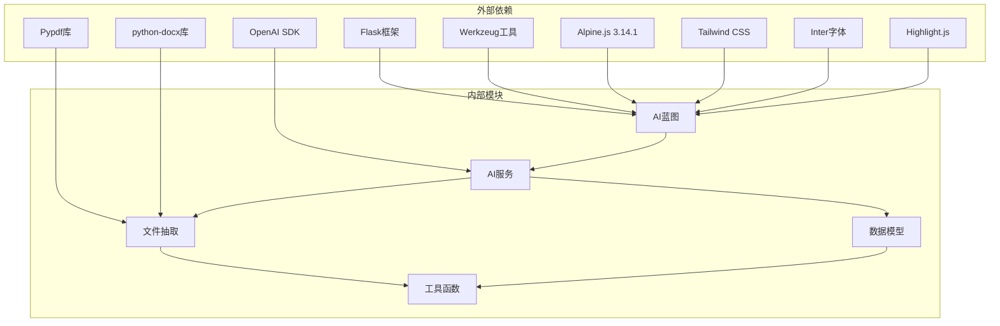

# AI知识库外部文件上传功能

<cite>
**本文档引用的文件**
- [app/blueprints/ai.py](file://app/blueprints/ai.py)
- [app/services/ai_service.py](file://app/services/ai_service.py)
- [app/utils/extract_upload.py](file://app/utils/extract_upload.py)
- [app/models/ai_kb.py](file://app/models/ai_kb.py)
- [app/templates/ai/sources.html](file://app/templates/ai/sources.html)
- [app/templates/ai/detail.html](file://app/templates/ai/detail.html)
- [app/templates/base.html](file://app/templates/base.html)
- [app/config.py](file://app/config.py)
- [app/static/vendor/js/alpine.min.js](file://app/static/vendor/js/alpine.min.js)
- [scripts/migrate_aikb_source_uploads.sql](file://scripts/migrate_aikb_source_uploads.sql)
</cite>

## 更新摘要
**变更内容**
- 新增现代化拖拽上传界面和Alpine.js交互功能
- 实现文件选择区的拖拽支持和实时文件管理
- 增加多文件上传支持和文件预览功能
- 优化用户交互体验和界面响应性

## 目录
1. [简介](#简介)
2. [项目结构](#项目结构)
3. [核心组件](#核心组件)
4. [架构概览](#架构概览)
5. [详细组件分析](#详细组件分析)
6. [依赖关系分析](#依赖关系分析)
7. [性能考虑](#性能考虑)
8. [故障排除指南](#故障排除指南)
9. [结论](#结论)

## 简介

AI知识库外部文件上传功能是MyWiki项目中AI知识库模块的重要组成部分，允许用户将PDF、Word文档、文本文件和图片等外部文件作为源文档导入到AI知识库中。该功能实现了从文件上传、格式检测、内容抽取到AI Wiki化的完整工作流程。

**最新更新** 新增了现代化的拖拽上传界面和Alpine.js交互功能，提供更加直观和高效的文件管理体验。

该功能的核心价值在于：
- 支持多种文件格式的统一处理
- 通过OCR技术处理图片内容
- 自动化的AI Wiki生成流程
- 与现有知识库系统的无缝集成
- 现代化的用户界面和交互体验

## 项目结构

AI知识库外部文件上传功能主要涉及以下文件结构：

**图表来源**
- [app/blueprints/ai.py:1-395](file://app/blueprints/ai.py#L1-L395)
- [app/services/ai_service.py:1-585](file://app/services/ai_service.py#L1-L585)
- [app/utils/extract_upload.py:1-126](file://app/utils/extract_upload.py#L1-L126)
- [app/templates/ai/sources.html:1-193](file://app/templates/ai/sources.html#L1-L193)
- [app/templates/base.html:1-30](file://app/templates/base.html#L1-L30)

**章节来源**
- [app/blueprints/ai.py:1-395](file://app/blueprints/ai.py#L1-L395)
- [app/services/ai_service.py:1-585](file://app/services/ai_service.py#L1-L585)
- [app/utils/extract_upload.py:1-126](file://app/utils/extract_upload.py#L1-L126)
- [app/templates/ai/sources.html:1-193](file://app/templates/ai/sources.html#L1-L193)
- [app/templates/base.html:1-30](file://app/templates/base.html#L1-L30)

## 核心组件

### 文件上传处理组件

AI知识库外部文件上传功能由多个核心组件协同工作：

1. **蓝图路由处理** - 负责HTTP请求处理和响应
2. **文件抽取工具** - 处理不同格式文件的内容提取
3. **AI服务层** - 执行AI Wiki生成和处理逻辑
4. **数据模型** - 定义数据库结构和关系
5. **前端模板** - 提供用户交互界面
6. **Alpine.js交互框架** - 实现现代化的前端交互

### 支持的文件格式

系统支持以下文件格式的外部上传：
- **PDF文档** (.pdf)
- **Word文档** (.docx)
- **文本文件** (.txt, .md, .markdown)
- **图片文件** (.png, .jpg, .jpeg, .webp, .gif, .bmp)

### 现代化界面特性

**新增功能** 现代化的拖拽上传界面提供了以下增强功能：
- 拖拽上传区域，支持拖放文件
- 实时文件管理，可动态添加和删除文件
- 文件大小格式化显示
- 多文件上传支持
- 响应式设计和流畅动画效果

**章节来源**
- [app/utils/extract_upload.py:15-22](file://app/utils/extract_upload.py#L15-L22)
- [app/templates/ai/sources.html:107-111](file://app/templates/ai/sources.html#L107-L111)
- [app/templates/ai/sources.html:88-112](file://app/templates/ai/sources.html#L88-L112)

## 架构概览

AI知识库外部文件上传功能采用分层架构设计，实现了清晰的关注点分离：

**图表来源**
- [app/blueprints/ai.py:153-205](file://app/blueprints/ai.py#L153-L205)
- [app/services/ai_service.py:430-465](file://app/services/ai_service.py#L430-L465)
- [app/utils/extract_upload.py:99-125](file://app/utils/extract_upload.py#L99-L125)
- [app/templates/ai/sources.html:39-73](file://app/templates/ai/sources.html#L39-L73)

## 详细组件分析

### 文件上传处理流程

外部文件上传功能的核心处理流程如下：

**图表来源**
- [app/blueprints/ai.py:153-205](file://app/blueprints/ai.py#L153-L205)
- [app/services/ai_service.py:467-522](file://app/services/ai_service.py#L467-L522)
- [app/templates/ai/sources.html:39-73](file://app/templates/ai/sources.html#L39-L73)

### 文件格式检测机制

系统实现了智能的文件格式检测机制：

**图表来源**
- [app/utils/extract_upload.py:25-41](file://app/utils/extract_upload.py#L25-L41)
- [app/utils/extract_upload.py:43-97](file://app/utils/extract_upload.py#L43-L97)

### AI知识库数据模型

AI知识库系统的核心数据模型包括：

**图表来源**
- [app/models/ai_kb.py:23-146](file://app/models/ai_kb.py#L23-L146)

**章节来源**
- [app/blueprints/ai.py:153-205](file://app/blueprints/ai.py#L153-L205)
- [app/utils/extract_upload.py:99-125](file://app/utils/extract_upload.py#L99-L125)
- [app/models/ai_kb.py:52-89](file://app/models/ai_kb.py#L52-L89)

### 现代化前端用户界面

系统提供了直观且现代化的用户界面来管理外部文件上传：

**图表来源**
- [app/templates/ai/sources.html:38-153](file://app/templates/ai/sources.html#L38-L153)
- [app/templates/ai/detail.html:54-101](file://app/templates/ai/detail.html#L54-L101)
- [app/templates/base.html:12](file://app/templates/base.html#L12)

**章节来源**
- [app/templates/ai/sources.html:1-193](file://app/templates/ai/sources.html#L1-L193)
- [app/templates/ai/detail.html:1-140](file://app/templates/ai/detail.html#L1-L140)
- [app/templates/base.html:1-30](file://app/templates/base.html#L1-L30)

## 依赖关系分析

AI知识库外部文件上传功能的依赖关系如下：

**图表来源**
- [app/blueprints/ai.py:1-20](file://app/blueprints/ai.py#L1-L20)
- [app/services/ai_service.py:47-115](file://app/services/ai_service.py#L47-L115)
- [app/utils/extract_upload.py:44-58](file://app/utils/extract_upload.py#L44-L58)
- [app/templates/base.html:8-13](file://app/templates/base.html#L8-L13)

### 数据库迁移脚本

系统提供了完整的数据库迁移支持：

| 字段名 | 类型 | 默认值 | 描述 |
|--------|------|--------|------|
| kind | varchar(16) | 'document' | 源类型：document 或 upload |
| upload_filename | varchar(255) | '' | 原始文件名 |
| upload_path | varchar(500) | '' | 服务器存储相对路径 |
| upload_ext | varchar(16) | '' | 文件扩展名 |
| upload_bytes | int | 0 | 文件大小（字节） |

**章节来源**
- [scripts/migrate_aikb_source_uploads.sql:6-26](file://scripts/migrate_aikb_source_uploads.sql#L6-L26)

## 性能考虑

AI知识库外部文件上传功能在性能方面采用了多项优化策略：

### 异步处理机制
- 使用后台线程处理文件上传和AI Wiki生成
- 避免阻塞主线程，提升用户体验
- 支持并发处理多个文件上传请求

### Alpine.js优化
- **响应式数据绑定** - 实时更新界面状态
- **虚拟DOM操作** - 减少不必要的DOM重绘
- **事件委托** - 优化事件处理性能
- **微任务队列** - 合理安排UI更新时机

### 内存管理优化
- 流式处理大文件，避免内存溢出
- 及时释放临时文件资源
- 合理的缓存策略

### 错误处理机制
- 完善的异常捕获和错误恢复
- 文件格式验证和内容检查
- 失败重试和状态跟踪

## 故障排除指南

### 常见问题及解决方案

| 问题类型 | 症状 | 可能原因 | 解决方案 |
|----------|------|----------|----------|
| 文件上传失败 | 上传按钮禁用或报错 | 不支持的文件格式 | 检查文件扩展名是否在支持列表中 |
| Alpine.js功能异常 | 拖拽无效或文件管理失效 | Alpine.js未正确加载 | 确认Alpine.js版本兼容性 |
| OCR处理失败 | 图片文件无法识别 | LLM配置问题 | 确认OpenAI API密钥和模型配置 |
| Wiki生成错误 | 文章内容为空 | 文件内容格式问题 | 检查源文件是否包含可读文本 |
| 存储空间不足 | 文件保存失败 | 磁盘空间限制 | 清理临时文件或增加存储空间 |

### 调试步骤

1. **检查文件格式** - 确认文件扩展名在支持列表中
2. **验证Alpine.js加载** - 检查浏览器控制台是否有Alpine.js错误
3. **验证API配置** - 检查OpenAI API密钥和模型设置
4. **查看日志信息** - 分析应用日志中的错误详情
5. **测试连接** - 验证与外部服务的网络连接

**章节来源**
- [app/services/ai_service.py:467-522](file://app/services/ai_service.py#L467-L522)
- [app/utils/extract_upload.py:118-125](file://app/utils/extract_upload.py#L118-L125)
- [app/templates/base.html:12](file://app/templates/base.html#L12)

## 结论

AI知识库外部文件上传功能是一个功能完整、架构清晰的现代化文档处理系统。它成功地将多种文件格式的处理、AI驱动的内容理解和用户友好的界面集成在一起，为用户提供了一站式的知识库构建解决方案。

**最新改进** 新增的拖拽上传界面和Alpine.js交互功能显著提升了用户体验：
- **现代化界面** - 直观的拖拽上传区域和实时文件管理
- **流畅交互** - Alpine.js提供的响应式数据绑定和事件处理
- **多文件支持** - 支持批量文件上传和管理
- **增强的视觉反馈** - 拖拽状态指示和文件大小格式化显示

### 主要优势

1. **多格式支持** - 全面支持PDF、Word、文本和图片文件
2. **智能化处理** - 通过OCR技术处理图片内容
3. **自动化流程** - 从上传到Wiki生成的完整自动化
4. **现代化界面** - 直观的拖拽上传界面和Alpine.js交互
5. **用户友好** - 实时文件管理和状态反馈
6. **可扩展性** - 基于插件化的架构设计

### 技术亮点

- **异步处理架构** - 提升系统响应性和吞吐量
- **Alpine.js响应式** - 实现轻量级的前端交互框架
- **错误恢复机制** - 确保系统稳定运行
- **灵活的配置选项** - 支持多种部署环境
- **完善的监控机制** - 便于问题诊断和性能优化

该功能为AI知识库的实用化和普及化奠定了坚实的技术基础，是现代知识管理系统的重要组成部分。新增的拖拽上传界面和Alpine.js交互功能使其在用户体验和技术架构上都达到了新的高度。