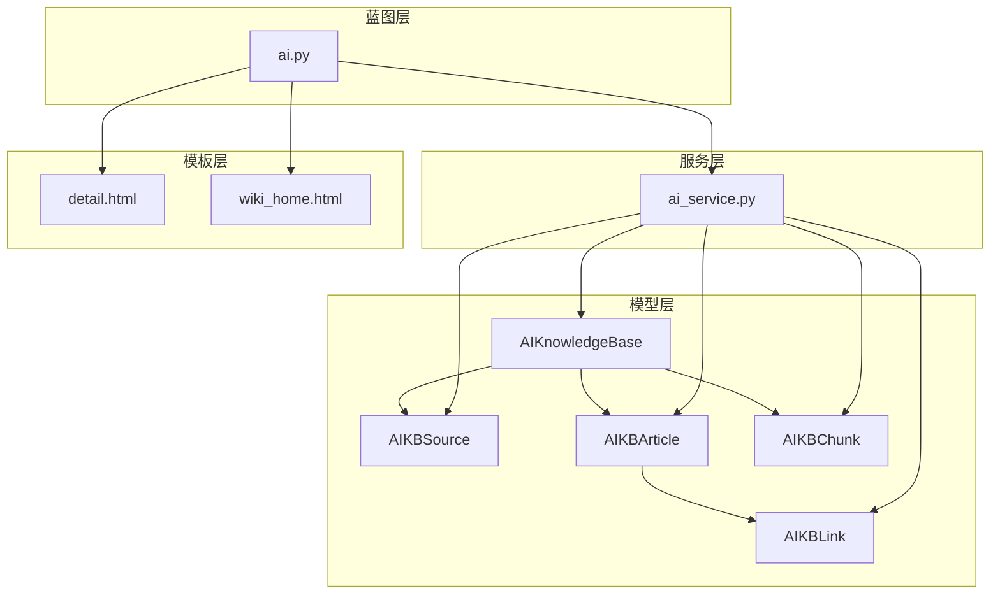
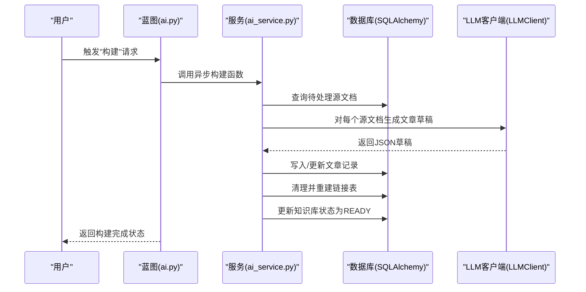
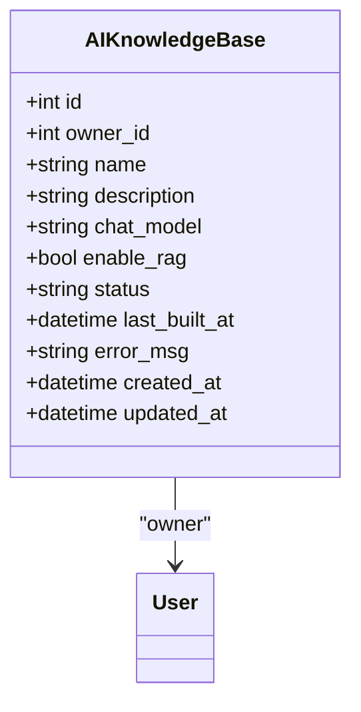
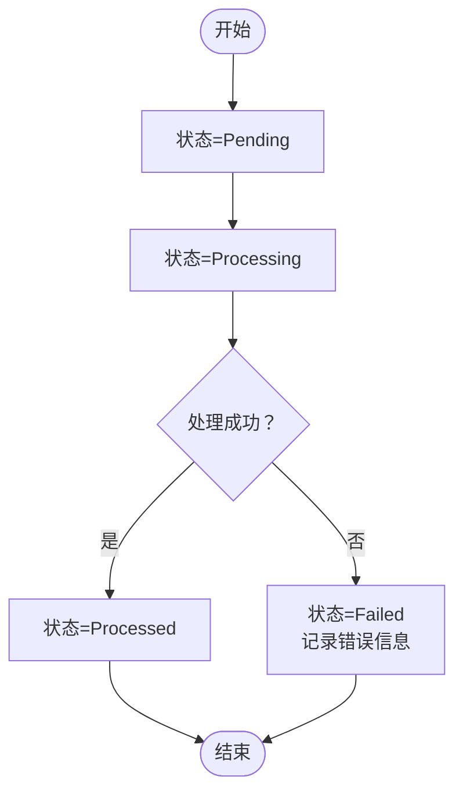
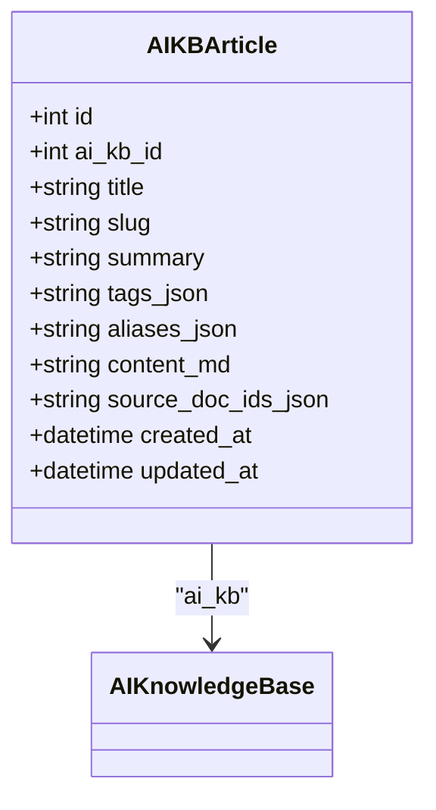
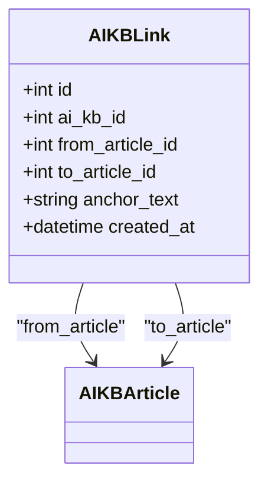
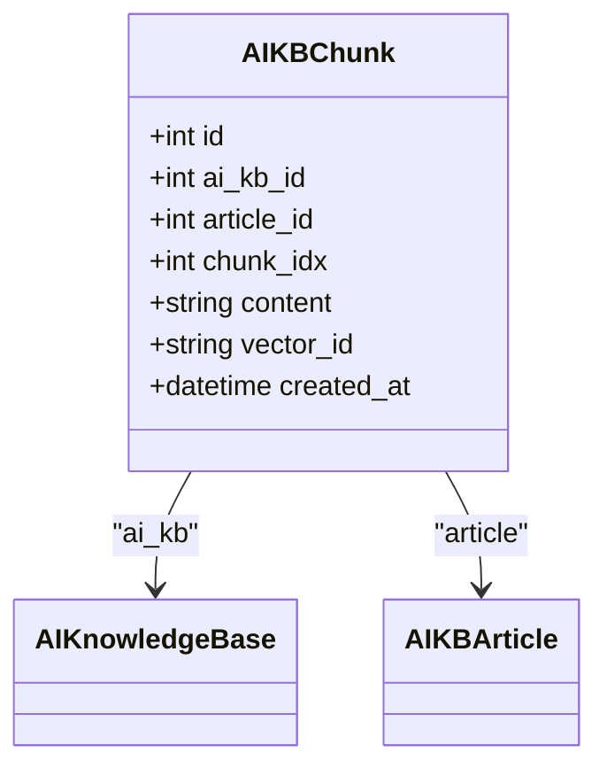
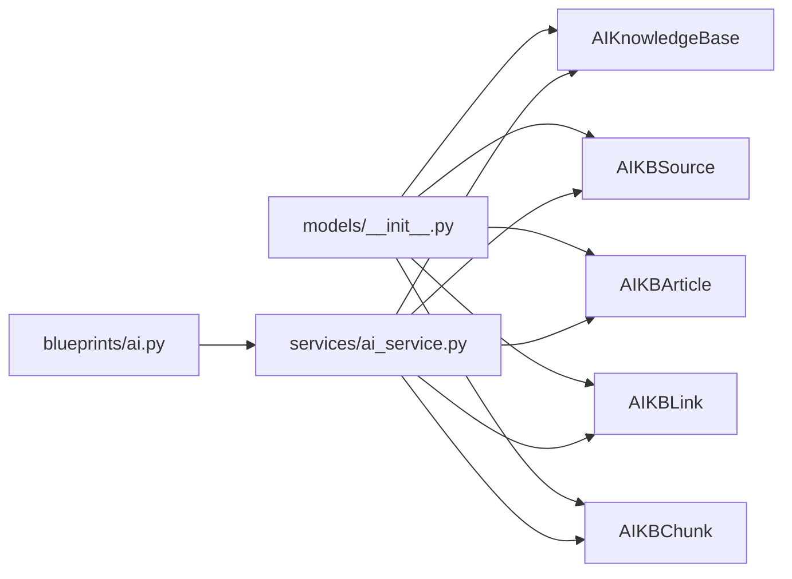

# AI知识库数据模型

<cite>
**本文档引用的文件**
- [app/models/ai_kb.py](file://app/models/ai_kb.py)
- [app/models/__init__.py](file://app/models/__init__.py)
- [app/services/ai_service.py](file://app/services/ai_service.py)
- [app/blueprints/ai.py](file://app/blueprints/ai.py)
- [app/models/document.py](file://app/models/document.py)
- [app/models/knowledge_base.py](file://app/models/knowledge_base.py)
- [app/extensions.py](file://app/extensions.py)
- [app/templates/ai/detail.html](file://app/templates/ai/detail.html)
- [app/templates/ai/wiki_home.html](file://app/templates/ai/wiki_home.html)
</cite>

## 更新摘要
**变更内容**
- 完整验证了AI知识库数据模型的实现细节
- 新增了服务层和蓝图层的具体实现分析
- 补充了模板层的前端使用方式
- 更新了模型间关系图和数据流图
- 增加了实际的数据库操作示例和性能优化建议

## 目录
1. [简介](#简介)
2. [项目结构](#项目结构)
3. [核心组件](#核心组件)
4. [架构总览](#架构总览)
5. [详细组件分析](#详细组件分析)
6. [依赖分析](#依赖分析)
7. [性能考虑](#性能考虑)
8. [故障排查指南](#故障排查指南)
9. [结论](#结论)
10. [附录](#附录)

## 简介
本文件系统化梳理了"AI知识库"数据模型的设计理念与实现细节，围绕以下目标展开：
- 解释AIKnowledgeBase主模型的状态管理、配置选项与时间戳管理
- 说明AIKBSource源文档模型的生命周期状态与唯一约束
- 阐述AIKBArticle维基文章模型的Karpathy风格设计（slug唯一性、标签系统、别名解析、来源文档追踪）
- 分析AIKBLink链接模型的双向关系与红链处理机制
- 解释AIKBChunk向量化模型与ChromaDB的集成方案
- 提供模型间关系图、字段约束说明与数据访问模式
- 给出实际数据库操作示例与性能优化建议

## 项目结构
AI知识库功能位于应用的模型层、服务层、蓝图层与模板层中，采用分层解耦设计：
- 模型层：定义数据库表结构与关系（AIKnowledgeBase、AIKBSource、AIKBArticle、AIKBLink、AIKBChunk）
- 服务层：封装LLM调用、构建流程、链接解析、聊天检索等业务逻辑
- 蓝图层：提供HTTP接口，驱动模型与服务层协同工作
- 模板层：提供用户界面，展示知识库内容与交互功能

**图表来源**
- [app/models/ai_kb.py:22-121](file://app/models/ai_kb.py#L22-L121)
- [app/services/ai_service.py:1-408](file://app/services/ai_service.py#L1-L408)
- [app/blueprints/ai.py:1-279](file://app/blueprints/ai.py#L1-L279)
- [app/templates/ai/detail.html:1-81](file://app/templates/ai/detail.html#L1-L81)
- [app/templates/ai/wiki_home.html:1-52](file://app/templates/ai/wiki_home.html#L1-L52)

**章节来源**
- [app/models/ai_kb.py:1-121](file://app/models/ai_kb.py#L1-L121)
- [app/services/ai_service.py:1-408](file://app/services/ai_service.py#L1-L408)
- [app/blueprints/ai.py:1-279](file://app/blueprints/ai.py#L1-L279)

## 核心组件
本节聚焦五大核心模型及其职责边界与关键字段。

- **AIKnowledgeBase（AI知识库主模型）**
  - 所属：用户拥有，支持私有/公开/成员可见的知识库
  - 关键字段：名称、描述、聊天模型、是否启用RAG、状态、最后构建时间、错误信息、创建/更新时间
  - 关键关系：owner（User），sources（AIKBSource），articles（AIKBArticle）

- **AIKBSource（源文档模型）**
  - 作用：记录某AI知识库所纳入的源文档集合
  - 唯一约束：(ai_kb_id, doc_id)，避免重复收录
  - 生命周期状态：PENDING、PROCESSING、PROCESSED、FAILED
  - 关键关系：ai_kb（AIKnowledgeBase），document（Document）

- **AIKBArticle（维基文章模型）**
  - 设计理念：Karpathy风格，每篇文章对应一个独立的Markdown文件
  - 唯一约束：(ai_kb_id, slug)，确保同一知识库内slug唯一
  - 字段要点：标题、slug、摘要、标签JSON、别名JSON、内容MD、来源文档ID数组JSON
  - 关键关系：ai_kb（AIKnowledgeBase）

- **AIKBLink（链接模型）**
  - 作用：维护文章间的超链接，解析自[[Title]]占位符
  - 特性：from_article -> to_article（可为空，表示红链）
  - 关键关系：from_article（AIKBArticle），to_article（AIKBArticle）

- **AIKBChunk（向量化模型）**
  - 作用：当启用RAG时，存储切分元数据；向量本体存储于ChromaDB
  - 字段要点：ai_kb_id、article_id、chunk_idx、content、vector_id、创建时间
  - 关键关系：ai_kb（AIKnowledgeBase），article（AIKBArticle）

**章节来源**
- [app/models/ai_kb.py:22-121](file://app/models/ai_kb.py#L22-L121)

## 架构总览
AI知识库的构建与运行由蓝图驱动，服务层负责LLM调用与数据处理，模型层承载持久化结构，模板层提供用户界面。

**图表来源**
- [app/blueprints/ai.py:143-156](file://app/blueprints/ai.py#L143-L156)
- [app/services/ai_service.py:313-345](file://app/services/ai_service.py#L313-L345)

## 详细组件分析

### AIKnowledgeBase（状态管理与配置）
- **状态枚举**：IDLE、BUILDING、READY、FAILED
- **配置选项**：
  - chat_model：为空则回退到全局配置CHAT_MODEL
  - enable_rag：是否启用RAG增强
- **时间戳管理**：created_at、updated_at、last_built_at
- **访问模式**：
  - 通过蓝图创建/编辑/删除
  - 通过服务层进行构建与状态查询

**图表来源**
- [app/models/ai_kb.py:22-43](file://app/models/ai_kb.py#L22-L43)

**章节来源**
- [app/models/ai_kb.py:22-43](file://app/models/ai_kb.py#L22-L43)
- [app/blueprints/ai.py:34-85](file://app/blueprints/ai.py#L34-L85)

### AIKBSource（源文档生命周期与唯一约束）
- **唯一约束**：(ai_kb_id, doc_id)，防止重复收录
- **生命周期状态**：PENDING、PROCESSING、PROCESSED、FAILED
- **关系**：属于AIKnowledgeBase，关联Document

**图表来源**
- [app/models/ai_kb.py:46-64](file://app/models/ai_kb.py#L46-L64)
- [app/services/ai_service.py:296-311](file://app/services/ai_service.py#L296-L311)

**章节来源**
- [app/models/ai_kb.py:46-64](file://app/models/ai_kb.py#L46-L64)
- [app/services/ai_service.py:296-311](file://app/services/ai_service.py#L296-L311)
- [app/blueprints/ai.py:108-138](file://app/blueprints/ai.py#L108-L138)

### AIKBArticle（Karpathy风格设计）
- **唯一约束**：(ai_kb_id, slug)，保证同一知识库内slug唯一
- **字段要点**：
  - 标题、slug、摘要
  - tags_json：标签数组
  - aliases_json：别名数组，用于[[别名]]解析
  - content_md：Markdown正文
  - source_doc_ids_json：来源文档ID数组
- **别名解析**：服务层构建标题/别名到文章的索引，支持大小写不敏感匹配

**图表来源**
- [app/models/ai_kb.py:66-91](file://app/models/ai_kb.py#L66-L91)
- [app/services/ai_service.py:237-249](file://app/services/ai_service.py#L237-L249)

**章节来源**
- [app/models/ai_kb.py:66-91](file://app/models/ai_kb.py#L66-L91)
- [app/services/ai_service.py:164-171](file://app/services/ai_service.py#L164-L171)
- [app/services/ai_service.py:237-249](file://app/services/ai_service.py#L237-L249)

### AIKBLink（双向链接与红链处理）
- **双向关系**：from_article -> to_article
- **红链**：to_article_id为空，表示占位但未命中任何条目
- **链接解析**：服务层扫描所有文章的[[...]]占位符，重建链接表

**图表来源**
- [app/models/ai_kb.py:93-108](file://app/models/ai_kb.py#L93-L108)
- [app/services/ai_service.py:251-278](file://app/services/ai_service.py#L251-L278)

**章节来源**
- [app/models/ai_kb.py:93-108](file://app/models/ai_kb.py#L93-L108)
- [app/services/ai_service.py:251-278](file://app/services/ai_service.py#L251-L278)

### AIKBChunk（向量化与ChromaDB集成）
- **使用场景**：当AIKnowledgeBase.enable_rag为真时启用
- **存储策略**：切分元数据存数据库，向量本体存ChromaDB
- **字段要点**：ai_kb_id、article_id、chunk_idx、content、vector_id、created_at

**图表来源**
- [app/models/ai_kb.py:110-121](file://app/models/ai_kb.py#L110-L121)

**章节来源**
- [app/models/ai_kb.py:110-121](file://app/models/ai_kb.py#L110-L121)
- [app/services/ai_service.py:384-408](file://app/services/ai_service.py#L384-L408)

## 依赖分析
- **模型导入**：通过包初始化统一导出，便于蓝图与服务层按需引用
- **外部依赖**：OpenAI兼容SDK（LLMClient），slugify（URL友好化）
- **数据库依赖**：SQLAlchemy，外键级联删除，唯一约束，索引

**图表来源**
- [app/models/__init__.py:5-13](file://app/models/__init__.py#L5-L13)
- [app/blueprints/ai.py:8-12](file://app/blueprints/ai.py#L8-L12)
- [app/services/ai_service.py:30-38](file://app/services/ai_service.py#L30-L38)

**章节来源**
- [app/models/__init__.py:1-38](file://app/models/__init__.py#L1-L38)
- [app/extensions.py:1-17](file://app/extensions.py#L1-L17)

## 性能考虑
- **索引优化**
  - AIKnowledgeBase：owner_id、status
  - AIKBSource：ai_kb_id、doc_id、status
  - AIKBArticle：ai_kb_id、slug
  - AIKBLink：from_article_id、to_article_id
  - AIKBChunk：ai_kb_id、article_id、vector_id
- **查询优化**
  - 构建阶段：按状态过滤（PENDING/FAILED）批量处理
  - 链接解析：一次性扫描所有文章，避免重复遍历
- **I/O优化**
  - 文章文件写入：统一目录结构，避免频繁目录创建
- **并发与异步**
  - 构建流程在后台线程执行，避免阻塞主线程
- **向量化（RAG）**
  - 切分元数据入库，向量本体存ChromaDB，减少数据库压力

## 故障排查指南
- **构建失败**
  - 检查AIKnowledgeBase.error_msg与AIKBSource.err_msg
  - 查看服务层异常捕获与状态回滚逻辑
- **红链过多**
  - 通过蓝图统计红链数量，定位未解析的[[...]]占位符
  - 检查AIKBArticle的aliases_json与标题一致性
- **重复收录**
  - 确认AIKBSource唯一约束是否生效
- **slug冲突**
  - 服务层提供slug生成与冲突重试逻辑

**章节来源**
- [app/blueprints/ai.py:55-62](file://app/blueprints/ai.py#L55-L62)
- [app/services/ai_service.py:296-311](file://app/services/ai_service.py#L296-L311)
- [app/services/ai_service.py:251-278](file://app/services/ai_service.py#L251-L278)

## 结论
本数据模型以Karpathy风格的"纯Markdown + 双向链接"为核心，辅以可选的RAG增强。通过清晰的状态机、唯一约束与索引策略，实现了从源文档到维基文章、再到链接图谱的全链路闭环。服务层对LLM的封装与异步构建流程，使得系统具备良好的扩展性与稳定性。

## 附录

### 字段约束与说明
- **AIKnowledgeBase**
  - owner_id：外键，CASCADE删除
  - status：默认IDLE，索引
  - chat_model：为空回退至配置
  - enable_rag：布尔开关
- **AIKBSource**
  - 唯一约束：(ai_kb_id, doc_id)
  - status：PENDING/PROCESSING/PROCESSED/FAILED
- **AIKBArticle**
  - 唯一约束：(ai_kb_id, slug)
  - tags_json/aliases_json/source_doc_ids_json：JSON数组
- **AIKBLink**
  - to_article_id可为空，表示红链
- **AIKBChunk**
  - vector_id：ChromaDB向量标识

**章节来源**
- [app/models/ai_kb.py:22-121](file://app/models/ai_kb.py#L22-L121)

### 数据访问模式示例
- **创建AI知识库**
  - 蓝图POST /ai/new，写入AIKnowledgeBase
- **加入源文档**
  - 蓝图POST /ai/<id>/sources/add，写入AIKBSource
- **触发构建**
  - 蓝图POST /ai/<id>/build，服务层异步处理
- **查看状态**
  - 蓝图GET /ai/<id>/status，返回状态与统计
- **浏览维基文章**
  - 蓝图GET /ai/<id>/wiki/<slug>，渲染Markdown并解析链接

**章节来源**
- [app/blueprints/ai.py:34-85](file://app/blueprints/ai.py#L34-L85)
- [app/blueprints/ai.py:108-138](file://app/blueprints/ai.py#L108-L138)
- [app/blueprints/ai.py:143-156](file://app/blueprints/ai.py#L143-L156)
- [app/blueprints/ai.py:159-173](file://app/blueprints/ai.py#L159-L173)
- [app/blueprints/ai.py:208-236](file://app/blueprints/ai.py#L208-L236)

### LLM客户端配置
- **支持的后端**：OpenAI、DeepSeek、Tongyi、本地代理
- **配置参数**：base_url、api_key、model
- **温度控制**：0.2-0.4用于问答，0.3用于草稿生成

**章节来源**
- [app/services/ai_service.py:47-86](file://app/services/ai_service.py#L47-L86)

### 前端界面使用
- **知识库详情页**：显示构建状态、源文档列表、文章统计
- **Wiki主页**：按标签分组的文章列表
- **文章详情页**：Markdown渲染、反向链接、标签展示
- **关系图**：可视化文章链接网络

**章节来源**
- [app/templates/ai/detail.html:1-81](file://app/templates/ai/detail.html#L1-L81)
- [app/templates/ai/wiki_home.html:1-52](file://app/templates/ai/wiki_home.html#L1-L52)