# AI知识库服务层

<cite>
**本文引用的文件**
- [app/services/ai_service.py](file://app/services/ai_service.py)
- [app/models/ai_kb.py](file://app/models/ai_kb.py)
- [app/utils/markdown.py](file://app/utils/markdown.py)
- [app/utils/outline.py](file://app/utils/outline.py)
- [app/blueprints/ai.py](file://app/blueprints/ai.py)
- [app/config.py](file://app/config.py)
- [app/extensions.py](file://app/extensions.py)
- [app/__init__.py](file://app/__init__.py)
- [app/utils/ids.py](file://app/utils/ids.py)
- [app/services/config_service.py](file://app/services/config_service.py)
- [requirements.txt](file://requirements.txt)
</cite>

## 目录
1. [简介](#简介)
2. [项目结构](#项目结构)
3. [核心组件](#核心组件)
4. [架构总览](#架构总览)
5. [详细组件分析](#详细组件分析)
6. [依赖分析](#依赖分析)
7. [性能考虑](#性能考虑)
8. [故障排除指南](#故障排除指南)
9. [结论](#结论)
10. [附录](#附录)

## 简介
本文件面向AI知识库服务层，系统化梳理从源文档到Wiki条目的完整处理链路，覆盖状态机管理、源文档处理管道、错误恢复机制、链接解析与跨文档引用、向量嵌入与RAG检索（可选）、增量更新策略、缓存与性能优化、OpenAI兼容SDK封装、并发与后台任务调度，以及蓝图层交互与中间件集成。文档以"可读性优先"的原则，结合图示与路径引用，帮助开发者快速理解与扩展。

**更新** 服务层现已采用字符串ID处理模式，所有AI知识库相关函数均接受字符串类型的ID参数，确保与模型层的统一性和类型安全性。同时，增强了错误处理机制，包括配置获取的回退机制、更好的空文档处理、改进的日志记录和配置管理，显著提升了AI知识库构建过程的可靠性。

## 项目结构
- 服务层位于 app/services，核心为 ai_service.py，负责LLM封装、Wiki构建、链接解析、异步构建与RAG问答。
- 数据模型位于 app/models，核心为 ai_kb.py，定义AI知识库、源文档、文章、链接、分片等实体及状态枚举。
- 工具函数位于 app/utils，包括Markdown渲染与wikilink收集、Editor.js内容提取。
- 蓝图层位于 app/blueprints，ai.py 提供知识库管理、构建、浏览、图谱、聊天等路由。
- 配置与扩展位于 app/config.py 与 app/extensions.py，统一注入数据库、登录、CSRF、AI相关参数。
- 应用工厂位于 app/__init__.py，注册蓝图、扩展与上下文处理器。
- ID生成工具位于 app/utils/ids.py，提供短URL友好的随机ID生成器。
- 配置服务位于 app/services/config_service.py，提供DB缓存的配置管理。

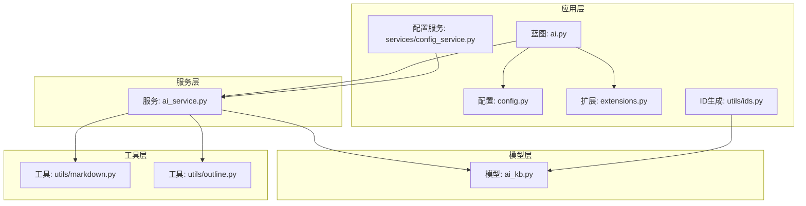

**图表来源**
- [app/blueprints/ai.py:1-309](file://app/blueprints/ai.py#L1-L309)
- [app/services/ai_service.py:1-444](file://app/services/ai_service.py#L1-L444)
- [app/models/ai_kb.py:1-122](file://app/models/ai_kb.py#L1-L122)
- [app/utils/markdown.py:1-87](file://app/utils/markdown.py#L1-L87)
- [app/utils/outline.py:1-143](file://app/utils/outline.py#L1-L143)
- [app/config.py:1-84](file://app/config.py#L1-L84)
- [app/extensions.py:1-17](file://app/extensions.py#L1-L17)
- [app/utils/ids.py:1-21](file://app/utils/ids.py#L1-L21)
- [app/services/config_service.py:1-82](file://app/services/config_service.py#L1-L82)

**章节来源**
- [app/__init__.py:11-101](file://app/__init__.py#L11-L101)
- [app/blueprints/ai.py:1-309](file://app/blueprints/ai.py#L1-L309)
- [app/services/ai_service.py:1-444](file://app/services/ai_service.py#L1-L444)
- [app/models/ai_kb.py:1-122](file://app/models/ai_kb.py#L1-L122)
- [app/utils/markdown.py:1-87](file://app/utils/markdown.py#L1-L87)
- [app/utils/outline.py:1-143](file://app/utils/outline.py#L1-L143)
- [app/config.py:1-84](file://app/config.py#L1-L84)
- [app/extensions.py:1-17](file://app/extensions.py#L1-L17)
- [app/utils/ids.py:1-21](file://app/utils/ids.py#L1-L21)
- [app/services/config_service.py:1-82](file://app/services/config_service.py#L1-L82)

## 核心组件
- LLM客户端封装：统一OpenAI兼容SDK调用，支持多厂商与本地代理，动态加载client，避免重复初始化。**新增配置获取回退机制**：当DB配置服务在后台线程中不可用时，自动回退到应用配置。
- Wiki构建器：将源文档转换为标准模板的Markdown条目，输出标题、别名、摘要、标签、正文与相关条目列表。**增强空文档处理**：对空文档进行特殊处理，避免构建失败。
- 链接解析器：扫描条目中的[[Title]]占位符，基于标题/别名/slug建立索引，生成双向链接表与红链统计。
- 异步构建流水线：后台线程执行构建，维护源文档状态机与知识库整体状态机，失败回滚与错误消息持久化。**改进日志记录**：增加详细的构建过程日志，便于调试和监控。
- 可选RAG问答：基于关键词重排Top-N条目，拼接上下文后调用LLM回答；向量存储与嵌入模型预留（需启用RAG）。
- 蓝图交互：提供知识库创建、编辑、构建、浏览、图谱、聊天等端点，配合权限控制与状态查询。
- **字符串ID处理**：所有服务函数现在明确接受字符串类型的AI知识库ID参数，确保类型安全和一致性。

**章节来源**
- [app/services/ai_service.py:47-86](file://app/services/ai_service.py#L47-L86)
- [app/services/ai_service.py:147-171](file://app/services/ai_service.py#L147-L171)
- [app/services/ai_service.py:251-288](file://app/services/ai_service.py#L251-L288)
- [app/services/ai_service.py:326-381](file://app/services/ai_service.py#L326-L381)
- [app/services/ai_service.py:427-444](file://app/services/ai_service.py#L427-L444)
- [app/blueprints/ai.py:173-203](file://app/blueprints/ai.py#L173-L203)

## 架构总览
服务层围绕"知识库-源文档-文章-链接"四元组展开，通过LLM生成文章，再进行wikilink解析，最终形成可浏览的Wiki与可选的RAG问答能力。蓝图层负责权限校验、状态查询与UI交互，配置层提供模型与目录参数。所有ID现在统一使用字符串类型，确保跨层一致性和类型安全。**新增配置回退机制**确保在各种环境下都能正确获取配置信息。

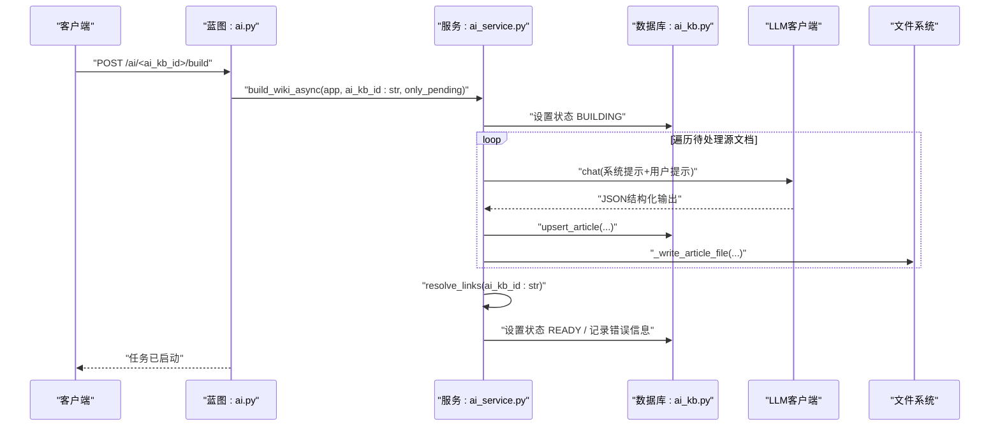

**图表来源**
- [app/blueprints/ai.py:173-186](file://app/blueprints/ai.py#L173-L186)
- [app/services/ai_service.py:326-381](file://app/services/ai_service.py#L326-L381)
- [app/services/ai_service.py:306-324](file://app/services/ai_service.py#L306-L324)
- [app/services/ai_service.py:147-171](file://app/services/ai_service.py#L147-L171)
- [app/services/ai_service.py:214-240](file://app/services/ai_service.py#L214-L240)
- [app/services/ai_service.py:261-288](file://app/services/ai_service.py#L261-L288)

## 详细组件分析

### LLM客户端封装（OpenAI兼容）
- 功能要点
  - 基于当前应用配置动态构造client，支持base_url与api_key，模型名可按知识库覆盖。
  - **新增配置获取回退机制**：优先使用显式参数，然后尝试DB配置服务，最后回退到应用配置，确保在后台线程中也能正常工作。
  - 提供chat方法，固定系统与用户消息结构，支持响应格式约束。
  - 导入异常保护，缺失SDK时抛出明确运行时错误。
- 并发与稳定性
  - client惰性初始化，避免重复导入与初始化开销。
  - 失败时保留错误消息，便于上层状态机记录与展示。

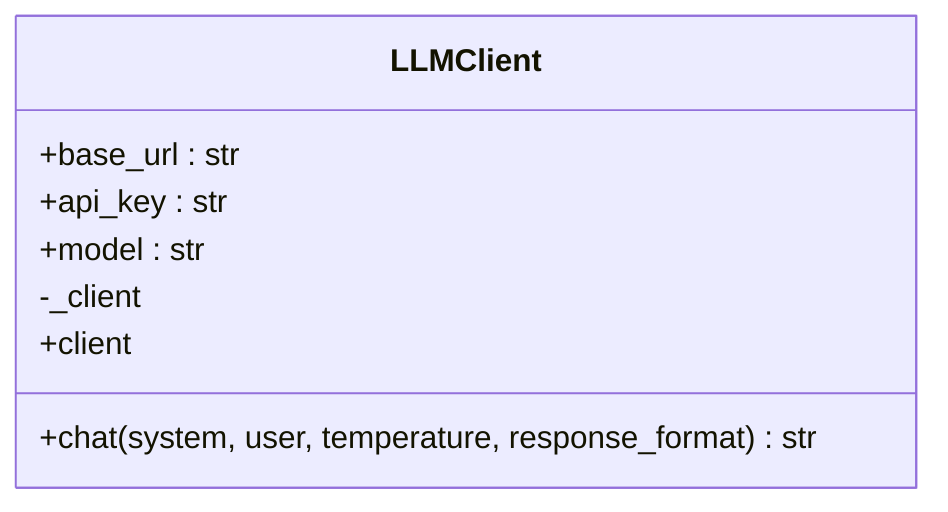

**图表来源**
- [app/services/ai_service.py:47-86](file://app/services/ai_service.py#L47-L86)

**章节来源**
- [app/services/ai_service.py:47-86](file://app/services/ai_service.py#L47-L86)

### Wiki构建流程与状态机
- 文章生成
  - 从源文档抽取纯文本，截断安全上限，拼装系统提示与用户模板，调用LLM生成JSON结构化结果，解析为草稿对象。
  - **增强空文档处理**：对空文档内容进行特殊处理，避免构建失败并提供清晰的错误信息。
  - 去重slug生成，插入或更新文章记录，落盘为Markdown文件。
- 状态机
  - 知识库状态：IDLE → BUILDING → READY/FAILED
  - 源文档状态：PENDING → PROCESSING → PROCESSED/FAILED
- 错误恢复
  - 源文档处理异常捕获，记录错误消息，状态置为FAILED，不影响其他源文档。
  - 知识库级异常捕获，设置FAILED并持久化错误信息。
  - **改进日志记录**：增加详细的构建过程日志，包括开始、完成和失败信息，便于调试和监控。

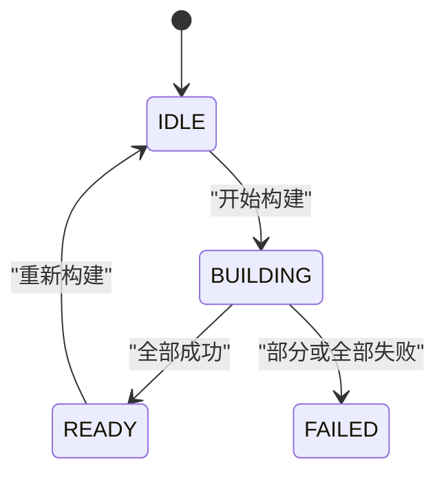

**图表来源**
- [app/models/ai_kb.py:9-14](file://app/models/ai_kb.py#L9-L14)
- [app/models/ai_kb.py:16-21](file://app/models/ai_kb.py#L16-L21)

**章节来源**
- [app/services/ai_service.py:147-171](file://app/services/ai_service.py#L147-L171)
- [app/services/ai_service.py:306-324](file://app/services/ai_service.py#L306-L324)
- [app/services/ai_service.py:336-377](file://app/services/ai_service.py#L336-L377)
- [app/services/ai_service.py:326-381](file://app/services/ai_service.py#L326-L381)
- [app/models/ai_kb.py:9-14](file://app/models/ai_kb.py#L9-L14)
- [app/models/ai_kb.py:16-21](file://app/models/ai_kb.py#L16-L21)

### 源文档处理管道
- 输入：AIKBSource（绑定知识库与文档）
- 处理：逐条拉取源文档，抽取纯文本，调用LLM生成草稿，入库与落盘
- 输出：AIKBArticle（含标题、别名、摘要、标签、正文、来源文档ID列表）
- **字符串ID处理**：所有操作均基于字符串类型的AI知识库ID进行过滤和查询
- **增强错误处理**：对不存在或已删除的源文档进行明确处理，避免构建失败

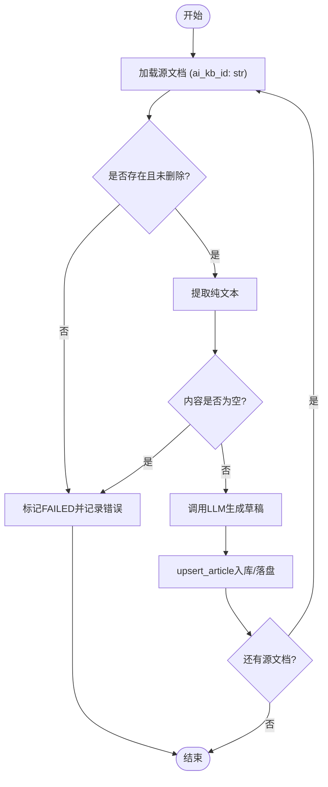

**图表来源**
- [app/services/ai_service.py:306-324](file://app/services/ai_service.py#L306-L324)
- [app/services/ai_service.py:147-171](file://app/services/ai_service.py#L147-L171)
- [app/services/ai_service.py:214-240](file://app/services/ai_service.py#L214-L240)

**章节来源**
- [app/services/ai_service.py:306-324](file://app/services/ai_service.py#L306-L324)
- [app/services/ai_service.py:147-171](file://app/services/ai_service.py#L147-L171)
- [app/services/ai_service.py:214-240](file://app/services/ai_service.py#L214-L240)

### 链接解析算法与跨文档引用
- 解析步骤
  - 清空旧链接表，构建标题/别名/slug索引（大小写不敏感去重）
  - 扫描所有文章正文中的wikilink，查找目标文章，生成出站/入站链接
  - 统计解析数与红链数（未命中的占位符）
- 解析器
  - 提供resolver闭包，将[[Target]]映射为slug或None
  - 蓝图层渲染时，将占位锚点替换为实际URL
- **字符串ID处理**：索引构建和查找均基于字符串类型的AI知识库ID

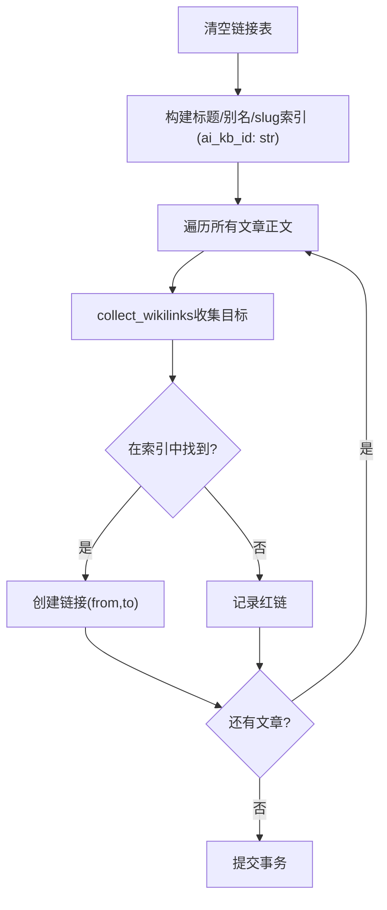

**图表来源**
- [app/services/ai_service.py:261-288](file://app/services/ai_service.py#L261-L288)
- [app/utils/markdown.py:69-87](file://app/utils/markdown.py#L69-L87)
- [app/blueprints/ai.py:240-266](file://app/blueprints/ai.py#L240-L266)

**章节来源**
- [app/services/ai_service.py:261-288](file://app/services/ai_service.py#L261-L288)
- [app/utils/markdown.py:69-87](file://app/utils/markdown.py#L69-L87)
- [app/blueprints/ai.py:240-266](file://app/blueprints/ai.py#L240-L266)

### RAG检索与问答（可选）
- 触发条件：知识库开启enable_rag
- 检索策略：关键词重排Top-N文章，拼接上下文后调用LLM回答
- 向量存储：预留ai_kb_chunks表与vector_id字段，嵌入模型与Chroma路径由配置提供（需安装可选依赖）

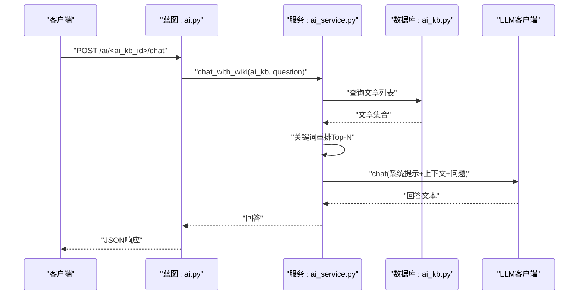

**图表来源**
- [app/blueprints/ai.py:295-309](file://app/blueprints/ai.py#L295-L309)
- [app/services/ai_service.py:427-444](file://app/services/ai_service.py#L427-L444)
- [app/config.py:45-49](file://app/config.py#L45-L49)
- [app/models/ai_kb.py:111-122](file://app/models/ai_kb.py#L111-L122)

**章节来源**
- [app/services/ai_service.py:427-444](file://app/services/ai_service.py#L427-L444)
- [app/blueprints/ai.py:295-309](file://app/blueprints/ai.py#L295-L309)
- [app/config.py:45-49](file://app/config.py#L45-L49)
- [app/models/ai_kb.py:111-122](file://app/models/ai_kb.py#L111-L122)

### 增量更新与重生机制
- 单篇文章重生：根据文章首个源文档重建条目，保持slug不变，更新数据库与文件
- 全量重建：可选择仅处理待处理/失败的源文档，或重置状态后全量重建
- **字符串ID处理**：重生操作基于字符串类型的AI知识库ID和文章ID进行定位

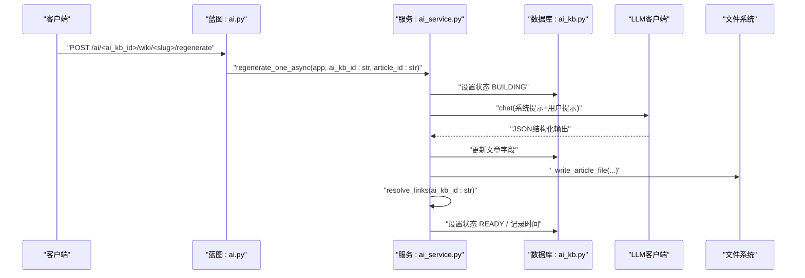

**图表来源**
- [app/blueprints/ai.py:269-278](file://app/blueprints/ai.py#L269-L278)
- [app/services/ai_service.py:383-417](file://app/services/ai_service.py#L383-L417)
- [app/services/ai_service.py:147-171](file://app/services/ai_service.py#L147-L171)
- [app/services/ai_service.py:214-240](file://app/services/ai_service.py#L214-L240)
- [app/services/ai_service.py:261-288](file://app/services/ai_service.py#L261-L288)

**章节来源**
- [app/blueprints/ai.py:269-278](file://app/blueprints/ai.py#L269-L278)
- [app/services/ai_service.py:383-417](file://app/services/ai_service.py#L383-L417)

### 蓝图层交互与中间件集成
- 权限控制：仅知识库拥有者或超级管理员可操作AI知识库
- 状态查询：提供JSON接口返回知识库状态、错误、最后构建时间、源文档计数与文章数量
- 中间件：登录、CSRF、数据库扩展在应用工厂中注册
- **字符串ID处理**：蓝图路由参数均为字符串类型，确保与服务层的一致性

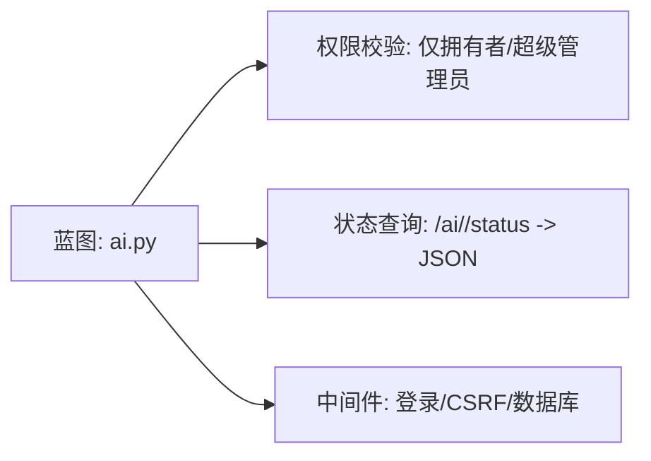

**图表来源**
- [app/blueprints/ai.py:18-25](file://app/blueprints/ai.py#L18-L25)
- [app/blueprints/ai.py:189-203](file://app/blueprints/ai.py#L189-L203)
- [app/__init__.py:39-54](file://app/__init__.py#L39-L54)
- [app/extensions.py:1-17](file://app/extensions.py#L1-L17)

**章节来源**
- [app/blueprints/ai.py:18-25](file://app/blueprints/ai.py#L18-L25)
- [app/blueprints/ai.py:189-203](file://app/blueprints/ai.py#L189-L203)
- [app/__init__.py:39-54](file://app/__init__.py#L39-L54)
- [app/extensions.py:1-17](file://app/extensions.py#L1-L17)

## 依赖分析
- 运行时依赖：Flask、SQLAlchemy、OpenAI SDK、python-slugify、markdown、bleach等
- 可选依赖：当启用RAG时需要chromadb与tiktoken（见配置与注释）
- 服务层与蓝图层解耦：蓝图仅负责路由与权限，业务逻辑集中在服务层
- **ID生成工具**：使用app/utils/ids.py提供的短URL友好ID生成器，确保跨层ID一致性
- **配置服务**：使用app/services/config_service.py提供DB缓存的配置管理，支持回退机制

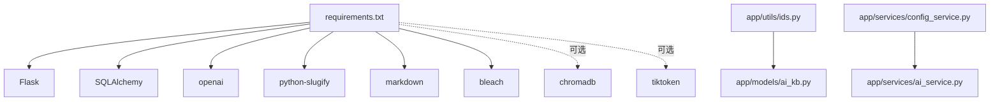

**图表来源**
- [requirements.txt:1-21](file://requirements.txt#L1-L21)
- [app/utils/ids.py:14-21](file://app/utils/ids.py#L14-L21)
- [app/services/config_service.py:1-82](file://app/services/config_service.py#L1-L82)

**章节来源**
- [requirements.txt:1-21](file://requirements.txt#L1-L21)
- [app/config.py:45-49](file://app/config.py#L45-L49)
- [app/utils/ids.py:1-21](file://app/utils/ids.py#L1-L21)
- [app/services/config_service.py:1-82](file://app/services/config_service.py#L1-L82)

## 性能考虑
- 文本截断与安全上限：对源文档纯文本进行长度限制，降低LLM输入成本与风险
- 惰性初始化：LLM客户端按需创建，避免全局初始化开销
- 文件落盘：文章以独立Markdown文件存储，便于静态化与CDN加速
- 索引去重：wikilink解析前构建大小写不敏感索引，减少重复计算
- 并发与后台任务：使用后台线程执行构建，避免阻塞请求；失败不影响其他任务
- 可选RAG：仅在enable_rag开启时引入向量化与Chroma存储，按需启用
- **字符串ID优化**：统一的字符串ID类型减少了类型转换开销，提高了查询效率
- **配置缓存优化**：配置服务使用进程内缓存，避免频繁的DB查询开销

**章节来源**
- [app/services/ai_service.py:147-171](file://app/services/ai_service.py#L147-L171)
- [app/services/ai_service.py:62-70](file://app/services/ai_service.py#L62-L70)
- [app/services/ai_service.py:196-202](file://app/services/ai_service.py#L196-L202)
- [app/services/ai_service.py:261-288](file://app/services/ai_service.py#L261-L288)
- [app/services/ai_service.py:326-381](file://app/services/ai_service.py#L326-L381)
- [app/config.py:45-49](file://app/config.py#L45-L49)
- [app/services/config_service.py:20-31](file://app/services/config_service.py#L20-L31)

## 故障排除指南
- LLM SDK未安装
  - 现象：初始化LLM客户端时报运行时错误
  - 处理：安装openai依赖或检查环境变量
  - 参考路径：[app/services/ai_service.py:77-79](file://app/services/ai_service.py#L77-L79)
- 源文档不存在或已删除
  - 现象：构建阶段状态置为FAILED并记录错误
  - 处理：确认源文档状态，重新加入或修复文档
  - 参考路径：[app/services/ai_service.py:312-313](file://app/services/ai_service.py#L312-L313)
- **新增：空文档处理失败**
  - 现象：源文档内容为空，构建失败
  - 处理：检查源文档内容，确保包含有效文本
  - 参考路径：[app/services/ai_service.py:315-316](file://app/services/ai_service.py#L315-L316)
- 红链过多
  - 现象：wikilink未解析为目标文章
  - 处理：检查目标标题/别名是否正确，必要时手动修正
  - 参考路径：[app/services/ai_service.py:261-288](file://app/services/ai_service.py#L261-L288)
- 知识库构建失败
  - 现象：状态停留在BUILDING或切换为FAILED
  - 处理：查看错误消息，重试或清理失败状态后全量重建
  - 参考路径：[app/services/ai_service.py:374-377](file://app/services/ai_service.py#L374-L377)
- **新增：配置获取失败**
  - 现象：LLM API密钥或模型配置获取失败
  - 处理：检查系统设置中的配置项，确保DB配置服务正常工作
  - 参考路径：[app/services/ai_service.py:62-69](file://app/services/ai_service.py#L62-L69)
- RAG不可用
  - 现象：启用RAG后仍为纯文本问答
  - 处理：安装chromadb与tiktoken，配置EMBEDDING_MODEL与CHROMA_PATH
  - 参考路径：[requirements.txt:19-21](file://requirements.txt#L19-L21)，[app/config.py:45-49](file://app/config.py#L45-L49)
- **字符串ID类型错误**
  - 现象：服务函数调用时报类型错误
  - 处理：确保传递字符串类型的AI知识库ID，不要使用整数ID
  - 参考路径：[app/services/ai_service.py:326](file://app/services/ai_service.py#L326)

**章节来源**
- [app/services/ai_service.py:77-79](file://app/services/ai_service.py#L77-L79)
- [app/services/ai_service.py:312-313](file://app/services/ai_service.py#L312-L313)
- [app/services/ai_service.py:315-316](file://app/services/ai_service.py#L315-L316)
- [app/services/ai_service.py:261-288](file://app/services/ai_service.py#L261-L288)
- [app/services/ai_service.py:374-377](file://app/services/ai_service.py#L374-L377)
- [app/services/ai_service.py:62-69](file://app/services/ai_service.py#L62-L69)
- [requirements.txt:19-21](file://requirements.txt#L19-L21)
- [app/config.py:45-49](file://app/config.py#L45-L49)
- [app/services/ai_service.py:326](file://app/services/ai_service.py#L326)

## 结论
本服务层以Karpathy LLM Wiki方法为核心，结合可选RAG增强，提供了从源文档到可导航知识图谱的完整链路。通过清晰的状态机、健壮的错误恢复、可扩展的LLM封装与后台异步任务，既满足纯文本知识库场景，也为未来向量检索与大规模扩展打下基础。蓝图层与服务层职责分离，便于维护与演进。

**更新** 服务层现已全面采用字符串ID处理模式，确保了与模型层的完全一致性和类型安全性，为系统的稳定性和可维护性提供了重要保障。同时，通过增强的错误处理机制、配置获取回退、空文档处理和改进的日志记录，显著提升了AI知识库构建过程的可靠性和用户体验。

## 附录

### 服务层API接口文档（蓝图层）
- 获取状态
  - 方法：GET
  - 路径：/ai/<ai_kb_id>/status
  - 参数：ai_kb_id（字符串类型）
  - 返回：JSON，包含status、error、last_built_at、sources计数、articles数量
  - 权限：登录用户
  - 参考路径：[app/blueprints/ai.py:189-203](file://app/blueprints/ai.py#L189-L203)
- 启动构建
  - 方法：POST
  - 路径：/ai/<ai_kb_id>/build
  - 参数：ai_kb_id（字符串类型），scope（默认仅待处理，传all则重置为PENDING后全量）
  - 返回：重定向至详情页
  - 权限：登录用户（拥有者或超级管理员）
  - 参考路径：[app/blueprints/ai.py:173-186](file://app/blueprints/ai.py#L173-L186)
- 文章重生
  - 方法：POST
  - 路径：/ai/<ai_kb_id>/wiki/<slug>/regenerate
  - 参数：ai_kb_id（字符串类型），slug（字符串类型）
  - 返回：重定向至文章详情
  - 权限：登录用户（拥有者或超级管理员）
  - 参考路径：[app/blueprints/ai.py:269-278](file://app/blueprints/ai.py#L269-L278)
- 聊天问答（可选）
  - 方法：GET/POST
  - 路径：/ai/<ai_kb_id>/chat
  - 参数：ai_kb_id（字符串类型），POST参数：q（问题）
  - 返回：JSON，包含ok与answer或error
  - 权限：登录用户
  - 参考路径：[app/blueprints/ai.py:295-309](file://app/blueprints/ai.py#L295-L309)

**章节来源**
- [app/blueprints/ai.py:189-203](file://app/blueprints/ai.py#L189-L203)
- [app/blueprints/ai.py:173-186](file://app/blueprints/ai.py#L173-L186)
- [app/blueprints/ai.py:269-278](file://app/blueprints/ai.py#L269-L278)
- [app/blueprints/ai.py:295-309](file://app/blueprints/ai.py#L295-L309)

### 关键数据模型与关系
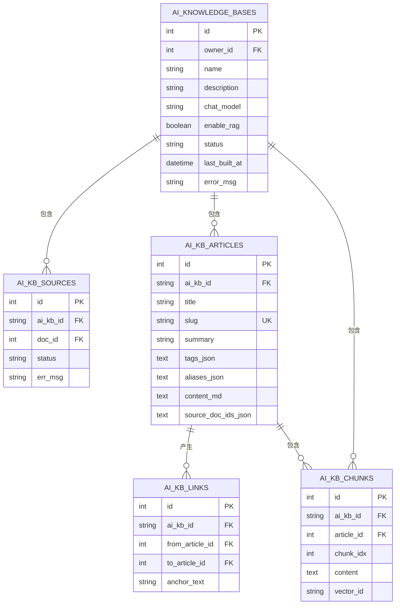

**图表来源**
- [app/models/ai_kb.py:23-44](file://app/models/ai_kb.py#L23-L44)
- [app/models/ai_kb.py:47-65](file://app/models/ai_kb.py#L47-L65)
- [app/models/ai_kb.py:67-92](file://app/models/ai_kb.py#L67-L92)
- [app/models/ai_kb.py:94-109](file://app/models/ai_kb.py#L94-L109)
- [app/models/ai_kb.py:111-122](file://app/models/ai_kb.py#L111-L122)

### 字符串ID处理最佳实践
- **类型一致性**：所有服务函数必须接收字符串类型的AI知识库ID参数
- **参数验证**：在服务层入口处验证ID格式，确保非空且符合预期格式
- **错误处理**：对无效ID进行明确的错误处理和用户反馈
- **日志记录**：记录ID处理过程中的关键信息，便于调试和监控

**章节来源**
- [app/services/ai_service.py:326](file://app/services/ai_service.py#L326)
- [app/services/ai_service.py:383](file://app/services/ai_service.py#L383)
- [app/services/ai_service.py:261](file://app/services/ai_service.py#L261)
- [app/services/ai_service.py:346](file://app/services/ai_service.py#L346)
- [app/services/ai_service.py:396](file://app/services/ai_service.py#L396)

### 配置管理最佳实践
- **配置获取回退机制**：优先使用显式参数，然后尝试DB配置服务，最后回退到应用配置
- **缓存优化**：利用配置服务的进程内缓存，避免频繁的DB查询
- **错误处理**：在后台线程中遇到配置服务异常时，自动回退到应用配置
- **日志记录**：记录配置获取过程，便于调试和监控

**章节来源**
- [app/services/ai_service.py:62-69](file://app/services/ai_service.py#L62-L69)
- [app/services/ai_service.py:344-352](file://app/services/ai_service.py#L344-L352)
- [app/services/config_service.py:20-31](file://app/services/config_service.py#L20-L31)