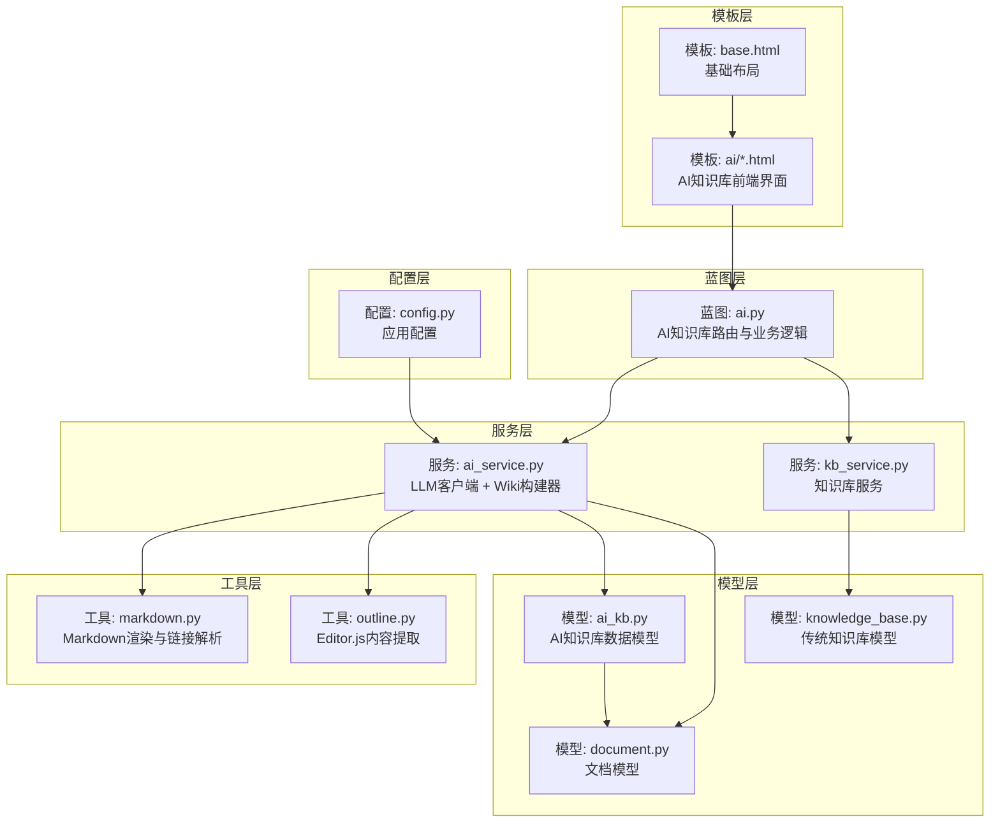
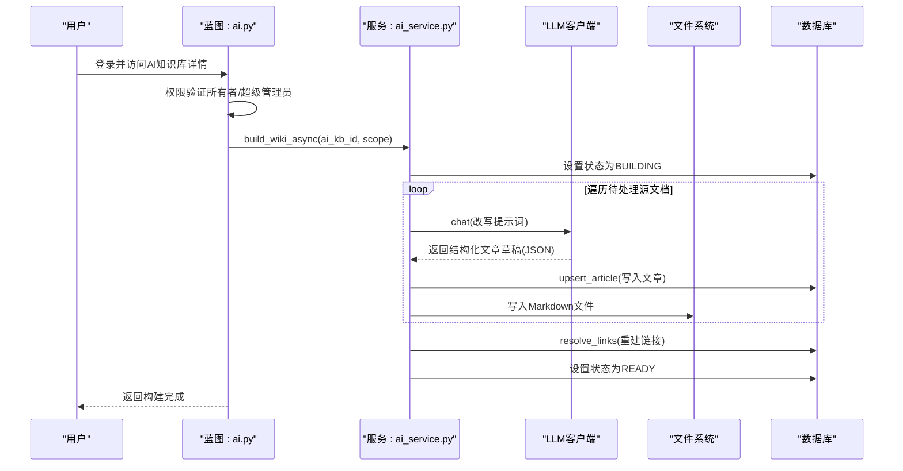
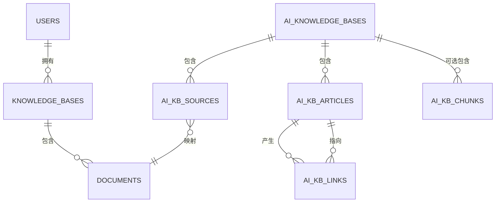
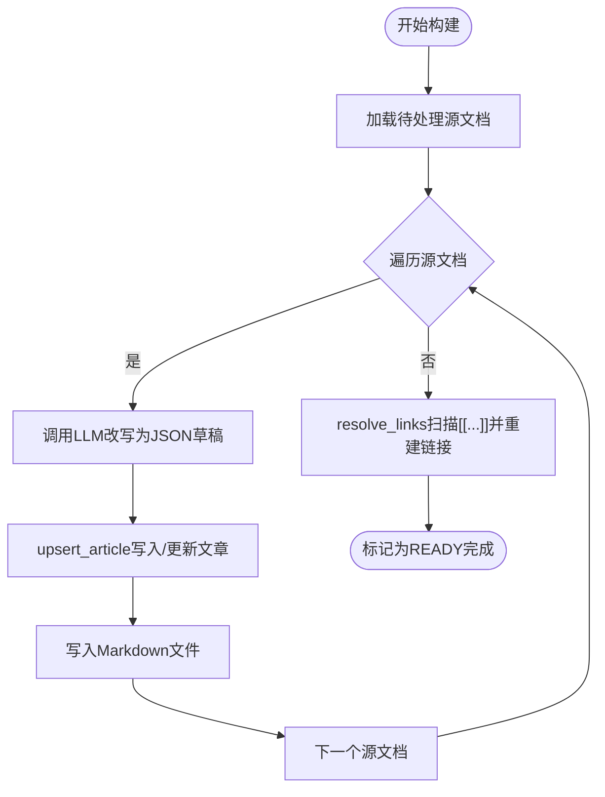
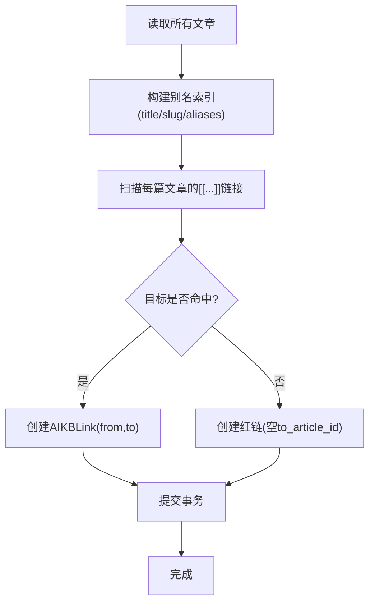
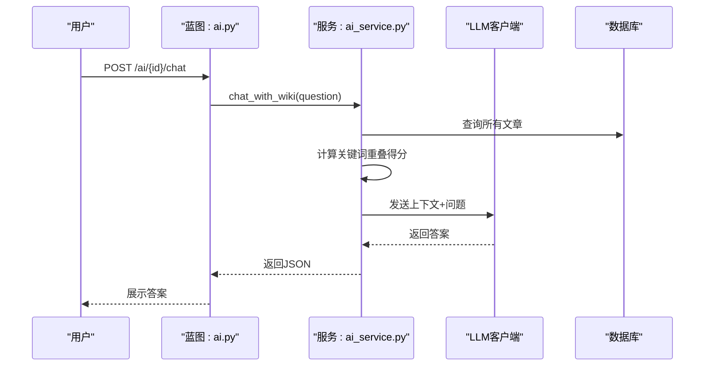
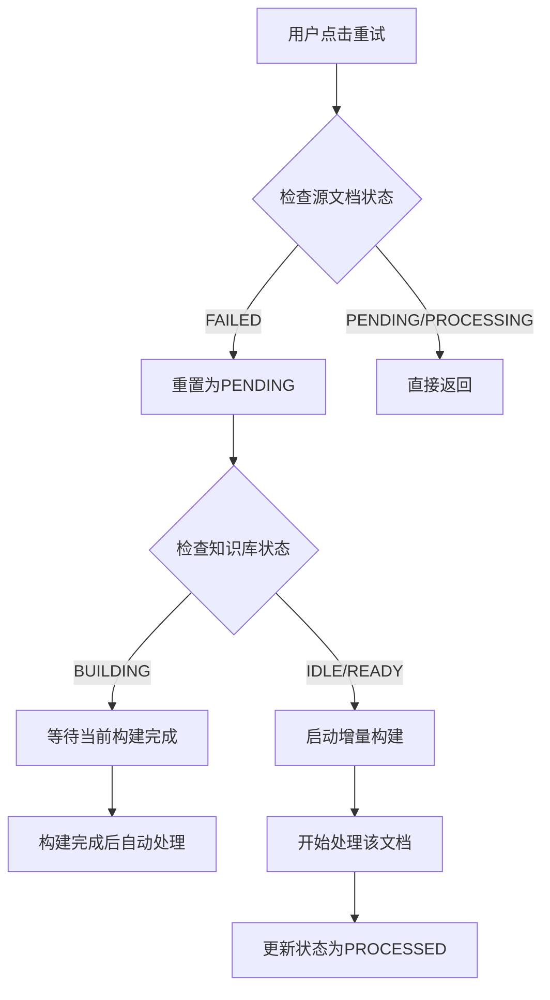
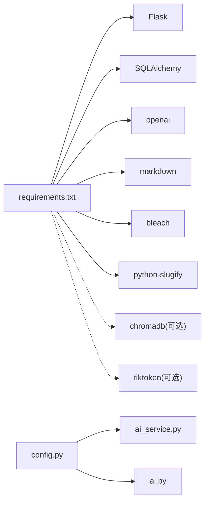

# AI知识库模块

<cite>
**本文档引用的文件**
- [app/blueprints/ai.py](file://app/blueprints/ai.py)
- [app/models/ai_kb.py](file://app/models/ai_kb.py)
- [app/models/knowledge_base.py](file://app/models/knowledge_base.py)
- [app/models/document.py](file://app/models/document.py)
- [app/services/ai_service.py](file://app/services/ai_service.py)
- [app/services/kb_service.py](file://app/services/kb_service.py)
- [app/utils/markdown.py](file://app/utils/markdown.py)
- [app/utils/outline.py](file://app/utils/outline.py)
- [app/config.py](file://app/config.py)
- [requirements.txt](file://requirements.txt)
- [app/templates/ai/index.html](file://app/templates/ai/index.html)
- [app/templates/ai/detail.html](file://app/templates/ai/detail.html)
- [app/templates/ai/wiki_home.html](file://app/templates/ai/wiki_home.html)
- [app/templates/ai/wiki_article.html](file://app/templates/ai/wiki_article.html)
- [app/templates/ai/sources.html](file://app/templates/ai/sources.html)
- [app/templates/base.html](file://app/templates/base.html)
</cite>

## 更新摘要
**所做更改**
- 全面重新设计AI知识库详情页面，包括改进的状态指示器和视觉反馈
- 增强的错误报告系统，提供更详细的错误信息展示
- 新增失败文档重试功能，支持单条源文档的重试机制
- 改进的源文档状态管理，提供更好的用户体验
- 完善的前端模板系统，包含完整的UI界面

## 目录
1. [简介](#简介)
2. [项目结构](#项目结构)
3. [核心组件](#核心组件)
4. [架构总览](#架构总览)
5. [详细组件分析](#详细组件分析)
6. [前端模板系统](#前端模板系统)
7. [API接口文档](#api接口文档)
8. [依赖分析](#依赖分析)
9. [性能考虑](#性能考虑)
10. [故障排除指南](#故障排除指南)
11. [结论](#结论)
12. [附录](#附录)

## 简介
本模块实现了基于 Andrej Karpathy LLM Wiki 方法论的完整AI知识库系统，支持将多源文档转换为结构化的Markdown条目，通过双向链接构建知识图谱，并提供两种问答模式：纯关键词检索增强的问答（默认）与可选的向量检索增强（RAG）。系统采用Flask + SQLAlchemy架构，结合OpenAI兼容API进行内容改写与对话，同时保留纯文本/Markdown的轻量存储方案。

**更新** 详情页面进行了全面重新设计，包括改进的状态指示器、更好的视觉反馈、增强的错误报告和失败文档重试功能。

## 项目结构
- **蓝图层**：AI知识库蓝图实现，包含完整的路由定义、权限控制和业务逻辑
- **服务层**：AI核心逻辑（LLM客户端、Wiki构建器、链接解析器、异步构建流水线、问答接口）
- **工具层**：Markdown渲染、Wiki链接收集与重写、Editor.js内容提取
- **模型层**：AI知识库实体及其关系（知识库、源文档、文章、链接、片段）
- **配置层**：应用配置与环境变量（OpenAI、聊天模型、AI Wiki存储路径、可选RAG参数）
- **模板层**：完整的前端模板系统，包含AI知识库的所有UI界面

**图表来源**
- [app/blueprints/ai.py:1-309](file://app/blueprints/ai.py#L1-L309)
- [app/services/ai_service.py:1-444](file://app/services/ai_service.py#L1-L444)
- [app/services/kb_service.py:1-80](file://app/services/kb_service.py#L1-L80)
- [app/utils/markdown.py:1-87](file://app/utils/markdown.py#L1-L87)
- [app/utils/outline.py:1-136](file://app/utils/outline.py#L1-L136)
- [app/models/ai_kb.py:1-122](file://app/models/ai_kb.py#L1-L122)
- [app/models/knowledge_base.py:1-62](file://app/models/knowledge_base.py#L1-L62)
- [app/models/document.py:1-98](file://app/models/document.py#L1-L98)
- [app/config.py:1-83](file://app/config.py#L1-L83)
- [app/templates/base.html:1-30](file://app/templates/base.html#L1-L30)

**章节来源**
- [app/blueprints/ai.py:1-309](file://app/blueprints/ai.py#L1-L309)
- [app/services/ai_service.py:1-444](file://app/services/ai_service.py#L1-L444)
- [app/utils/markdown.py:1-87](file://app/utils/markdown.py#L1-L87)
- [app/utils/outline.py:1-136](file://app/utils/outline.py#L1-L136)
- [app/models/ai_kb.py:1-122](file://app/models/ai_kb.py#L1-L122)
- [app/models/knowledge_base.py:1-62](file://app/models/knowledge_base.py#L1-L62)
- [app/models/document.py:1-98](file://app/models/document.py#L1-L98)
- [app/config.py:1-83](file://app/config.py#L1-L83)
- [app/templates/base.html:1-30](file://app/templates/base.html#L1-L30)

## 核心组件
- **AI知识库蓝图**：完整的Flask蓝图实现，包含创建、编辑、删除、构建、浏览、问答等所有功能
- **AI知识库模型**：管理知识库状态、文章、链接、源文档映射的完整数据模型
- **LLM客户端**：封装OpenAI兼容SDK，支持自定义base_url、api_key、model
- **Wiki构建器**：将源文档转换为结构化Markdown条目，生成别名与标签，写入文件系统
- **链接解析器**：扫描文章中的[[Title]]，构建双向链接与反向链接
- **异步构建流水线**：批量处理源文档、更新状态、重建链接、标记完成
- **问答接口**：默认关键词匹配 + 文章上下文检索，可选RAG增强（需启用）
- **前端模板系统**：完整的AI知识库UI界面，包含主页、详情页、Wiki浏览、图谱、问答等

**更新** 新增蓝图层的完整实现，包含用户认证、权限控制和完整的业务逻辑，特别是失败文档重试功能。

**章节来源**
- [app/blueprints/ai.py:18-309](file://app/blueprints/ai.py#L18-L309)
- [app/models/ai_kb.py:22-122](file://app/models/ai_kb.py#L22-L122)
- [app/services/ai_service.py:47-86](file://app/services/ai_service.py#L47-L86)
- [app/services/ai_service.py:147-231](file://app/services/ai_service.py#L147-L231)
- [app/services/ai_service.py:251-290](file://app/services/ai_service.py#L251-L290)
- [app/services/ai_service.py:313-382](file://app/services/ai_service.py#L313-L382)
- [app/services/ai_service.py:391-408](file://app/services/ai_service.py#L391-L408)

## 架构总览
系统采用"蓝图-服务-模型-工具-配置-模板"的七层架构，核心流程包括：
- 用户认证与权限控制，确保只有知识库所有者或超级管理员可以访问
- 创建AI知识库并添加源文档，支持从传统知识库中选择文档
- 异步构建：LLM改写 → 写入文章 → 解析链接 → 更新状态
- 浏览与图谱：Markdown渲染、Wiki链接重写、反向链接展示
- 问答：关键词打分 + 文章上下文 + LLM回答

**图表来源**
- [app/blueprints/ai.py:173-186](file://app/blueprints/ai.py#L173-L186)
- [app/services/ai_service.py:326-381](file://app/services/ai_service.py#L326-L381)
- [app/services/ai_service.py:296-311](file://app/services/ai_service.py#L296-L311)
- [app/services/ai_service.py:147-161](file://app/services/ai_service.py#L147-L161)
- [app/services/ai_service.py:196-201](file://app/services/ai_service.py#L196-L201)
- [app/services/ai_service.py:251-278](file://app/services/ai_service.py#L251-L278)

## 详细组件分析

### 数据模型设计
AI知识库采用关系型模型，围绕"知识库-源文档-文章-链接-片段"组织数据，支持：
- **状态机**：知识库与源文档均具备状态字段，便于构建进度跟踪
- **双向链接**：文章间通过外键建立from/to关系，支持反向链接统计
- **别名与标签**：文章支持别名与JSON标签，提升链接解析准确度
- **文件存储**：文章内容以Markdown文件形式持久化，便于外部工具访问
- **权限控制**：通过owner_id字段实现知识库的所有权控制

**图表来源**
- [app/models/ai_kb.py:22-122](file://app/models/ai_kb.py#L22-L122)
- [app/models/knowledge_base.py:19-62](file://app/models/knowledge_base.py#L19-L62)
- [app/models/document.py:20-98](file://app/models/document.py#L20-L98)

**章节来源**
- [app/models/ai_kb.py:22-122](file://app/models/ai_kb.py#L22-L122)
- [app/models/knowledge_base.py:19-62](file://app/models/knowledge_base.py#L19-L62)
- [app/models/document.py:20-98](file://app/models/document.py#L20-L98)

### Wiki构建流程
- **LLM改写**：使用系统提示词与用户模板，要求输出JSON结构，包含标题、别名、摘要、标签、正文、相关条目
- **文章入库**：去重/合并现有文章，更新别名与来源文档ID列表，写入数据库与Markdown文件
- **文件落盘**：生成Front Matter（标题、slug、摘要、标签、时间戳），拼接正文并写入文件
- **并发构建**：后台线程逐条处理源文档，失败记录错误信息，成功后统一解析链接
- **状态管理**：完整的构建状态跟踪，包括PENDING、PROCESSING、PROCESSED、FAILED状态

**图表来源**
- [app/services/ai_service.py:296-311](file://app/services/ai_service.py#L296-L311)
- [app/services/ai_service.py:147-161](file://app/services/ai_service.py#L147-L161)
- [app/services/ai_service.py:204-230](file://app/services/ai_service.py#L204-L230)
- [app/services/ai_service.py:196-201](file://app/services/ai_service.py#L196-L201)
- [app/services/ai_service.py:251-278](file://app/services/ai_service.py#L251-L278)

**章节来源**
- [app/services/ai_service.py:147-231](file://app/services/ai_service.py#L147-L231)
- [app/services/ai_service.py:251-290](file://app/services/ai_service.py#L251-L290)
- [app/services/ai_service.py:313-382](file://app/services/ai_service.py#L313-L382)

### 链接解析机制
- **别名索引**：聚合文章标题、slug、别名，统一小写作为键，加速解析
- **链接扫描**：从文章内容中提取[[Target]]，支持[[Title|Anchor]]语法
- **双向链接**：记录from_article_id → to_article_id，支持反向链接统计与图谱渲染
- **红链处理**：未命中的链接保留为红链，便于后续修复
- **解析器函数**：提供article_resolver函数，支持动态链接解析

**图表来源**
- [app/services/ai_service.py:237-248](file://app/services/ai_service.py#L237-L248)
- [app/services/ai_service.py:264-277](file://app/services/ai_service.py#L264-L277)
- [app/utils/markdown.py:69-87](file://app/utils/markdown.py#L69-L87)

**章节来源**
- [app/services/ai_service.py:237-290](file://app/services/ai_service.py#L237-L290)
- [app/utils/markdown.py:42-66](file://app/utils/markdown.py#L42-L66)

### 搜索与问答机制
- **默认问答**：对问题进行分词，计算与文章标题/摘要/正文的关键词重叠得分，选取Top-N文章作为上下文，调用LLM生成答案
- **RAG增强**：通过配置开关与向量嵌入模型实现（当前仓库未实现向量存储与检索），预留扩展点
- **图谱与导航**：基于链接关系生成节点与边，支持可视化知识图谱
- **关键词重叠**：使用正则表达式提取中文和英文词汇，进行精确匹配

**图表来源**
- [app/blueprints/ai.py:295-309](file://app/blueprints/ai.py#L295-L309)
- [app/services/ai_service.py:427-444](file://app/services/ai_service.py#L427-L444)

**章节来源**
- [app/services/ai_service.py:427-444](file://app/services/ai_service.py#L427-L444)
- [app/blueprints/ai.py:295-309](file://app/blueprints/ai.py#L295-L309)

### OpenAI API集成与兼容性
- **客户端封装**：支持自定义base_url、api_key、model，兼容OpenAI、DeepSeek、Tongyi、本地代理等
- **提示词工程**：系统提示词约束输出格式与内容范围，用户模板标准化输入结构
- **错误处理**：捕获外部LLM调用异常，记录到源文档状态与知识库错误信息
- **模型选择**：支持每个知识库独立设置chat_model，优先级高于全局配置

**章节来源**
- [app/services/ai_service.py:47-86](file://app/services/ai_service.py#L47-L86)
- [app/services/ai_service.py:92-119](file://app/services/ai_service.py#L92-L119)
- [app/services/ai_service.py:296-310](file://app/services/ai_service.py#L296-L310)
- [app/config.py:37-42](file://app/config.py#L37-L42)

### 向量嵌入与RAG实现现状
- **当前实现**：默认问答采用关键词重叠评分，不依赖向量数据库
- **可选配置**：预留ENABLE_RAG、EMBEDDING_MODEL、CHROMA_PATH等参数
- **扩展建议**：在enable_rag=true时，实现AIKBChunk向量化与ChromaDB存储，替换默认问答为向量检索 + 重排序
- **数据模型**：AIKBChunk模型已定义，支持向量化存储和查询

**章节来源**
- [app/config.py:44-47](file://app/config.py#L44-L47)
- [app/models/ai_kb.py:111-122](file://app/models/ai_kb.py#L111-L122)
- [app/services/ai_service.py:427-444](file://app/services/ai_service.py#L427-L444)

### 失败文档重试机制
**更新** 新增失败文档重试功能，提供更完善的错误处理机制：

- **单条重试**：支持对失败的单个源文档进行重试，重置状态为PENDING并触发增量构建
- **批量重置**：支持对所有失败文档进行批量重试
- **错误信息**：详细记录每个源文档的错误原因，便于诊断和修复
- **状态同步**：重试时自动清理知识库整体错误信息，避免误导用户
- **智能判断**：如果知识库正在构建中，重试会自动加入当前构建队列

**图表来源**
- [app/blueprints/ai.py:146-168](file://app/blueprints/ai.py#L146-L168)
- [app/services/ai_service.py:306-324](file://app/services/ai_service.py#L306-L324)

**章节来源**
- [app/blueprints/ai.py:146-168](file://app/blueprints/ai.py#L146-L168)
- [app/services/ai_service.py:306-324](file://app/services/ai_service.py#L306-L324)

## 前端模板系统
**更新** AI知识库模块包含完整的前端模板系统，提供用户友好的界面，特别在详情页面进行了全面重新设计：

### 主页模板
- **AI知识库列表**：展示用户的全部AI知识库，包含状态、描述、模型信息
- **状态指示**：使用颜色编码显示知识库状态（ready、processing、failed、idle）
- **快速操作**：新建按钮、查看详情链接

### 详情页模板
**更新** 全面重新设计的详情页面，包含以下改进：

- **知识库概览**：名称、描述、状态、最后构建时间
- **改进的状态指示器**：使用彩色徽章显示知识库状态，提供更好的视觉反馈
- **增强的错误报告**：详细显示知识库级别的错误信息，支持错误信息折叠展开
- **源文档管理**：显示已添加的源文档列表和状态，包含彩色状态徽章
- **失败文档重试**：为失败的源文档提供一键重试按钮
- **Wiki条目预览**：显示前10个Wiki条目
- **快捷操作**：构建、图谱、问答入口

### 源文档模板
- **文档选择界面**：展示可选择的源文档，支持按知识库分组显示
- **状态显示**：显示文档的加入状态和来源知识库
- **批量操作**：支持批量添加文档到AI知识库

### Wiki浏览模板
- **标签分组**：按标签分组显示所有Wiki条目
- **条目列表**：网格布局显示所有条目，包含标题、摘要、更新时间
- **导航链接**：返回上级页面的链接

### Wiki文章模板
- **文章内容**：渲染Markdown内容，支持代码高亮、表格等
- **反向链接**：显示引用该条目的其他文章
- **来源文档**：显示原始文档的链接
- **重新生成**：支持重新生成单个条目

**章节来源**
- [app/templates/ai/index.html:1-38](file://app/templates/ai/index.html#L1-L38)
- [app/templates/ai/detail.html:1-127](file://app/templates/ai/detail.html#L1-L127)
- [app/templates/ai/sources.html:1-41](file://app/templates/ai/sources.html#L1-L41)
- [app/templates/ai/wiki_home.html:1-52](file://app/templates/ai/wiki_home.html#L1-L52)
- [app/templates/ai/wiki_article.html:1-63](file://app/templates/ai/wiki_article.html#L1-L63)

## API接口文档

### 知识库管理接口
- **获取AI知识库列表**
  - 方法：GET
  - 路径：/ai/
  - 功能：返回当前用户拥有的所有AI知识库
- **创建AI知识库**
  - 方法：POST
  - 路径：/ai/new
  - 参数：name、description、chat_model
  - 功能：创建新的AI知识库
- **编辑AI知识库**
  - 方法：POST
  - 路径：/ai/<ai_kb_id>/edit
  - 参数：name、description、chat_model、enable_rag
  - 功能：更新知识库配置
- **删除AI知识库**
  - 方法：POST
  - 路径：/ai/<ai_kb_id>/delete
  - 功能：删除指定的AI知识库

### 源文档管理接口
- **查看源文档列表**
  - 方法：GET
  - 路径：/ai/<ai_kb_id>/sources
  - 功能：显示可选择的源文档列表
- **添加源文档**
  - 方法：POST
  - 路径：/ai/<ai_kb_id>/sources/add
  - 参数：doc_ids（数组）
  - 功能：为AI知识库添加源文档
- **移除源文档**
  - 方法：POST
  - 路径：/ai/<ai_kb_id>/sources/<source_id>/remove
  - 功能：从AI知识库移除源文档

### 构建与状态接口
- **获取构建状态**
  - 方法：GET
  - 路径：/ai/<ai_kb_id>/status
  - 返回：状态、错误信息、最后构建时间、各状态源文档数量、文章总数
- **触发构建**
  - 方法：POST
  - 路径：/ai/<ai_kb_id>/build
  - 参数：scope（all/pending）
  - 行为：重置源文档状态（非all时）、异步构建

### Wiki浏览接口
- **Wiki首页**
  - 方法：GET
  - 路径：/ai/<ai_kb_id>/wiki
  - 功能：渲染Wiki首页，按标签分组显示条目
- **Wiki文章**
  - 方法：GET
  - 路径：/ai/<ai_kb_id>/wiki/<slug>
  - 功能：渲染指定文章，重写[[...]]链接，显示反向链接
- **重新生成文章**
  - 方法：POST
  - 路径：/ai/<ai_kb_id>/wiki/<slug>/regenerate
  - 功能：重新生成指定文章

### 图谱与问答接口
- **知识图谱**
  - 方法：GET
  - 路径：/ai/<ai_kb_id>/graph
  - 功能：返回节点与边的JSON，供前端可视化
- **问答**
  - 方法：GET/POST
  - 路径：/ai/<ai_kb_id>/chat
  - 行为：POST提交问题，返回答案；GET加载问答页面

### 失败文档重试接口
**更新** 新增失败文档重试相关接口：

- **重试失败文档**
  - 方法：POST
  - 路径：/ai/<ai_kb_id>/sources/<source_id>/retry
  - 功能：重置失败的单个源文档为待处理并触发增量构建
- **移除源文档**
  - 方法：POST
  - 路径：/ai/<ai_kb_id>/sources/<source_id>/remove
  - 功能：从AI知识库移除源文档

**章节来源**
- [app/blueprints/ai.py:27-85](file://app/blueprints/ai.py#L27-L85)
- [app/blueprints/ai.py:88-139](file://app/blueprints/ai.py#L88-L139)
- [app/blueprints/ai.py:141-174](file://app/blueprints/ai.py#L141-L174)
- [app/blueprints/ai.py:176-261](file://app/blueprints/ai.py#L176-L261)
- [app/blueprints/ai.py:263-279](file://app/blueprints/ai.py#L263-L279)
- [app/blueprints/ai.py:146-168](file://app/blueprints/ai.py#L146-L168)

## 依赖分析
- **外部依赖**：Flask、SQLAlchemy、openai、markdown、bleach、python-slugify等
- **可选依赖**：当启用RAG时需要chromadb、tiktoken
- **配置耦合**：LLM客户端依赖OPENAI_BASE_URL、OPENAI_API_KEY、CHAT_MODEL、AI_WIKI_DIR等环境变量
- **模板依赖**：前端模板依赖Flask Jinja2引擎和静态资源

**图表来源**
- [requirements.txt:1-22](file://requirements.txt#L1-L22)

**章节来源**
- [requirements.txt:1-22](file://requirements.txt#L1-L22)
- [app/config.py:37-47](file://app/config.py#L37-L47)

## 性能考虑
- **并发构建**：使用后台线程逐条处理源文档，避免阻塞主线程
- **I/O优化**：文章写入文件系统时批量提交数据库事务，减少磁盘写入次数
- **链接解析**：别名索引使用字典结构，O(1)查找；链接扫描去重保持顺序
- **LLM调用**：限制单次输入长度，控制响应格式，降低Token成本
- **可选RAG**：向量检索需注意索引构建与查询延迟，建议异步预热与缓存热点问题
- **模板渲染**：使用Jinja2模板引擎，支持缓存和压缩
- **静态资源**：CSS和JS文件支持浏览器缓存
- **状态缓存**：详情页面使用AJAX轮询状态，减少不必要的页面刷新

## 故障排除指南
**更新** 增强的故障排除指南，包含失败文档重试相关内容：

- **构建失败**
  - 现象：知识库状态变为FAILED，错误信息显示在状态接口
  - 排查：检查源文档是否存在、LLM API是否可用、网络连通性
  - 处理：使用失败文档重试功能或检查错误信息详情
- **红链过多**
  - 现象：链接解析后出现大量红链
  - 排查：确认文章标题/别名是否一致，检查[[...]]语法是否正确
- **问答无结果**
  - 现象：返回"知识库为空"
  - 排查：确认已构建知识库且至少有一篇文章
- **权限问题**
  - 现象：访问403
  - 排查：确认当前用户为知识库所有者或超级管理员
- **模板渲染错误**
  - 现象：页面显示异常或空白
  - 排查：检查模板文件是否存在、Jinja2语法是否正确
- **LLM调用失败**
  - 现象：构建过程中出现API错误
  - 排查：检查OPENAI_BASE_URL、OPENAI_API_KEY配置、网络连接
- **失败文档重试无效**
  - 现象：重试后状态仍为FAILED
  - 排查：检查源文档是否仍然存在、错误信息是否已清除、知识库状态是否正确
- **状态显示异常**
  - 现象：状态徽章颜色不正确或显示错误
  - 排查：检查数据库状态字段值、前端样式类名

**章节来源**
- [app/services/ai_service.py:373-377](file://app/services/ai_service.py#L373-L377)
- [app/services/ai_service.py:320-324](file://app/services/ai_service.py#L320-L324)
- [app/services/ai_service.py:430-431](file://app/services/ai_service.py#L430-L431)
- [app/blueprints/ai.py:18-24](file://app/blueprints/ai.py#L18-L24)
- [app/blueprints/ai.py:146-168](file://app/blueprints/ai.py#L146-L168)

## 结论
该AI知识库模块以Karpathy LLM Wiki为核心思想，结合LLM自动化改写与双向链接构建知识图谱，提供开箱即用的问答能力。系统采用完整的蓝图-服务-模型-工具-模板分层设计，包含用户认证、权限控制、异步构建、完整的前端界面等企业级功能。

**更新** 最新版本的详情页面进行了全面重新设计，显著改进了用户体验：
- 更直观的状态指示器和视觉反馈
- 增强的错误报告系统，提供详细的错误信息
- 完整的失败文档重试功能，支持单条和批量重试
- 改进的源文档管理界面，提供更好的操作体验

默认实现无需向量数据库即可获得良好效果，同时为RAG增强预留了清晰的扩展路径。通过模块化设计，系统具备良好的可维护性与可扩展性。

## 附录

### 与传统知识库的区别与优势
- **结构化输出**：通过LLM将非结构化文档转换为带标签、别名、摘要的结构化条目
- **双向链接**：自动解析内部引用，形成知识图谱，提升检索与发现效率
- **低门槛**：无需复杂向量库部署，即可实现语义检索与问答
- **可扩展**：在需要时接入向量嵌入与ChromaDB，实现更精准的语义搜索
- **完整生态**：包含前端模板、用户界面、权限控制等完整功能
- **完善的错误处理**：提供详细的错误报告和失败文档重试机制

### 开发者扩展方法
- **新增提示词模板**：在服务层增加系统/用户提示词，适配不同领域
- **自定义解析规则**：在链接解析与Markdown渲染处扩展别名与锚点规则
- **集成向量检索**：实现AIKBChunk的向量化与ChromaDB存储，替换默认问答为向量检索
- **增强安全**：在Markdown渲染与LLM输入处增加内容过滤与长度限制
- **扩展前端**：基于现有模板系统开发新的UI组件和交互功能
- **改进错误处理**：扩展错误报告机制，提供更详细的诊断信息

### 调试技巧
- **使用状态接口轮询构建进度**
- **在日志中记录LLM请求与响应摘要**
- **对链接解析失败的条目进行人工修正并回滚重建**
- **逐步缩小问题范围：先验证LLM可用性，再检查数据库与文件系统**
- **使用浏览器开发者工具检查AJAX请求和响应**
- **验证模板渲染是否正常，检查Jinja2语法错误**
- **测试失败文档重试功能，确保状态切换正确**
- **监控错误信息的显示和清理机制**