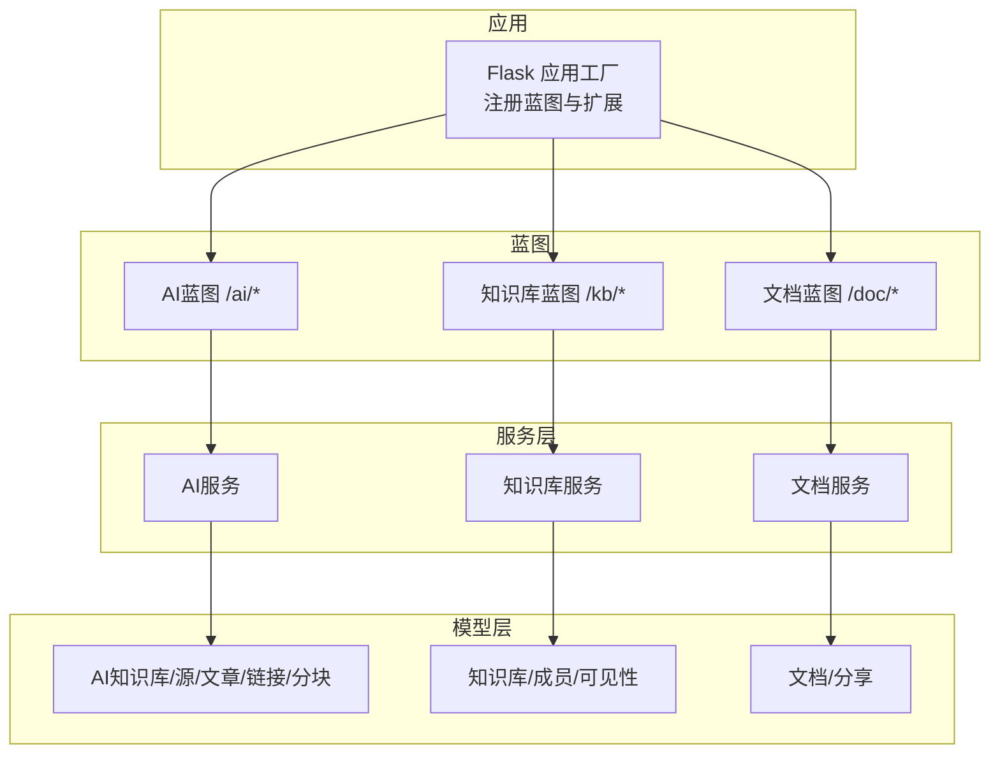
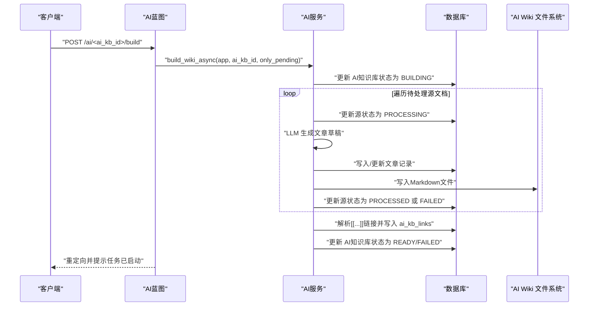
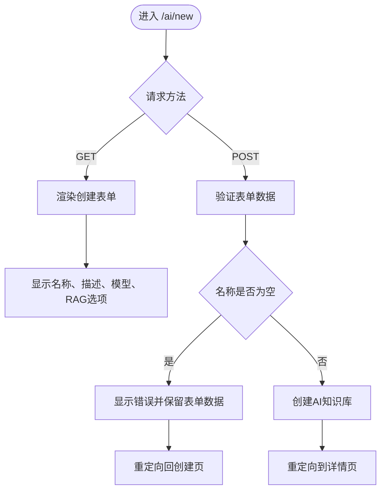
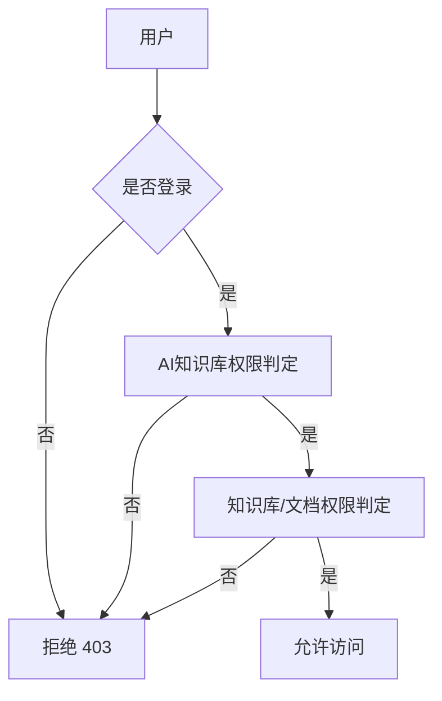
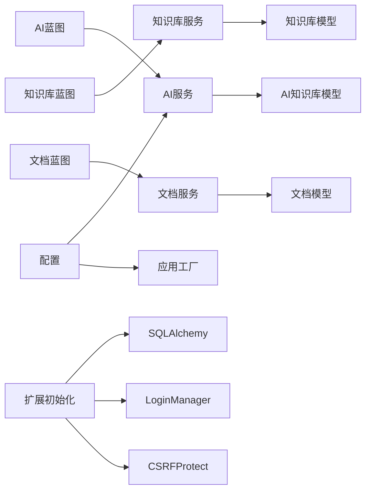

# AI知识库蓝图路由

<cite>
**本文引用的文件**
- [app/blueprints/ai.py](file://app/blueprints/ai.py)
- [app/models/ai_kb.py](file://app/models/ai_kb.py)
- [app/services/ai_service.py](file://app/services/ai_service.py)
- [app/blueprints/kb.py](file://app/blueprints/kb.py)
- [app/models/knowledge_base.py](file://app/models/knowledge_base.py)
- [app/services/kb_service.py](file://app/services/kb_service.py)
- [app/blueprints/doc.py](file://app/blueprints/doc.py)
- [app/models/document.py](file://app/models/document.py)
- [app/services/doc_service.py](file://app/services/doc_service.py)
- [app/utils/markdown.py](file://app/utils/markdown.py)
- [app/utils/outline.py](file://app/utils/outline.py)
- [app/config.py](file://app/config.py)
- [app/extensions.py](file://app/extensions.py)
- [app/__init__.py](file://app/__init__.py)
- [app/templates/ai/index.html](file://app/templates/ai/index.html)
- [app/templates/ai/detail.html](file://app/templates/ai/detail.html)
- [app/templates/ai/new.html](file://app/templates/ai/new.html)
</cite>

## 更新摘要
**所做更改**
- 更新AI知识库蓝图路由文档以反映 /new 路由方法扩展
- 新增GET和POST方法支持的详细说明，提升用户体验
- 补充AI知识库创建表单的完整交互流程
- 更新RESTful API定义和调用示例

## 目录
1. [简介](#简介)
2. [项目结构](#项目结构)
3. [核心组件](#核心组件)
4. [架构总览](#架构总览)
5. [详细组件分析](#详细组件分析)
6. [依赖分析](#依赖分析)
7. [性能考量](#性能考量)
8. [故障排查指南](#故障排查指南)
9. [结论](#结论)
10. [附录](#附录)

## 简介
本文件系统化梳理"AI知识库蓝图路由"的HTTP API与内部流程，覆盖AI知识库的CRUD操作、源文档管理、Wiki构建触发与状态查询、聊天交互、文件上传与批量处理、权限验证与角色控制、以及与前端的集成方式。文档以蓝图与服务层为核心，结合模型定义与配置，给出REST风格的URL模式、请求响应格式、错误码定义、调用示例、参数校验规则与安全建议，并提供调试与性能监控指引。

## 项目结构
- 蓝图组织
  - AI蓝图：负责AI知识库的创建、详情、编辑、删除、源文档选择、构建、状态查询、Wiki浏览、图谱、聊天等
  - 知识库蓝图：负责知识库的列表、创建、详情、编辑、删除、成员管理等页面级路由
  - 文档蓝图：负责文档的创建、查看、编辑、保存、删除、分享等页面级路由
- 服务层
  - AI服务：LLM客户端封装、文章构建、链接解析、异步构建、聊天
  - 知识库服务：访问控制、成员管理、查询聚合
  - 文档服务：树形结构、内容更新、软删除、后代收集
- 模型层
  - AI知识库、源文档、文章、链接、分块
  - 知识库、成员、可见性枚举
  - 文档、分享
- 配置与扩展
  - 应用配置、CSRF、登录管理、数据库初始化
  - 蓝图注册与上下文注入

**图表来源**
- [app/__init__.py:56-74](file://app/__init__.py#L56-L74)
- [app/blueprints/ai.py:15](file://app/blueprints/ai.py#L15)
- [app/blueprints/kb.py:11](file://app/blueprints/kb.py#L11)
- [app/blueprints/doc.py:10](file://app/blueprints/doc.py#L10)

**章节来源**
- [app/__init__.py:56-74](file://app/__init__.py#L56-L74)
- [app/extensions.py:8-17](file://app/extensions.py#L8-L17)

## 核心组件
- AI蓝图
  - 提供AI知识库CRUD、源文档选择、构建触发、状态查询、Wiki浏览、图谱、聊天
  - 内部通过服务层执行异步构建与链接解析
- 知识库蓝图
  - 提供知识库列表、新建、详情、编辑、删除、成员管理等页面路由
  - 于服务层进行访问控制与成员增删
- 文档蓝图
  - 提供文档树展示、创建、编辑、保存JSON、删除、分享等
  - 支持隐私控制与分享令牌生成
- 服务层
  - AI服务：LLM封装、文章构建、链接解析、异步构建、聊天
  - 知识库服务：can_access/can_edit/can_manage、我的知识库/公开知识库查询、成员增删
  - 文档服务：树形结构、内容更新、软删除、后代收集
- 模型层
  - 定义可见性、成员角色、状态枚举与实体关系
- 配置与扩展
  - 开放AI相关配置项、CSRF与登录管理、蓝图注册

**章节来源**
- [app/blueprints/ai.py:27-281](file://app/blueprints/ai.py#L27-L281)
- [app/services/ai_service.py:47-408](file://app/services/ai_service.py#L47-L408)
- [app/blueprints/kb.py:21-141](file://app/blueprints/kb.py#L21-L141)
- [app/services/kb_service.py:10-80](file://app/services/kb_service.py#L10-L80)
- [app/blueprints/doc.py:20-139](file://app/blueprints/doc.py#L20-L139)
- [app/services/doc_service.py:11-81](file://app/services/doc_service.py#L11-L81)
- [app/models/ai_kb.py:8-121](file://app/models/ai_kb.py#L8-L121)
- [app/models/knowledge_base.py:8-62](file://app/models/knowledge_base.py#L8-L62)
- [app/models/document.py:20-98](file://app/models/document.py#L20-L98)
- [app/config.py:15-83](file://app/config.py#L15-L83)
- [app/extensions.py:8-17](file://app/extensions.py#L8-L17)

## 架构总览
AI知识库蓝图路由围绕"蓝图-服务-模型-配置"的分层设计展开，采用Flask蓝图注册到应用工厂，统一由扩展模块初始化数据库、登录与CSRF保护。AI构建采用后台线程异步执行，状态通过状态查询接口反馈；聊天交互支持纯关键词检索与可选RAG增强两种模式。

**图表来源**
- [app/blueprints/ai.py:145-158](file://app/blueprints/ai.py#L145-L158)
- [app/services/ai_service.py:313-344](file://app/services/ai_service.py#L313-L344)

**章节来源**
- [app/blueprints/ai.py:145-176](file://app/blueprints/ai.py#L145-L176)
- [app/services/ai_service.py:313-344](file://app/services/ai_service.py#L313-L344)

## 详细组件分析

### AI知识库蓝图（/ai）
- 路由与职责
  - GET /ai/：列出当前用户的所有AI知识库
  - GET/POST /ai/new：创建AI知识库（名称、描述、模型、RAG开关）
  - GET /ai/<int:ai_kb_id>：AI知识库详情（源、文章、红链统计）
  - POST /ai/<int:ai_kb_id>/edit：编辑AI知识库（名称、描述、模型、RAG）
  - POST /ai/<int:ai_kb_id>/delete：删除AI知识库
  - GET /ai/<int:ai_kb_id>/sources：选择源文档（仅显示当前用户可访问的文档）
  - POST /ai/<int:ai_kb_id>/sources/add：批量添加源文档
  - POST /ai/<int:ai_kb_id>/sources/<int:source_id>/remove：移除源文档
  - POST /ai/<int:ai_kb_id>/build：触发构建（可选仅处理待处理/失败）
  - GET /ai/<int:ai_kb_id>/status：返回构建状态、错误、计数与最后构建时间
  - GET /ai/<int:ai_kb_id>/wiki：Wiki首页（按标签分组）
  - GET /ai/<int:ai_kb_id>/wiki/<slug>：文章详情（链接重写、反链）
  - POST /ai/<int:ai_kb_id>/wiki/<slug>/regenerate：单篇文章重生
  - GET /ai/<int:ai_kb_id>/graph：图谱（节点与边）
  - GET/POST /ai/<int:ai_kb_id>/chat：聊天（纯关键词检索或RAG）
- 权限控制
  - 所有AI路由均要求登录；详情页仅AI知识库所有者或超级管理员可访问
- 关键服务
  - AI服务：LLM封装、文章构建、链接解析、异步构建、单文章重生、聊天
- 数据模型
  - AI知识库、源文档、文章、链接、分块（可选RAG）

**更新** 新增GET方法支持AI知识库创建表单直接访问，提升用户体验

**图表来源**
- [app/blueprints/ai.py:34-54](file://app/blueprints/ai.py#L34-L54)
- [app/templates/ai/new.html:6-31](file://app/templates/ai/new.html#L6-L31)

**章节来源**
- [app/blueprints/ai.py:27-281](file://app/blueprints/ai.py#L27-L281)
- [app/services/ai_service.py:47-408](file://app/services/ai_service.py#L47-L408)
- [app/models/ai_kb.py:8-121](file://app/models/ai_kb.py#L8-L121)

### 知识库蓝图（/kb）
- 路由与职责
  - GET /kb/：按tab（mine/public）列出知识库
  - GET/POST /kb/new：创建新知识库（表单提交）
  - GET /kb/<int:kb_id>：知识库详情页（含文档树、首篇文档）
  - GET/POST /kb/<int:kb_id>/edit：编辑知识库（名称、描述、可见性、图标）
  - POST /kb/<int:kb_id>/delete：归档知识库
  - GET/POST /kb/<int:kb_id>/members：成员管理（添加/移除）
  - POST /kb/<int:kb_id>/members/<int:user_id>/delete：移除成员
- 访问控制
  - 登录必选；详情与编辑需具备相应权限；成员管理需拥有管理权
- 关键服务
  - 知识库服务提供can_access/can_edit/can_manage与我的/公开知识库查询
- 数据模型
  - 知识库、成员、可见性枚举

**章节来源**
- [app/blueprints/kb.py:21-141](file://app/blueprints/kb.py#L21-L141)
- [app/services/kb_service.py:10-80](file://app/services/kb_service.py#L10-L80)
- [app/models/knowledge_base.py:8-62](file://app/models/knowledge_base.py#L8-L62)

### 文档蓝图（/doc）
- 路由与职责
  - POST /doc/new：创建文档（校验知识库与编辑权限）
  - GET /doc/<int:doc_id>：文档视图（含大纲）
  - GET /doc/<int:doc_id>/edit：文档编辑页
  - POST /doc/<int:doc_id>/save：保存JSON内容（标题、内容、隐私）
  - POST /doc/<int:doc_id>/delete：软删除文档及其后代
  - GET/POST /doc/<int:doc_id>/share：生成分享链接（可选密码、有效期）
  - POST /doc/share/<int:share_id>/revoke：撤销分享
- 权限控制
  - 视图与编辑需具备编辑权限；分享与撤销需具备编辑权限
- 关键服务
  - 文档服务提供树形结构、内容更新、软删除、后代收集
- 数据模型
  - 文档、分享（含密码哈希、过期、失效）

**章节来源**
- [app/blueprints/doc.py:20-139](file://app/blueprints/doc.py#L20-L139)
- [app/services/doc_service.py:11-81](file://app/services/doc_service.py#L11-L81)
- [app/models/document.py:20-98](file://app/models/document.py#L20-L98)

### 权限验证与角色控制
- AI知识库权限
  - 详情页仅所有者或超级管理员可访问
- 知识库权限
  - can_access：公开可见、登录且非归档、超级管理员、所有者、成员（成员可见）
  - can_edit：超级管理员、所有者、成员为编辑者
  - can_manage：仅所有者或超级管理员
- 文档权限
  - 视图与编辑需具备编辑权限；分享与撤销需具备编辑权限

**图表来源**
- [app/services/kb_service.py:10-45](file://app/services/kb_service.py#L10-L45)
- [app/blueprints/ai.py:18-24](file://app/blueprints/ai.py#L18-L24)

**章节来源**
- [app/services/kb_service.py:10-45](file://app/services/kb_service.py#L10-L45)
- [app/blueprints/doc.py:47-48](file://app/blueprints/doc.py#L47-L48)
- [app/blueprints/ai.py:18-24](file://app/blueprints/ai.py#L18-L24)

### WebSocket与实时状态推送
- 现状
  - 蓝图中未发现WebSocket端点或实时推送逻辑
- 建议
  - 若需实时状态推送，可在AI构建状态查询接口基础上引入WebSocket（如Flask-SocketIO），在构建状态变更时推送至订阅客户端

**章节来源**
- [app/blueprints/ai.py:161-175](file://app/blueprints/ai.py#L161-L175)

### 文件上传、批量处理与进度跟踪
- 文件上传
  - 文档内容通过JSON保存接口提交；未见独立文件上传路由
- 批量处理
  - 源文档批量添加：POST /ai/<int:ai_kb_id>/sources/add 接收多个doc_ids
- 进度跟踪
  - 通过状态查询接口轮询构建状态与计数
  - 源文档状态枚举：PENDING、PROCESSING、PROCESSED、FAILED

**章节来源**
- [app/blueprints/ai.py:110-128](file://app/blueprints/ai.py#L110-L128)
- [app/blueprints/ai.py:161-175](file://app/blueprints/ai.py#L161-L175)
- [app/models/ai_kb.py:15-19](file://app/models/ai_kb.py#L15-L19)

### RESTful API定义与调用示例
- AI知识库（/ai）
  - GET /ai/：返回当前用户的所有AI知识库
  - GET/POST /ai/new：GET返回创建表单，POST创建AI知识库（表单字段 name, description, chat_model, enable_rag）
  - GET /ai/<int:ai_kb_id>：返回AI知识库详情
  - POST /ai/<int:ai_kb_id>/edit：表单字段 name, description, chat_model, enable_rag
  - POST /ai/<int:ai_kb_id>/delete：删除AI知识库
  - GET /ai/<int:ai_kb_id>/sources：返回可选源文档列表
  - POST /ai/<int:ai_kb_id>/sources/add：表单字段 doc_ids（多选）
  - POST /ai/<int:ai_kb_id>/sources/<int:source_id>/remove：移除源文档
  - POST /ai/<int:ai_kb_id>/build：表单字段 scope（默认仅待处理）
  - GET /ai/<int:ai_kb_id>/status：返回 {status, error, last_built_at, sources, articles}
  - GET /ai/<int:ai_kb_id>/wiki：返回文章列表与标签分组
  - GET /ai/<int:ai_kb_id>/wiki/<slug>：返回文章HTML与反链
  - POST /ai/<int:ai_kb_id>/wiki/<slug>/regenerate：重生单篇文章
  - GET /ai/<int:ai_kb_id>/graph：返回图谱数据
  - GET/POST /ai/<int:ai_kb_id>/chat：GET返回聊天界面，POST表单字段 q；成功返回 {ok:true, answer}，失败返回 {ok:false, error}
- 知识库（/kb）
  - GET /kb/?tab=mine|public：返回知识库列表
  - POST /kb/new：表单字段 name, description, visibility, icon
  - GET /kb/<int:kb_id>：返回详情页
  - POST /kb/<int:kb_id>/edit：表单字段 name, description, visibility, icon
  - POST /kb/<int:kb_id>/delete：归档
  - POST /kb/<int:kb_id>/members：表单字段 user（用户名或邮箱）、role
  - POST /kb/<int:kb_id>/members/<int:user_id>/delete：移除成员
- 文档（/doc）
  - POST /doc/new：表单字段 kb_id, parent_id, type, privacy, title
  - GET /doc/<int:doc_id>：返回视图页
  - GET /doc/<int:doc_id>/edit：返回编辑页
  - POST /doc/<int:doc_id>/save：JSON payload {title, content_json, privacy}
  - POST /doc/<int:doc_id>/delete：软删除
  - GET/POST /doc/<int:doc_id>/share：表单字段 password, ttl_hours
  - POST /doc/share/<int:share_id>/revoke：撤销分享

**更新** 新增GET/POST方法支持，特别是 /ai/new 路由现在同时支持GET和POST方法

**章节来源**
- [app/blueprints/ai.py:27-281](file://app/blueprints/ai.py#L27-L281)
- [app/blueprints/kb.py:21-141](file://app/blueprints/kb.py#L21-L141)
- [app/blueprints/doc.py:20-139](file://app/blueprints/doc.py#L20-L139)

### 请求响应格式与错误码
- 成功响应
  - 页面路由：返回渲染模板
  - JSON路由：返回 {ok: true, ...} 或结构化数据
- 错误响应
  - 403：无权限访问
  - 404：资源不存在或已归档/删除
  - JSON错误：{ok: false, error: "<message>"}
- 典型场景
  - AI聊天输入为空：返回 {ok: false, error: "请输入问题"}
  - 构建任务已在运行：页面提示"正在生成，请稍候"
  - 创建AI知识库名称为空：页面提示"请输入名称"

**更新** 新增创建AI知识库名称验证错误处理

**章节来源**
- [app/blueprints/ai.py:267-281](file://app/blueprints/ai.py#L267-L281)
- [app/blueprints/ai.py:145-158](file://app/blueprints/ai.py#L145-L158)

### 参数验证规则与安全考虑
- 参数验证
  - 可见性/角色/类型/隐私：限定枚举值，否则回退默认
  - 数字字段：转换失败则忽略
  - 必填字段：如名称为空时返回错误并保留表单数据
- 安全措施
  - CSRF保护：启用CSRFProtect
  - 登录保护：login_required装饰器
  - 分享令牌：使用安全随机token
  - 会话安全：Cookie HttpOnly、SameSite策略
  - LLM客户端：从配置读取base_url与api_key，避免硬编码

**章节来源**
- [app/blueprints/kb.py:35-43](file://app/blueprints/kb.py#L35-L43)
- [app/blueprints/ai.py:37-41](file://app/blueprints/ai.py#L37-L41)
- [app/utils/security.py:5-8](file://app/utils/security.py#L5-L8)
- [app/extensions.py:8-17](file://app/extensions.py#L8-L17)
- [app/config.py:15-83](file://app/config.py#L15-L83)

### 与前端组件的集成方式
- 页面路由
  - 使用Flask render_template渲染Jinja2模板，传递上下文变量（如AI知识库、文档树、成员、文章、标签分组等）
- JSON接口
  - 通过AJAX调用/status、/chat等接口，返回JSON数据驱动前端交互
- 实时通信
  - 当前未实现WebSocket；可通过引入SocketIO在构建状态变化时推送消息

**章节来源**
- [app/blueprints/ai.py:29](file://app/blueprints/ai.py#L29)
- [app/blueprints/ai.py:161-175](file://app/blueprints/ai.py#L161-L175)
- [app/templates/ai/index.html:1-38](file://app/templates/ai/index.html#L1-L38)
- [app/templates/ai/detail.html:1-81](file://app/templates/ai/detail.html#L1-L81)

## 依赖分析
- 蓝图到服务层
  - AI蓝图依赖AI服务进行构建、链接解析与聊天
  - 知识库蓝图依赖知识库服务进行权限与查询
  - 文档蓝图依赖文档服务进行树形结构与内容更新
- 服务层到模型层
  - 服务层通过SQLAlchemy ORM操作模型，维护实体关系
- 配置与扩展
  - 应用工厂注册蓝图与扩展，统一初始化数据库、登录与CSRF
  - 蓝图注册时指定URL前缀，便于路径组织

**图表来源**
- [app/__init__.py:56-74](file://app/__init__.py#L56-L74)
- [app/services/ai_service.py:47-408](file://app/services/ai_service.py#L47-L408)
- [app/services/kb_service.py:10-80](file://app/services/kb_service.py#L10-L80)
- [app/services/doc_service.py:11-81](file://app/services/doc_service.py#L11-L81)

**章节来源**
- [app/__init__.py:56-74](file://app/__init__.py#L56-L74)
- [app/extensions.py:8-17](file://app/extensions.py#L8-L17)

## 性能考量
- 异步构建
  - 构建在后台线程执行，避免阻塞主线程
- 状态查询
  - 通过聚合查询快速统计各状态数量，减少前端轮询压力
- 文本截断
  - LLM输入对长文本进行安全上限截断，防止成本过高
- 存储与索引
  - AI Wiki文件写入磁盘，文章与链接建立索引，提升解析效率

**章节来源**
- [app/services/ai_service.py:313-344](file://app/services/ai_service.py#L313-L344)
- [app/services/ai_service.py:147-161](file://app/services/ai_service.py#L147-L161)
- [app/services/ai_service.py:251-278](file://app/services/ai_service.py#L251-L278)

## 故障排查指南
- 常见问题
  - 403权限不足：检查当前用户是否为知识库所有者或具有编辑/管理权限
  - 404资源不存在：确认知识库/文档/文章ID有效且未归档/删除
  - 构建失败：查看AI知识库错误信息字段，定位具体异常
  - 聊天无结果：确认知识库已生成文章，或开启RAG后提供有效模型配置
  - 创建失败：检查名称是否为空，查看错误提示
- 调试步骤
  - 查看状态接口返回的错误信息与最后构建时间
  - 检查源文档状态是否全部为PROCESSED
  - 核对LLM配置（base_url、api_key、model）是否正确
- 性能监控
  - 监控构建耗时与并发任务数
  - 关注数据库慢查询与锁等待
  - 对接日志系统记录关键事件（构建开始/结束、失败原因）

**更新** 新增创建AI知识库失败的调试指导

**章节来源**
- [app/blueprints/ai.py:161-175](file://app/blueprints/ai.py#L161-L175)
- [app/services/ai_service.py:338-341](file://app/services/ai_service.py#L338-L341)
- [app/config.py:37-47](file://app/config.py#L37-L47)

## 结论
AI知识库蓝图路由以清晰的分层设计实现了从AI知识库管理到Wiki构建与聊天的完整闭环。通过严格的权限控制与服务层抽象，系统具备良好的可维护性与扩展性。最新的 /ai/new 路由方法扩展显著提升了用户体验，允许直接访问AI知识库创建表单。建议后续引入WebSocket实现实时状态推送，并完善文件上传与批处理的统一接口，以进一步提升用户体验与开发效率。

## 附录
- 配置项要点
  - 数据库连接、会话与CSRF、上传目录与大小限制
  - AI相关：OPENAI_BASE_URL、OPENAI_API_KEY、CHAT_MODEL、AI_WIKI_DIR
  - 可选RAG：ENABLE_RAG、EMBEDDING_MODEL、CHROMA_PATH
- 蓝图注册
  - 应用工厂集中注册各蓝图并设置URL前缀

**章节来源**
- [app/config.py:15-83](file://app/config.py#L15-L83)
- [app/__init__.py:56-74](file://app/__init__.py#L56-L74)