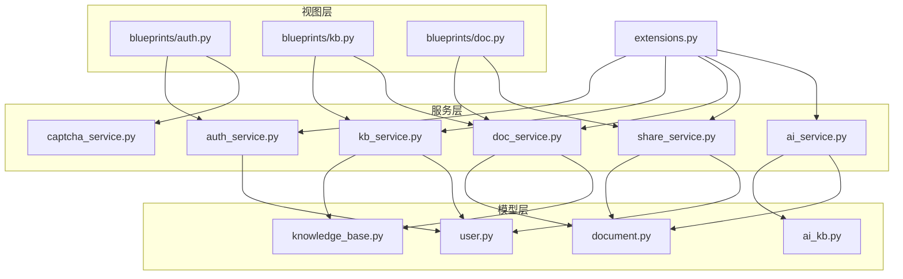
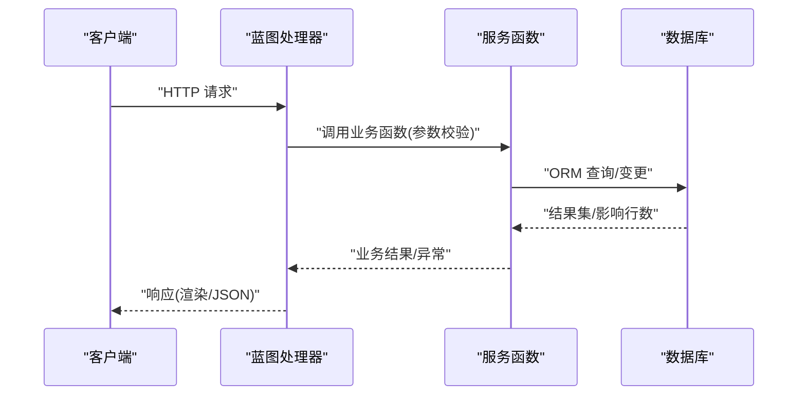
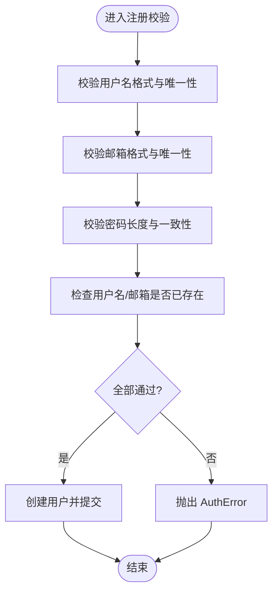
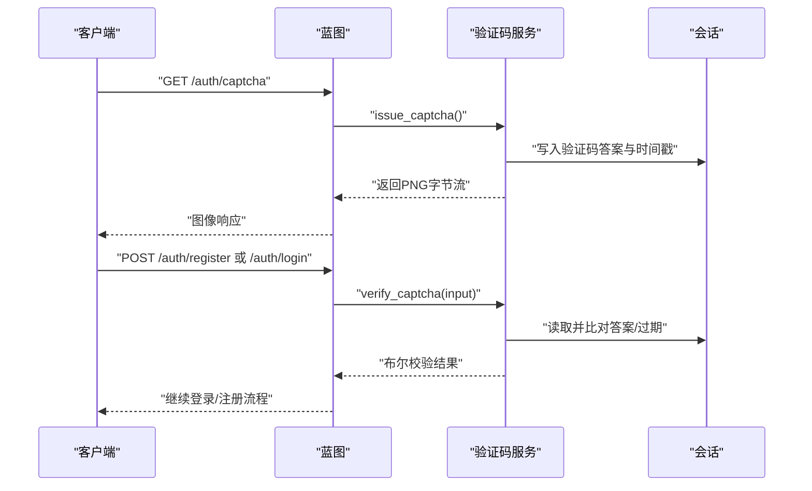
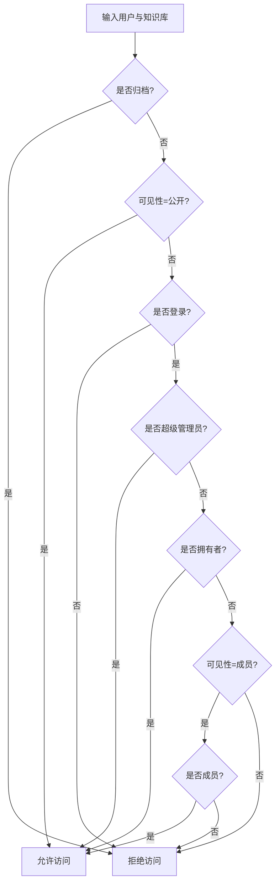
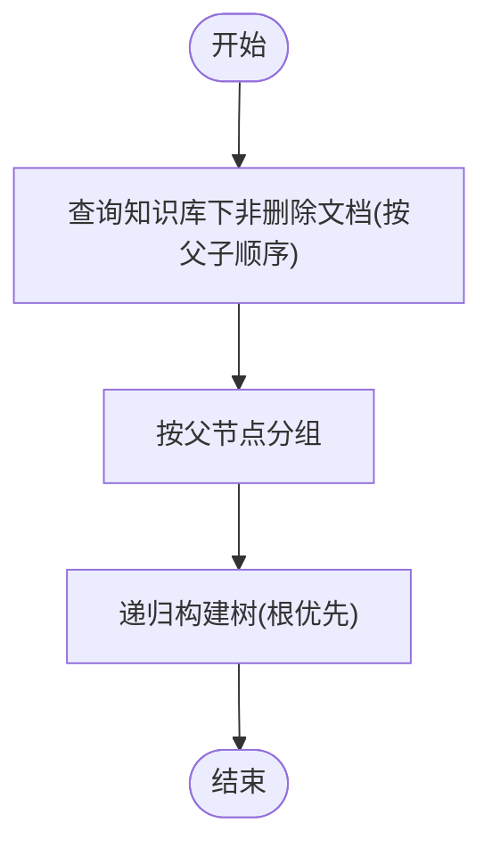
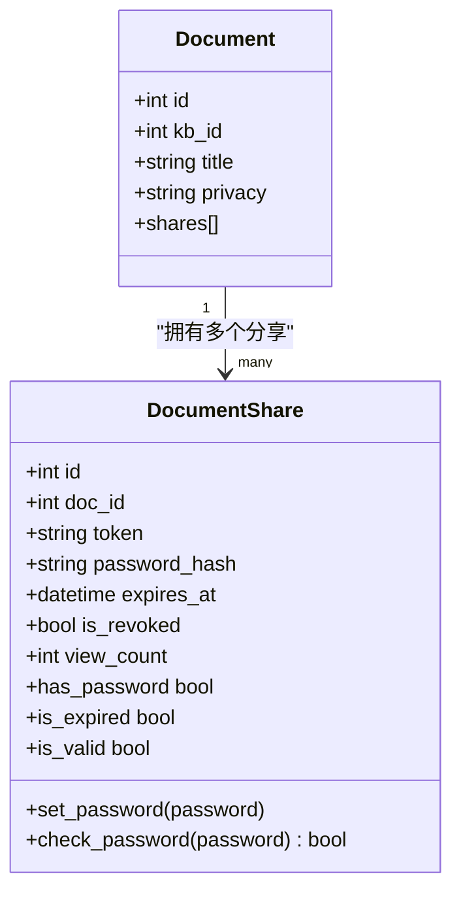
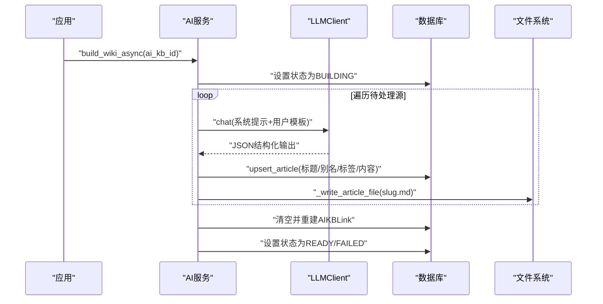
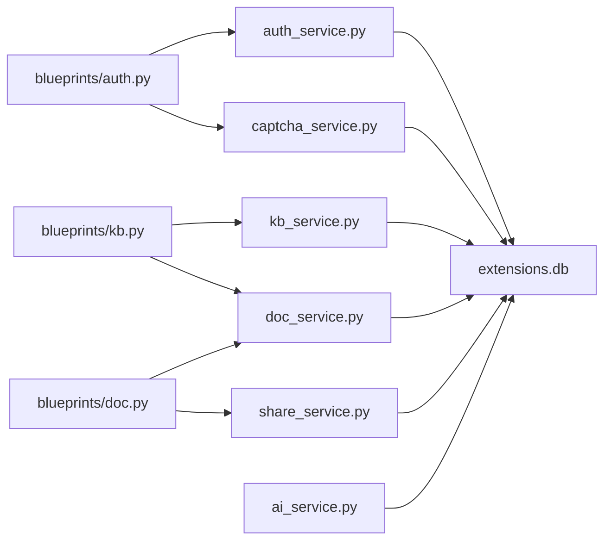

# 业务服务层

<cite>
**本文引用的文件**
- [app/services/__init__.py](file://app/services/__init__.py)
- [app/services/ai_service.py](file://app/services/ai_service.py)
- [app/services/auth_service.py](file://app/services/auth_service.py)
- [app/services/captcha_service.py](file://app/services/captcha_service.py)
- [app/services/doc_service.py](file://app/services/doc_service.py)
- [app/services/kb_service.py](file://app/services/kb_service.py)
- [app/services/share_service.py](file://app/services/share_service.py)
- [app/models/__init__.py](file://app/models/__init__.py)
- [app/models/document.py](file://app/models/document.py)
- [app/models/knowledge_base.py](file://app/models/knowledge_base.py)
- [app/models/ai_kb.py](file://app/models/ai_kb.py)
- [app/models/user.py](file://app/models/user.py)
- [app/blueprints/doc.py](file://app/blueprints/doc.py)
- [app/blueprints/kb.py](file://app/blueprints/kb.py)
- [app/blueprints/auth.py](file://app/blueprints/auth.py)
- [app/extensions.py](file://app/extensions.py)
</cite>

## 目录
1. [引言](#引言)
2. [项目结构](#项目结构)
3. [核心组件](#核心组件)
4. [架构总览](#架构总览)
5. [详细组件分析](#详细组件分析)
6. [依赖分析](#依赖分析)
7. [性能考虑](#性能考虑)
8. [故障排查指南](#故障排查指南)
9. [结论](#结论)
10. [附录](#附录)

## 引言
本文件系统性梳理业务服务层的设计与实现，覆盖服务层架构、业务逻辑封装、事务管理、接口设计与依赖注入模式，以及与数据模型的交互方式、错误处理策略与性能优化方法。同时提供服务层API接口文档、调用示例与最佳实践指南，并解释服务层在整体架构中的定位与扩展点。

## 项目结构
服务层位于 app/services 目录，围绕“知识库/文档/分享/认证/验证码/AI知识库”六大领域划分模块化服务，每个服务模块聚焦单一职责，通过 Flask 扩展 db 进行数据库访问，通过蓝图在视图层进行调用。

图表来源
- [app/services/ai_service.py:1-408](file://app/services/ai_service.py#L1-L408)
- [app/services/auth_service.py:1-57](file://app/services/auth_service.py#L1-L57)
- [app/services/captcha_service.py:1-90](file://app/services/captcha_service.py#L1-L90)
- [app/services/doc_service.py:1-81](file://app/services/doc_service.py#L1-L81)
- [app/services/kb_service.py:1-80](file://app/services/kb_service.py#L1-L80)
- [app/services/share_service.py:1-49](file://app/services/share_service.py#L1-L49)
- [app/models/__init__.py:1-38](file://app/models/__init__.py#L1-L38)
- [app/models/document.py:1-98](file://app/models/document.py#L1-L98)
- [app/models/knowledge_base.py:1-62](file://app/models/knowledge_base.py#L1-L62)
- [app/models/ai_kb.py:1-121](file://app/models/ai_kb.py#L1-L121)
- [app/models/user.py:1-104](file://app/models/user.py#L1-L104)
- [app/blueprints/doc.py:1-139](file://app/blueprints/doc.py#L1-L139)
- [app/blueprints/kb.py:1-141](file://app/blueprints/kb.py#L1-L141)
- [app/blueprints/auth.py:1-85](file://app/blueprints/auth.py#L1-L85)
- [app/extensions.py:1-17](file://app/extensions.py#L1-L17)

章节来源
- [app/services/__init__.py:1-2](file://app/services/__init__.py#L1-L2)
- [app/services/ai_service.py:1-408](file://app/services/ai_service.py#L1-L408)
- [app/services/auth_service.py:1-57](file://app/services/auth_service.py#L1-L57)
- [app/services/captcha_service.py:1-90](file://app/services/captcha_service.py#L1-L90)
- [app/services/doc_service.py:1-81](file://app/services/doc_service.py#L1-L81)
- [app/services/kb_service.py:1-80](file://app/services/kb_service.py#L1-L80)
- [app/services/share_service.py:1-49](file://app/services/share_service.py#L1-L49)
- [app/models/__init__.py:1-38](file://app/models/__init__.py#L1-L38)
- [app/models/document.py:1-98](file://app/models/document.py#L1-L98)
- [app/models/knowledge_base.py:1-62](file://app/models/knowledge_base.py#L1-L62)
- [app/models/ai_kb.py:1-121](file://app/models/ai_kb.py#L1-L121)
- [app/models/user.py:1-104](file://app/models/user.py#L1-L104)
- [app/blueprints/doc.py:1-139](file://app/blueprints/doc.py#L1-L139)
- [app/blueprints/kb.py:1-141](file://app/blueprints/kb.py#L1-L141)
- [app/blueprints/auth.py:1-85](file://app/blueprints/auth.py#L1-L85)
- [app/extensions.py:1-17](file://app/extensions.py#L1-L17)

## 核心组件
- 认证服务：负责注册校验、登录认证、登录信息记录与异常类型定义。
- 验证码服务：生成图片验证码、存储答案到会话、验证与过期控制。
- 知识库服务：权限判定（访问/编辑/管理）、成员管理、公开与我的知识库查询。
- 文档服务：知识库内树形文档结构构建、文档创建/更新/软删除、后代收集。
- 分享服务：文档分享令牌生成、过期与撤销、有效状态判断与访问计数。
- AI知识库服务：LLM客户端封装、文章草稿生成、文章去重/插入、别名索引与链接解析、异步构建与增量重建、可选RAG问答。

章节来源
- [app/services/auth_service.py:1-57](file://app/services/auth_service.py#L1-L57)
- [app/services/captcha_service.py:1-90](file://app/services/captcha_service.py#L1-L90)
- [app/services/kb_service.py:1-80](file://app/services/kb_service.py#L1-L80)
- [app/services/doc_service.py:1-81](file://app/services/doc_service.py#L1-L81)
- [app/services/share_service.py:1-49](file://app/services/share_service.py#L1-L49)
- [app/services/ai_service.py:1-408](file://app/services/ai_service.py#L1-L408)

## 架构总览
服务层采用“单例扩展 + 蓝图调用”的模式：
- 所有服务通过统一的 db 扩展进行数据库操作，保证事务边界清晰。
- 蓝图在请求上下文中调用服务函数，完成业务编排与参数校验。
- 模型层提供数据结构与枚举，服务层以模型为契约进行读写与约束。

图表来源
- [app/blueprints/auth.py:1-85](file://app/blueprints/auth.py#L1-L85)
- [app/blueprints/kb.py:1-141](file://app/blueprints/kb.py#L1-L141)
- [app/blueprints/doc.py:1-139](file://app/blueprints/doc.py#L1-L139)
- [app/services/auth_service.py:1-57](file://app/services/auth_service.py#L1-L57)
- [app/services/kb_service.py:1-80](file://app/services/kb_service.py#L1-L80)
- [app/services/doc_service.py:1-81](file://app/services/doc_service.py#L1-L81)
- [app/services/share_service.py:1-49](file://app/services/share_service.py#L1-L49)
- [app/services/captcha_service.py:1-90](file://app/services/captcha_service.py#L1-L90)
- [app/extensions.py:1-17](file://app/extensions.py#L1-L17)

## 详细组件分析

### 认证服务（auth_service）
职责与接口
- 注册校验：用户名、邮箱、密码一致性与唯一性检查。
- 用户注册：创建用户并持久化。
- 登录认证：根据用户名或邮箱查找用户，校验激活状态与密码。
- 登录记录：记录最近登录时间与IP。

事务与错误
- 使用 db.session 进行提交，确保原子性。
- 定义 AuthError 作为注册阶段的业务异常类型。

图表来源
- [app/services/auth_service.py:17-34](file://app/services/auth_service.py#L17-L34)

章节来源
- [app/services/auth_service.py:1-57](file://app/services/auth_service.py#L1-L57)

### 验证码服务（captcha_service）
职责与接口
- 生成验证码图片与答案，答案写入会话并带过期时间。
- 校验用户输入，支持一次性使用与过期控制。

图表来源
- [app/blueprints/auth.py:10-16](file://app/blueprints/auth.py#L10-L16)
- [app/services/captcha_service.py:65-90](file://app/services/captcha_service.py#L65-L90)

章节来源
- [app/services/captcha_service.py:1-90](file://app/services/captcha_service.py#L1-L90)
- [app/blueprints/auth.py:1-85](file://app/blueprints/auth.py#L1-L85)

### 知识库服务（kb_service）
职责与接口
- 权限判定：can_access/can_edit/can_manage，覆盖公开、成员、拥有者与超级管理员。
- 成员管理：add_member/remove_member，支持角色变更。
- 列表查询：list_my_kbs/list_public_kbs。

图表来源
- [app/services/kb_service.py:10-23](file://app/services/kb_service.py#L10-L23)

章节来源
- [app/services/kb_service.py:1-80](file://app/services/kb_service.py#L1-L80)

### 文档服务（doc_service）
职责与接口
- 树形结构：list_kb_doc_tree 返回嵌套列表表示的知识库文档树。
- 文档生命周期：create_document/update_content/soft_delete。
- 后代收集：collect_descendants 返回包括自身的所有后代ID。

图表来源
- [app/services/doc_service.py:11-34](file://app/services/doc_service.py#L11-L34)

章节来源
- [app/services/doc_service.py:1-81](file://app/services/doc_service.py#L1-L81)

### 分享服务（share_service）
职责与接口
- 创建分享：生成唯一token，可选密码与过期时间。
- 撤销分享：标记失效。
- 有效态查询：按token检索并校验有效性。
- 访问计数：增加浏览次数。

图表来源
- [app/models/document.py:56-98](file://app/models/document.py#L56-L98)
- [app/services/share_service.py:15-31](file://app/services/share_service.py#L15-L31)

章节来源
- [app/services/share_service.py:1-49](file://app/services/share_service.py#L1-L49)
- [app/models/document.py:1-98](file://app/models/document.py#L1-L98)

### AI知识库服务（ai_service）
职责与接口
- LLM 客户端：封装 OpenAI 兼容SDK，支持多厂商与本地代理。
- 文章构建：从文档生成 Wiki 草稿，去重插入，生成文件。
- 链接解析：扫描 [[...]] 并建立反链，统计解析结果。
- 异步构建：后台线程批量处理源文档，完成后解析链接。
- 可选RAG问答：关键词匹配Top-N后进行问答。

图表来源
- [app/services/ai_service.py:313-344](file://app/services/ai_service.py#L313-L344)
- [app/services/ai_service.py:296-311](file://app/services/ai_service.py#L296-L311)
- [app/services/ai_service.py:204-230](file://app/services/ai_service.py#L204-L230)
- [app/services/ai_service.py:251-278](file://app/services/ai_service.py#L251-L278)

章节来源
- [app/services/ai_service.py:1-408](file://app/services/ai_service.py#L1-L408)

## 依赖分析
- 服务层依赖
  - db 扩展：统一的数据库会话与事务边界。
  - 模型层：服务函数以模型为契约进行读写。
  - 工具模块：Markdown/大纲解析工具辅助内容处理。
- 蓝图依赖
  - 蓝图在请求上下文中调用服务函数，完成参数校验与权限检查。
- 外部依赖
  - OpenAI兼容SDK（可选，用于LLMClient）。
  - Pillow（用于验证码图片生成）。

图表来源
- [app/services/auth_service.py:1-57](file://app/services/auth_service.py#L1-L57)
- [app/services/captcha_service.py:1-90](file://app/services/captcha_service.py#L1-L90)
- [app/services/kb_service.py:1-80](file://app/services/kb_service.py#L1-L80)
- [app/services/doc_service.py:1-81](file://app/services/doc_service.py#L1-L81)
- [app/services/share_service.py:1-49](file://app/services/share_service.py#L1-L49)
- [app/services/ai_service.py:1-408](file://app/services/ai_service.py#L1-L408)
- [app/blueprints/auth.py:1-85](file://app/blueprints/auth.py#L1-L85)
- [app/blueprints/kb.py:1-141](file://app/blueprints/kb.py#L1-L141)
- [app/blueprints/doc.py:1-139](file://app/blueprints/doc.py#L1-L139)
- [app/extensions.py:1-17](file://app/extensions.py#L1-L17)

章节来源
- [app/extensions.py:1-17](file://app/extensions.py#L1-L17)
- [app/models/__init__.py:1-38](file://app/models/__init__.py#L1-L38)

## 性能考虑
- 事务粒度
  - 服务函数内部尽量减少多次提交，避免长事务锁竞争。
  - 对于耗时操作（如LLM调用），建议在后台线程执行，主线程快速返回。
- 查询优化
  - 使用模型索引字段进行过滤（如文档的is_deleted、知识库的visibility等）。
  - 树形结构构建采用一次查询+内存分组+递归构建，避免N+1查询。
- 文件I/O
  - 文章文件写入在数据库提交之后进行，确保数据一致性。
- 缓存与重试
  - 对外部LLM调用可引入指数退避与超时控制（当前实现未包含，建议在生产环境增强）。
- 并发与锁
  - 异步构建使用线程池/队列管理任务，避免阻塞主线程。
  - 对共享资源（如AI知识库状态）使用数据库级状态机与错误消息记录。

## 故障排查指南
常见问题与定位
- 注册失败
  - 现象：提示用户名/邮箱已被占用或密码不一致。
  - 排查：确认正则校验、唯一性检查与两次密码一致性。
- 登录失败
  - 现象：用户名或密码错误。
  - 排查：确认用户是否存在、是否激活、密码校验是否通过。
- 分享无效
  - 现象：分享链接无法访问或提示已撤销/过期。
  - 排查：检查DocumentPrivacy是否为可分享、Token是否有效、过期时间与撤销标记。
- AI构建失败
  - 现象：状态停留在BUILDING或出现FAILED。
  - 排查：查看error_msg字段，确认源文档是否存在且未删除、LLM配置是否正确。
- 验证码过期
  - 现象：验证码错误或已过期。
  - 排查：确认会话中答案与时间戳、TTL配置。

章节来源
- [app/services/auth_service.py:17-34](file://app/services/auth_service.py#L17-L34)
- [app/services/share_service.py:15-31](file://app/services/share_service.py#L15-L31)
- [app/services/ai_service.py:313-344](file://app/services/ai_service.py#L313-L344)
- [app/services/captcha_service.py:75-90](file://app/services/captcha_service.py#L75-L90)

## 结论
服务层通过清晰的职责划分与统一的事务管理，将业务规则与数据访问解耦，便于维护与扩展。结合蓝图的参数校验与权限控制，形成“视图-服务-模型”的稳定架构。建议在生产环境中进一步完善外部依赖的超时与重试、并发任务的监控与告警，以及对敏感操作的审计日志。

## 附录

### 服务层API接口文档（按模块）

- 认证服务
  - 接口：validate_register(username, email, password, password2) -> None
  - 接口：register(username, email, password) -> User
  - 接口：authenticate(login, password) -> User | None
  - 接口：mark_login(user) -> None
  - 异常：AuthError
  - 事务：注册与登录记录均提交

- 验证码服务
  - 接口：issue_captcha() -> bytes
  - 接口：verify_captcha(user_input) -> bool
  - 事务：无

- 知识库服务
  - 接口：can_access(user, kb) -> bool
  - 接口：can_edit(user, kb) -> bool
  - 接口：can_manage(user, kb) -> bool
  - 接口：list_my_kbs(user) -> Query
  - 接口：list_public_kbs() -> Query
  - 接口：add_member(kb, user, role) -> KBMember
  - 接口：remove_member(kb, user_id) -> None
  - 事务：成员增删与查询

- 文档服务
  - 接口：list_kb_doc_tree(kb_id) -> list[dict]
  - 接口：create_document(kb, user, title, parent_id, doc_type, privacy) -> Document
  - 接口：update_content(doc, content_json, title) -> Document
  - 接口：soft_delete(doc) -> None
  - 接口：collect_descendants(doc_id) -> list[int]
  - 事务：文档创建/更新/删除

- 分享服务
  - 接口：create_share(doc, creator_id, password, ttl_hours) -> DocumentShare
  - 接口：revoke(share) -> None
  - 接口：get_active_share(token) -> DocumentShare | None
  - 接口：increment_view(share) -> None
  - 异常：ShareError
  - 事务：分享创建/撤销/计数

- AI知识库服务
  - 类：LLMClient(chat, client属性)
  - 接口：build_article_from_document(llm, doc) -> WikiArticleDraft
  - 接口：upsert_article(ai_kb, draft, source_doc_id) -> AIKBArticle
  - 接口：resolve_links(ai_kb) -> (resolved_count, redlink_count)
  - 接口：build_wiki_async(app, ai_kb_id, only_pending) -> None
  - 接口：regenerate_one_async(app, ai_kb_id, article_id) -> None
  - 接口：chat_with_wiki(ai_kb, question, max_articles) -> str
  - 事务：文章写入、链接重建、状态更新

章节来源
- [app/services/auth_service.py:1-57](file://app/services/auth_service.py#L1-L57)
- [app/services/captcha_service.py:1-90](file://app/services/captcha_service.py#L1-L90)
- [app/services/kb_service.py:1-80](file://app/services/kb_service.py#L1-L80)
- [app/services/doc_service.py:1-81](file://app/services/doc_service.py#L1-L81)
- [app/services/share_service.py:1-49](file://app/services/share_service.py#L1-L49)
- [app/services/ai_service.py:1-408](file://app/services/ai_service.py#L1-L408)

### 调用示例（蓝图到服务）
- 注册流程
  - 蓝图：/auth/register
  - 步骤：验证码校验 -> validate_register -> register -> 登录 -> mark_login
- 文档编辑
  - 蓝图：/doc/<int:doc_id>/save
  - 步骤：权限校验 -> update_content -> 返回大纲与更新时间
- 分享文档
  - 蓝图：/doc/<int:doc_id>/share
  - 步骤：权限校验 -> create_share -> 列表展示 -> revoke

章节来源
- [app/blueprints/auth.py:19-48](file://app/blueprints/auth.py#L19-L48)
- [app/blueprints/doc.py:69-84](file://app/blueprints/doc.py#L69-L84)
- [app/blueprints/doc.py:103-124](file://app/blueprints/doc.py#L103-L124)

### 开发规范与测试策略
- 开发规范
  - 事务边界：每个服务函数内部保持最小事务，避免跨服务长事务。
  - 错误处理：使用明确的异常类型（如AuthError、ShareError）区分业务错误。
  - 参数校验：在蓝图层进行输入清洗与范围校验，服务层进行业务规则校验。
  - 日志与可观测：对外部依赖（LLM）增加调用日志与错误摘要。
- 测试策略
  - 单元测试：针对服务函数的输入/输出与异常路径进行覆盖。
  - 集成测试：模拟蓝图调用，验证权限、事务与数据库一致性。
  - 压力测试：对AI构建与文档树构建进行并发与大数据量测试。
  - 回归测试：对分享、验证码、权限判定等关键路径进行回归。