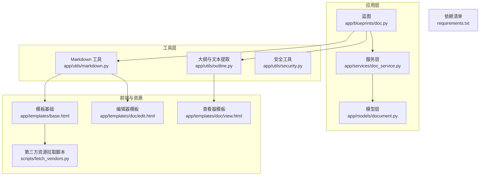
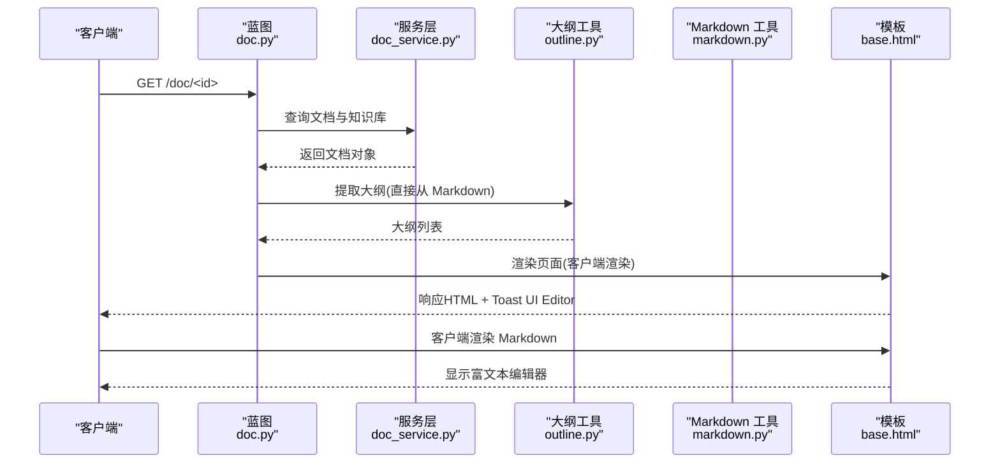
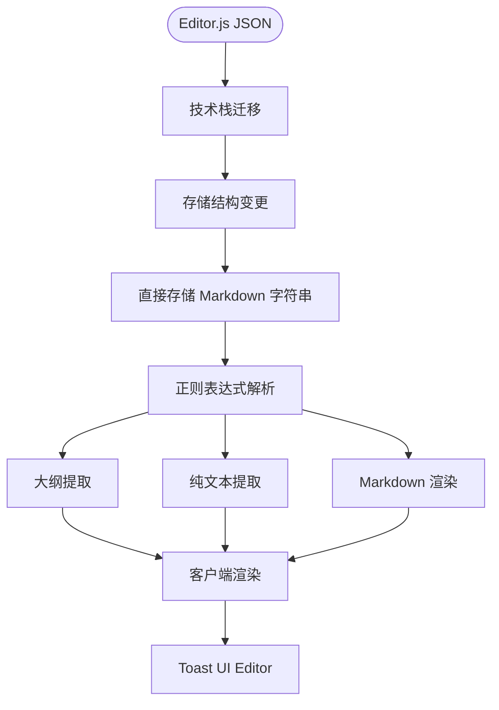
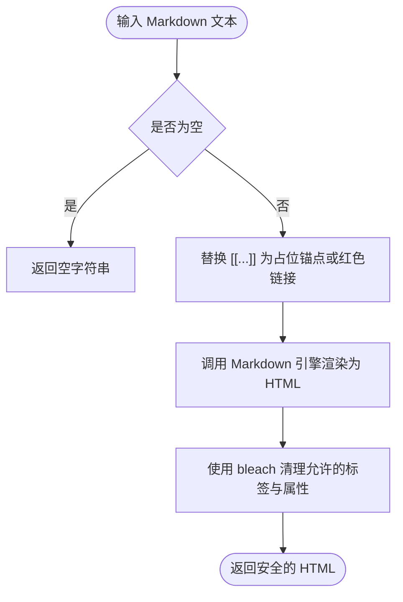
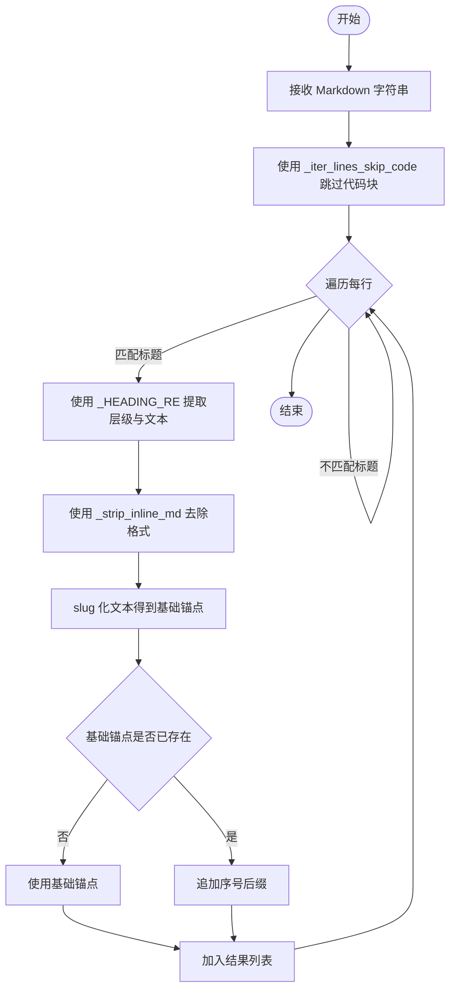
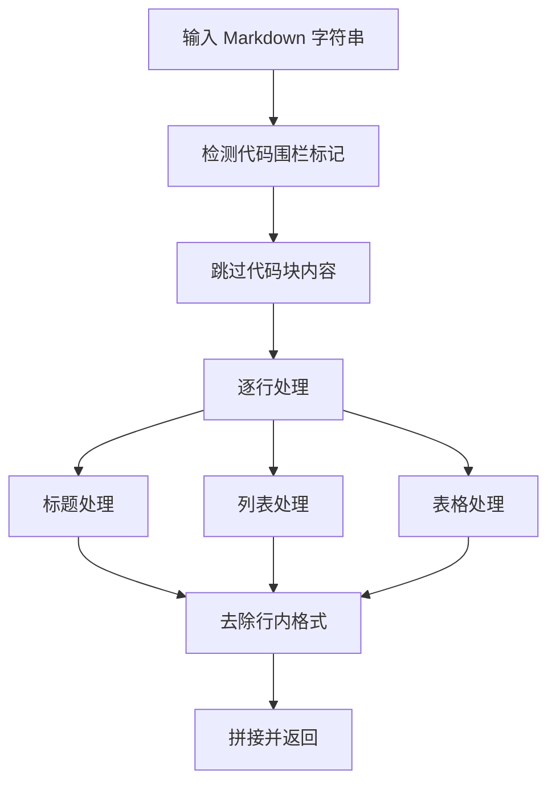
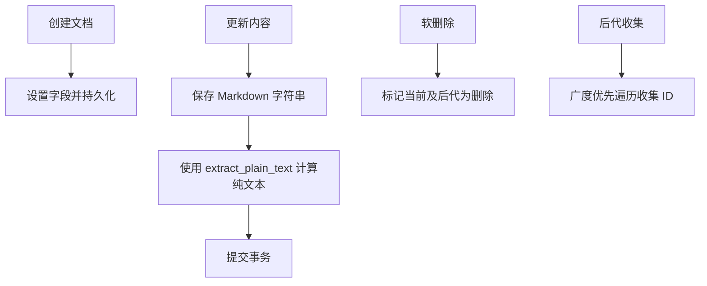
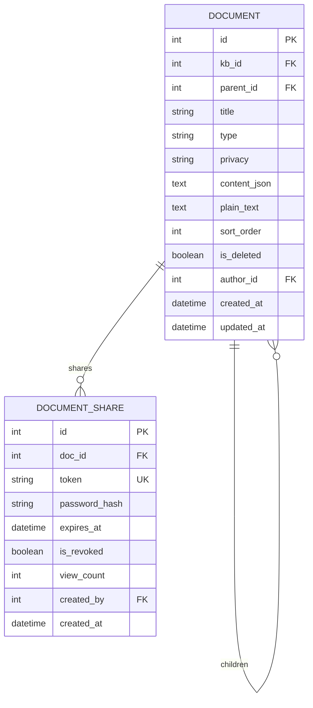
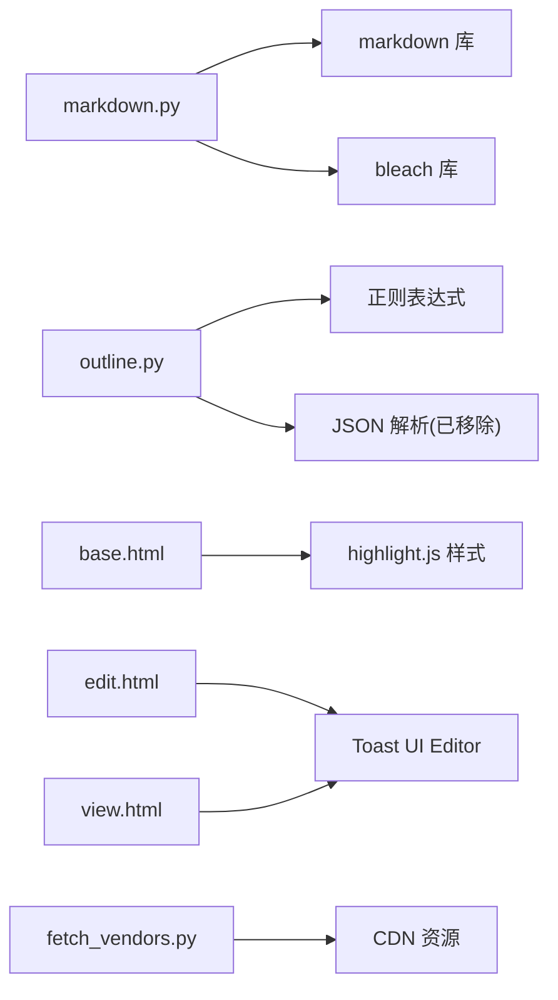

# 内容处理工具

<cite>
**本文引用的文件**
- [app/utils/markdown.py](file://app/utils/markdown.py)
- [app/utils/outline.py](file://app/utils/outline.py)
- [app/utils/security.py](file://app/utils/security.py)
- [app/services/doc_service.py](file://app/services/doc_service.py)
- [app/models/document.py](file://app/models/document.py)
- [app/blueprints/doc.py](file://app/blueprints/doc.py)
- [app/templates/base.html](file://app/templates/base.html)
- [app/templates/doc/view.html](file://app/templates/doc/view.html)
- [app/templates/doc/edit.html](file://app/templates/doc/edit.html)
- [scripts/fetch_vendors.py](file://scripts/fetch_vendors.py)
- [requirements.txt](file://requirements.txt)
</cite>

## 更新摘要
**所做更改**
- 更新了从 Editor.js JSON 解析迁移到基于正则表达式的 Markdown 解析的技术栈变更
- 新增了 Toast UI Editor 作为富文本编辑器的详细说明
- 更新了文档存储结构：从 Editor.js JSON 迁移到直接存储 Markdown 字符串
- 修正了大纲生成算法的实现细节，现在基于正则表达式解析 Markdown
- 更新了前端渲染流程，从服务器端渲染改为客户端渲染使用 Toast UI Editor

## 目录
1. [简介](#简介)
2. [项目结构](#项目结构)
3. [核心组件](#核心组件)
4. [架构总览](#架构总览)
5. [详细组件分析](#详细组件分析)
6. [依赖分析](#依赖分析)
7. [性能考虑](#性能考虑)
8. [故障排查指南](#故障排查指南)
9. [结论](#结论)
10. [附录](#附录)

## 简介
本文件面向"内容处理工具"的使用者与维护者，系统性阐述以下能力与实现细节：
- **Markdown 渲染引擎的集成与配置**：Markdown 到 HTML 的转换、代码高亮、数学公式支持（通过扩展与外部资源）、安全过滤。
- **文档大纲生成算法**：基于正则表达式的标题层级识别、目录结构构建、锚点链接生成。
- **内容预处理流程**：富文本编辑器内容的标准化、特殊字符处理和安全过滤。
- **技术栈迁移**：从 Editor.js JSON 解析迁移到基于正则表达式的 Markdown 解析，包括标题提取、代码块处理、表格解析等功能的重新实现。
- **工具函数使用示例、配置选项与性能优化建议**。
- **自定义渲染器与扩展功能的开发指导**。

## 项目结构
该工具围绕 Flask 应用组织，核心处理逻辑集中在 utils 包中，服务层负责业务编排，模型层定义数据结构，蓝图负责路由与视图交互，模板与脚本负责前端资源与静态资源拉取。

**图表来源**
- [app/blueprints/doc.py:1-139](file://app/blueprints/doc.py#L1-L139)
- [app/services/doc_service.py:1-81](file://app/services/doc_service.py#L1-L81)
- [app/models/document.py:1-98](file://app/models/document.py#L1-L98)
- [app/utils/markdown.py:1-87](file://app/utils/markdown.py#L1-L87)
- [app/utils/outline.py:1-143](file://app/utils/outline.py#L1-L143)
- [app/utils/security.py:1-8](file://app/utils/security.py#L1-L8)
- [app/templates/base.html:1-30](file://app/templates/base.html#L1-L30)
- [app/templates/doc/edit.html:1-133](file://app/templates/doc/edit.html#L1-L133)
- [app/templates/doc/view.html:1-95](file://app/templates/doc/view.html#L1-L95)
- [scripts/fetch_vendors.py:1-107](file://scripts/fetch_vendors.py#L1-L107)

**章节来源**
- [app/blueprints/doc.py:1-139](file://app/blueprints/doc.py#L1-L139)
- [app/services/doc_service.py:1-81](file://app/services/doc_service.py#L1-L81)
- [app/models/document.py:1-98](file://app/models/document.py#L1-L98)
- [app/utils/markdown.py:1-87](file://app/utils/markdown.py#L1-L87)
- [app/utils/outline.py:1-143](file://app/utils/outline.py#L1-L143)
- [app/utils/security.py:1-8](file://app/utils/security.py#L1-L8)
- [app/templates/base.html:1-30](file://app/templates/base.html#L1-L30)
- [app/templates/doc/edit.html:1-133](file://app/templates/doc/edit.html#L1-L133)
- [app/templates/doc/view.html:1-95](file://app/templates/doc/view.html#L1-L95)
- [scripts/fetch_vendors.py:1-107](file://scripts/fetch_vendors.py#L1-L107)

## 核心组件
- **Markdown 渲染工具**：提供 Markdown 到 HTML 的转换、Wiki 链接解析、维基链接收集与安全清理。
- **大纲与文本提取工具**：基于正则表达式从 Markdown 中抽取 H1-H3 大纲、纯文本与简化 Markdown。
- **文档服务**：文档树构建、内容更新、后代收集等。
- **模型层**：文档与分享模型的数据结构与约束。
- **安全工具**：生成安全的分享令牌。
- **蓝图与模板**：路由、视图渲染与前端资源加载。

**章节来源**
- [app/utils/markdown.py:1-87](file://app/utils/markdown.py#L1-L87)
- [app/utils/outline.py:1-143](file://app/utils/outline.py#L1-L143)
- [app/services/doc_service.py:1-81](file://app/services/doc_service.py#L1-L81)
- [app/models/document.py:1-98](file://app/models/document.py#L1-L98)
- [app/utils/security.py:1-8](file://app/utils/security.py#L1-L8)
- [app/blueprints/doc.py:1-139](file://app/blueprints/doc.py#L1-L139)
- [app/templates/base.html:1-30](file://app/templates/base.html#L1-L30)

## 架构总览
下图展示从请求到渲染的关键路径，以及 Markdown 与大纲工具的调用位置。**更新**：现在采用客户端渲染模式，使用 Toast UI Editor 进行实时预览。

**图表来源**
- [app/blueprints/doc.py:43-55](file://app/blueprints/doc.py#L43-L55)
- [app/services/doc_service.py:11-34](file://app/services/doc_service.py#L11-L34)
- [app/utils/outline.py:69-90](file://app/utils/outline.py#L69-L90)
- [app/utils/markdown.py:31-39](file://app/utils/markdown.py#L31-L39)
- [app/templates/base.html:1-30](file://app/templates/base.html#L1-L30)
- [app/templates/doc/edit.html:70-96](file://app/templates/doc/edit.html#L70-L96)

## 详细组件分析

### 技术栈迁移：从 Editor.js JSON 到 Markdown 正则解析

**更新**：项目已完成从 Editor.js JSON 解析到基于正则表达式的 Markdown 解析的技术栈迁移。

#### 存储结构变更
- **旧架构**：数据库字段 `content_json` 存储 Editor.js JSON 对象，包含 blocks 数组
- **新架构**：`content_json` 字段直接存储 Markdown 字符串，为避免破坏既有迁移保留字段名

#### 富文本编辑器变更
- **旧架构**：使用 Editor.js 作为富文本编辑器
- **新架构**：改用 Toast UI Editor，支持 Markdown + WYSIWYG 双模式

**图表来源**
- [app/models/document.py:31-32](file://app/models/document.py#L31-L32)
- [app/utils/outline.py:3-8](file://app/utils/outline.py#L3-L8)
- [app/templates/doc/edit.html:75-90](file://app/templates/doc/edit.html#L75-L90)

**章节来源**
- [app/models/document.py:31-32](file://app/models/document.py#L31-L32)
- [app/utils/outline.py:3-8](file://app/utils/outline.py#L3-L8)
- [app/templates/doc/edit.html:75-90](file://app/templates/doc/edit.html#L75-L90)

### Markdown 渲染引擎与安全过滤
- **渲染扩展与输出格式**
  - 使用的扩展包括 extra、sane_lists、tables、fenced_code、toc、nl2br。
  - 输出格式为 html5。
- **安全策略**
  - 允许标签与属性在默认允许集基础上扩展，确保渲染安全。
  - 使用 bleach.clean 对 HTML 进行白名单清理与剥离。
- **Wiki 链接解析**
  - 支持 [[目标]] 与 [[目标|显示名]] 两种形式。
  - 通过传入的 resolver 将目标解析为 slug；若解析失败则生成红色未链接样式提示。
  - 维护占位锚点 #WIKI:slug，由路由层重写为实际 URL。
- **维基链接收集**
  - 从文本中提取所有 [[...]] 形式的链接目标，去重并保持顺序。

**图表来源**
- [app/utils/markdown.py:31-66](file://app/utils/markdown.py#L31-L66)

**章节来源**
- [app/utils/markdown.py:1-87](file://app/utils/markdown.py#L1-L87)

### 基于正则表达式的文档大纲生成算法
**更新**：算法已完全重构，从 Editor.js JSON 解析迁移到基于正则表达式的 Markdown 解析。

- **输入**：直接接收 Markdown 字符串，无需 JSON 解析
- **处理步骤**
  - 使用正则表达式 `_HEADING_RE` 匹配标题行 `^(#{1,6})\s+(.+?)\s*#*\s*$`
  - 过滤类型为 header 的块，限制层级为 H1-H3
  - 使用 `_strip_inline_md` 去除行内 Markdown 格式标记
  - 生成锚点：先进行 slug 化，再对重复基础锚点追加序号后缀
  - 使用 `_iter_lines_skip_code` 跳过代码块内容，避免干扰标题提取
- **输出**：包含 level、text、anchor 的大纲条目列表

**图表来源**
- [app/utils/outline.py:69-90](file://app/utils/outline.py#L69-L90)
- [app/utils/outline.py:48-66](file://app/utils/outline.py#L48-L66)
- [app/utils/outline.py:27-45](file://app/utils/outline.py#L27-L45)

**章节来源**
- [app/utils/outline.py:1-143](file://app/utils/outline.py#L1-L143)

### 内容预处理与富文本标准化
**更新**：内容预处理流程已适应新的 Markdown 存储结构。

- **直接存储 Markdown**
  - `content_json` 字段直接存储 Markdown 字符串，无需 JSON 解析
  - 保持与 Editor.js JSON 的兼容性，但不再需要解析 blocks 数组
- **纯文本提取**
  - 针对标题、列表、引用、表格等类型进行文本化处理
  - 使用正则表达式跳过代码块内容，避免干扰纯文本生成
  - 表格内容按单元格提取并去除 Markdown 格式
- **简化 Markdown 转换**
  - 直接返回存储的 Markdown 字符串
  - 适用于导出或二次处理场景

**图表来源**
- [app/utils/outline.py:93-137](file://app/utils/outline.py#L93-L137)
- [app/utils/outline.py:48-66](file://app/utils/outline.py#L48-L66)

**章节来源**
- [app/utils/outline.py:1-143](file://app/utils/outline.py#L1-L143)

### 文档服务与内容更新
- **文档树构建**：基于父节点分组递归构建嵌套列表。
- **创建文档**：初始化标题、类型、隐私、作者等字段，`content_json` 和 `plain_text` 初始化为空字符串。
- **更新内容**：保存 Markdown 字符串，同时计算并存储纯文本表示。
- **软删除**：标记文档及其后代为已删除。
- **后代收集**：广度优先遍历收集所有后代 ID。

**图表来源**
- [app/services/doc_service.py:37-62](file://app/services/doc_service.py#L37-L62)
- [app/services/doc_service.py:65-80](file://app/services/doc_service.py#L65-L80)

**章节来源**
- [app/services/doc_service.py:1-81](file://app/services/doc_service.py#L1-L81)

### 模型层与数据结构
- **Document**：文档实体，包含标题、类型、隐私、排序、删除标记、作者、知识库外键、内容 JSON 与纯文本等。
- **DocumentShare**：分享记录，支持密码哈希、过期时间、撤销标记与访问统计。

**更新**：`content_json` 字段现在直接存储 Markdown 字符串，而非 Editor.js JSON 对象。

**图表来源**
- [app/models/document.py:20-98](file://app/models/document.py#L20-L98)

**章节来源**
- [app/models/document.py:1-98](file://app/models/document.py#L1-L98)

### 安全工具与分享令牌
- 生成 URL 安全的随机令牌，用于分享链接的安全性保障。

**章节来源**
- [app/utils/security.py:1-8](file://app/utils/security.py#L1-L8)

### 蓝图与模板集成
**更新**：模板已适配新的客户端渲染架构。

- **蓝图**：负责路由、权限校验、视图渲染与内容保存。
- **模板基础**：引入 Tailwind、Highlight.js 样式与 Alpine.js，为渲染与交互提供前端基础。
- **编辑器模板**：使用 Toast UI Editor 进行富文本编辑，支持 Markdown + WYSIWYG 双模式。
- **查看器模板**：使用 Toast UI Editor 的 viewer 模式进行内容展示。

**章节来源**
- [app/blueprints/doc.py:1-139](file://app/blueprints/doc.py#L1-L139)
- [app/templates/base.html:1-30](file://app/templates/base.html#L1-L30)
- [app/templates/doc/edit.html:1-133](file://app/templates/doc/edit.html#L1-L133)
- [app/templates/doc/view.html:1-95](file://app/templates/doc/view.html#L1-L95)

## 依赖分析
- **Python 依赖**
  - Flask、SQLAlchemy、Markdown、Bleach、python-slugify 等。
- **前端依赖**
  - Toast UI Editor 插件集合、highlight.js 与主题、Lucide 图标、Inter 字体等。
- **资源拉取**
  - 通过脚本从 CDN 下载第三方资源，便于部署与版本管理。

**图表来源**
- [app/utils/markdown.py:6-7](file://app/utils/markdown.py#L6-L7)
- [app/utils/markdown.py:4-5](file://app/utils/markdown.py#L4-L5)
- [app/utils/outline.py:12](file://app/utils/outline.py#L12)
- [app/templates/base.html:10](file://app/templates/base.html#L10)
- [app/templates/doc/edit.html:36-43](file://app/templates/doc/edit.html#L36-L43)
- [app/templates/doc/view.html:68-70](file://app/templates/doc/view.html#L68-L70)
- [scripts/fetch_vendors.py:51-60](file://scripts/fetch_vendors.py#L51-L60)

**章节来源**
- [requirements.txt:1-22](file://requirements.txt#L1-L22)
- [scripts/fetch_vendors.py:1-107](file://scripts/fetch_vendors.py#L1-L107)

## 性能考虑
- **渲染路径**
  - Markdown 渲染与 bleach 清理为 CPU 密集操作，建议在高频更新场景下缓存渲染结果或仅在必要时触发。
  - 大文档的 toc 扩展可能带来额外开销，可根据需要禁用或延迟生成。
- **正则表达式解析**
  - 新的正则表达式解析算法相比 JSON 解析更加高效，避免了不必要的对象序列化开销。
  - `_iter_lines_skip_code` 函数通过状态机避免重复扫描，提升性能。
- **客户端渲染**
  - Toast UI Editor 在客户端进行实时渲染，减少服务器负载。
  - 编辑器初始化失败时自动降级为纯文本显示，保证用户体验。
- **数据库与查询**
  - 文档树构建与后代收集采用一次查询与队列遍历，复杂度与层级深度相关，建议控制层级深度或分页展示。
- **前端资源**
  - Toast UI Editor 一体化版本包含所有依赖，避免运行时依赖解析开销。
  - Highlight.js 主题与插件体积较大，建议按需加载或在生产环境启用压缩与缓存。

## 故障排查指南
- **渲染异常**
  - 若出现 HTML 注入风险或标签缺失，检查允许标签与属性配置，确认 bleach.clean 的调用参数。
  - 若 Wiki 链接未生效，确认 resolver 返回值与占位锚点替换逻辑。
- **大纲为空**
  - 确认 Markdown 格式正确，标题使用 `#` 符号且层级不超过 H3。
  - 检查正则表达式 `_HEADING_RE` 是否正确匹配标题格式。
- **内容保存失败**
  - 检查 Markdown 字符串格式与字段合法性；确认数据库事务提交成功。
  - 确认 Toast UI Editor 正常加载，编辑器实例创建成功。
- **分享链接无效**
  - 检查令牌生成、过期时间与撤销状态；确认模板中资源加载正常。
- **编辑器加载失败**
  - 检查 `window.toastui` 是否可用，确认静态资源正确加载。
  - 查看浏览器控制台错误信息，确认 CDN 资源可访问。

**章节来源**
- [app/utils/markdown.py:10-25](file://app/utils/markdown.py#L10-L25)
- [app/utils/outline.py:69-78](file://app/utils/outline.py#L69-L78)
- [app/services/doc_service.py:56-62](file://app/services/doc_service.py#L56-L62)
- [app/models/document.py:56-98](file://app/models/document.py#L56-L98)
- [app/templates/doc/edit.html:61-64](file://app/templates/doc/edit.html#L61-L64)

## 结论
本工具已完成从 Editor.js JSON 解析到基于正则表达式的 Markdown 解析的技术栈迁移，实现了更高效的存储与处理机制。通过简洁的工具函数为核心，结合服务层与模型层实现了从富文本到 HTML 的安全渲染、从 Markdown 到大纲与纯文本的标准化处理，并提供了分享与权限控制的基础能力。新的架构以 Toast UI Editor 作为富文本编辑器，支持 Markdown + WYSIWYG 双模式，提升了用户体验与开发效率。通过合理配置渲染扩展与前端资源，可在保证安全性的前提下获得良好的渲染效果与用户体验。

## 附录

### 工具函数使用示例（路径指引）
- **Markdown 渲染**
  - [render_markdown:31-39](file://app/utils/markdown.py#L31-L39)
  - [render_wiki_markdown:42-66](file://app/utils/markdown.py#L42-L66)
  - [collect_wikilinks:69-86](file://app/utils/markdown.py#L69-L86)
- **大纲与文本提取**
  - [extract_outline:69-90](file://app/utils/outline.py#L69-L90)
  - [extract_plain_text:93-137](file://app/utils/outline.py#L93-L137)
  - [extract_markdown:140-142](file://app/utils/outline.py#L140-L142)
- **文档服务**
  - [list_kb_doc_tree:11-34](file://app/services/doc_service.py#L11-L34)
  - [create_document:37-53](file://app/services/doc_service.py#L37-L53)
  - [update_content:56-62](file://app/services/doc_service.py#L56-L62)
  - [soft_delete:65-67](file://app/services/doc_service.py#L65-L67)
  - [collect_descendants:70-80](file://app/services/doc_service.py#L70-L80)
- **安全工具**
  - [generate_token:5-7](file://app/utils/security.py#L5-L7)

**章节来源**
- [app/utils/markdown.py:31-86](file://app/utils/markdown.py#L31-L86)
- [app/utils/outline.py:22-142](file://app/utils/outline.py#L22-L142)
- [app/services/doc_service.py:11-80](file://app/services/doc_service.py#L11-L80)
- [app/utils/security.py:5-7](file://app/utils/security.py#L5-L7)

### 配置选项与扩展开发建议
- **Markdown 扩展**
  - 当前启用 extra、sane_lists、tables、fenced_code、toc、nl2br；如需数学公式支持，可引入相应扩展并在模板中加载对应资源。
  - 代码高亮：模板已引入 highlight.js 样式，可在渲染后对 `<pre><code>` 块执行高亮初始化。
- **安全过滤**
  - 允许标签与属性在默认允许集基础上扩展，建议根据业务需求审慎增删。
- **自定义渲染器**
  - 可在 render_wiki_markdown 的 resolver 参数中注入自定义解析逻辑，实现跨知识库或外部资源的链接解析。
- **前端资源**
  - 通过 [base.html:8-12](file://app/templates/base.html#L8-L12) 与 [fetch_vendors.py:51-60](file://scripts/fetch_vendors.py#L51-L60) 管理第三方资源版本与加载策略。
- **技术栈迁移注意事项**
  - 新架构已完全移除 Editor.js 依赖，确保所有相关代码已清理。
  - 确保数据库迁移脚本正确更新 `content_json` 字段的存储格式。

**章节来源**
- [app/utils/markdown.py:34-39](file://app/utils/markdown.py#L34-L39)
- [app/templates/base.html:8-12](file://app/templates/base.html#L8-L12)
- [scripts/fetch_vendors.py:51-60](file://scripts/fetch_vendors.py#L51-L60)
- [app/utils/outline.py:3-8](file://app/utils/outline.py#L3-L8)