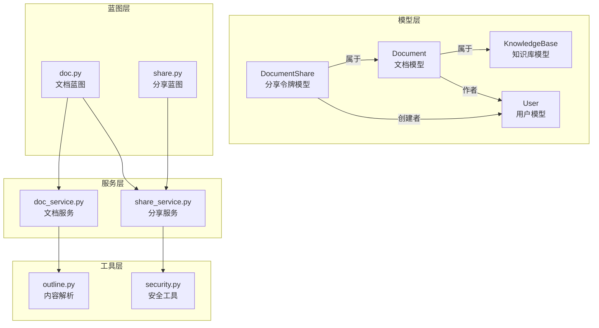
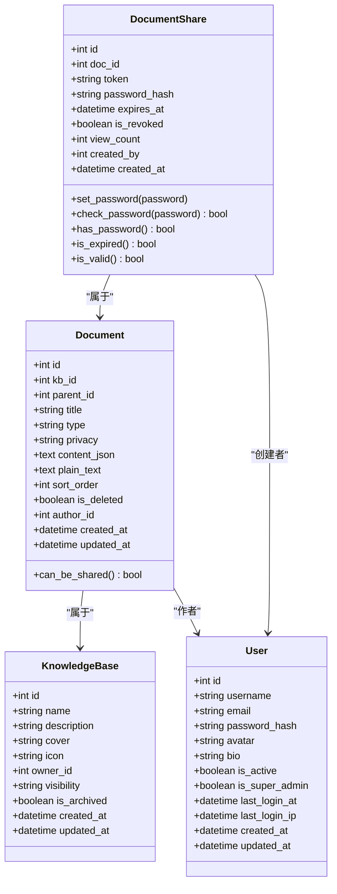
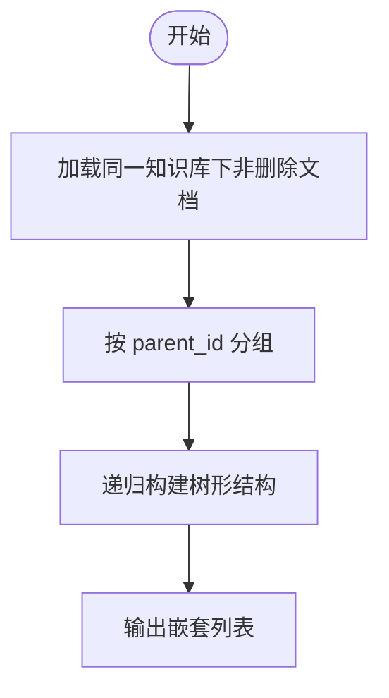
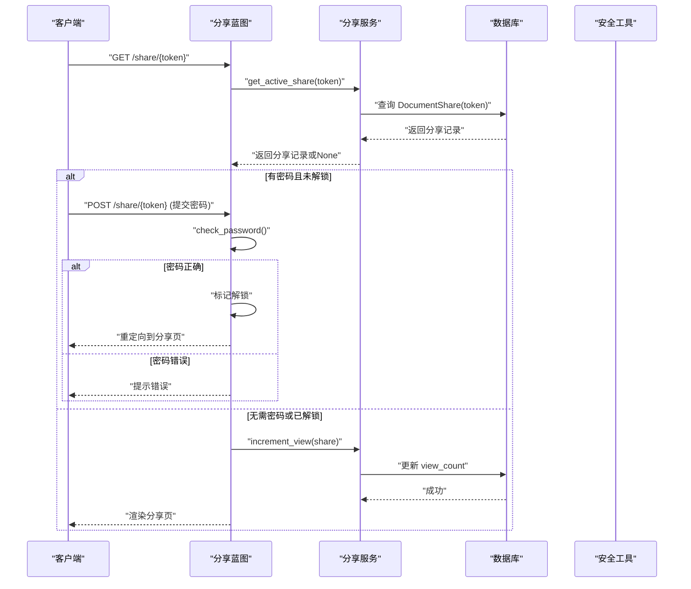
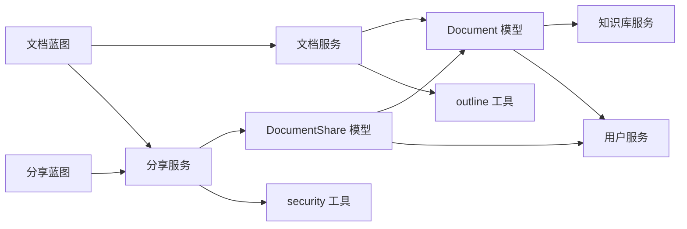

# 文档数据模型

<cite>
**本文引用的文件**
- [document.py](file://app/models/document.py)
- [knowledge_base.py](file://app/models/knowledge_base.py)
- [user.py](file://app/models/user.py)
- [doc_service.py](file://app/services/doc_service.py)
- [share_service.py](file://app/services/share_service.py)
- [doc.py](file://app/blueprints/doc.py)
- [share.py](file://app/blueprints/share.py)
- [security.py](file://app/utils/security.py)
- [outline.py](file://app/utils/outline.py)
- [extensions.py](file://app/extensions.py)
- [config.py](file://app/config.py)
</cite>

## 目录
1. [简介](#简介)
2. [项目结构](#项目结构)
3. [核心组件](#核心组件)
4. [架构总览](#架构总览)
5. [详细组件分析](#详细组件分析)
6. [依赖关系分析](#依赖关系分析)
7. [性能考量](#性能考量)
8. [故障排查指南](#故障排查指南)
9. [结论](#结论)
10. [附录：使用示例与最佳实践](#附录使用示例与最佳实践)

## 简介
本文件系统性梳理“文档数据模型”的设计与实现，重点覆盖以下方面：
- 模型与枚举：Document、DocumentShare、DocumentType、DocumentPrivacy 的字段定义与关系映射
- 文档树与父子关系：层级组织、排序规则、软删除策略
- 时间戳与索引：自动维护 created_at/updated_at、关键字段索引
- 关联关系：文档与知识库、用户的关系
- 分享机制：分享令牌生成、密码保护、有效期控制、访问计数
- 数据库约束与性能优化：外键级联、索引、查询路径
- 使用示例与最佳实践：如何正确创建、更新、删除、分享文档

## 项目结构
围绕文档模型的关键文件分布如下：
- 模型层：app/models/document.py、app/models/knowledge_base.py、app/models/user.py
- 服务层：app/services/doc_service.py、app/services/share_service.py
- 蓝图层：app/blueprints/doc.py、app/blueprints/share.py
- 工具层：app/utils/security.py、app/utils/outline.py
- 配置与扩展：app/config.py、app/extensions.py

图表来源
- [document.py:20-98](file://app/models/document.py#L20-L98)
- [knowledge_base.py:19-62](file://app/models/knowledge_base.py#L19-L62)
- [user.py:55-104](file://app/models/user.py#L55-L104)
- [doc_service.py:11-81](file://app/services/doc_service.py#L11-L81)
- [share_service.py:15-49](file://app/services/share_service.py#L15-L49)
- [doc.py:20-139](file://app/blueprints/doc.py#L20-L139)
- [share.py:22-42](file://app/blueprints/share.py#L22-L42)
- [security.py:5-7](file://app/utils/security.py#L5-L7)
- [outline.py:58-88](file://app/utils/outline.py#L58-L88)

章节来源
- [document.py:1-98](file://app/models/document.py#L1-L98)
- [knowledge_base.py:1-62](file://app/models/knowledge_base.py#L1-L62)
- [user.py:1-104](file://app/models/user.py#L1-L104)
- [doc_service.py:1-81](file://app/services/doc_service.py#L1-L81)
- [share_service.py:1-49](file://app/services/share_service.py#L1-L49)
- [doc.py:1-139](file://app/blueprints/doc.py#L1-L139)
- [share.py:1-42](file://app/blueprints/share.py#L1-L42)
- [security.py:1-8](file://app/utils/security.py#L1-L8)
- [outline.py:1-136](file://app/utils/outline.py#L1-L136)
- [extensions.py:1-17](file://app/extensions.py#L1-L17)
- [config.py:1-83](file://app/config.py#L1-L83)

## 核心组件
- 文档模型 Document
  - 字段：主键 id、所属知识库 kb_id、父节点 parent_id、标题 title、类型 type、隐私级别 privacy、Editor.js JSON 内容 content_json、纯文本 plain_text、排序字段 sort_order、软删除标志 is_deleted、作者 author_id、时间戳 created_at/updated_at
  - 关系：与知识库 KnowledgeBase 的一对多；与用户 User 的作者关系；自引用父子关系 children
  - 行为：can_be_shared 属性基于隐私级别判断是否允许分享
- 分享令牌模型 DocumentShare
  - 字段：主键 id、文档 doc_id、唯一令牌 token、密码哈希 password_hash、过期时间 expires_at、撤销标志 is_revoked、访问计数 view_count、创建者 created_by、时间戳 created_at
  - 关系：与 Document 的一对多（级联删除）；与 User 的创建者关系
  - 行为：set_password/check_password 密码设置与校验；has_password/is_expired/is_valid 属性组合判断有效性
- 枚举
  - DocumentType：DOC、SHEET
  - DocumentPrivacy：NORMAL（可分享）、PRIVATE（不可分享）
- 服务与蓝图
  - 文档服务：列表树形结构、创建、更新内容、软删除、收集后代
  - 分享服务：创建分享、撤销、获取有效分享、访问计数
  - 蓝图：文档路由（新建/查看/编辑/保存/删除/分享）、公开分享路由（密码解锁/展示）

章节来源
- [document.py:10-98](file://app/models/document.py#L10-L98)
- [doc_service.py:11-81](file://app/services/doc_service.py#L11-L81)
- [share_service.py:15-49](file://app/services/share_service.py#L15-L49)
- [doc.py:20-139](file://app/blueprints/doc.py#L20-L139)
- [share.py:22-42](file://app/blueprints/share.py#L22-L42)

## 架构总览
下图展示文档模型在系统中的位置与交互流程。

图表来源
- [document.py:20-98](file://app/models/document.py#L20-L98)
- [knowledge_base.py:19-62](file://app/models/knowledge_base.py#L19-L62)
- [user.py:55-104](file://app/models/user.py#L55-L104)

## 详细组件分析

### 文档模型 Document 设计
- 字段与约束
  - 主键与外键：kb_id 外键到知识库，parent_id 自引用外键到文档自身；author_id 外键到用户
  - 类型与隐私：type 默认为文档类型，privacy 默认为可分享
  - 内容：content_json 存储 Editor.js JSON，plain_text 存储纯文本用于检索/AI
  - 排序与软删除：sort_order 控制同级顺序，is_deleted 实现软删除
  - 时间戳：created_at 默认当前时间，updated_at 支持自动更新
- 关系映射
  - 与 KnowledgeBase：一对多，反向为 documents
  - 与 User（作者）：一对多，反向为 authored_docs
  - 自引用父子：parent 与 children，支持树形结构
- 行为特性
  - can_be_shared 基于隐私级别判断是否允许分享
- 查询与排序
  - 列表树形结构时按 parent_id 是否为空优先、sort_order 升序、id 升序排列

章节来源
- [document.py:20-53](file://app/models/document.py#L20-L53)
- [doc_service.py:11-35](file://app/services/doc_service.py#L11-L35)

### 分享令牌模型 DocumentShare 设计
- 字段与约束
  - token 唯一且带索引，便于快速查找
  - password_hash 可空，表示无密码保护
  - expires_at 可空，支持永久有效或带有效期
  - is_revoked 标记撤销状态
  - view_count 记录访问次数
  - created_by 外键到用户，记录创建者
- 行为特性
  - set_password/check_password：密码设置与校验
  - has_password：是否存在密码
  - is_expired：是否过期
  - is_valid：综合撤销与过期状态
- 与文档的关系
  - 一对多，删除文档时级联删除分享记录

章节来源
- [document.py:56-98](file://app/models/document.py#L56-L98)
- [share_service.py:15-49](file://app/services/share_service.py#L15-L49)

### 枚举设计
- DocumentType：DOC（文档）、SHEET（表格）
- DocumentPrivacy：NORMAL（常规，可分享）、PRIVATE（私密，不可分享）

章节来源
- [document.py:10-18](file://app/models/document.py#L10-L18)

### 父子关系与树形结构
- 父子关系通过 parent_id 指向自身主键，形成自引用外键
- 树形遍历采用广度优先收集后代，支持批量软删除
- 列表渲染时优先显示根节点（parent_id 为空），再按 sort_order 和 id 排序

图表来源
- [doc_service.py:11-35](file://app/services/doc_service.py#L11-L35)

章节来源
- [doc_service.py:11-35](file://app/services/doc_service.py#L11-L35)
- [doc_service.py:70-81](file://app/services/doc_service.py#L70-L81)

### 软删除机制
- 删除操作将 is_deleted 设为真，并递归标记所有后代为删除
- 查询默认过滤 is_deleted=False，确保不返回已删除文档
- 蓝图中对 404 的处理也包含 is_deleted 条件

章节来源
- [doc_service.py:65-68](file://app/services/doc_service.py#L65-L68)
- [doc_service.py:70-81](file://app/services/doc_service.py#L70-L81)
- [doc.py:13-17](file://app/blueprints/doc.py#L13-L17)

### 排序规则与时间戳管理
- 排序：parent_id 为空优先，sort_order 升序，id 升序
- 时间戳：created_at 默认当前时间，updated_at 在更新时自动更新
- 分享视图计数：每次有效访问增加 view_count

章节来源
- [doc_service.py:14-16](file://app/services/doc_service.py#L14-L16)
- [document.py:41-42](file://app/models/document.py#L41-L42)
- [document.py:67-68](file://app/models/document.py#L67-L68)
- [share_service.py:46-49](file://app/services/share_service.py#L46-L49)

### 文档与知识库、用户的关联
- 文档属于某个知识库（kb_id），并由作者（author_id）创建
- 知识库拥有多个文档，用户可拥有多个文档
- 分享记录属于某文档，创建者为某用户

章节来源
- [document.py:24-46](file://app/models/document.py#L24-L46)
- [knowledge_base.py:22-35](file://app/models/knowledge_base.py#L22-L35)
- [user.py:58-77](file://app/models/user.py#L58-L77)

### 分享令牌生成与验证机制
- 生成：服务层根据文档隐私级别与 TTL 创建分享记录，生成唯一 token 并可选设置密码
- 验证：公开分享蓝图对密码进行校验，校验成功后在会话中标记解锁
- 有效性：综合 is_revoked 与 is_expired 判断是否有效
- 访问统计：每次有效访问增加 view_count

图表来源
- [share.py:22-42](file://app/blueprints/share.py#L22-L42)
- [share_service.py:39-49](file://app/services/share_service.py#L39-L49)
- [security.py:5-7](file://app/utils/security.py#L5-L7)

章节来源
- [share_service.py:15-31](file://app/services/share_service.py#L15-L31)
- [share_service.py:39-49](file://app/services/share_service.py#L39-L49)
- [share.py:22-42](file://app/blueprints/share.py#L22-L42)
- [security.py:5-7](file://app/utils/security.py#L5-L7)

### 内容解析与纯文本提取
- 从 Editor.js JSON 中提取纯文本，用于搜索与 AI 消费
- 提供大纲提取（H1-H3）辅助导航

章节来源
- [outline.py:58-88](file://app/utils/outline.py#L58-L88)
- [outline.py:34-56](file://app/utils/outline.py#L34-L56)
- [doc_service.py:56-62](file://app/services/doc_service.py#L56-L62)

## 依赖关系分析
- 模型间依赖
  - Document 依赖 KnowledgeBase 与 User
  - DocumentShare 依赖 Document 与 User
- 服务层依赖
  - doc_service 依赖 Document、KnowledgeBase、DocumentType、DocumentPrivacy、outline 工具
  - share_service 依赖 Document、DocumentShare、DocumentPrivacy、security 工具
- 蓝图层依赖
  - doc 蓝图依赖 doc_service、share_service、kb_service、outline 工具
  - share 蓝图依赖 share_service、outline 工具

图表来源
- [document.py:20-98](file://app/models/document.py#L20-L98)
- [knowledge_base.py:19-62](file://app/models/knowledge_base.py#L19-L62)
- [user.py:55-104](file://app/models/user.py#L55-L104)
- [doc_service.py:11-81](file://app/services/doc_service.py#L11-L81)
- [share_service.py:15-49](file://app/services/share_service.py#L15-L49)
- [outline.py:58-88](file://app/utils/outline.py#L58-L88)
- [security.py:5-7](file://app/utils/security.py#L5-L7)
- [doc.py:20-139](file://app/blueprints/doc.py#L20-L139)
- [share.py:22-42](file://app/blueprints/share.py#L22-L42)

章节来源
- [doc_service.py:11-81](file://app/services/doc_service.py#L11-L81)
- [share_service.py:15-49](file://app/services/share_service.py#L15-L49)
- [doc.py:20-139](file://app/blueprints/doc.py#L20-L139)
- [share.py:22-42](file://app/blueprints/share.py#L22-L42)

## 性能考量
- 索引设计
  - 文档：kb_id、parent_id、privacy、is_deleted、author_id、created_at/updated_at
  - 分享：doc_id、token、created_by
  - 用户：username、email、is_super_admin
  - 知识库：owner_id、visibility、is_archived
- 查询路径
  - 列表树形结构：按 kb_id 过滤 + 非删除 + 排序（parent_id、sort_order、id）
  - 分享查询：按 token 查找 + 有效性判断
- 内容处理
  - 纯文本提取在更新时执行，避免重复计算
- 数据库连接池
  - 配置启用 pool_pre_ping 与 pool_recycle，提升连接稳定性

章节来源
- [document.py:24-42](file://app/models/document.py#L24-L42)
- [document.py:60-68](file://app/models/document.py#L60-L68)
- [user.py:58-70](file://app/models/user.py#L58-L70)
- [knowledge_base.py:22-33](file://app/models/knowledge_base.py#L22-L33)
- [doc_service.py:14-16](file://app/services/doc_service.py#L14-L16)
- [config.py:23-26](file://app/config.py#L23-L26)

## 故障排查指南
- 分享失败
  - 私密文档不可分享：检查文档隐私级别
  - 令牌无效或已撤销/过期：确认 token 与 is_valid
  - 密码错误：核对密码哈希与输入
- 文档访问 404
  - 文档不存在或已被软删除：确认 is_deleted 与存在性
- 删除异常
  - 未正确递归删除后代：确认 collect_descendants 与批量更新逻辑
- 内容解析问题
  - Editor.js JSON 格式异常：检查 parse_editor_blocks 与 JSON 结构

章节来源
- [share_service.py:17-18](file://app/services/share_service.py#L17-L18)
- [share_service.py:39-43](file://app/services/share_service.py#L39-L43)
- [share.py:24-26](file://app/blueprints/share.py#L24-L26)
- [doc.py:13-17](file://app/blueprints/doc.py#L13-L17)
- [doc_service.py:70-81](file://app/services/doc_service.py#L70-L81)
- [outline.py:22-32](file://app/utils/outline.py#L22-L32)

## 结论
文档数据模型通过清晰的枚举、严格的外键约束、合理的索引与排序策略，实现了灵活的树形文档组织与可靠的软删除机制。结合分享令牌的生成与验证流程，系统在保证安全性的同时提供了良好的用户体验。服务层与蓝图层的职责分离使得业务逻辑清晰可维护，配合内容解析工具提升了搜索与 AI 场景的可用性。

## 附录：使用示例与最佳实践
- 创建文档
  - 选择知识库与可编辑权限后，调用文档服务创建新文档，默认标题“未命名”，类型为文档，隐私为可分享
  - 参考路径：[doc_service.py:37-53](file://app/services/doc_service.py#L37-L53)
- 更新内容
  - 保存时自动提取纯文本，建议在前端提交 Editor.js JSON
  - 参考路径：[doc_service.py:56-62](file://app/services/doc_service.py#L56-L62)，[outline.py:58-88](file://app/utils/outline.py#L58-L88)
- 删除文档
  - 批量软删除，包含所有后代；确认权限与知识库可见性
  - 参考路径：[doc_service.py:65-68](file://app/services/doc_service.py#L65-L68)，[doc_service.py:70-81](file://app/services/doc_service.py#L70-L81)，[doc.py:87-101](file://app/blueprints/doc.py#L87-L101)
- 分享文档
  - 仅可分享的文档可生成分享；可设置密码与有效期；公开访问需通过密码解锁或直接访问
  - 参考路径：[share_service.py:15-31](file://app/services/share_service.py#L15-L31)，[share_service.py:39-49](file://app/services/share_service.py#L39-L49)，[share.py:22-42](file://app/blueprints/share.py#L22-L42)，[security.py:5-7](file://app/utils/security.py#L5-L7)
- 最佳实践
  - 为高频查询字段建立索引（如 kb_id、parent_id、privacy、is_deleted、token）
  - 合理设置排序字段 sort_order，避免频繁重排
  - 对大文本字段使用合适的数据库类型（如 LONGTEXT）以满足内容存储需求
  - 定期清理过期分享记录，降低存储压力
  - 在前端渲染树形结构时，优先加载非删除文档并按 parent_id/sort_order 排序