# 文档服务层

<cite>
**本文引用的文件**
- [app/services/doc_service.py](file://app/services/doc_service.py)
- [app/models/document.py](file://app/models/document.py)
- [app/services/share_service.py](file://app/services/share_service.py)
- [app/blueprints/doc.py](file://app/blueprints/doc.py)
- [app/blueprints/share.py](file://app/blueprints/share.py)
- [app/blueprints/kb.py](file://app/blueprints/kb.py)
- [app/utils/outline.py](file://app/utils/outline.py)
- [app/utils/security.py](file://app/utils/security.py)
- [app/models/knowledge_base.py](file://app/models/knowledge_base.py)
- [app/services/kb_service.py](file://app/services/kb_service.py)
- [app/extensions.py](file://app/extensions.py)
- [app/utils/ids.py](file://app/utils/ids.py)
- [app/templates/kb/detail.html](file://app/templates/kb/detail.html)
- [app/templates/doc/view.html](file://app/templates/doc/view.html)
- [app/static/js/app.js](file://app/static/js/app.js)
- [app/static/css/app.css](file://app/static/css/app.css)
</cite>

## 更新摘要
**变更内容**
- 新增文档分组服务功能：`list_kb_doc_tree` 重构为支持分组结构
- 新增 `list_kb_doc_flat` 兼容函数用于向后兼容
- 新增 `DocGroup` 模型支持文档分组管理
- 更新文档树结构与分组展示的实现逻辑
- 增强文档组织与管理功能
- **新增**：改进的分组管理界面和增强的拖拽排序体验
- **新增**：完整的前端拖拽交互实现，支持文档和分组的拖拽排序
- **新增**：实时排序更新的AJAX接口

## 目录
1. [简介](#简介)
2. [项目结构](#项目结构)
3. [核心组件](#核心组件)
4. [架构总览](#架构总览)
5. [详细组件分析](#详细组件分析)
6. [文档分组服务](#文档分组服务)
7. [分组UI交互优化](#分组ui交互优化)
8. [字符串ID处理机制](#字符串id处理机制)
9. [依赖关系分析](#依赖关系分析)
10. [性能考虑](#性能考虑)
11. [故障排除指南](#故障排除指南)
12. [结论](#结论)

## 简介
本文件聚焦于文档服务层的设计与实现，系统性阐述文档的创建、读取、更新、删除（CRUD）流程；解析 Editor.js JSON 内容到纯文本的提取机制及其在搜索与 AI 处理中的应用；梳理文档树结构的维护与排序规则；详述文档分享功能的令牌生成、密码验证、访问统计与过期控制；最后给出服务层的事务管理、错误处理与性能优化策略。

**重要变更**：文档服务层现已支持文档分组功能，`list_kb_doc_tree` 函数重构为返回分组结构，包含未分组文档和各分组下的文档树。同时新增 `list_kb_doc_flat` 函数提供向后兼容的平铺列表。**最新更新**：分组功能的UI交互得到显著优化，包括改进的分组管理界面和增强的拖拽排序体验，提供更加直观和流畅的文档组织体验。

## 项目结构
文档服务层位于应用的服务层与模型层之间，通过蓝图暴露接口，使用 SQLAlchemy 进行持久化，并借助工具模块完成内容解析与安全处理。所有ID现在为字符串类型，增强了系统的安全性和可扩展性。

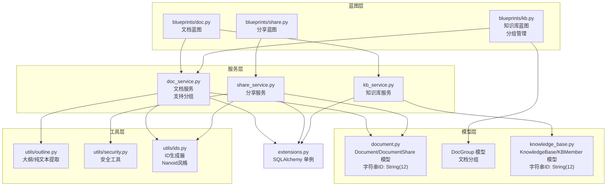

**图表来源**
- [app/services/doc_service.py:1-130](file://app/services/doc_service.py#L1-L130)
- [app/services/share_service.py:1-49](file://app/services/share_service.py#L1-L49)
- [app/services/kb_service.py:1-115](file://app/services/kb_service.py#L1-L115)
- [app/models/document.py:11-72](file://app/models/document.py#L11-L72)
- [app/blueprints/kb.py:173-242](file://app/blueprints/kb.py#L173-L242)

**章节来源**
- [app/services/doc_service.py:1-130](file://app/services/doc_service.py#L1-L130)
- [app/services/share_service.py:1-49](file://app/services/share_service.py#L1-L49)
- [app/services/kb_service.py:1-115](file://app/services/kb_service.py#L1-L115)
- [app/models/document.py:11-72](file://app/models/document.py#L11-L72)
- [app/blueprints/kb.py:173-242](file://app/blueprints/kb.py#L173-L242)

## 核心组件
- **文档服务**：负责文档树构建、文档创建、内容更新、软删除及后代收集等，支持分组结构的文档树返回。所有ID参数现为字符串类型。
- **分享服务**：负责分享令牌生成、密码设置与校验、有效期控制、访问计数，支持字符串ID的分享管理。
- **知识库服务**：负责知识库访问权限判定与成员角色管理，统一处理字符串ID。
- **模型层**：定义文档与分享实体、枚举类型与外键约束，新增 DocGroup 模型支持文档分组，全部使用字符串ID。
- **工具层**：提供 Editor.js JSON 到纯文本与大纲的提取能力，以及安全令牌生成。

**章节来源**
- [app/services/doc_service.py:11-130](file://app/services/doc_service.py#L11-L130)
- [app/services/share_service.py:15-49](file://app/services/share_service.py#L15-L49)
- [app/services/kb_service.py:10-115](file://app/services/kb_service.py#L10-L115)
- [app/models/document.py:11-72](file://app/models/document.py#L11-L72)
- [app/utils/outline.py:22-136](file://app/utils/outline.py#L22-L136)

## 架构总览
文档服务层采用分层设计，所有ID现在为字符串类型，提供更好的安全性：
- 蓝图层接收请求，调用服务层进行业务处理，参数类型统一为字符串。
- 服务层协调模型层与工具层，执行数据持久化与内容转换。
- 模型层通过 SQLAlchemy 定义实体关系与索引，使用字符串ID主键，新增 DocGroup 支持文档分组。
- 工具层提供内容解析与安全辅助，包括ID生成器。

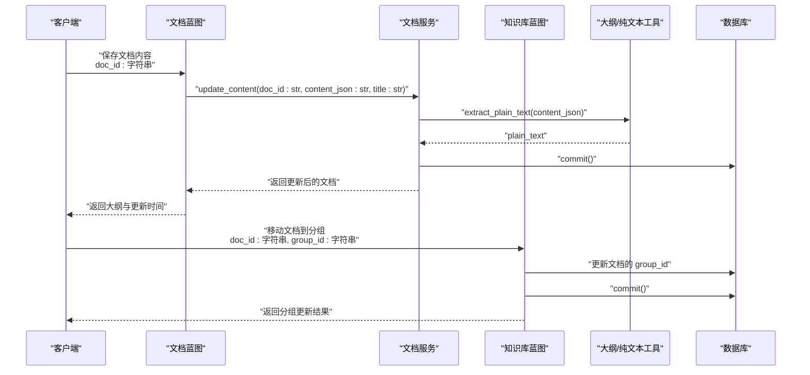

**图表来源**
- [app/blueprints/doc.py:111-135](file://app/blueprints/doc.py#L111-L135)
- [app/blueprints/kb.py:220-241](file://app/blueprints/kb.py#L220-L241)
- [app/services/doc_service.py:105-111](file://app/services/doc_service.py#L105-L111)
- [app/utils/outline.py:58-87](file://app/utils/outline.py#L58-L87)

## 详细组件分析

### 文档树结构与排序规则
- **文档树构建**：按父节点分组，优先显示根节点，再按 sort_order 升序、id 升序排列，递归生成嵌套列表。所有ID现在为字符串类型。
- **排序规则**：根节点优先，随后按 sort_order 升序，最后按 id 升序保证稳定排序。
- **父子关系**：支持多级嵌套，后代收集用于批量软删除，使用字符串ID进行关联。

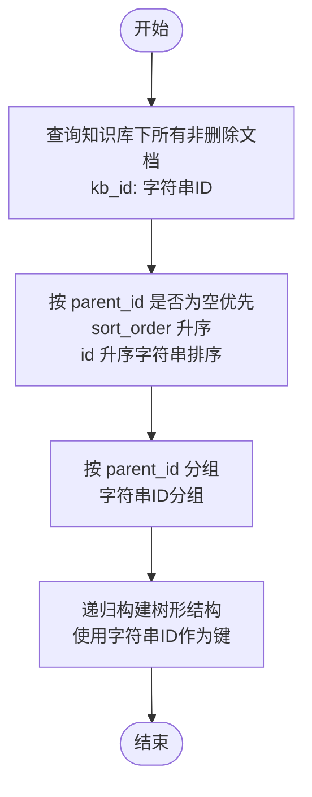

**图表来源**
- [app/services/doc_service.py:42-58](file://app/services/doc_service.py#L42-L58)

**章节来源**
- [app/services/doc_service.py:42-58](file://app/services/doc_service.py#L42-L58)

### 文档 CRUD 流程
- **创建**：填充基础字段，初始化空内容与纯文本，分配默认排序值，提交事务。所有ID参数为字符串类型。
- **更新**：可选更新标题，写入 Editor.js JSON，同步生成纯文本，提交事务。
- **删除**：软删除当前文档及其所有后代，提交事务。

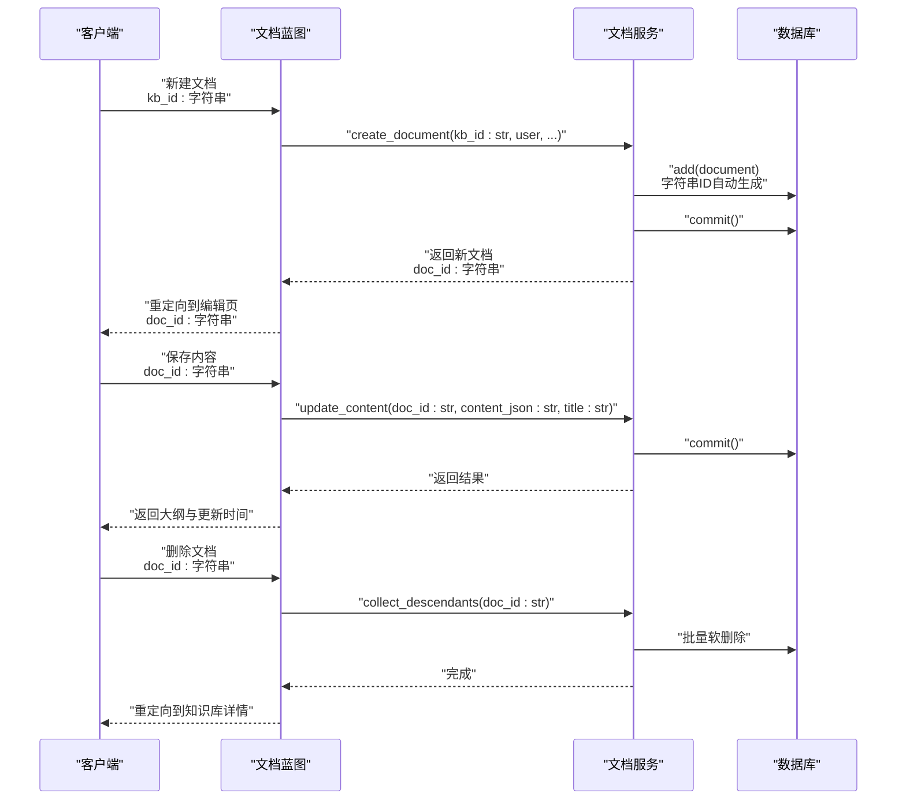

**图表来源**
- [app/blueprints/doc.py:20-41](file://app/blueprints/doc.py#L20-L41)
- [app/blueprints/doc.py:111-151](file://app/blueprints/doc.py#L111-L151)
- [app/services/doc_service.py:84-111](file://app/services/doc_service.py#L84-L111)
- [app/services/doc_service.py:119-129](file://app/services/doc_service.py#L119-L129)

**章节来源**
- [app/blueprints/doc.py:20-41](file://app/blueprints/doc.py#L20-L41)
- [app/blueprints/doc.py:111-151](file://app/blueprints/doc.py#L111-L151)
- [app/services/doc_service.py:84-111](file://app/services/doc_service.py#L84-L111)
- [app/services/doc_service.py:119-129](file://app/services/doc_service.py#L119-L129)

### 文档内容 JSON 存储与纯文本提取
- **Editor.js JSON 结构**：服务层通过工具模块解析 blocks 数组，提取标题、段落、列表、表格、代码块、图片等元素。
- **纯文本提取**：剥离 HTML 标签，保留正文、列表项、表格行、代码片段与图片说明，便于全文检索与 AI 消费。
- **大纲提取**：仅提取 H1-H3 标题，生成锚点与层级信息，供前端目录导航使用。

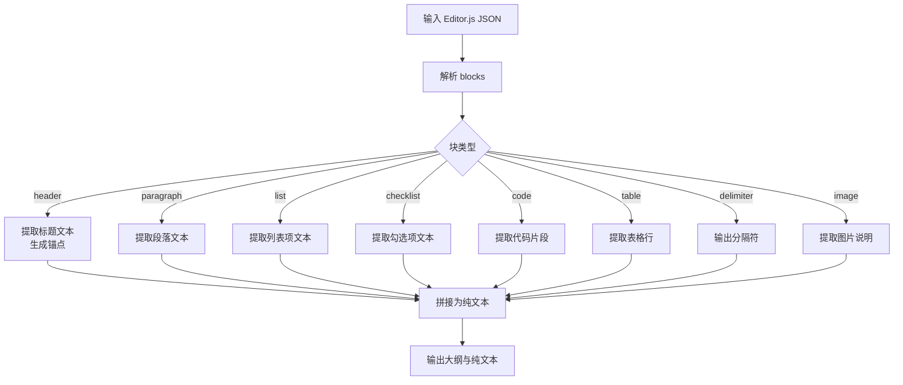

**图表来源**
- [app/utils/outline.py:22-136](file://app/utils/outline.py#L22-L136)
- [app/services/doc_service.py:105-111](file://app/services/doc_service.py#L105-L111)

**章节来源**
- [app/utils/outline.py:22-136](file://app/utils/outline.py#L22-L136)
- [app/services/doc_service.py:105-111](file://app/services/doc_service.py#L105-L111)

### 文档分享功能
- **令牌生成**：使用安全随机字符串生成唯一令牌，支持可选过期时间。
- **密码验证**：可选设置密码，使用哈希存储；访问时进行密码校验。
- **访问统计**：每次有效访问增加计数。
- **过期处理**：根据当前时间判断是否过期，无效分享不可访问。
- **前端交互**：支持密码输入页面与会话标记，避免重复输入。

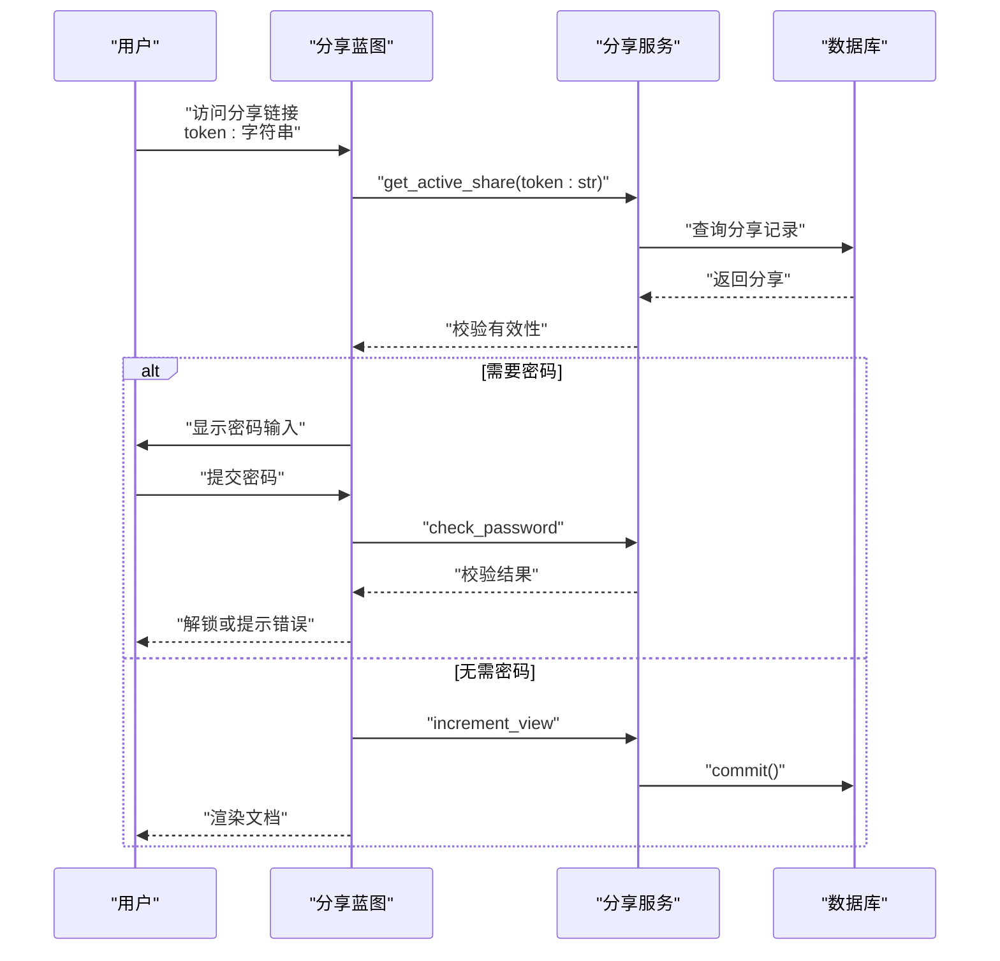

**图表来源**
- [app/blueprints/share.py:22-42](file://app/blueprints/share.py#L22-L42)
- [app/services/share_service.py:15-49](file://app/services/share_service.py#L15-L49)
- [app/models/document.py:75-117](file://app/models/document.py#L75-L117)

**章节来源**
- [app/blueprints/share.py:22-42](file://app/blueprints/share.py#L22-L42)
- [app/services/share_service.py:15-49](file://app/services/share_service.py#L15-L49)
- [app/models/document.py:75-117](file://app/models/document.py#L75-L117)

### 权限与可见性控制
- **知识库访问**：公开知识库任意访问；成员可见需加入成员；私有仅限拥有者。
- **编辑权限**：超级管理员、拥有者或成员角色为编辑者可编辑。
- **管理权限**：仅拥有者可邀请成员、变更可见性与删除知识库。
- **文档隐私**：仅常规隐私文档可分享，私密文档不可分享。

**章节来源**
- [app/services/kb_service.py:10-115](file://app/services/kb_service.py#L10-L115)
- [app/models/document.py:67-69](file://app/models/document.py#L67-L69)

## 文档分组服务

### 分组模型与关系
系统新增 DocGroup 模型支持文档分组功能：
- **DocGroup 模型**：定义文档分组的基本属性，包括名称、排序和创建时间
- **外键关系**：DocGroup 与 KnowledgeBase 一对多关系，文档通过 group_id 关联到分组
- **索引优化**：kb_id 和 sort_order 字段建立索引，支持高效的分组查询和排序

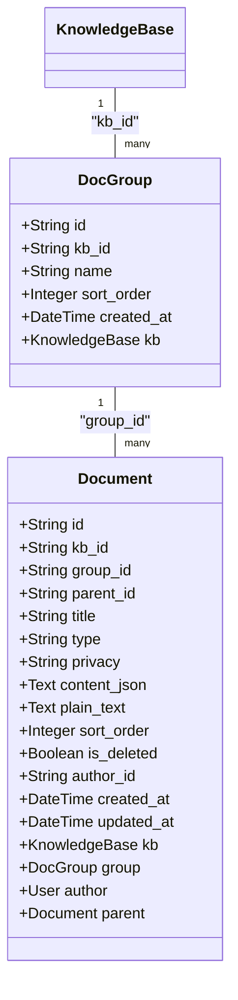

**图表来源**
- [app/models/document.py:11-24](file://app/models/document.py#L11-L24)
- [app/models/document.py:37-72](file://app/models/document.py#L37-L72)

### 分组文档树构建
`list_kb_doc_tree` 函数重构为支持分组结构，返回包含分组信息的文档树：
- **分组桶构建**：按分组ID分组文档，未分组文档使用 None 作为键
- **树形结构**：为每个分组构建独立的文档树，包含未分组文档和各分组文档
- **返回格式**：数组格式，每个元素包含分组信息和文档列表

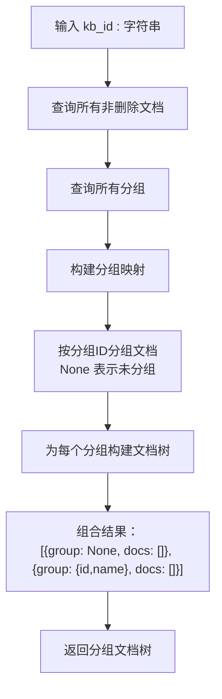

**图表来源**
- [app/services/doc_service.py:11-72](file://app/services/doc_service.py#L11-L72)

### 分组管理功能
知识库蓝图提供完整的分组管理接口：
- **创建分组**：支持表单和JSON两种提交方式，自动计算排序顺序
- **重命名分组**：动态修改分组名称
- **删除分组**：删除分组并将文档移回未分组
- **移动文档**：支持拖拽和表单提交方式移动文档到指定分组

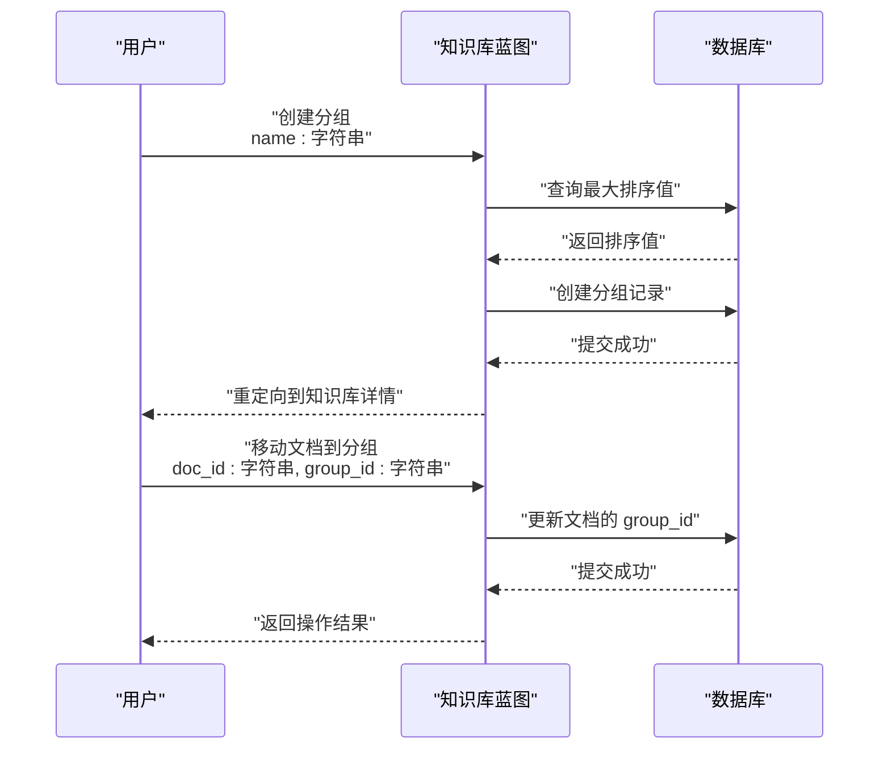

**图表来源**
- [app/blueprints/kb.py:175-187](file://app/blueprints/kb.py#L175-L187)
- [app/blueprints/kb.py:220-241](file://app/blueprints/kb.py#L220-L241)

### 向后兼容性
新增 `list_kb_doc_flat` 函数确保与现有代码的兼容性：
- **功能**：返回知识库下所有非删除文档的平铺列表
- **用途**：为旧版本代码和第三方集成提供兼容接口
- **性能**：直接查询数据库，无需复杂的分组和树形结构构建

**章节来源**
- [app/models/document.py:11-24](file://app/models/document.py#L11-L24)
- [app/services/doc_service.py:11-72](file://app/services/doc_service.py#L11-L72)
- [app/services/doc_service.py:75-81](file://app/services/doc_service.py#L75-L81)
- [app/blueprints/kb.py:173-242](file://app/blueprints/kb.py#L173-L242)

## 分组UI交互优化

### 拖拽排序功能
系统提供了完整的拖拽排序体验，支持文档和分组的拖拽操作：

#### 文档拖拽排序
- **拖拽源**：文档树中的每个文档项都可以拖拽
- **拖拽目标**：支持在同一分组内排序，也支持跨分组移动
- **视觉反馈**：拖拽时显示半透明效果，悬停区域高亮显示
- **实时更新**：拖拽完成后立即通过AJAX接口更新排序

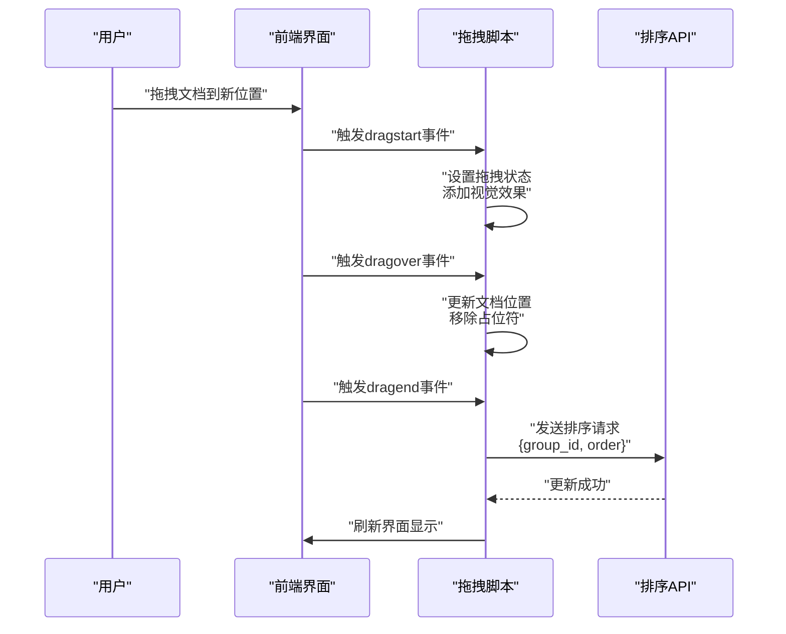

**图表来源**
- [app/templates/kb/detail.html:197-226](file://app/templates/kb/detail.html#L197-L226)
- [app/templates/kb/detail.html:309-318](file://app/templates/kb/detail.html#L309-L318)

#### 分组拖拽排序
- **分组拖拽**：分组标题区域支持拖拽重新排序
- **分组移动**：文档可以拖拽到分组标题区域进行分组移动
- **占位符系统**：空分组显示"（空）"提示，拖拽区域高亮显示

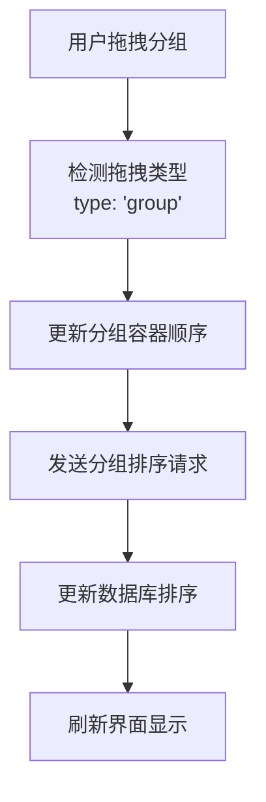

**图表来源**
- [app/templates/kb/detail.html:320-380](file://app/templates/kb/detail.html#L320-L380)

### 前端交互实现
系统采用Alpine.js和原生JavaScript实现响应式交互：

#### Alpine.js集成
- **展开/折叠**：使用 `x-data` 和 `x-show` 控制分组展开状态
- **编辑模式**：分组名称支持直接编辑，点击编辑按钮切换模式
- **条件显示**：根据用户权限动态显示操作按钮

#### CSS样式优化
- **拖拽视觉效果**：`.drag-ghost` 类提供半透明拖拽效果
- **悬停反馈**：`.drag-over-zone` 类高亮拖拽目标区域
- **分组样式**：分组标题区域显示编辑和删除按钮

**章节来源**
- [app/templates/kb/detail.html:96-147](file://app/templates/kb/detail.html#L96-L147)
- [app/templates/kb/detail.html:197-380](file://app/templates/kb/detail.html#L197-L380)
- [app/static/css/app.css:27-35](file://app/static/css/app.css#L27-L35)

### AJAX接口支持
系统提供专门的AJAX接口支持实时排序更新：

#### 文档排序接口
- **端点**：`/kb/<kb_id>/sort-docs`
- **请求格式**：JSON对象包含 `group_id` 和 `order` 数组
- **响应格式**：JSON对象包含 `ok` 状态

#### 分组排序接口
- **端点**：`/kb/<kb_id>/sort-groups`
- **请求格式**：JSON对象包含 `order` 数组
- **响应格式**：JSON对象包含 `ok` 状态

**章节来源**
- [app/blueprints/kb.py:246-291](file://app/blueprints/kb.py#L246-L291)

## 字符串ID处理机制

### ID生成与安全性
系统采用Nanoid风格的字符串ID生成器，提供以下特性：
- **长度**：12字符，碰撞概率极低（约5.8e20）
- **字符集**：去除易混淆字符（0/O/1/l/I），使用56个安全字符
- **生成方式**：基于secrets模块的安全随机数生成
- **URL友好**：不含特殊字符，适合URL和数据库使用

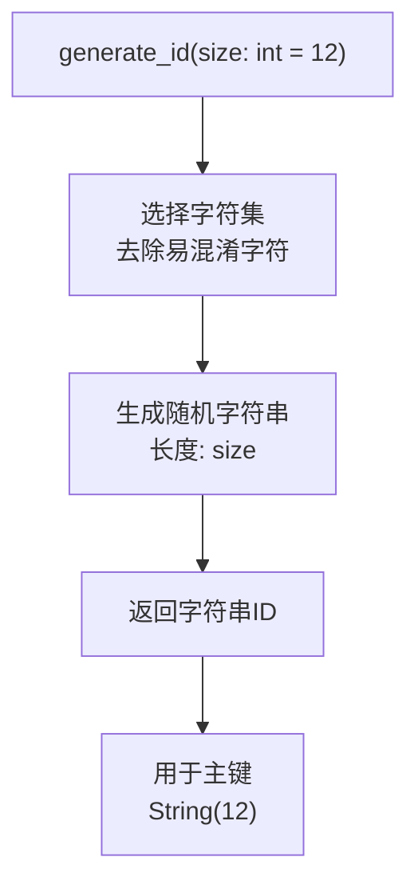

**图表来源**
- [app/utils/ids.py:14-21](file://app/utils/ids.py#L14-L21)

### ID类型转换与验证
- **类型声明**：所有服务层函数参数明确标注为字符串类型
- **空值处理**：支持None值表示无父节点或未分组
- **验证机制**：蓝图层确保传入正确的字符串ID格式
- **兼容性**：与前端模板和URL路由完全兼容

**章节来源**
- [app/utils/ids.py:14-21](file://app/utils/ids.py#L14-L21)
- [app/services/doc_service.py:11-81](file://app/services/doc_service.py#L11-L81)
- [app/services/share_service.py:15-31](file://app/services/share_service.py#L15-L31)

## 依赖关系分析
- 服务层依赖模型层与工具层，通过 SQLAlchemy 单例进行数据库操作，所有ID参数为字符串类型。
- 蓝图层依赖服务层与模型层，负责路由与权限校验，确保传入正确的字符串ID。
- 分享蓝图依赖分享服务与工具层，处理密码保护与会话状态。
- 知识库蓝图依赖文档服务和分组模型，提供完整的文档组织管理功能。

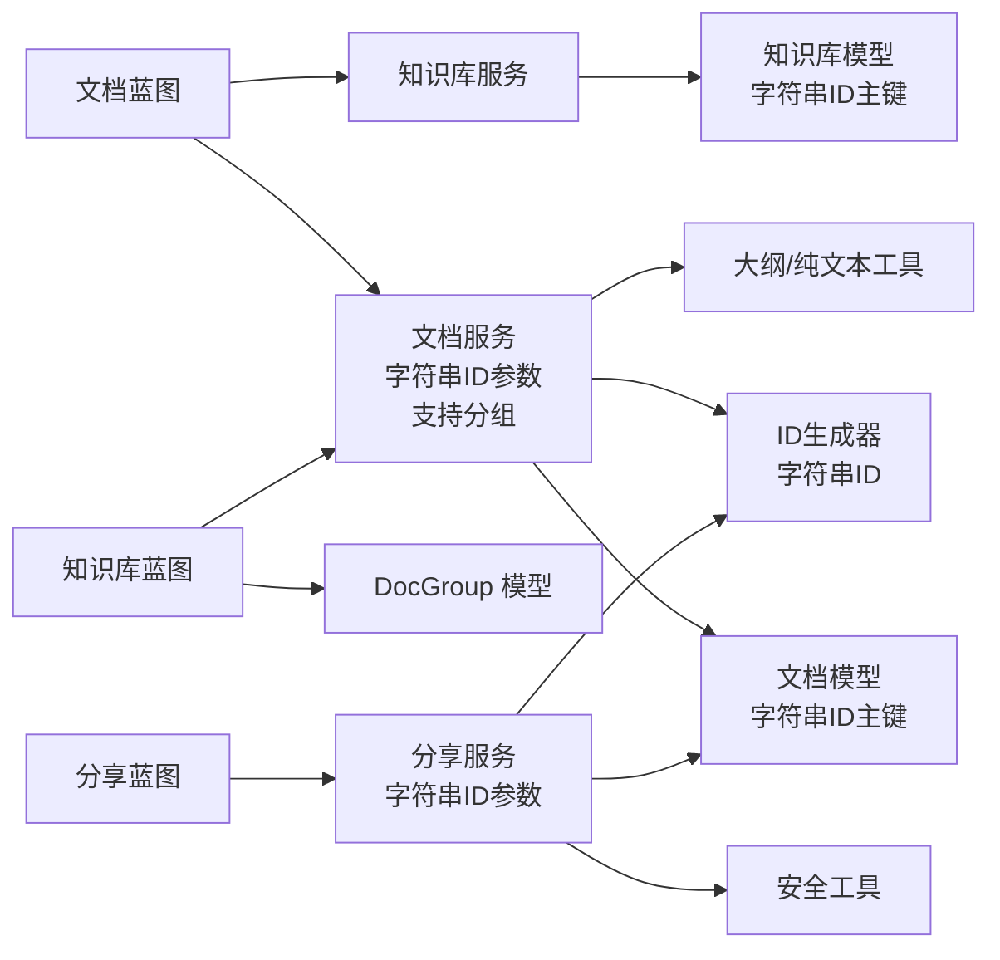

**图表来源**
- [app/blueprints/doc.py:1-190](file://app/blueprints/doc.py#L1-L190)
- [app/blueprints/share.py:1-42](file://app/blueprints/share.py#L1-L42)
- [app/blueprints/kb.py:173-242](file://app/blueprints/kb.py#L173-L242)
- [app/services/doc_service.py:1-130](file://app/services/doc_service.py#L1-L130)
- [app/services/share_service.py:1-49](file://app/services/share_service.py#L1-L49)
- [app/models/document.py:11-72](file://app/models/document.py#L11-L72)
- [app/utils/outline.py:1-136](file://app/utils/outline.py#L1-L136)
- [app/utils/security.py:1-8](file://app/utils/security.py#L1-L8)
- [app/utils/ids.py:14-21](file://app/utils/ids.py#L14-L21)
- [app/extensions.py:1-17](file://app/extensions.py#L1-L17)

**章节来源**
- [app/blueprints/doc.py:1-190](file://app/blueprints/doc.py#L1-L190)
- [app/blueprints/share.py:1-42](file://app/blueprints/share.py#L1-L42)
- [app/blueprints/kb.py:173-242](file://app/blueprints/kb.py#L173-L242)
- [app/services/doc_service.py:1-130](file://app/services/doc_service.py#L1-L130)
- [app/services/share_service.py:1-49](file://app/services/share_service.py#L1-L49)
- [app/models/document.py:11-72](file://app/models/document.py#L11-L72)
- [app/utils/outline.py:1-136](file://app/utils/outline.py#L1-L136)
- [app/utils/security.py:1-8](file://app/utils/security.py#L1-L8)
- [app/utils/ids.py:14-21](file://app/utils/ids.py#L14-L21)
- [app/extensions.py:1-17](file://app/extensions.py#L1-L17)

## 性能考虑
- **查询优化**
  - 文档树查询：按 kb_id 与 is_deleted 索引过滤，排序字段包含 parent_id、sort_order、id，确保高效分组与排序。
  - 分享查询：按 token 唯一索引快速定位，同时检查 is_revoked 与 expires_at。
  - 字符串ID比较：MySQL对字符串ID的比较性能良好，但建议使用固定长度12字符以优化索引。
  - 分组查询：DocGroup 按 kb_id 和 sort_order 建立索引，支持高效的分组排序和查询。
- **内存与算法**
  - 文档树构建：使用字典分组与递归，时间复杂度 O(n)，空间复杂度 O(n)。
  - 后代收集：广度优先遍历，时间复杂度 O(n)，适合小到中等规模树。
  - 分组桶构建：按分组ID分组文档，时间复杂度 O(n)，空间复杂度 O(n)。
- **数据库事务**
  - 所有写操作均在单事务内提交，避免部分更新导致的数据不一致。
- **内容处理**
  - 纯文本与大纲提取在服务层完成，减少前端负担；对大文档建议分块处理或异步任务队列。
- **前端性能**
  - 拖拽操作使用事件委托，避免过多DOM绑定。
  - AJAX请求采用防抖机制，避免频繁网络请求。

## 故障排除指南
- **分享失败**
  - 症状：无法访问分享链接或提示无效。
  - 排查：确认分享记录存在且未撤销、未过期；若设置了密码，确认密码正确；检查会话状态。
- **私密文档不可分享**
  - 症状：尝试分享私密文档时报错。
  - 排查：将文档隐私级别调整为常规后重试。
- **删除异常**
  - 症状：删除文档后仍可见或影响其他文档。
  - 排查：确认后代收集逻辑已覆盖所有子节点；检查 is_deleted 字段是否正确更新。
- **内容更新无效**
  - 症状：保存后标题或内容未更新。
  - 排查：确认传入 JSON 正确；检查纯文本提取是否成功；查看数据库提交是否成功。
- **ID相关问题**
  - 症状：字符串ID格式错误或长度不符。
  - 排查：确认使用系统自动生成的12字符ID；检查URL路由参数传递；验证蓝图层的ID验证逻辑。
- **分组功能异常**
  - 症状：分组创建、重命名或删除失败。
  - 排查：确认用户具有编辑权限；检查分组名称是否为空；验证分组ID有效性；查看数据库事务是否正常提交。
- **文档移动失败**
  - 症状：移动文档到分组时失败。
  - 排查：确认目标分组存在且属于同一知识库；检查文档ID有效性；验证用户权限。
- **拖拽排序失效**
  - 症状：拖拽文档或分组后排序未更新。
  - 排查：检查浏览器控制台是否有JavaScript错误；确认AJAX请求是否成功；验证CSRF令牌是否正确。
- **分组界面显示异常**
  - 症状：分组列表显示不正确或操作按钮不出现。
  - 排查：确认Alpine.js正确加载；检查用户权限；验证分组数据是否正确。

**章节来源**
- [app/services/share_service.py:15-49](file://app/services/share_service.py#L15-L49)
- [app/models/document.py:75-117](file://app/models/document.py#L75-L117)
- [app/services/doc_service.py:119-129](file://app/services/doc_service.py#L119-L129)
- [app/blueprints/share.py:22-42](file://app/blueprints/share.py#L22-L42)
- [app/utils/ids.py:14-21](file://app/utils/ids.py#L14-L21)
- [app/blueprints/kb.py:175-241](file://app/blueprints/kb.py#L175-L241)
- [app/templates/kb/detail.html:197-380](file://app/templates/kb/detail.html#L197-L380)

## 结论
文档服务层以清晰的分层架构实现了文档生命周期管理、内容解析与分享控制。通过采用字符串ID（12字符随机字符串）替代传统整数ID，系统获得了更好的安全性、可读性和URL友好性。新增的文档分组功能进一步增强了文档组织能力，支持更灵活的知识库管理。

**最新优化**：分组功能的UI交互得到了显著改进，包括改进的分组管理界面和增强的拖拽排序体验。用户现在可以通过直观的拖拽操作来重新组织文档和分组，系统提供了实时的视觉反馈和即时的排序更新。完整的AJAX接口支持确保了操作的流畅性和可靠性。

合理的索引与排序策略、严格的权限控制与事务管理，保障了数据一致性与用户体验。通过 `list_kb_doc_tree` 的分组结构和 `list_kb_doc_flat` 的向后兼容性，系统在功能增强的同时保持了良好的兼容性。

未来可在大文档场景引入异步处理与缓存策略，进一步提升性能与可扩展性。分组功能的完善将为知识库的规模化管理提供更好的支持。拖拽排序功能的成功实现为其他类似的功能模块提供了可复用的交互模式和最佳实践。

**重要提醒**：所有服务层函数现在要求字符串类型的ID参数，确保与新的模型设计保持一致。蓝图层已内置相应的类型验证和转换逻辑，开发者只需关注业务逻辑的实现。新增的分组功能通过 `list_kb_doc_tree` 提供了更丰富的文档组织视图，而 `list_kb_doc_flat` 保持了向后兼容性。拖拽排序功能的完整实现为用户提供了更加直观和高效的文档管理体验。