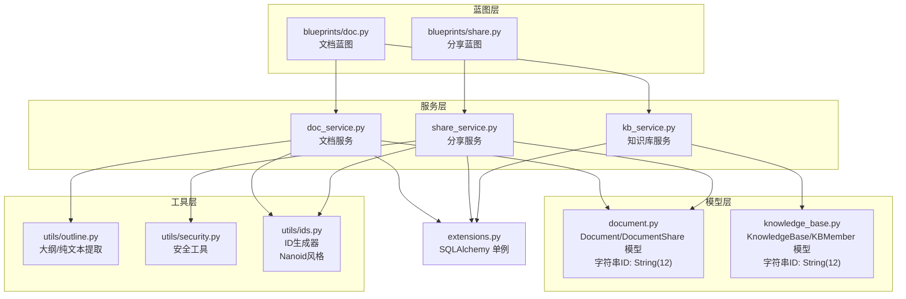
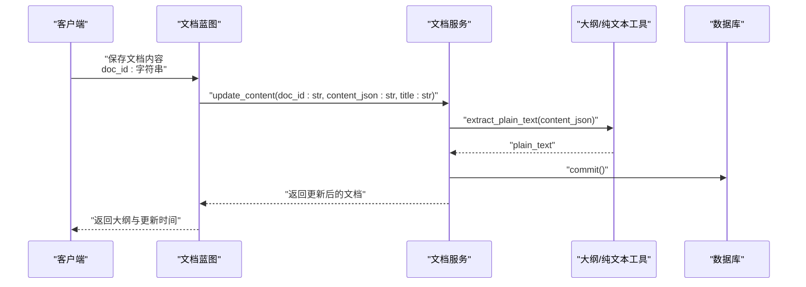
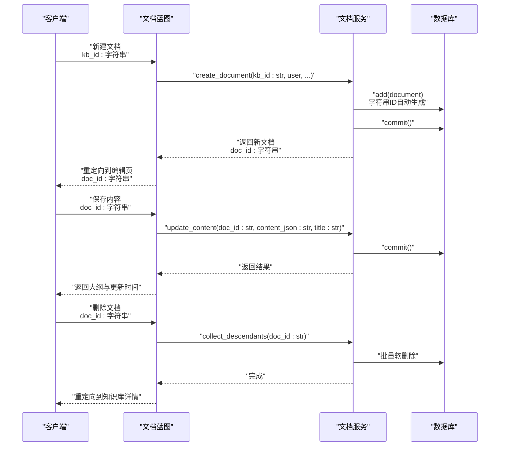
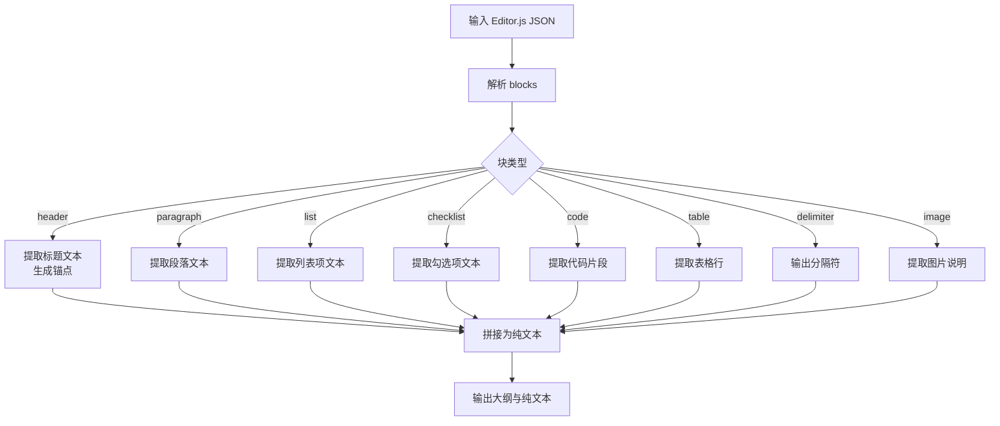
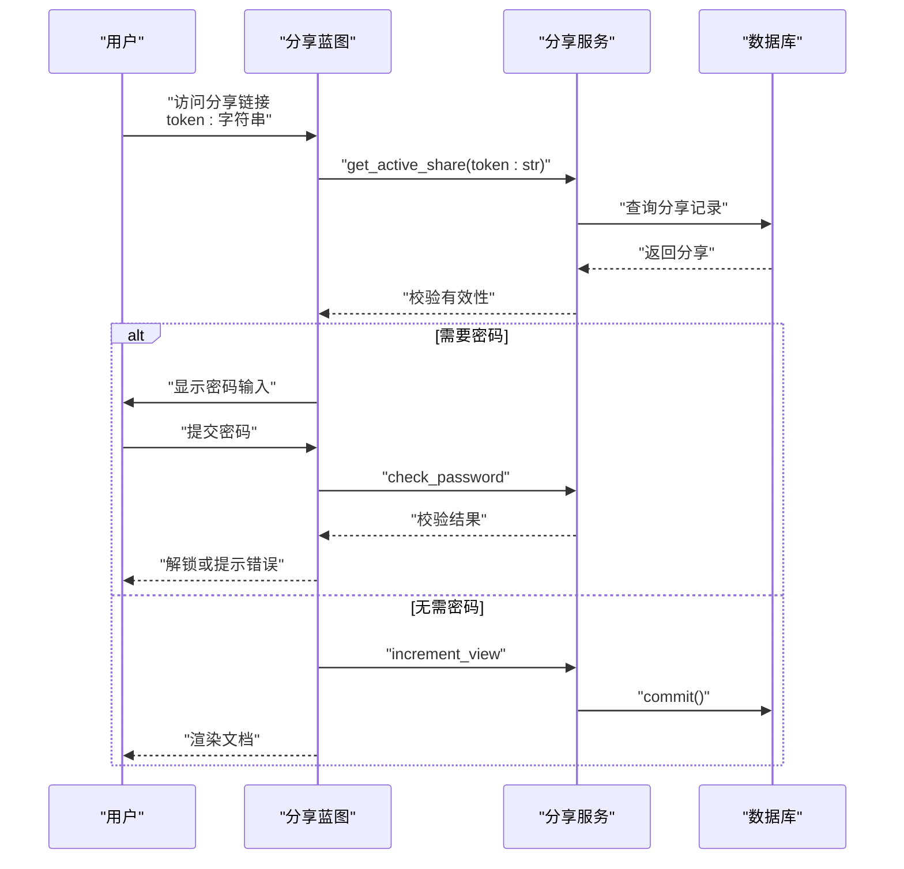
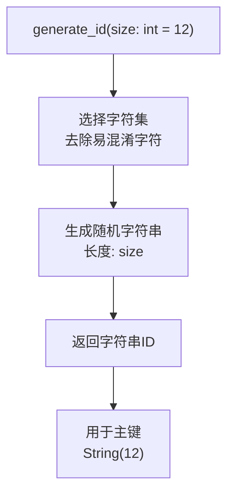
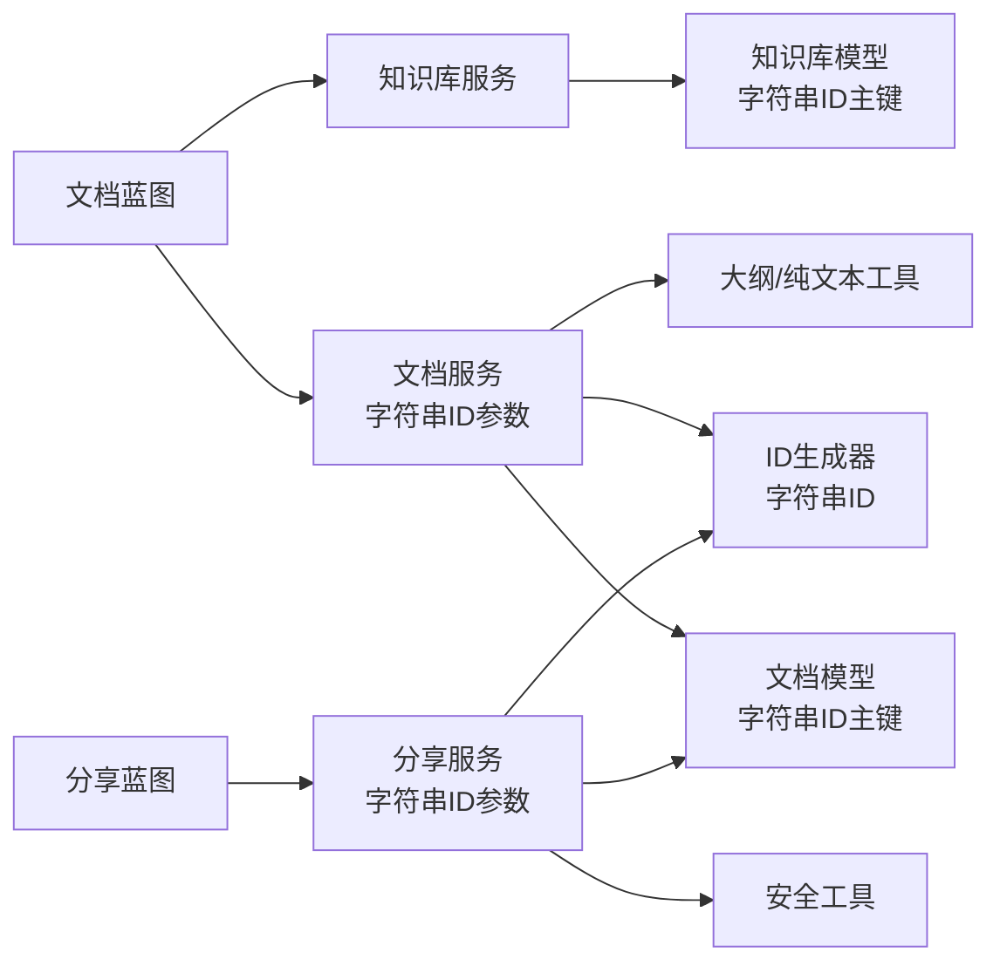

# 文档服务层

<cite>
**本文引用的文件**
- [app/services/doc_service.py](file://app/services/doc_service.py)
- [app/models/document.py](file://app/models/document.py)
- [app/services/share_service.py](file://app/services/share_service.py)
- [app/blueprints/doc.py](file://app/blueprints/doc.py)
- [app/blueprints/share.py](file://app/blueprints/share.py)
- [app/utils/outline.py](file://app/utils/outline.py)
- [app/utils/security.py](file://app/utils/security.py)
- [app/models/knowledge_base.py](file://app/models/knowledge_base.py)
- [app/services/kb_service.py](file://app/services/kb_service.py)
- [app/extensions.py](file://app/extensions.py)
- [app/utils/ids.py](file://app/utils/ids.py)
</cite>

## 更新摘要
**变更内容**
- 更新文档服务层函数参数类型，从整数ID改为字符串ID
- 新增字符串ID处理的详细说明和最佳实践
- 补充ID生成机制和安全性说明
- 更新相关架构图和代码示例

## 目录
1. [简介](#简介)
2. [项目结构](#项目结构)
3. [核心组件](#核心组件)
4. [架构总览](#架构总览)
5. [详细组件分析](#详细组件分析)
6. [字符串ID处理机制](#字符串id处理机制)
7. [依赖关系分析](#依赖关系分析)
8. [性能考虑](#性能考虑)
9. [故障排除指南](#故障排除指南)
10. [结论](#结论)

## 简介
本文件聚焦于文档服务层的设计与实现，系统性阐述文档的创建、读取、更新、删除（CRUD）流程；解析 Editor.js JSON 内容到纯文本的提取机制及其在搜索与 AI 处理中的应用；梳理文档树结构的维护与排序规则；详述文档分享功能的令牌生成、密码验证、访问统计与过期控制；最后给出服务层的事务管理、错误处理与性能优化策略。

**重要变更**：文档和知识库模型现已采用字符串ID（12字符随机字符串），替代传统的整数ID，提供更好的安全性、可读性和URL友好性。

## 项目结构
文档服务层位于应用的服务层与模型层之间，通过蓝图暴露接口，使用 SQLAlchemy 进行持久化，并借助工具模块完成内容解析与安全处理。所有ID现在为字符串类型，增强了系统的安全性和可扩展性。

**图表来源**
- [app/services/doc_service.py:1-81](file://app/services/doc_service.py#L1-L81)
- [app/services/share_service.py:1-49](file://app/services/share_service.py#L1-L49)
- [app/services/kb_service.py:1-115](file://app/services/kb_service.py#L1-L115)
- [app/models/document.py:24-26](file://app/models/document.py#L24-L26)
- [app/models/knowledge_base.py:25-26](file://app/models/knowledge_base.py#L25-L26)
- [app/utils/ids.py:14-21](file://app/utils/ids.py#L14-L21)

**章节来源**
- [app/services/doc_service.py:1-81](file://app/services/doc_service.py#L1-L81)
- [app/services/share_service.py:1-49](file://app/services/share_service.py#L1-L49)
- [app/services/kb_service.py:1-115](file://app/services/kb_service.py#L1-L115)
- [app/models/document.py:24-26](file://app/models/document.py#L24-L26)
- [app/models/knowledge_base.py:25-26](file://app/models/knowledge_base.py#L25-L26)
- [app/utils/ids.py:14-21](file://app/utils/ids.py#L14-L21)

## 核心组件
- **文档服务**：负责文档树构建、文档创建、内容更新、软删除及后代收集等，所有ID参数现为字符串类型。
- **分享服务**：负责分享令牌生成、密码设置与校验、有效期控制、访问计数，支持字符串ID的分享管理。
- **知识库服务**：负责知识库访问权限判定与成员角色管理，统一处理字符串ID。
- **模型层**：定义文档与分享实体、枚举类型与外键约束，全部使用字符串ID。
- **工具层**：提供 Editor.js JSON 到纯文本与大纲的提取能力，以及安全令牌生成。

**章节来源**
- [app/services/doc_service.py:11-81](file://app/services/doc_service.py#L11-L81)
- [app/services/share_service.py:15-49](file://app/services/share_service.py#L15-L49)
- [app/services/kb_service.py:10-115](file://app/services/kb_service.py#L10-L115)
- [app/models/document.py:21-99](file://app/models/document.py#L21-L99)
- [app/utils/outline.py:22-136](file://app/utils/outline.py#L22-L136)

## 架构总览
文档服务层采用分层设计，所有ID现在为字符串类型，提供更好的安全性：
- 蓝图层接收请求，调用服务层进行业务处理，参数类型统一为字符串。
- 服务层协调模型层与工具层，执行数据持久化与内容转换。
- 模型层通过 SQLAlchemy 定义实体关系与索引，使用字符串ID主键。
- 工具层提供内容解析与安全辅助，包括ID生成器。

**图表来源**
- [app/blueprints/doc.py:72-87](file://app/blueprints/doc.py#L72-L87)
- [app/services/doc_service.py:56-62](file://app/services/doc_service.py#L56-L62)
- [app/utils/outline.py:58-87](file://app/utils/outline.py#L58-L87)

## 详细组件分析

### 文档树结构与排序规则
- **文档树构建**：按父节点分组，优先显示根节点，再按 sort_order 升序、id 升序排列，递归生成嵌套列表。所有ID现在为字符串类型。
- **排序规则**：根节点优先，随后按 sort_order 升序，最后按 id 升序保证稳定排序。
- **父子关系**：支持多级嵌套，后代收集用于批量软删除，使用字符串ID进行关联。

**图表来源**
- [app/services/doc_service.py:11-34](file://app/services/doc_service.py#L11-L34)

**章节来源**
- [app/services/doc_service.py:11-34](file://app/services/doc_service.py#L11-L34)

### 文档 CRUD 流程
- **创建**：填充基础字段，初始化空内容与纯文本，分配默认排序值，提交事务。所有ID参数为字符串类型。
- **更新**：可选更新标题，写入 Editor.js JSON，同步生成纯文本，提交事务。
- **删除**：软删除当前文档及其所有后代，提交事务。

**图表来源**
- [app/blueprints/doc.py:20-41](file://app/blueprints/doc.py#L20-L41)
- [app/blueprints/doc.py:72-103](file://app/blueprints/doc.py#L72-L103)
- [app/services/doc_service.py:37-62](file://app/services/doc_service.py#L37-L62)
- [app/services/doc_service.py:70-81](file://app/services/doc_service.py#L70-L81)

**章节来源**
- [app/blueprints/doc.py:20-41](file://app/blueprints/doc.py#L20-L41)
- [app/blueprints/doc.py:72-103](file://app/blueprints/doc.py#L72-L103)
- [app/services/doc_service.py:37-62](file://app/services/doc_service.py#L37-L62)
- [app/services/doc_service.py:70-81](file://app/services/doc_service.py#L70-L81)

### 文档内容 JSON 存储与纯文本提取
- **Editor.js JSON 结构**：服务层通过工具模块解析 blocks 数组，提取标题、段落、列表、表格、代码块、图片等元素。
- **纯文本提取**：剥离 HTML 标签，保留正文、列表项、表格行、代码片段与图片说明，便于全文检索与 AI 消费。
- **大纲提取**：仅提取 H1-H3 标题，生成锚点与层级信息，供前端目录导航使用。

**图表来源**
- [app/utils/outline.py:22-136](file://app/utils/outline.py#L22-L136)
- [app/services/doc_service.py:56-62](file://app/services/doc_service.py#L56-L62)

**章节来源**
- [app/utils/outline.py:22-136](file://app/utils/outline.py#L22-L136)
- [app/services/doc_service.py:56-62](file://app/services/doc_service.py#L56-L62)

### 文档分享功能
- **令牌生成**：使用安全随机字符串生成唯一令牌，支持可选过期时间。
- **密码验证**：可选设置密码，使用哈希存储；访问时进行密码校验。
- **访问统计**：每次有效访问增加计数。
- **过期处理**：根据当前时间判断是否过期，无效分享不可访问。
- **前端交互**：支持密码输入页面与会话标记，避免重复输入。

**图表来源**
- [app/blueprints/share.py:22-42](file://app/blueprints/share.py#L22-L42)
- [app/services/share_service.py:15-49](file://app/services/share_service.py#L15-L49)
- [app/models/document.py:57-99](file://app/models/document.py#L57-L99)

**章节来源**
- [app/blueprints/share.py:22-42](file://app/blueprints/share.py#L22-L42)
- [app/services/share_service.py:15-49](file://app/services/share_service.py#L15-L49)
- [app/models/document.py:57-99](file://app/models/document.py#L57-L99)

### 权限与可见性控制
- **知识库访问**：公开知识库任意访问；成员可见需加入成员；私有仅限拥有者。
- **编辑权限**：超级管理员、拥有者或成员角色为编辑者可编辑。
- **管理权限**：仅拥有者可邀请成员、变更可见性与删除知识库。
- **文档隐私**：仅常规隐私文档可分享，私密文档不可分享。

**章节来源**
- [app/services/kb_service.py:10-115](file://app/services/kb_service.py#L10-L115)
- [app/models/document.py:49-51](file://app/models/document.py#L49-L51)

## 字符串ID处理机制

### ID生成与安全性
系统采用Nanoid风格的字符串ID生成器，提供以下特性：
- **长度**：12字符，碰撞概率极低（约5.8e20）
- **字符集**：去除易混淆字符（0/O/1/l/I），使用56个安全字符
- **生成方式**：基于secrets模块的安全随机数生成
- **URL友好**：不含特殊字符，适合URL和数据库使用

**图表来源**
- [app/utils/ids.py:14-21](file://app/utils/ids.py#L14-L21)

### ID类型转换与验证
- **类型声明**：所有服务层函数参数明确标注为字符串类型
- **空值处理**：支持None值表示无父节点
- **验证机制**：蓝图层确保传入正确的字符串ID格式
- **兼容性**：与前端模板和URL路由完全兼容

**章节来源**
- [app/utils/ids.py:14-21](file://app/utils/ids.py#L14-L21)
- [app/services/doc_service.py:11-39](file://app/services/doc_service.py#L11-L39)
- [app/services/share_service.py:15-31](file://app/services/share_service.py#L15-L31)

## 依赖关系分析
- 服务层依赖模型层与工具层，通过 SQLAlchemy 单例进行数据库操作，所有ID参数为字符串类型。
- 蓝图层依赖服务层与模型层，负责路由与权限校验，确保传入正确的字符串ID。
- 分享蓝图依赖分享服务与工具层，处理密码保护与会话状态。

**图表来源**
- [app/blueprints/doc.py:1-142](file://app/blueprints/doc.py#L1-L142)
- [app/blueprints/share.py:1-42](file://app/blueprints/share.py#L1-L42)
- [app/services/doc_service.py:1-81](file://app/services/doc_service.py#L1-L81)
- [app/services/share_service.py:1-49](file://app/services/share_service.py#L1-L49)
- [app/models/document.py:24-26](file://app/models/document.py#L24-L26)
- [app/models/knowledge_base.py:25-26](file://app/models/knowledge_base.py#L25-L26)
- [app/utils/outline.py:1-136](file://app/utils/outline.py#L1-L136)
- [app/utils/security.py:1-8](file://app/utils/security.py#L1-L8)
- [app/utils/ids.py:14-21](file://app/utils/ids.py#L14-L21)
- [app/extensions.py:1-17](file://app/extensions.py#L1-L17)

**章节来源**
- [app/blueprints/doc.py:1-142](file://app/blueprints/doc.py#L1-L142)
- [app/blueprints/share.py:1-42](file://app/blueprints/share.py#L1-L42)
- [app/services/doc_service.py:1-81](file://app/services/doc_service.py#L1-L81)
- [app/services/share_service.py:1-49](file://app/services/share_service.py#L1-L49)
- [app/models/document.py:24-26](file://app/models/document.py#L24-L26)
- [app/models/knowledge_base.py:25-26](file://app/models/knowledge_base.py#L25-L26)
- [app/utils/outline.py:1-136](file://app/utils/outline.py#L1-L136)
- [app/utils/security.py:1-8](file://app/utils/security.py#L1-L8)
- [app/utils/ids.py:14-21](file://app/utils/ids.py#L14-L21)
- [app/extensions.py:1-17](file://app/extensions.py#L1-L17)

## 性能考虑
- **查询优化**
  - 文档树查询：按 kb_id 与 is_deleted 索引过滤，排序字段包含 parent_id、sort_order、id，确保高效分组与排序。
  - 分享查询：按 token 唯一索引快速定位，同时检查 is_revoked 与 expires_at。
  - 字符串ID比较：MySQL对字符串ID的比较性能良好，但建议使用固定长度12字符以优化索引。
- **内存与算法**
  - 文档树构建：使用字典分组与递归，时间复杂度 O(n)，空间复杂度 O(n)。
  - 后代收集：广度优先遍历，时间复杂度 O(n)，适合小到中等规模树。
- **数据库事务**
  - 所有写操作均在单事务内提交，避免部分更新导致的数据不一致。
- **内容处理**
  - 纯文本与大纲提取在服务层完成，减少前端负担；对大文档建议分块处理或异步任务队列。

## 故障排除指南
- **分享失败**
  - 症状：无法访问分享链接或提示无效。
  - 排查：确认分享记录存在且未撤销、未过期；若设置了密码，确认密码正确；检查会话状态。
- **私密文档不可分享**
  - 症状：尝试分享私密文档时报错。
  - 排查：将文档隐私级别调整为常规后重试。
- **删除异常**
  - 症状：删除文档后仍可见或影响其他文档。
  - 排查：确认后代收集逻辑已覆盖所有子节点；检查 is_deleted 字段是否正确更新。
- **内容更新无效**
  - 症状：保存后标题或内容未更新。
  - 排查：确认传入 JSON 正确；检查纯文本提取是否成功；查看数据库提交是否成功。
- **ID相关问题**
  - 症状：字符串ID格式错误或长度不符。
  - 排查：确认使用系统自动生成的12字符ID；检查URL路由参数传递；验证蓝图层的ID验证逻辑。

**章节来源**
- [app/services/share_service.py:15-49](file://app/services/share_service.py#L15-L49)
- [app/models/document.py:57-99](file://app/models/document.py#L57-L99)
- [app/services/doc_service.py:70-81](file://app/services/doc_service.py#L70-L81)
- [app/blueprints/share.py:22-42](file://app/blueprints/share.py#L22-L42)
- [app/utils/ids.py:14-21](file://app/utils/ids.py#L14-L21)

## 结论
文档服务层以清晰的分层架构实现了文档生命周期管理、内容解析与分享控制。通过采用字符串ID（12字符随机字符串）替代传统整数ID，系统获得了更好的安全性、可读性和URL友好性。合理的索引与排序策略、严格的权限控制与事务管理，保障了数据一致性与用户体验。未来可在大文档场景引入异步处理与缓存策略，进一步提升性能与可扩展性。

**重要提醒**：所有服务层函数现在要求字符串类型的ID参数，确保与新的模型设计保持一致。蓝图层已内置相应的类型验证和转换逻辑，开发者只需关注业务逻辑的实现。