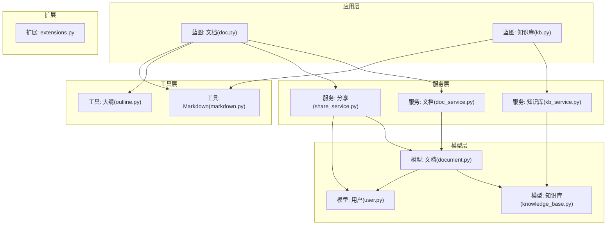
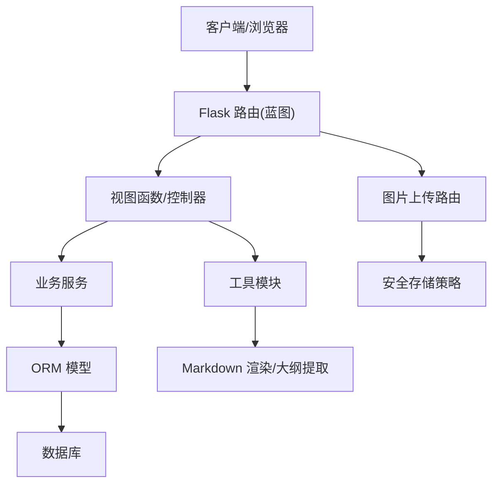
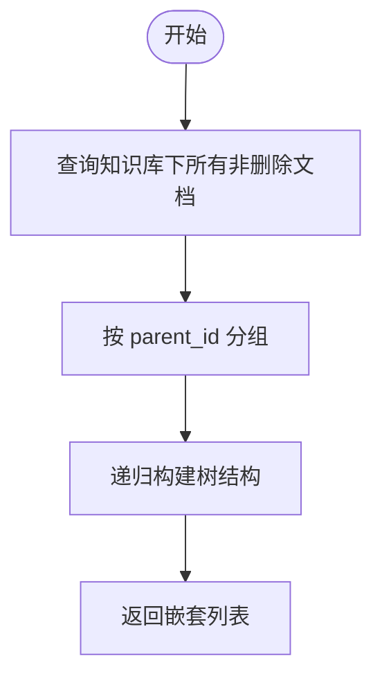
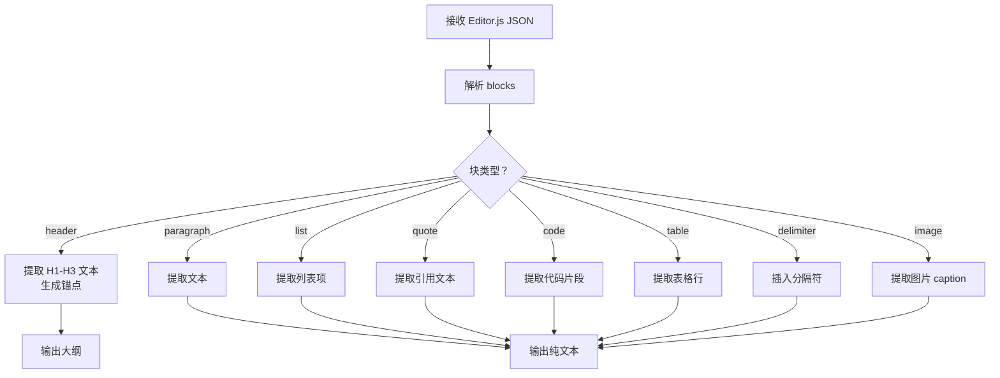
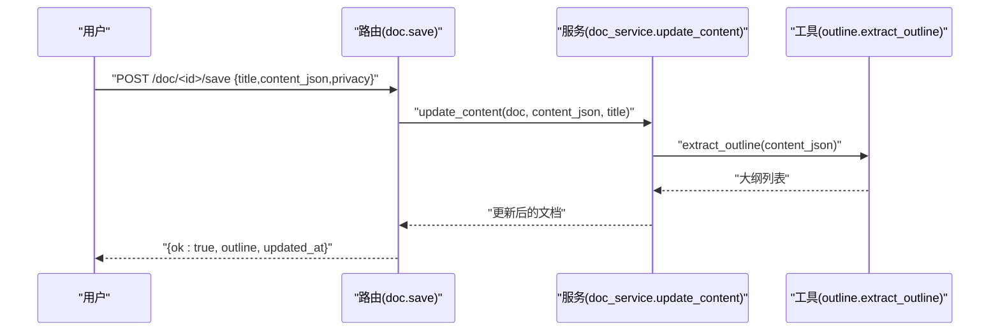
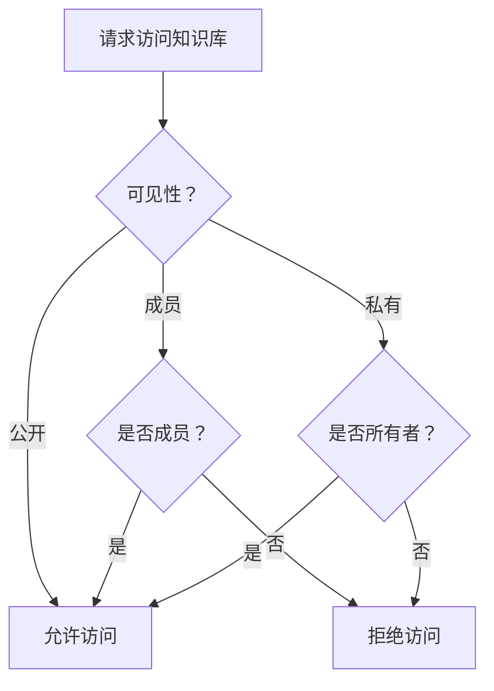
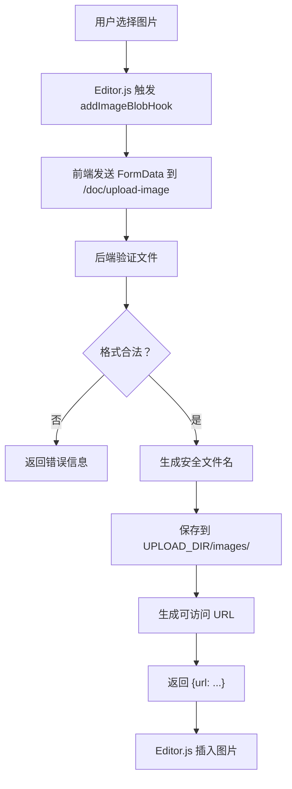
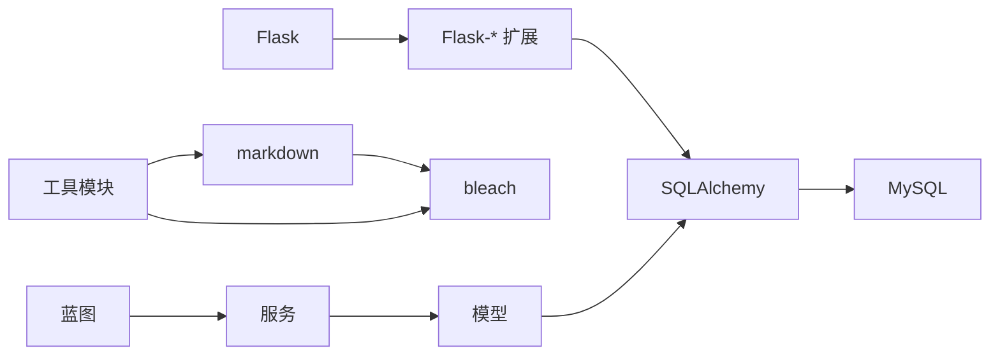

# 文档管理系统

<cite>
**本文引用的文件**
- [README.md](file://README.md)
- [requirements.txt](file://requirements.txt)
- [app/extensions.py](file://app/extensions.py)
- [app/models/document.py](file://app/models/document.py)
- [app/models/knowledge_base.py](file://app/models/knowledge_base.py)
- [app/models/user.py](file://app/models/user.py)
- [app/services/doc_service.py](file://app/services/doc_service.py)
- [app/services/kb_service.py](file://app/services/kb_service.py)
- [app/services/share_service.py](file://app/services/share_service.py)
- [app/utils/markdown.py](file://app/utils/markdown.py)
- [app/utils/outline.py](file://app/utils/outline.py)
- [app/blueprints/doc.py](file://app/blueprints/doc.py)
- [app/blueprints/kb.py](file://app/blueprints/kb.py)
- [app/templates/base.html](file://app/templates/base.html)
- [app/templates/doc/edit.html](file://app/templates/doc/edit.html)
- [app/config.py](file://app/config.py)
</cite>

## 目录
1. [简介](#简介)
2. [项目结构](#项目结构)
3. [核心组件](#核心组件)
4. [架构总览](#架构总览)
5. [详细组件分析](#详细组件分析)
6. [依赖分析](#依赖分析)
7. [性能考虑](#性能考虑)
8. [故障排除指南](#故障排除指南)
9. [结论](#结论)
10. [附录](#附录)

## 简介
本项目是一个基于 Flask 的个人知识库与文档管理系统，支持：
- 文档树结构管理（父子层级、排序）
- 富文本编辑器（Editor.js JSON）与 Markdown 渲染
- 文档分享与访问控制
- 文档大纲生成与纯文本提取
- 知识库权限体系（公开/成员/私有）、成员角色与可见性控制
- 基于 Markdown 的渲染与维基链接解析
- **新增：图片上传功能**（支持多种格式的安全存储与访问）

系统通过蓝图组织路由，服务层封装业务逻辑，工具模块负责内容处理与渲染，模型层定义数据结构与关系。

## 项目结构
后端采用典型的分层结构：
- 蓝图层：路由与控制器，负责请求处理与响应
- 服务层：业务逻辑封装，事务与权限校验
- 模型层：数据库实体与关系
- 工具层：内容处理、渲染、安全等辅助能力
- 配置与扩展：Flask 扩展初始化与全局配置



**图表来源**
- [app/blueprints/doc.py:1-179](file://app/blueprints/doc.py#L1-L179)
- [app/blueprints/kb.py:1-141](file://app/blueprints/kb.py#L1-L141)
- [app/services/doc_service.py:1-81](file://app/services/doc_service.py#L1-L81)
- [app/services/kb_service.py:1-80](file://app/services/kb_service.py#L1-L80)
- [app/services/share_service.py:1-49](file://app/services/share_service.py#L1-L49)
- [app/models/document.py:1-98](file://app/models/document.py#L1-L98)
- [app/models/knowledge_base.py:1-62](file://app/models/knowledge_base.py#L1-L62)
- [app/models/user.py:1-104](file://app/models/user.py#L1-L104)
- [app/utils/markdown.py:1-87](file://app/utils/markdown.py#L1-L87)
- [app/utils/outline.py:1-136](file://app/utils/outline.py#L1-L136)
- [app/extensions.py:1-17](file://app/extensions.py#L1-L17)

**章节来源**
- [README.md:1-3](file://README.md#L1-L3)
- [requirements.txt:1-22](file://requirements.txt#L1-L22)
- [app/extensions.py:1-17](file://app/extensions.py#L1-L17)

## 核心组件
- 数据模型
  - 文档模型：支持标题、类型（文档/表格）、隐私（常规/私密）、Editor.js JSON 内容、纯文本摘要、排序、软删除、作者、父节点、创建/更新时间等
  - 知识库模型：名称、描述、封面、图标、所有者、可见性（私有/成员/公开）、归档状态、创建/更新时间
  - 用户模型：用户名、邮箱、密码哈希、头像、简介、激活状态、超级管理员标记、角色与权限
- 服务层
  - 文档服务：构建知识库文档树、创建文档、更新内容（含纯文本提取）、软删除、收集后代 ID
  - 知识库服务：访问控制（读取）、编辑权限、管理权限、列出我的知识库、列出公开知识库、成员增删改
  - 分享服务：创建分享（令牌、过期时间、密码）、撤销、查询有效分享、浏览计数
- 工具层
  - Markdown 渲染：标准 Markdown 渲染与维基链接替换，允许标签与属性白名单
  - 大纲与纯文本：从 Editor.js JSON 提取 H1-H3 大纲、纯文本摘要、Markdown 表达式
- **新增：文件上传服务**
  - 图片上传：支持 PNG、JPG、JPEG、GIF、WEBP、SVG 格式的安全存储
  - 存储策略：随机文件名 + 原始扩展名，自动创建目录结构
  - 访问控制：基于登录状态的文件服务

**章节来源**
- [app/models/document.py:10-98](file://app/models/document.py#L10-L98)
- [app/models/knowledge_base.py:8-62](file://app/models/knowledge_base.py#L8-L62)
- [app/models/user.py:10-104](file://app/models/user.py#L10-L104)
- [app/services/doc_service.py:11-81](file://app/services/doc_service.py#L11-L81)
- [app/services/kb_service.py:10-80](file://app/services/kb_service.py#L10-L80)
- [app/services/share_service.py:15-49](file://app/services/share_service.py#L15-L49)
- [app/utils/markdown.py:31-87](file://app/utils/markdown.py#L31-L87)
- [app/utils/outline.py:22-136](file://app/utils/outline.py#L22-L136)
- [app/blueprints/doc.py:25-54](file://app/blueprints/doc.py#L25-L54)

## 架构总览
系统采用"蓝图 + 服务 + 模型 + 工具"的分层架构，前后端通过 JSON API 交互，模板用于渲染页面。Markdown 渲染与大纲提取由工具模块完成，分享与权限控制由服务模块完成。**新增的图片上传功能通过专用路由处理，确保安全存储与访问控制。**



**图表来源**
- [app/blueprints/doc.py:28-54](file://app/blueprints/doc.py#L28-L54)
- [app/services/doc_service.py:11-81](file://app/services/doc_service.py#L11-L81)
- [app/services/kb_service.py:10-80](file://app/services/kb_service.py#L10-L80)
- [app/services/share_service.py:15-49](file://app/services/share_service.py#L15-L49)
- [app/utils/markdown.py:31-87](file://app/utils/markdown.py#L31-L87)
- [app/utils/outline.py:34-88](file://app/utils/outline.py#L34-L88)

## 详细组件分析

### 数据模型设计
- 文档模型
  - 关键字段：标题、类型、隐私、Editor.js JSON 内容、纯文本摘要、排序、软删除、作者、父节点、创建/更新时间
  - 关系：属于知识库与作者；父子自关联；分享外键关联
  - 访问控制：can_be_shared 属性根据隐私判断是否可分享
- 知识库模型
  - 关键字段：名称、描述、封面、图标、所有者、可见性、归档状态、创建/更新时间
  - 成员关系：唯一约束 kb_id+user_id，角色（查看者/编辑者）
- 用户模型
  - 角色与权限：多对多关系，支持系统级权限与超级管理员

```mermaid
classDiagram
class User {
+int id
+string username
+string email
+bool is_active
+bool is_super_admin
+datetime created_at
+datetime updated_at
}
class KnowledgeBase {
+int id
+string name
+string description
+string cover
+string icon
+int owner_id
+string visibility
+bool is_archived
+datetime created_at
+datetime updated_at
}
class Document {
+int id
+int kb_id
+int~nullable~ parent_id
+string title
+string type
+string privacy
+string~nullable~ content_json
+string~nullable~ plain_text
+int sort_order
+bool is_deleted
+int~nullable~ author_id
+datetime created_at
+datetime updated_at
}
class DocumentShare {
+int id
+int doc_id
+string token
+string~nullable~ password_hash
+datetime~nullable~ expires_at
+bool is_revoked
+int view_count
+int~nullable~ created_by
+datetime created_at
}
KnowledgeBase "1" -- "many" Document : "documents"
User "1" -- "many" Document : "authored_docs"
Document "1" -- "many" Document : "children" : parent_id
Document "1" -- "many" DocumentShare : "shares"
```

**图表来源**
- [app/models/document.py:20-98](file://app/models/document.py#L20-L98)
- [app/models/knowledge_base.py:19-62](file://app/models/knowledge_base.py#L19-L62)
- [app/models/user.py:55-104](file://app/models/user.py#L55-L104)

**章节来源**
- [app/models/document.py:10-98](file://app/models/document.py#L10-L98)
- [app/models/knowledge_base.py:8-62](file://app/models/knowledge_base.py#L8-L62)
- [app/models/user.py:10-104](file://app/models/user.py#L10-L104)

### 文档树结构管理
- 构建规则
  - 过滤非删除文档，按父节点优先、排序字段升序、ID 升序排列
  - 使用字典按父 ID 分组，递归构建嵌套列表
- 查询复杂度
  - 一次查询 + O(N) 构建，适合中小规模知识库
- 典型用法
  - 知识库详情页与文档页均调用该方法生成左侧导航树



**图表来源**
- [app/services/doc_service.py:11-35](file://app/services/doc_service.py#L11-L35)

**章节来源**
- [app/services/doc_service.py:11-35](file://app/services/doc_service.py#L11-L35)

### 富文本编辑器与内容处理
- Editor.js JSON 解析
  - 解析 blocks 列表，支持标题、段落、列表、引用、代码、表格、分隔符、图片等
- 大纲提取
  - 仅提取 H1-H3，生成锚点（去重处理），用于侧边栏目录
- 纯文本提取
  - 用于搜索与 AI 索引，保留结构化信息
- Markdown 渲染
  - 支持 extra、sane_lists、tables、fenced_code、toc、nl2br 等扩展
  - 维基链接替换：[[标题]] 或 [[标题|显示名]]，通过解析器返回 slug



**图表来源**
- [app/utils/outline.py:22-136](file://app/utils/outline.py#L22-L136)

**章节来源**
- [app/utils/outline.py:22-136](file://app/utils/outline.py#L22-L136)
- [app/utils/markdown.py:31-87](file://app/utils/markdown.py#L31-L87)

### 版本控制机制
- 当前实现
  - 文档模型未显式存储历史版本；每次更新覆盖 content_json 与 plain_text
- 替代方案建议
  - 新增 DocumentVersion 模型，记录变更时间、作者、JSON 快照
  - 对比差异时使用 diff 库或基于块的增量记录
  - 提供"回滚到指定版本"与"版本对比"接口

**章节来源**
- [app/models/document.py:31-42](file://app/models/document.py#L31-L42)

### 文档生命周期与操作
- 创建
  - 校验知识库与编辑权限，设置默认值（空 JSON、空纯文本、排序 0）
- 编辑
  - 接收 JSON 与标题，更新纯文本摘要，返回新大纲与更新时间
- 删除
  - 软删除：递归收集后代 ID 并批量标记删除
- 移动/复制
  - 当前未实现直接移动/复制接口；可通过创建新文档 + 复制 JSON 的方式实现
- 分享
  - 仅常规隐私文档可分享；支持设置密码与过期时间；提供撤销与计数



**图表来源**
- [app/blueprints/doc.py:109-124](file://app/blueprints/doc.py#L109-L124)
- [app/services/doc_service.py:56-62](file://app/services/doc_service.py#L56-L62)
- [app/utils/outline.py:34-55](file://app/utils/outline.py#L34-L55)

**章节来源**
- [app/blueprints/doc.py:57-141](file://app/blueprints/doc.py#L57-L141)
- [app/services/doc_service.py:37-81](file://app/services/doc_service.py#L37-L81)

### 权限与知识库关联
- 知识库可见性
  - 私有：仅所有者可见
  - 成员：所有者与成员可见
  - 公开：任何人可见
- 编辑与管理
  - 编辑：所有者或成员角色为编辑者
  - 管理：仅所有者
- 成员管理
  - 添加/修改成员角色、移除成员



**图表来源**
- [app/services/kb_service.py:10-46](file://app/services/kb_service.py#L10-L46)

**章节来源**
- [app/services/kb_service.py:10-80](file://app/services/kb_service.py#L10-L80)

### 文件上传处理
- **新增：图片上传功能**
  - **路由接口**：POST /doc/upload-image（CSRF 免除，基于登录状态保护）
  - **文件验证**：
    - 格式限制：PNG、JPG、JPEG、GIF、WEBP、SVG
    - 文件名安全：使用安全文件名验证
    - 大小限制：受 Flask MAX_CONTENT_LENGTH 配置约束
  - **安全存储策略**：
    - 目录结构：UPLOAD_DIR/images/
    - 文件命名：16位随机ID + 原始扩展名
    - 自动创建目录：确保存储路径存在
  - **访问控制**：
    - 上传路由：需要登录用户
    - 文件服务：基于安全文件名验证
    - 路径遍历防护：使用 secure_filename 验证
  - **前端集成**：
    - Editor.js Hook：addImageBlobHook 自动触发上传
    - 错误处理：网络异常与格式错误提示
    - 回调机制：成功返回 URL，失败返回错误信息



**图表来源**
- [app/blueprints/doc.py:28-44](file://app/blueprints/doc.py#L28-L44)
- [app/templates/doc/edit.html:129-147](file://app/templates/doc/edit.html#L129-L147)

**章节来源**
- [app/blueprints/doc.py:25-54](file://app/blueprints/doc.py#L25-L54)
- [app/templates/doc/edit.html:129-147](file://app/templates/doc/edit.html#L129-L147)
- [app/config.py:33-36](file://app/config.py#L33-L36)

### API 接口文档
- 文档相关
  - POST /doc/new：创建文档（需要 kb_id、可选 parent_id、type、privacy、title）
  - GET /doc/<id>：查看文档（返回树与大纲）
  - GET /doc/<id>/edit：编辑页
  - POST /doc/<id>/save：保存内容（JSON、标题、隐私）
  - POST /doc/<id>/delete：软删除（递归）
  - GET/POST /doc/<id>/share：生成分享（密码、时长）
  - POST /doc/share/<id>/revoke：撤销分享
  - **新增**：POST /doc/upload-image：图片上传（需要登录）
- 知识库相关
  - GET /kb/：列出知识库（tab=mine|public）
  - GET/POST /kb/new：创建知识库
  - GET /kb/<id>：知识库详情（带树与首个文档）
  - GET/POST /kb/<id>/edit：编辑知识库
  - POST /kb/<id>/delete：归档知识库
  - GET/POST /kb/<id>/members：成员管理
  - POST /kb/<id>/members/<user_id>/delete：移除成员

**章节来源**
- [app/blueprints/doc.py:28-179](file://app/blueprints/doc.py#L28-L179)
- [app/blueprints/kb.py:21-141](file://app/blueprints/kb.py#L21-L141)

### 编辑器配置与内容处理流程
- 编辑器 JSON → 大纲/纯文本
  - 解析 blocks，过滤非目标块类型，生成大纲与纯文本
- Markdown 渲染
  - 标准 Markdown + 扩展；维基链接替换为内部锚点占位符
- 安全策略
  - 使用白名单标签与属性，防止 XSS
- **新增：图片上传集成**
  - Editor.js Hook 配置：addImageBlobHook 自动上传
  - 前端错误处理：网络异常与格式错误提示
  - 后端安全验证：格式检查与文件名验证

**章节来源**
- [app/utils/outline.py:22-136](file://app/utils/outline.py#L22-L136)
- [app/utils/markdown.py:31-87](file://app/utils/markdown.py#L31-L87)
- [app/templates/doc/edit.html:129-147](file://app/templates/doc/edit.html#L129-L147)

## 依赖分析
- 外部依赖
  - Flask 生态：Flask、Flask-SQLAlchemy、Flask-Migrate、Flask-Login、Flask-WTF
  - Markdown 与安全：markdown、bleach
  - 数据库：PyMySQL、SQLAlchemy
  - 其他：Werkzeug、Pillow、requests、openai（可选）
- 内部依赖
  - 蓝图依赖服务层；服务层依赖模型层；工具层被蓝图与服务层共同使用



**图表来源**
- [requirements.txt:1-22](file://requirements.txt#L1-L22)
- [app/utils/markdown.py:31-87](file://app/utils/markdown.py#L31-L87)
- [app/utils/outline.py:22-136](file://app/utils/outline.py#L22-L136)
- [app/blueprints/doc.py:1-179](file://app/blueprints/doc.py#L1-L179)
- [app/blueprints/kb.py:1-141](file://app/blueprints/kb.py#L1-L141)
- [app/services/doc_service.py:1-81](file://app/services/doc_service.py#L1-L81)
- [app/services/kb_service.py:1-80](file://app/services/kb_service.py#L1-L80)
- [app/services/share_service.py:1-49](file://app/services/share_service.py#L1-L49)

**章节来源**
- [requirements.txt:1-22](file://requirements.txt#L1-L22)

## 性能考虑
- 查询优化
  - 文档树构建：单次查询 + 字典分组 + 递归，时间复杂度 O(N)，适合中小规模
  - 建议：对大文档集进行分页或懒加载
- 存储优化
  - Editor.js JSON 与纯文本分离存储，便于检索与渲染
  - 大 JSON 建议使用压缩或拆分存储（视数据库支持）
  - **新增：图片存储优化**
    - 使用随机文件名避免冲突
    - 目录分层存储，避免单目录文件过多
    - 建议：可考虑 CDN 加速图片访问
- 渲染优化
  - 大纲与纯文本提取在服务端完成，减少前端负担
  - Markdown 渲染启用必要的扩展，避免过度处理
- 缓存策略
  - 知识库树与常用查询结果可缓存，结合更新时间戳失效
  - **新增：图片缓存策略**
    - 图片 URL 可缓存，但需考虑文件名安全性
    - 建议：为图片添加版本号或哈希参数
- 并发与事务
  - 批量软删除使用一次性提交，避免频繁 IO
  - **新增：并发上传处理**
    - 文件名生成使用随机ID，避免并发冲突
    - 建议：可考虑文件锁机制

## 故障排除指南
- 权限错误
  - 403：当前用户无访问/编辑/管理权限；检查知识库可见性与成员角色
- 资源不存在
  - 404：文档或知识库不存在或已归档/删除
  - **新增**：图片文件不存在：检查文件名是否被篡改或已被清理
- 分享问题
  - 私密文档不可分享；过期或撤销的分享无效
- 内容异常
  - Editor.js JSON 非法导致解析失败；检查编辑器导出格式
- 安全与 XSS
  - Markdown 渲染使用白名单；确保输入过滤与 CSRF 保护开启
- **新增：图片上传问题**
  - 格式错误：检查文件扩展名是否在允许列表中
  - 上传失败：检查 UPLOAD_DIR 权限与磁盘空间
  - 访问失败：确认文件路径与安全文件名验证

**章节来源**
- [app/blueprints/doc.py:13-18](file://app/blueprints/doc.py#L13-L18)
- [app/blueprints/kb.py:14-18](file://app/blueprints/kb.py#L14-L18)
- [app/services/share_service.py:17-49](file://app/services/share_service.py#L17-L49)
- [app/utils/markdown.py:31-87](file://app/utils/markdown.py#L31-L87)
- [app/blueprints/doc.py:34-38](file://app/blueprints/doc.py#L34-L38)

## 结论
本系统以清晰的分层架构实现了文档与知识库的核心能力：树形结构、富文本内容、权限控制与分享。通过 Editor.js JSON 与工具模块，系统具备良好的内容处理与渲染能力。**新增的图片上传功能完善了富文本编辑体验，通过严格的安全验证与存储策略确保系统稳定运行。未来可在版本控制、移动/复制、缓存与分页等方面进一步增强。**

## 附录
- 前端基础模板
  - 提供 CSRF 令牌、样式与脚本引入，便于扩展前端组件与交互
- **新增：图片上传配置**
  - 上传目录：instance/uploads/images/
  - 最大文件大小：32MB（可配置）
  - 支持格式：PNG、JPG、JPEG、GIF、WEBP、SVG

**章节来源**
- [app/templates/base.html:1-29](file://app/templates/base.html#L1-L29)
- [app/config.py:33-36](file://app/config.py#L33-L36)