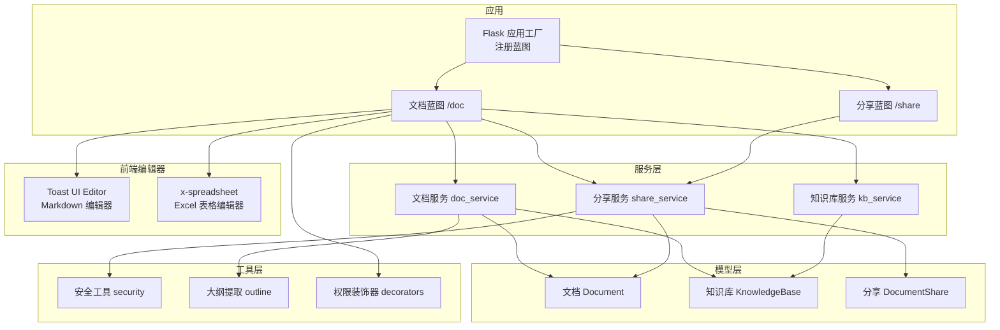
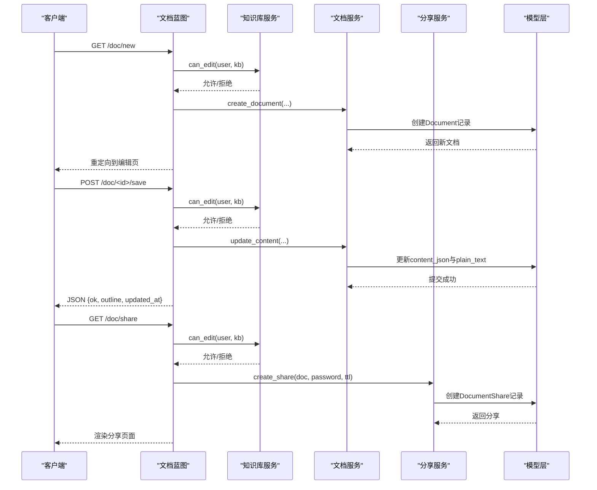
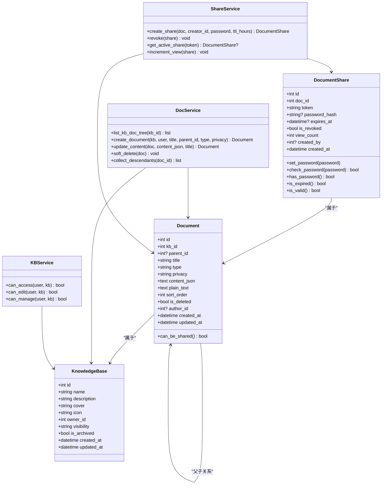

# 文档蓝图路由

<cite>
**本文引用的文件**
- [app/blueprints/doc.py](file://app/blueprints/doc.py)
- [app/blueprints/share.py](file://app/blueprints/share.py)
- [app/models/document.py](file://app/models/document.py)
- [app/models/knowledge_base.py](file://app/models/knowledge_base.py)
- [app/services/doc_service.py](file://app/services/doc_service.py)
- [app/services/kb_service.py](file://app/services/kb_service.py)
- [app/services/share_service.py](file://app/services/share_service.py)
- [app/utils/outlines.py](file://app/utils/outline.py)
- [app/utils/security.py](file://app/utils/security.py)
- [app/utils/decorators.py](file://app/utils/decorators.py)
- [app/templates/doc/edit.html](file://app/templates/doc/edit.html)
- [app/templates/doc/view.html](file://app/templates/doc/view.html)
- [app/templates/doc/share.html](file://app/templates/doc/share.html)
- [app/templates/base.html](file://app/templates/base.html)
- [app/static/vendor/js/toastui-editor-all.min.js](file://app/static/vendor/js/toastui-editor-all.min.js)
- [app/static/vendor/js/xspreadsheet.js](file://app/static/vendor/js/xspreadsheet.js)
- [app/static/vendor/js/xspreadsheet-zh-cn.js](file://app/static/vendor/js/xspreadsheet-zh-cn.js)
</cite>

## 目录
1. [简介](#简介)
2. [项目结构](#项目结构)
3. [核心组件](#核心组件)
4. [架构总览](#架构总览)
5. [详细组件分析](#详细组件分析)
6. [依赖关系分析](#依赖关系分析)
7. [性能考虑](#性能考虑)
8. [故障排查指南](#故障排查指南)
9. [结论](#结论)
10. [附录](#附录)

## 简介
本文件面向"文档蓝图路由"的API与前端交互，系统性梳理文档的增删改查、分享、内容编辑与文件上传等能力。重点覆盖：
- RESTful风格的HTTP方法、URL模式与参数规范
- 安全验证、权限检查与错误响应
- 路由中间件与装饰器的使用方式
- 常见调用示例、参数说明与返回值格式
- 自定义扩展建议（如新增文档类型、权限策略）

**更新** 新增Excel/Spreadsheet功能集成，支持双模式编辑系统（Markdown和Excel），替换原有Editor.js为Toast UI Editor，扩展前端模板以支持新的编辑器类型

## 项目结构
文档蓝图位于应用的蓝本模块中，并通过应用工厂注册到全局路由前缀下。蓝图内部通过服务层与模型层协作，完成文档生命周期管理与分享控制。

**图表来源**
- [app/__init__.py:56-74](file://app/__init__.py#L56-L74)
- [app/blueprints/doc.py:1-139](file://app/blueprints/doc.py#L1-L139)
- [app/blueprints/share.py:1-42](file://app/blueprints/share.py#L1-L42)
- [app/services/doc_service.py:1-81](file://app/services/doc_service.py#L1-L81)
- [app/services/kb_service.py:1-80](file://app/services/kb_service.py#L1-L80)
- [app/services/share_service.py:1-49](file://app/services/share_service.py#L1-L49)
- [app/utils/security.py:1-8](file://app/utils/security.py#L1-L8)
- [app/utils/outline.py:1-136](file://app/utils/outline.py#L1-L136)
- [app/utils/decorators.py:1-33](file://app/utils/decorators.py#L1-L33)

**章节来源**
- [app/__init__.py:56-74](file://app/__init__.py#L56-L74)
- [app/blueprints/doc.py:1-139](file://app/blueprints/doc.py#L1-L139)
- [app/blueprints/share.py:1-42](file://app/blueprints/share.py#L1-L42)

## 核心组件
- 文档蓝图：提供文档的创建、查看、编辑、保存、删除、分享与撤销分享等路由。
- 分享蓝图：提供公开分享的查看、密码解锁与访问统计。
- 服务层：
  - 文档服务：负责文档树构建、创建、更新内容、软删除与后代收集。
  - 知识库服务：负责知识库可见性、成员角色与权限判定。
  - 分享服务：负责分享令牌生成、密码校验、过期控制与访问计数。
- 工具层：
  - 安全工具：生成URL安全的分享令牌。
  - 大纲提取：从Editor.js JSON内容中抽取标题大纲与纯文本。
  - 权限装饰器：超级管理员与特定权限码的校验。
- 前端编辑器：
  - Toast UI Editor：Markdown富文本编辑器，支持所见即所得编辑。
  - x-spreadsheet：Excel在线表格编辑器，支持单元格操作、公式计算、数据验证等。

**章节来源**
- [app/blueprints/doc.py:1-139](file://app/blueprints/doc.py#L1-L139)
- [app/blueprints/share.py:1-42](file://app/blueprints/share.py#L1-L42)
- [app/services/doc_service.py:1-81](file://app/services/doc_service.py#L1-L81)
- [app/services/kb_service.py:1-80](file://app/services/kb_service.py#L1-L80)
- [app/services/share_service.py:1-49](file://app/services/share_service.py#L1-L49)
- [app/utils/security.py:1-8](file://app/utils/security.py#L1-L8)
- [app/utils/outline.py:1-136](file://app/utils/outline.py#L1-L136)
- [app/utils/decorators.py:1-33](file://app/utils/decorators.py#L1-L33)

## 架构总览
文档蓝图与分享蓝图通过服务层与模型层解耦，权限与安全逻辑集中在服务层与工具层，确保路由层只关注HTTP语义与参数解析。

**图表来源**
- [app/blueprints/doc.py:20-41](file://app/blueprints/doc.py#L20-L41)
- [app/blueprints/doc.py:69-84](file://app/blueprints/doc.py#L69-L84)
- [app/blueprints/doc.py:103-124](file://app/blueprints/doc.py#L103-L124)
- [app/services/kb_service.py:26-36](file://app/services/kb_service.py#L26-L36)
- [app/services/doc_service.py:37-62](file://app/services/doc_service.py#L37-L62)
- [app/services/share_service.py:15-31](file://app/services/share_service.py#L15-L31)

## 详细组件分析

### 文档蓝图路由清单与行为
- 路由前缀：/doc
- 关键路由与方法：
  - 新建文档：POST /doc/new
  - 查看文档：GET /doc/<int:doc_id>
  - 编辑文档：GET /doc/<int:doc_id>/edit
  - 保存内容：POST /doc/<int:doc_id>/save
  - 删除文档：POST /doc/<int:doc_id>/delete
  - 分享文档：GET/POST /doc/<int:doc_id>/share
  - 撤销分享：POST /doc/share/<int:share_id>/revoke

**章节来源**
- [app/blueprints/doc.py:20-139](file://app/blueprints/doc.py#L20-L139)
- [app/__init__.py:71](file://app/__init__.py#L71)

#### 新建文档
- 方法：POST
- 参数：
  - kb_id：整数，目标知识库ID
  - parent_id：可选整数，父级文档ID
  - type：可选字符串，文档类型（doc/sheet），默认doc
  - privacy：可选字符串，隐私级别（normal/private），默认normal
  - title：可选字符串，标题，默认"未命名"
- 权限：登录用户且具备知识库编辑权限
- 行为：校验知识库存在与权限，创建文档后重定向至编辑页

**章节来源**
- [app/blueprints/doc.py:20-41](file://app/blueprints/doc.py#L20-L41)
- [app/services/kb_service.py:26-36](file://app/services/kb_service.py#L26-L36)
- [app/services/doc_service.py:37-53](file://app/services/doc_service.py#L37-L53)

#### 查看文档
- 方法：GET
- 参数：doc_id
- 权限：登录用户且具备知识库访问权限
- 行为：渲染文档视图，提供侧边树与大纲；根据权限决定是否显示编辑按钮

**章节来源**
- [app/blueprints/doc.py:43-55](file://app/blueprints/doc.py#L43-L55)
- [app/services/kb_service.py:10-23](file://app/services/kb_service.py#L10-L23)
- [app/utils/outline.py:34-55](file://app/utils/outline.py#L34-L55)

#### 编辑文档
- 方法：GET
- 参数：doc_id
- 权限：登录用户且具备知识库编辑权限
- 行为：渲染编辑页面，提供侧边树

**章节来源**
- [app/blueprints/doc.py:58-66](file://app/blueprints/doc.py#L58-L66)
- [app/services/kb_service.py:26-36](file://app/services/kb_service.py#L26-L36)

#### 保存内容
- 方法：POST
- 路径参数：doc_id
- 请求体JSON字段：
  - title：可选字符串
  - content_json：可选字符串（Markdown或Excel JSON）
  - privacy：可选字符串（normal/private）
- 权限：登录用户且具备知识库编辑权限
- 行为：更新标题、内容与隐私级别；返回大纲与更新时间

**章节来源**
- [app/blueprints/doc.py:69-84](file://app/blueprints/doc.py#L69-L84)
- [app/services/doc_service.py:56-62](file://app/services/doc_service.py#L56-L62)
- [app/utils/outline.py:34-55](file://app/utils/outline.py#L34-L55)

#### 删除文档
- 方法：POST
- 路径参数：doc_id
- 权限：登录用户且具备知识库编辑权限
- 行为：递归标记所有后代文档为已删除；提交事务；提示信息并重定向

**章节来源**
- [app/blueprints/doc.py:87-100](file://app/blueprints/doc.py#L87-L100)
- [app/services/doc_service.py:70-80](file://app/services/doc_service.py#L70-L80)

#### 分享文档
- 方法：GET/POST
- 路径参数：doc_id
- GET行为：渲染分享管理页面，列出当前分享
- POST行为：
  - password：可选字符串，设置访问密码
  - ttl_hours：可选整数，过期时长（小时）
  - 校验：仅当文档隐私级别为normal时允许分享
  - 成功：生成分享令牌并记录到期时间与创建者；失败：抛出异常并提示
- 权限：登录用户且具备知识库编辑权限

**章节来源**
- [app/blueprints/doc.py:103-124](file://app/blueprints/doc.py#L103-L124)
- [app/services/share_service.py:15-31](file://app/services/share_service.py#L15-L31)
- [app/models/document.py:48-50](file://app/models/document.py#L48-L50)

#### 撤销分享
- 方法：POST
- 路径参数：share_id
- 行为：校验分享存在与当前用户对文档的编辑权限；执行撤销并提示

**章节来源**
- [app/blueprints/doc.py:127-139](file://app/blueprints/doc.py#L127-L139)
- [app/services/share_service.py:34-36](file://app/services/share_service.py#L34-L36)

### 分享蓝图路由
- 路由前缀：/share
- 关键路由：
  - 查看分享：GET /share/<token>
    - 若分享需要密码且未解锁：渲染密码输入页；提交正确密码后解锁并重定向
    - 访问计数+1；渲染分享视图
  - 密码解锁：POST /share/<token>（同上）

**章节来源**
- [app/blueprints/share.py:22-41](file://app/blueprints/share.py#L22-L41)
- [app/services/share_service.py:39-48](file://app/services/share_service.py#L39-L48)

### 数据模型与枚举
- 文档类型：doc（普通文档）、sheet（表格）
- 隐私级别：normal（可分享）、private（不可分享）
- 知识库可见性：private（仅拥有者）、members（成员可见）、public（公开）
- 知识库成员角色：viewer（只读）、editor（编辑）

**章节来源**
- [app/models/document.py:10-18](file://app/models/document.py#L10-L18)
- [app/models/knowledge_base.py:8-17](file://app/models/knowledge_base.py#L8-L17)
- [app/models/knowledge_base.py:14-16](file://app/models/knowledge_base.py#L14-L16)

### 权限与安全
- 登录要求：所有文档编辑类路由均需登录
- 权限判定：
  - 访问：公共知识库或成员/拥有者/超级管理员
  - 编辑：拥有者/编辑者/超级管理员
  - 管理：仅拥有者
- 分享安全：
  - 令牌生成：URL安全随机令牌
  - 密码校验：哈希存储与校验
  - 过期控制：UTC时间比较
  - 有效状态：未撤销且未过期

**章节来源**
- [app/utils/decorators.py:8-18](file://app/utils/decorators.py#L8-L18)
- [app/services/kb_service.py:10-45](file://app/services/kb_service.py#L10-L45)
- [app/utils/security.py:5-7](file://app/utils/security.py#L5-L7)
- [app/models/document.py:73-86](file://app/models/document.py#L73-L86)
- [app/services/share_service.py:19-21](file://app/services/share_service.py#L19-L21)

### 错误处理与响应
- 401 未认证：超级管理员/权限装饰器未登录
- 403 禁止访问：权限不足
- 404 未找到：文档/分享不存在或已删除
- 410 已失效：分享令牌不存在或已撤销/过期
- 业务异常：分享服务抛出异常并以消息提示

**章节来源**
- [app/utils/decorators.py:12-15](file://app/utils/decorators.py#L12-L15)
- [app/blueprints/doc.py:13-17](file://app/blueprints/doc.py#L13-L17)
- [app/blueprints/share.py:24-26](file://app/blueprints/share.py#L24-L26)
- [app/services/share_service.py:11-12](file://app/services/share_service.py#L11-L12)

### API调用示例与参数说明

- 新建文档
  - 方法：POST
  - 路径：/doc/new
  - 表单字段：
    - kb_id：整数
    - parent_id：可选整数
    - type：doc 或 sheet
    - privacy：normal 或 private
    - title：字符串
  - 返回：重定向到编辑页

- 保存内容
  - 方法：POST
  - 路径：/doc/<int:doc_id>/save
  - 请求体JSON：
    - title：可选
    - content_json：可选（Markdown或Excel JSON）
    - privacy：可选
  - 返回：
    - ok：布尔
    - outline：标题大纲数组
    - updated_at：ISO时间字符串

- 分享文档
  - 方法：GET/POST
  - 路径：/doc/<int:doc_id>/share
  - GET：返回分享管理页面
  - POST：
    - password：可选
    - ttl_hours：可选
  - 返回：重定向到分享管理页

- 撤销分享
  - 方法：POST
  - 路径：/doc/share/<int:share_id>/revoke
  - 返回：重定向到分享管理页

- 查看分享
  - 方法：GET
  - 路径：/share/<token>
  - 行为：若需要密码则渲染密码页；否则渲染分享视图并计数+1

**章节来源**
- [app/blueprints/doc.py:20-41](file://app/blueprints/doc.py#L20-L41)
- [app/blueprints/doc.py:69-84](file://app/blueprints/doc.py#L69-L84)
- [app/blueprints/doc.py:103-124](file://app/blueprints/doc.py#L103-L124)
- [app/blueprints/doc.py:127-139](file://app/blueprints/doc.py#L127-L139)
- [app/blueprints/share.py:22-41](file://app/blueprints/share.py#L22-L41)

### 文件上传接口
- 当前文档蓝图未提供独立的文件上传接口。上传目录与大小限制在配置中定义，通常用于其他场景（如头像、附件）。
- 如需在文档中嵌入图片，可通过Editor.js JSON内容块进行插入；分享视图会基于内容提取纯文本与大纲。

**章节来源**
- [app/config.py:33-35](file://app/config.py#L33-L35)
- [app/utils/outline.py:58-87](file://app/utils/outline.py#L58-L87)

### 路由中间件与装饰器
- 登录保护：所有编辑类路由均使用登录装饰器
- 权限装饰器：
  - 超级管理员：仅允许拥有is_super_admin=True的用户
  - 特定权限码：通过has_permission(code)校验
- 使用建议：
  - 在需要超级管理员权限的路由上使用装饰器
  - 在需要细粒度权限的路由上使用permission_required(code)

**章节来源**
- [app/blueprints/doc.py:3,21](file://app/blueprints/doc.py#L3,L21)
- [app/utils/decorators.py:8-18](file://app/utils/decorators.py#L8-L18)
- [app/utils/decorators.py:21-32](file://app/utils/decorators.py#L21-L32)

### 前端编辑器集成

#### 编辑器类型检测
- 通过文档类型判断使用哪种编辑器：
  - type == 'sheet'：使用 x-spreadsheet Excel编辑器
  - 其他：使用 Toast UI Editor Markdown编辑器

#### Toast UI Editor（Markdown编辑器）
- 功能特性：
  - 所见即所得编辑界面
  - 支持标题、列表、表格、代码块等Markdown语法
  - 预览模式切换
  - 中文本地化支持

#### x-spreadsheet（Excel编辑器）
- 功能特性：
  - 完整的电子表格功能
  - 单元格操作、行列插入删除
  - 公式计算支持
  - 数据验证规则
  - 合并单元格、边框样式
  - 中文本地化支持

**章节来源**
- [app/templates/doc/edit.html:29-33](file://app/templates/doc/edit.html#L29-L33)
- [app/templates/doc/edit.html:40-58](file://app/templates/doc/edit.html#L40-L58)
- [app/templates/doc/edit.html:78-106](file://app/templates/doc/edit.html#L78-L106)
- [app/templates/doc/edit.html:107-133](file://app/templates/doc/edit.html#L107-L133)
- [app/templates/doc/view.html:80-92](file://app/templates/doc/view.html#L80-L92)
- [app/templates/doc/view.html:101-118](file://app/templates/doc/view.html#L101-L118)

## 依赖关系分析

**图表来源**
- [app/models/document.py:20-54](file://app/models/document.py#L20-L54)
- [app/models/knowledge_base.py:19-42](file://app/models/knowledge_base.py#L19-L42)
- [app/models/document.py:56-97](file://app/models/document.py#L56-L97)
- [app/services/doc_service.py:11-81](file://app/services/doc_service.py#L11-L81)
- [app/services/kb_service.py:10-45](file://app/services/kb_service.py#L10-L45)
- [app/services/share_service.py:15-48](file://app/services/share_service.py#L15-L48)

## 性能考虑
- 文档树构建：按父节点分组后递归构建，复杂度与文档数量线性相关
- 内容提取：大纲与纯文本提取基于Editor.js JSON解析，注意大文档的内存占用
- 分享访问：每次访问计数+1，建议在高并发场景下评估数据库写压力
- 权限查询：知识库权限涉及多表联结，建议在知识库列表与文档页缓存必要信息
- 编辑器性能：Excel编辑器在大数据量时可能影响页面性能，建议合理设置表格行列限制

## 故障排查指南
- 403 禁止访问
  - 检查用户是否登录、是否为知识库拥有者/编辑者、是否为超级管理员
  - 检查知识库可见性与成员关系
- 404 未找到
  - 文档或分享不存在，或已被软删除
- 410 已失效
  - 分享被撤销或已过期
- 分享失败
  - 私密文档不可分享
  - 密码错误或过期时间非法
- 编辑器问题
  - Toast UI Editor未加载：检查静态资源路径和版本兼容性
  - x-spreadsheet未加载：检查JavaScript文件加载状态
  - 内容保存失败：检查content_json格式是否符合对应编辑器要求

**章节来源**
- [app/services/kb_service.py:10-45](file://app/services/kb_service.py#L10-L45)
- [app/blueprints/doc.py:13-17](file://app/blueprints/doc.py#L13-L17)
- [app/blueprints/share.py:24-26](file://app/blueprints/share.py#L24-L26)
- [app/services/share_service.py:17-18](file://app/services/share_service.py#L17-L18)

## 结论
文档蓝图路由围绕"文档生命周期 + 分享控制"提供了清晰的REST风格接口，配合服务层与模型层实现了权限、安全与内容处理的解耦。通过统一的装饰器与服务封装，既保证了安全性，也便于扩展新的文档类型与权限策略。新增的Excel/Spreadsheet功能进一步丰富了文档编辑体验，支持多种内容类型的协同工作。

## 附录

### 路由与权限对照表
- /doc/new：POST，登录+编辑权限
- /doc/<int:doc_id>：GET，访问权限
- /doc/<int:doc_id>/edit：GET，编辑权限
- /doc/<int:doc_id>/save：POST，编辑权限
- /doc/<int:doc_id>/delete：POST，编辑权限
- /doc/<int:doc_id>/share：GET/POST，编辑权限
- /doc/share/<int:share_id>/revoke：POST，编辑权限
- /share/<token>：GET/POST，公开访问（密码解锁）

**章节来源**
- [app/blueprints/doc.py:20-139](file://app/blueprints/doc.py#L20-L139)
- [app/blueprints/share.py:22-41](file://app/blueprints/share.py#L22-L41)
- [app/services/kb_service.py:10-45](file://app/services/kb_service.py#L10-L45)

### 编辑器类型映射
- 文档类型 doc → Toast UI Editor（Markdown）
- 文档类型 sheet → x-spreadsheet（Excel）

**章节来源**
- [app/models/document.py:10-18](file://app/models/document.py#L10-L18)
- [app/templates/doc/edit.html:3,29](file://app/templates/doc/edit.html#L3,L29)
- [app/templates/doc/view.html:3,53](file://app/templates/doc/view.html#L3,L53)