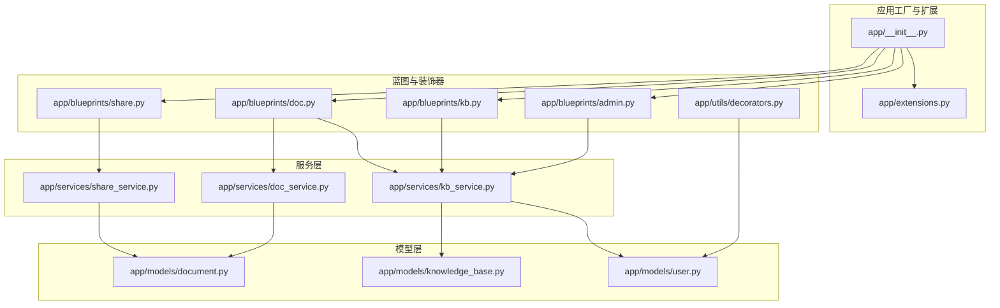
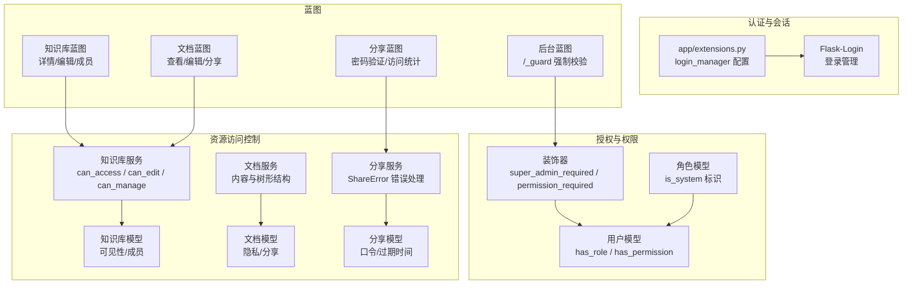
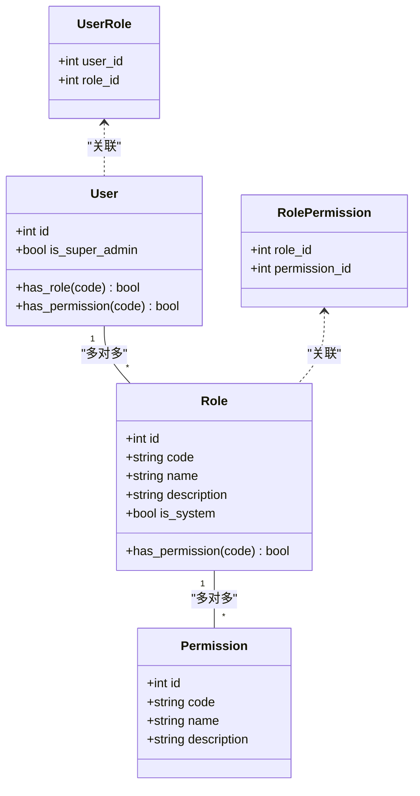
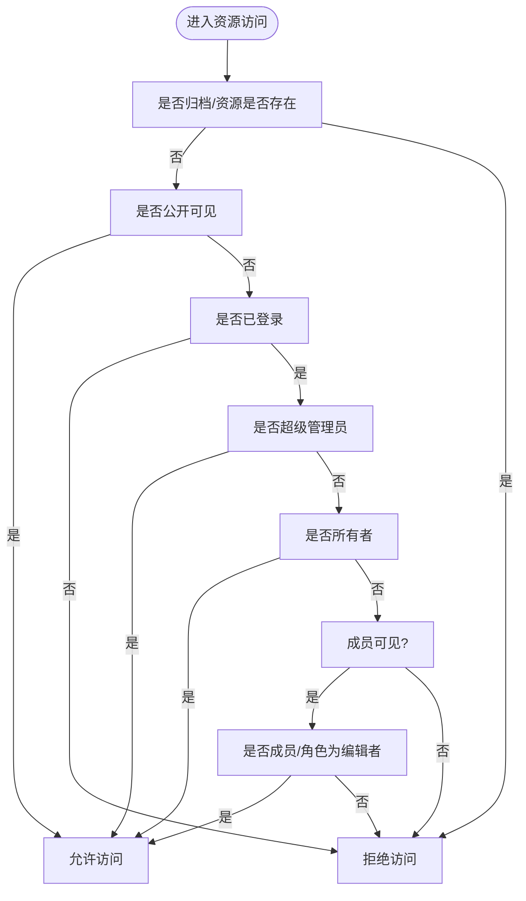
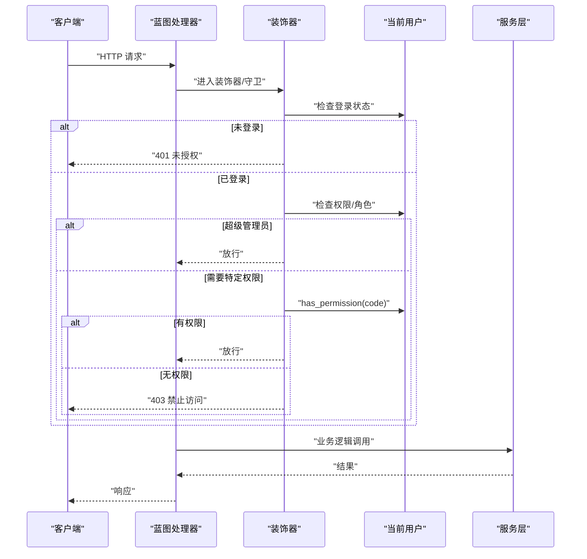
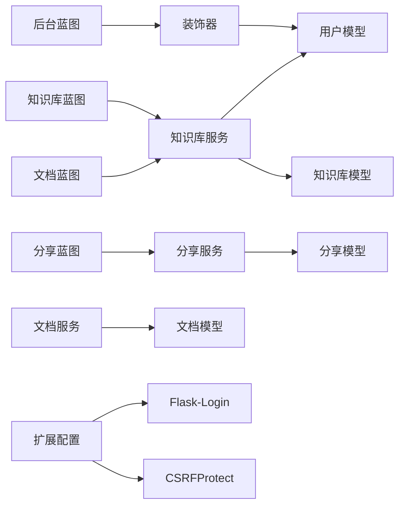

# 权限控制系统

<cite>
**本文引用的文件**
- [app/utils/decorators.py](file://app/utils/decorators.py)
- [app/models/user.py](file://app/models/user.py)
- [app/models/knowledge_base.py](file://app/models/knowledge_base.py)
- [app/models/document.py](file://app/models/document.py)
- [app/services/kb_service.py](file://app/services/kb_service.py)
- [app/services/doc_service.py](file://app/services/doc_service.py)
- [app/services/share_service.py](file://app/services/share_service.py)
- [app/blueprints/admin.py](file://app/blueprints/admin.py)
- [app/blueprints/kb.py](file://app/blueprints/kb.py)
- [app/blueprints/doc.py](file://app/blueprints/doc.py)
- [app/blueprints/share.py](file://app/blueprints/share.py)
- [app/blueprints/auth.py](file://app/blueprints/auth.py)
- [app/__init__.py](file://app/__init__.py)
- [app/extensions.py](file://app/extensions.py)
- [app/utils/security.py](file://app/utils/security.py)
- [app/services/auth_service.py](file://app/services/auth_service.py)
</cite>

## 目录
1. [简介](#简介)
2. [项目结构](#项目结构)
3. [核心组件](#核心组件)
4. [架构总览](#架构总览)
5. [详细组件分析](#详细组件分析)
6. [依赖分析](#依赖分析)
7. [性能考虑](#性能考虑)
8. [故障排查指南](#故障排查指南)
9. [结论](#结论)
10. [附录](#附录)

## 简介
本文件系统性梳理了基于角色的访问控制（RBAC）在知识库与文档场景下的实现，覆盖用户权限模型、资源访问控制、操作权限验证流程、权限继承规则、权限缓存策略与安全审计要点，并提供权限API接口文档、装饰器使用示例与安全最佳实践。目标是帮助开发者快速理解并扩展权限体系，同时确保在用户、知识库、文档等多资源维度的安全可控。

**更新** 本次更新增强了权限管理系统，包括新的权限管理API接口、更好的权限验证和错误处理、系统角色和自定义角色的区别处理等。

## 项目结构
权限系统围绕"用户-角色-权限"三层模型与"知识库-成员-可见性"的资源访问控制展开，通过蓝图路由在各业务域内进行权限校验，配合通用装饰器与服务层函数实现细粒度的访问控制。

**图表来源**
- [app/__init__.py:39-74](file://app/__init__.py#L39-L74)
- [app/extensions.py:8-17](file://app/extensions.py#L8-L17)
- [app/models/user.py:55-104](file://app/models/user.py#L55-L104)
- [app/models/knowledge_base.py:19-62](file://app/models/knowledge_base.py#L19-L62)
- [app/models/document.py:20-98](file://app/models/document.py#L20-L98)
- [app/services/kb_service.py:10-80](file://app/services/kb_service.py#L10-L80)
- [app/services/doc_service.py:11-81](file://app/services/doc_service.py#L11-L81)
- [app/services/share_service.py:1-49](file://app/services/share_service.py#L1-L49)
- [app/blueprints/admin.py:15-22](file://app/blueprints/admin.py#L15-L22)
- [app/blueprints/kb.py:56-72](file://app/blueprints/kb.py#L56-L72)
- [app/blueprints/doc.py:43-55](file://app/blueprints/doc.py#L43-L55)
- [app/blueprints/share.py:22-42](file://app/blueprints/share.py#L22-L42)
- [app/utils/decorators.py:8-33](file://app/utils/decorators.py#L8-L33)

**章节来源**
- [app/__init__.py:39-74](file://app/__init__.py#L39-L74)
- [app/extensions.py:8-17](file://app/extensions.py#L8-L17)

## 核心组件
- 用户模型与权限继承
  - 用户具备角色集合，支持超级管理员直通放行；角色具备权限集合；用户权限由其角色权限集合并继承。
- 资源与可见性
  - 知识库支持私有、成员可见、公开三种可见性；成员拥有查看者/编辑者角色；文档支持常规/私密两种隐私级别。
- 服务层访问控制
  - 提供 can_access/can_edit/can_manage 等判定函数，统一处理可见性、成员身份、所有权与超级管理员豁免。
- 蓝图与装饰器
  - 蓝图在请求入口处执行权限校验；通用装饰器提供超级管理员与具体权限码的强制校验。
- 系统角色与自定义角色
  - 新增系统角色标识字段，支持区分内置角色与自定义角色，提供更精细的角色管理能力。

**更新** 新增系统角色与自定义角色的区别处理，增强角色管理的灵活性和安全性。

**章节来源**
- [app/models/user.py:55-104](file://app/models/user.py#L55-L104)
- [app/models/knowledge_base.py:8-42](file://app/models/knowledge_base.py#L8-L42)
- [app/models/document.py:15-53](file://app/models/document.py#L15-L53)
- [app/services/kb_service.py:10-46](file://app/services/kb_service.py#L10-L46)
- [app/utils/decorators.py:8-33](file://app/utils/decorators.py#L8-L33)

## 架构总览
权限控制贯穿认证、授权与资源访问三个层面：认证负责身份建立；授权负责权限判定；资源访问在蓝图与服务层双重把关。

**图表来源**
- [app/extensions.py:14-17](file://app/extensions.py#L14-L17)
- [app/utils/decorators.py:8-33](file://app/utils/decorators.py#L8-L33)
- [app/models/user.py:87-96](file://app/models/user.py#L87-L96)
- [app/models/user.py:39](file://app/models/user.py#L39)
- [app/services/kb_service.py:10-46](file://app/services/kb_service.py#L10-L46)
- [app/services/share_service.py:11-12](file://app/services/share_service.py#L11-L12)
- [app/blueprints/admin.py:15-22](file://app/blueprints/admin.py#L15-L22)
- [app/blueprints/kb.py:56-72](file://app/blueprints/kb.py#L56-L72)
- [app/blueprints/doc.py:43-55](file://app/blueprints/doc.py#L43-L55)
- [app/blueprints/share.py:22-42](file://app/blueprints/share.py#L22-L42)

## 详细组件分析

### 用户权限模型与继承规则
- 角色-权限
  - 角色与权限通过中间表关联，角色具备权限集合；用户具备角色集合。
- 权限继承
  - 用户权限 = 超级管理员直通 + 角色权限集合并集；当任一角色拥有某权限码时即满足。
- 超级管理员
  - is_super_admin 为真时，绕过所有基于角色/成员的限制。
- 系统角色标识
  - 新增 is_system 字段标识系统内置角色，支持角色的系统化管理。

**更新** 新增角色的系统标识字段，支持系统角色与自定义角色的区分管理。

**图表来源**
- [app/models/user.py:10-104](file://app/models/user.py#L10-L104)
- [app/models/user.py:39](file://app/models/user.py#L39)

**章节来源**
- [app/models/user.py:87-96](file://app/models/user.py#L87-L96)
- [app/models/user.py:48-49](file://app/models/user.py#L48-L49)
- [app/models/user.py:39](file://app/models/user.py#L39)

### 知识库与文档的资源访问控制
- 知识库访问
  - 公开可见：直接允许访问；
  - 成员可见：仅限成员；
  - 私有：仅限所有者；
  - 超级管理员直通；
  - 未登录或已归档返回拒绝。
- 知识库编辑
  - 超级管理员直通；
  - 所有者直通；
  - 成员需为编辑者角色。
- 知识库管理
  - 仅限所有者。
- 文档隐私
  - 常规文档可分享；
  - 私密文档不可分享；
  - 分享链接支持口令与过期时间。

**图表来源**
- [app/services/kb_service.py:10-46](file://app/services/kb_service.py#L10-L46)
- [app/models/knowledge_base.py:8-42](file://app/models/knowledge_base.py#L8-L42)
- [app/models/document.py:15-53](file://app/models/document.py#L15-L53)

**章节来源**
- [app/services/kb_service.py:10-46](file://app/services/kb_service.py#L10-L46)
- [app/models/knowledge_base.py:19-42](file://app/models/knowledge_base.py#L19-L42)
- [app/models/document.py:48-53](file://app/models/document.py#L48-L53)

### 权限验证流程与安全装饰器
- 装饰器
  - 超级管理员装饰器：要求 is_super_admin 为真，否则 403。
  - 指定权限码装饰器：要求当前用户具备对应权限码，且超级管理员自动通过。
- 蓝图守卫
  - 后台蓝图在 before_request 中统一校验登录与超级管理员身份。
- 认证与会话
  - 登录失败与登录成功后的会话信息记录由认证服务与登录管理器协作完成。

**图表来源**
- [app/utils/decorators.py:8-33](file://app/utils/decorators.py#L8-L33)
- [app/blueprints/admin.py:15-22](file://app/blueprints/admin.py#L15-L22)
- [app/models/user.py:90-96](file://app/models/user.py#L90-L96)

**章节来源**
- [app/utils/decorators.py:8-33](file://app/utils/decorators.py#L8-L33)
- [app/blueprints/admin.py:15-22](file://app/blueprints/admin.py#L15-L22)
- [app/__init__.py:48-54](file://app/__init__.py#L48-L54)

### 权限API接口文档
- 蓝图路由与权限校验点
  - 知识库详情与编辑：基于 can_access/can_edit 进行访问控制。
  - 知识库成员管理：基于 can_manage 进行管理控制。
  - 文档查看与编辑：基于 can_access/can_edit 进行访问控制。
  - 文档分享：基于 can_edit 与文档隐私属性进行控制。
  - 后台管理：基于 before_request 的超级管理员守卫。
  - 分享访问：基于分享令牌的有效性验证。
- 关键参数与行为
  - can_access(user, kb): 判断用户是否可访问知识库。
  - can_edit(user, kb): 判断用户是否可编辑知识库。
  - can_manage(user, kb): 判断用户是否可管理知识库（邀请成员/变更可见性/删除）。
  - 文档隐私：NORMAL 可分享，PRIVATE 不可分享。
  - 分享服务：提供分享创建、撤销、有效性检查等功能。

**更新** 新增分享服务的详细接口文档，包括分享令牌管理、密码验证和访问统计功能。

**章节来源**
- [app/blueprints/kb.py:56-72](file://app/blueprints/kb.py#L56-L72)
- [app/blueprints/kb.py:75-91](file://app/blueprints/kb.py#L75-L91)
- [app/blueprints/kb.py:106-129](file://app/blueprints/kb.py#L106-L129)
- [app/blueprints/doc.py:43-55](file://app/blueprints/doc.py#L43-L55)
- [app/blueprints/doc.py:58-66](file://app/blueprints/doc.py#L58-L66)
- [app/blueprints/doc.py:103-124](file://app/blueprints/doc.py#L103-L124)
- [app/blueprints/admin.py:15-22](file://app/blueprints/admin.py#L15-L22)
- [app/blueprints/share.py:22-42](file://app/blueprints/share.py#L22-L42)
- [app/services/kb_service.py:10-46](file://app/services/kb_service.py#L10-L46)
- [app/models/document.py:48-53](file://app/models/document.py#L48-L53)
- [app/services/share_service.py:15-49](file://app/services/share_service.py#L15-L49)

### 权限缓存策略与安全审计
- 权限缓存策略
  - 当前实现采用即时查询，未见显式缓存层。建议在高频读取场景引入会话级缓存（如将用户权限集合缓存于 current_user 上），以降低数据库压力。
- 安全审计
  - 登录成功后记录时间与来源 IP，便于审计追踪。
  - 分享链接支持口令与过期时间，减少泄露风险。
  - 超级管理员操作应增加审计日志与二次确认。
  - 新增分享访问统计功能，记录分享链接的查看次数。

**更新** 新增分享访问统计功能，增强分享行为的审计能力。

**章节来源**
- [app/services/auth_service.py:53-57](file://app/services/auth_service.py#L53-L57)
- [app/models/document.py:73-91](file://app/models/document.py#L73-L91)
- [app/services/share_service.py:46-49](file://app/services/share_service.py#L46-L49)

### 装饰器使用示例
- 超级管理员装饰器
  - 用于后台管理等需要最高权限的端点。
- 指定权限码装饰器
  - 用于需要细粒度权限控制的端点，例如特定管理操作。

**章节来源**
- [app/utils/decorators.py:8-33](file://app/utils/decorators.py#L8-L33)
- [app/blueprints/admin.py:15-22](file://app/blueprints/admin.py#L15-L22)

### 安全最佳实践
- 最小权限原则：为角色分配最小必要权限码。
- 多因素与强口令：结合验证码与强口令策略。
- 会话安全：启用 CSRF 保护，合理设置会话超时。
- 资源隔离：知识库可见性与成员角色严格区分。
- 审计留痕：对敏感操作增加审计日志。
- 系统角色管理：区分系统内置角色与自定义角色，避免权限冲突。

**更新** 新增系统角色管理的最佳实践建议。

**章节来源**
- [app/extensions.py:14-17](file://app/extensions.py#L14-L17)
- [app/blueprints/auth.py:10-16](file://app/blueprints/auth.py#L10-L16)
- [app/services/auth_service.py:21-33](file://app/services/auth_service.py#L21-L33)
- [app/models/user.py:39](file://app/models/user.py#L39)

## 依赖分析
- 组件耦合
  - 蓝图依赖服务层进行权限判定；服务层依赖模型层的数据结构；装饰器依赖当前用户上下文。
- 外部依赖
  - Flask-Login 提供用户会话与登录管理；Flask-SQLAlchemy 提供 ORM；Flask-WTF-CSRF 提供 CSRF 保护。

**图表来源**
- [app/utils/decorators.py:8-33](file://app/utils/decorators.py#L8-L33)
- [app/blueprints/admin.py:15-22](file://app/blueprints/admin.py#L15-L22)
- [app/blueprints/kb.py:56-72](file://app/blueprints/kb.py#L56-L72)
- [app/blueprints/doc.py:43-55](file://app/blueprints/doc.py#L43-L55)
- [app/blueprints/share.py:22-42](file://app/blueprints/share.py#L22-L42)
- [app/services/kb_service.py:10-46](file://app/services/kb_service.py#L10-L46)
- [app/services/share_service.py:15-49](file://app/services/share_service.py#L15-L49)
- [app/extensions.py:8-17](file://app/extensions.py#L8-L17)

**章节来源**
- [app/__init__.py:39-74](file://app/__init__.py#L39-L74)
- [app/extensions.py:8-17](file://app/extensions.py#L8-L17)

## 性能考虑
- 查询优化
  - 在 can_access/can_edit/can_manage 中尽量复用已加载的用户角色与成员关系，避免重复查询。
- 缓存策略
  - 对用户权限集合进行会话级缓存，减少数据库往返。
- 分页与索引
  - 对常用过滤字段（如 visibility、is_archived、owner_id、user_id）建立索引，提升查询效率。
- 错误处理优化
  - 使用专门的异常类（如 ShareError）提供更精确的错误处理和用户体验。

**更新** 新增错误处理优化建议，使用专门的异常类提升错误处理质量。

**章节来源**
- [app/services/share_service.py:11-12](file://app/services/share_service.py#L11-L12)

## 故障排查指南
- 401 未登录
  - 检查登录视图与会话是否正常建立。
- 403 禁止访问
  - 检查用户是否为超级管理员；检查角色权限码；检查知识库可见性与成员角色；检查文档隐私设置。
- 蓝图守卫失效
  - 确认 before_request 是否正确挂载；确认装饰器是否包裹目标端点。
- 分享链接无效
  - 检查文档隐私是否为常规；检查分享口令与过期时间；检查分享状态。
- 角色管理问题
  - 检查系统角色是否被错误修改或删除；确认角色权限分配是否正确。
- 权限继承异常
  - 检查用户角色关系是否正确；确认权限继承链是否完整。

**更新** 新增角色管理和权限继承相关的故障排查指导。

**章节来源**
- [app/__init__.py:76-87](file://app/__init__.py#L76-L87)
- [app/blueprints/admin.py:15-22](file://app/blueprints/admin.py#L15-L22)
- [app/services/kb_service.py:10-46](file://app/services/kb_service.py#L10-L46)
- [app/models/document.py:73-91](file://app/models/document.py#L73-L91)
- [app/blueprints/admin.py:125-131](file://app/blueprints/admin.py#L125-L131)
- [app/blueprints/admin.py:139-141](file://app/blueprints/admin.py#L139-L141)

## 结论
本权限系统以 RBAC 为核心，结合资源可见性与成员角色，实现了对用户、知识库与文档的细粒度访问控制。通过蓝图守卫与通用装饰器，形成统一的权限入口；服务层提供清晰的判定函数，便于在各业务场景中复用。本次更新显著增强了权限管理能力，包括系统角色管理、分享服务的完善和错误处理的优化。建议进一步引入权限缓存与审计日志，以提升性能与合规性。

**更新** 本次更新大幅增强了权限控制系统的功能性和安全性，特别是在角色管理、分享控制和错误处理方面。

## 附录
- 安全工具
  - URL 安全令牌生成：用于分享链接等场景。
  - 分享访问统计：记录分享链接的查看次数。
- 认证流程
  - 注册与登录包含验证码校验与会话记录。
- 角色管理
  - 支持系统角色与自定义角色的区分管理。
  - 提供角色权限的动态分配和修改功能。

**更新** 新增分享访问统计和角色管理相关的工具和流程说明。

**章节来源**
- [app/utils/security.py:5-8](file://app/utils/security.py#L5-L8)
- [app/blueprints/auth.py:19-48](file://app/blueprints/auth.py#L19-L48)
- [app/services/auth_service.py:21-50](file://app/services/auth_service.py#L21-L50)
- [app/services/share_service.py:46-49](file://app/services/share_service.py#L46-L49)
- [app/blueprints/admin.py:88-152](file://app/blueprints/admin.py#L88-L152)