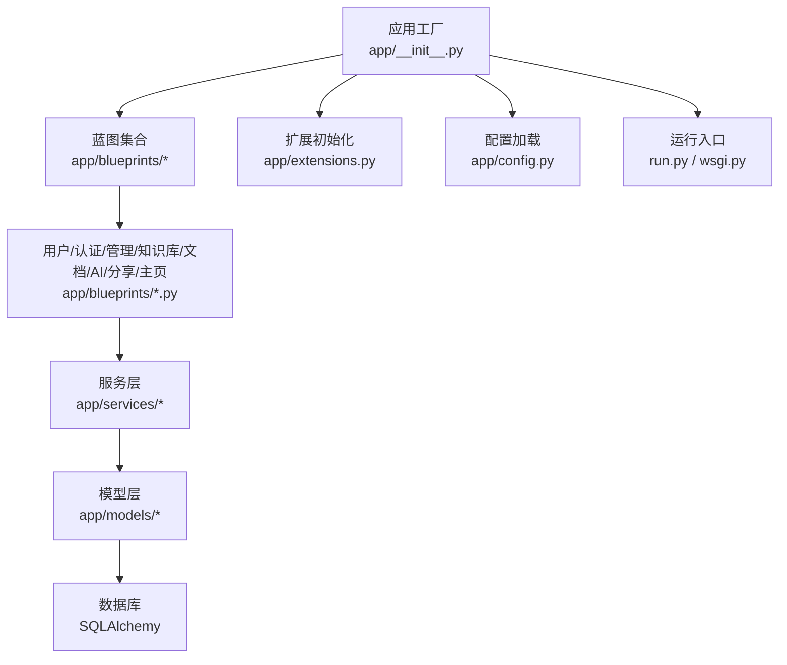
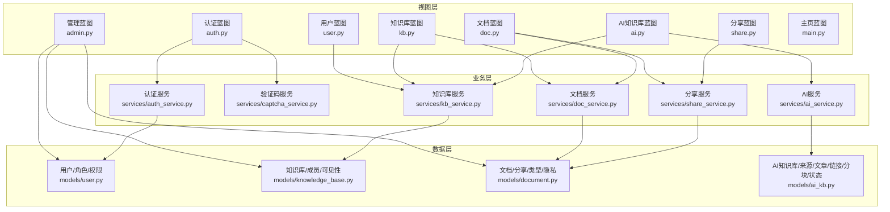
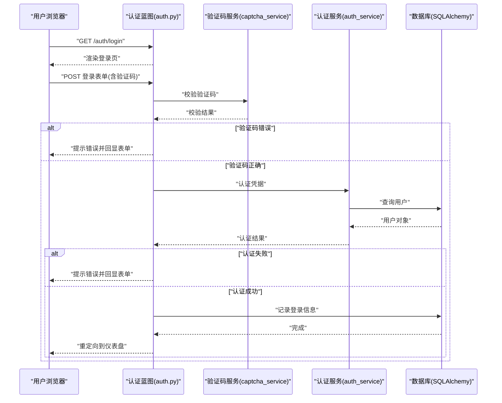
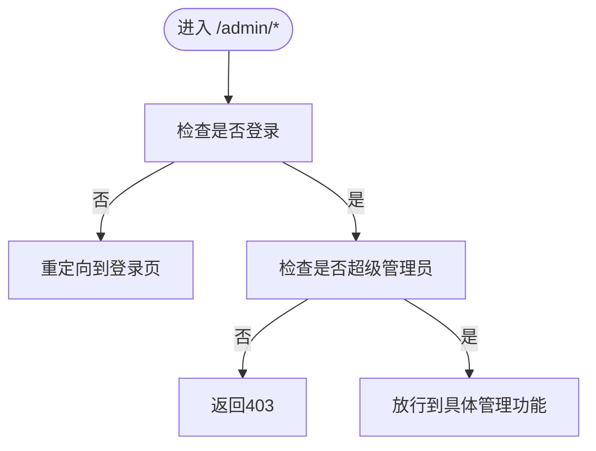
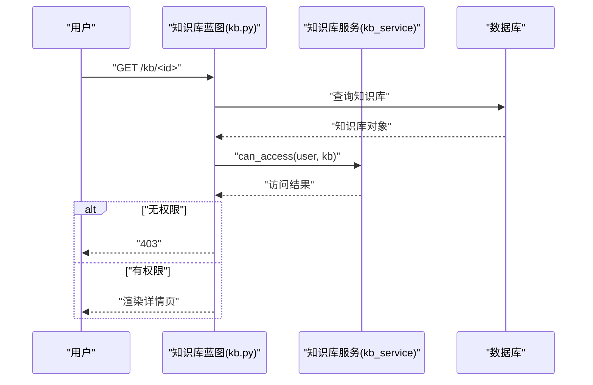
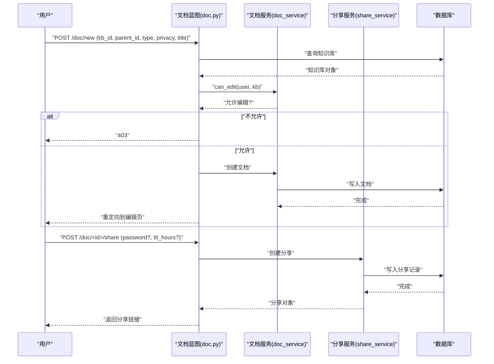
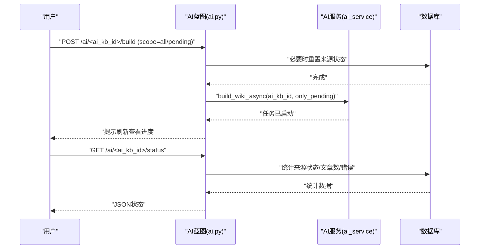
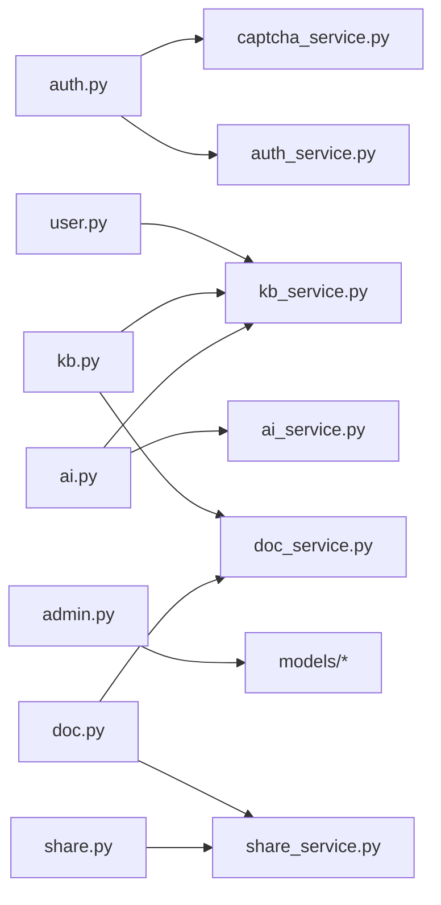

# 核心模块

<cite>
**本文引用的文件**
- [README.md](file://README.md)
- [app/__init__.py](file://app/__init__.py)
- [app/config.py](file://app/config.py)
- [app/extensions.py](file://app/extensions.py)
- [app/blueprints/__init__.py](file://app/blueprints/__init__.py)
- [app/blueprints/auth.py](file://app/blueprints/auth.py)
- [app/blueprints/user.py](file://app/blueprints/user.py)
- [app/blueprints/admin.py](file://app/blueprints/admin.py)
- [app/blueprints/kb.py](file://app/blueprints/kb.py)
- [app/blueprints/doc.py](file://app/blueprints/doc.py)
- [app/blueprints/ai.py](file://app/blueprints/ai.py)
- [app/blueprints/share.py](file://app/blueprints/share.py)
- [app/blueprints/main.py](file://app/blueprints/main.py)
- [app/models/__init__.py](file://app/models/__init__.py)
- [app/services/__init__.py](file://app/services/__init__.py)
- [requirements.txt](file://requirements.txt)
- [run.py](file://run.py)
- [wsgi.py](file://wsgi.py)
</cite>

## 目录
1. [简介](#简介)
2. [项目结构](#项目结构)
3. [核心组件](#核心组件)
4. [架构总览](#架构总览)
5. [详细组件分析](#详细组件分析)
6. [依赖分析](#依赖分析)
7. [性能考虑](#性能考虑)
8. [故障排查指南](#故障排查指南)
9. [结论](#结论)
10. [附录](#附录)

## 简介
本文件面向My Wiki的核心模块，系统性梳理用户系统、知识库管理、文档管理、AI知识库、权限与共享等模块的设计与实现，明确模块职责边界、接口契约、数据模型与业务流程，并给出交互关系图、序列图与最佳实践建议，帮助开发者快速理解并扩展系统。

## 项目结构
应用采用Flask应用工厂模式，按“蓝图+服务层+模型层”的分层组织方式构建。核心入口通过应用工厂创建Flask实例，注册扩展、蓝图、错误处理、上下文变量与CLI命令；配置集中于配置类，支持开发、生产与测试环境；依赖通过requirements声明。

图表来源
- [app/__init__.py:11-28](file://app/__init__.py#L11-L28)
- [app/config.py:80-83](file://app/config.py#L80-L83)
- [app/extensions.py:8-11](file://app/extensions.py#L8-L11)

章节来源
- [README.md:1-3](file://README.md#L1-L3)
- [app/__init__.py:11-28](file://app/__init__.py#L11-L28)
- [app/config.py:15-54](file://app/config.py#L15-L54)
- [requirements.txt:1-22](file://requirements.txt#L1-22)
- [run.py:7-16](file://run.py#L7-L16)
- [wsgi.py:7-9](file://wsgi.py#L7-L9)

## 核心组件
- 应用工厂与生命周期
  - 负责创建Flask实例、加载配置、确保实例目录、注册扩展、蓝图、错误处理器、上下文变量与CLI。
  - 关键路径：[app/__init__.py:11-28](file://app/__init__.py#L11-L28)，[app/__init__.py:31-54](file://app/__init__.py#L31-L54)，[app/__init__.py:56-74](file://app/__init__.py#L56-L74)，[app/__init__.py:76-88](file://app/__init__.py#L76-L88)，[app/__init__.py:90-101](file://app/__init__.py#L90-L101)。
- 配置中心
  - 统一管理数据库、会话、上传、AI/OpenAI、RAG、分页、验证码等参数，支持多环境映射。
  - 关键路径：[app/config.py:15-54](file://app/config.py#L15-L54)，[app/config.py:73-83](file://app/config.py#L73-L83)。
- 扩展注册
  - 注册SQLAlchemy、Flask-Migrate、Flask-Login、CSRF保护，并设置登录视图与消息。
  - 关键路径：[app/extensions.py:8-17](file://app/extensions.py#L8-L17)。

章节来源
- [app/__init__.py:11-28](file://app/__init__.py#L11-L28)
- [app/config.py:15-54](file://app/config.py#L15-L54)
- [app/extensions.py:8-17](file://app/extensions.py#L8-L17)

## 架构总览
My Wiki采用典型的Web MVC分层：
- 视图层：蓝图路由定义HTTP接口，模板渲染页面。
- 业务层：服务层封装领域逻辑，协调模型与外部能力（如OpenAI）。
- 数据层：SQLAlchemy模型与数据库交互。
- 外部集成：OpenAI API、可选RAG向量库（通过配置开关启用）。

图表来源
- [app/blueprints/auth.py:1-85](file://app/blueprints/auth.py#L1-L85)
- [app/blueprints/user.py:1-35](file://app/blueprints/user.py#L1-L35)
- [app/blueprints/admin.py:1-217](file://app/blueprints/admin.py#L1-L217)
- [app/blueprints/kb.py:1-141](file://app/blueprints/kb.py#L1-L141)
- [app/blueprints/doc.py:1-139](file://app/blueprints/doc.py#L1-L139)
- [app/blueprints/ai.py:1-279](file://app/blueprints/ai.py#L1-L279)
- [app/blueprints/share.py:1-42](file://app/blueprints/share.py#L1-L42)
- [app/blueprints/main.py:1-16](file://app/blueprints/main.py#L1-L16)
- [app/models/__init__.py:1-38](file://app/models/__init__.py#L1-L38)

## 详细组件分析

### 用户系统与认证授权
- 功能要点
  - 提供图形化注册、登录、登出流程，集成验证码校验。
  - 登录后通过Flask-Login维护会话，未登录访问受保护路由时跳转至登录页。
  - 支持超级管理员全局访问守卫。
- 关键接口
  - GET/POST /auth/register：表单提交验证与注册，成功后自动登录并记录登录信息。
  - GET/POST /auth/login：表单提交验证与登录，支持“记住我”。
  - POST /auth/logout：安全登出。
  - GET /auth/captcha：生成验证码图片。
- 安全与会话
  - 使用CSRF保护，Cookie属性严格，登录视图指向auth.login。
- 服务与模型
  - 服务层负责验证与持久化；模型层包含用户、角色、权限及其关联表。

图表来源
- [app/blueprints/auth.py:51-76](file://app/blueprints/auth.py#L51-L76)
- [app/blueprints/auth.py:10-16](file://app/blueprints/auth.py#L10-L16)
- [app/extensions.py:14-16](file://app/extensions.py#L14-L16)

章节来源
- [app/blueprints/auth.py:19-48](file://app/blueprints/auth.py#L19-L48)
- [app/blueprints/auth.py:51-76](file://app/blueprints/auth.py#L51-L76)
- [app/blueprints/auth.py:79-84](file://app/blueprints/auth.py#L79-L84)
- [app/blueprints/auth.py:10-16](file://app/blueprints/auth.py#L10-L16)
- [app/extensions.py:14-16](file://app/extensions.py#L14-L16)

### 管理员与权限控制
- 功能要点
  - 基于before_request的守卫：未登录重定向，非超级管理员返回403。
  - 用户管理：启用/停用、重置密码、分配角色。
  - 角色与权限：增删改查、批量赋权。
  - 公共知识库与公开文档治理：下架/私有化。
- 关键接口
  - GET /admin：系统概览统计。
  - GET/POST /admin/users：列表、启用/停用、重置密码、分配角色。
  - GET/POST /admin/roles：新增角色、赋权、删除（系统角色不可删）。
  - GET /admin/public-kbs 与 /admin/public-docs：公共资源治理。
- 权限模型
  - 用户具备布尔字段is_super_admin；角色-权限通过中间表解耦。

图表来源
- [app/blueprints/admin.py:15-22](file://app/blueprints/admin.py#L15-L22)

章节来源
- [app/blueprints/admin.py:15-22](file://app/blueprints/admin.py#L15-L22)
- [app/blueprints/admin.py:38-86](file://app/blueprints/admin.py#L38-L86)
- [app/blueprints/admin.py:88-132](file://app/blueprints/admin.py#L88-L132)
- [app/blueprints/admin.py:136-167](file://app/blueprints/admin.py#L136-L167)
- [app/blueprints/admin.py:171-217](file://app/blueprints/admin.py#L171-L217)

### 知识库管理
- 功能要点
  - 创建、编辑、删除（归档）、成员管理（添加/移除成员，设置角色）。
  - 可见性控制：私有/公开/受限。
  - 访问控制：仅拥有者或被授权成员可编辑/管理。
- 关键接口
  - GET /kb：按tab（mine/public）列出知识库。
  - GET/POST /kb/new：新建知识库。
  - GET /kb/<id>：详情页，计算可编辑/可管理权限位。
  - GET/POST /kb/<id>/edit：修改元信息与可见性。
  - POST /kb/<id>/delete：归档知识库。
  - GET/POST /kb/<id>/members：成员列表与添加成员。
  - POST /kb/<id>/members/<user_id>/delete：移除成员。
- 服务与模型
  - 服务层封装访问/编辑/管理判定与成员操作；模型层包含知识库、成员、可见性枚举与成员角色。

图表来源
- [app/blueprints/kb.py:56-72](file://app/blueprints/kb.py#L56-L72)
- [app/blueprints/kb.py:14-18](file://app/blueprints/kb.py#L14-L18)

章节来源
- [app/blueprints/kb.py:21-29](file://app/blueprints/kb.py#L21-L29)
- [app/blueprints/kb.py:32-53](file://app/blueprints/kb.py#L32-L53)
- [app/blueprints/kb.py:56-72](file://app/blueprints/kb.py#L56-L72)
- [app/blueprints/kb.py:75-91](file://app/blueprints/kb.py#L75-L91)
- [app/blueprints/kb.py:94-103](file://app/blueprints/kb.py#L94-L103)
- [app/blueprints/kb.py:106-129](file://app/blueprints/kb.py#L106-L129)
- [app/blueprints/kb.py:132-140](file://app/blueprints/kb.py#L132-L140)

### 文档管理
- 功能要点
  - 新建文档（支持类型与隐私），树形导航，大纲提取，Markdown内容编辑，删除（软删除）。
  - 分享：为文档生成带有效期与可选口令的分享链接，支持撤销。
- 关键接口
  - POST /doc/new：基于知识库ID与父节点创建文档。
  - GET /doc/<id>：查看文档，渲染树与大纲。
  - GET /doc/<id>/edit：编辑页。
  - POST /doc/<id>/save：保存标题、内容与隐私。
  - POST /doc/<id>/delete：删除文档及后代。
  - GET/POST /doc/<id>/share：生成/撤销分享。
  - POST /share/<token>：分享页访问，支持口令解锁。
- 服务与工具
  - 服务层负责文档创建/更新/树构建/分享创建/撤销；工具层提供大纲提取。
  - 模型层包含文档、分享、类型与隐私枚举。

图表来源
- [app/blueprints/doc.py:20-41](file://app/blueprints/doc.py#L20-L41)
- [app/blueprints/doc.py:103-124](file://app/blueprints/doc.py#L103-L124)
- [app/blueprints/share.py:22-41](file://app/blueprints/share.py#L22-L41)

章节来源
- [app/blueprints/doc.py:20-41](file://app/blueprints/doc.py#L20-L41)
- [app/blueprints/doc.py:43-55](file://app/blueprints/doc.py#L43-L55)
- [app/blueprints/doc.py:58-66](file://app/blueprints/doc.py#L58-L66)
- [app/blueprints/doc.py:69-84](file://app/blueprints/doc.py#L69-L84)
- [app/blueprints/doc.py:87-100](file://app/blueprints/doc.py#L87-L100)
- [app/blueprints/doc.py:103-124](file://app/blueprints/doc.py#L103-L124)
- [app/blueprints/doc.py:127-139](file://app/blueprints/doc.py#L127-L139)
- [app/blueprints/share.py:22-41](file://app/blueprints/share.py#L22-L41)

### AI知识库（Karpathy LLM Wiki风格）
- 功能要点
  - 创建/编辑/删除AI知识库，配置聊天模型与RAG开关。
  - 来源管理：从自有或成员知识库中选择文档作为来源。
  - 构建流程：异步构建文章与链接，支持仅重建待定来源。
  - 浏览：按标签分组的文章列表、文章详情、反链展示、图谱可视化。
  - 对话：可选RAG或纯聊天，调用服务层封装的AI能力。
- 关键接口
  - GET/POST /ai/new：新建AI知识库。
  - GET /ai/<ai_kb_id>：来源与文章概览。
  - GET /ai/<ai_kb_id>/sources：来源选择与移除。
  - POST /ai/<ai_kb_id>/sources/add：批量加入来源。
  - POST /ai/<ai_kb_id>/build：触发构建任务。
  - GET /ai/<ai_kb_id>/status：查询构建状态与统计。
  - GET /ai/<ai_kb_id>/wiki：文章索引。
  - GET /ai/<ai_kb_id>/wiki/<slug>：文章详情，内部链接重写为站内URL。
  - POST /ai/<ai_kb_id>/wiki/<slug>/regenerate：再生单篇文章。
  - GET /ai/<ai_kb_id>/graph：文章链接图。
  - GET/POST /ai/<ai_kb_id>/chat：问答接口。
- 服务与模型
  - 服务层封装构建、再生、对话、解析器；模型层包含AI知识库、来源、文章、链接、分块与状态枚举。

图表来源
- [app/blueprints/ai.py:143-156](file://app/blueprints/ai.py#L143-L156)
- [app/blueprints/ai.py:159-173](file://app/blueprints/ai.py#L159-L173)

章节来源
- [app/blueprints/ai.py:27-32](file://app/blueprints/ai.py#L27-L32)
- [app/blueprints/ai.py:88-139](file://app/blueprints/ai.py#L88-L139)
- [app/blueprints/ai.py:141-174](file://app/blueprints/ai.py#L141-L174)
- [app/blueprints/ai.py:176-249](file://app/blueprints/ai.py#L176-L249)
- [app/blueprints/ai.py:251-261](file://app/blueprints/ai.py#L251-L261)
- [app/blueprints/ai.py:265-279](file://app/blueprints/ai.py#L265-L279)

### 用户仪表盘与主页
- 主页
  - 未登录显示公开知识库列表，登录后重定向到仪表盘。
- 仪表盘
  - 展示我的知识库、公开知识库、最近文档、AI知识库与计数。

章节来源
- [app/blueprints/main.py:10-15](file://app/blueprints/main.py#L10-L15)
- [app/blueprints/user.py:12-28](file://app/blueprints/user.py#L12-L28)

## 依赖分析
- 模块耦合
  - 蓝图依赖服务层进行业务处理，服务层依赖模型层与配置/扩展。
  - 管理蓝图对用户、知识库、文档模型有直接读写依赖。
  - AI蓝图依赖知识库服务以筛选可用文档作为来源。
- 外部依赖
  - OpenAI SDK用于对话与嵌入；可选RAG依赖向量库（通过配置开关启用）。
- 循环依赖
  - 当前结构通过蓝图-服务-模型分层避免循环导入；若新增跨层调用需谨慎重构。

图表来源
- [app/blueprints/auth.py:5-6](file://app/blueprints/auth.py#L5-L6)
- [app/blueprints/user.py:7](file://app/blueprints/user.py#L7)
- [app/blueprints/admin.py:6-9](file://app/blueprints/admin.py#L6-L9)
- [app/blueprints/kb.py:9](file://app/blueprints/kb.py#L9)
- [app/blueprints/doc.py:7](file://app/blueprints/doc.py#L7)
- [app/blueprints/ai.py:12](file://app/blueprints/ai.py#L12)
- [app/blueprints/share.py:7](file://app/blueprints/share.py#L7)

章节来源
- [requirements.txt:18-22](file://requirements.txt#L18-L22)

## 性能考虑
- 数据库连接池
  - 启用pool_pre_ping与合理pool_recycle，降低连接失效导致的异常。
- 查询优化
  - 列表页使用分页与限制数量；树形/大纲提取在服务层进行，避免重复计算。
- 缓存与静态资源
  - 图片验证码不缓存，分享解锁使用会话存储，减少数据库压力。
- 异步构建
  - AI知识库构建与再生通过异步任务触发，避免阻塞请求线程。

## 故障排查指南
- 403/404错误
  - 管理蓝图对未登录与非超级管理员直接拦截；知识库/文档/AI知识库详情页对不可见/归档/删除状态返回404/403。
- 登录失败
  - 检查验证码是否正确且未过期；确认用户状态正常；核对凭据。
- 分享失效
  - 分享口令错误或已过期；确认分享记录有效且未被撤销。
- AI构建卡住
  - 查看状态接口返回的来源状态分布；确认来源文档仍存在且可访问；检查OpenAI配置与网络连通性。

章节来源
- [app/blueprints/admin.py:15-22](file://app/blueprints/admin.py#L15-L22)
- [app/blueprints/kb.py:14-18](file://app/blueprints/kb.py#L14-L18)
- [app/blueprints/doc.py:13-17](file://app/blueprints/doc.py#L13-L17)
- [app/blueprints/ai.py:18-24](file://app/blueprints/ai.py#L18-L24)
- [app/blueprints/share.py:22-26](file://app/blueprints/share.py#L22-L26)

## 结论
My Wiki以清晰的分层与模块化设计实现了从用户认证到知识库与文档管理，再到AI知识库与分享的完整能力闭环。通过服务层抽象业务规则、蓝图暴露RESTful接口、模型层承载数据契约，系统具备良好的可维护性与扩展性。建议在后续迭代中完善单元测试覆盖、引入更细粒度的权限校验与审计日志，并根据实际负载评估数据库与AI服务的性能瓶颈。

## 附录
- 配置项速览
  - 数据库：SQLALCHEMY_DATABASE_URI、SQLALCHEMY_ENGINE_OPTIONS
  - 会话与Cookie：SESSION_COOKIE_HTTPONLY、SESSION_COOKIE_SAMESITE、REMEMBER_COOKIE_DURATION
  - 上传与容量：UPLOAD_DIR、MAX_CONTENT_LENGTH
  - AI与RAG：OPENAI_BASE_URL、OPENAI_API_KEY、CHAT_MODEL、ENABLE_RAG、EMBEDDING_MODEL、CHROMA_PATH
  - 验证码：CAPTCHA_TTL_SECONDS
  - 分页：DEFAULT_PAGE_SIZE
- 运行方式
  - 开发：通过run.py加载.env并启动Flask开发服务器。
  - 生产：通过wsgi.py加载.env并部署至WSGI容器。

章节来源
- [app/config.py:15-54](file://app/config.py#L15-L54)
- [run.py:7-16](file://run.py#L7-L16)
- [wsgi.py:7-9](file://wsgi.py#L7-L9)