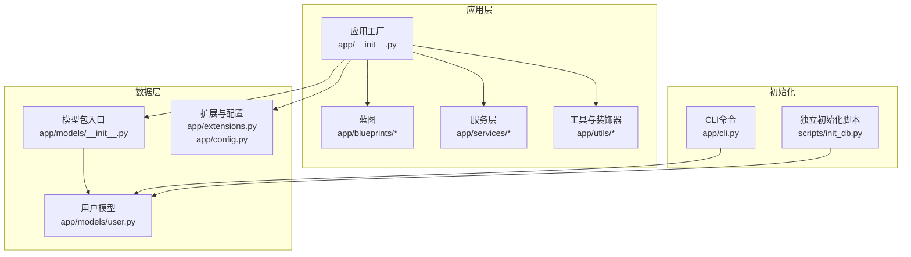
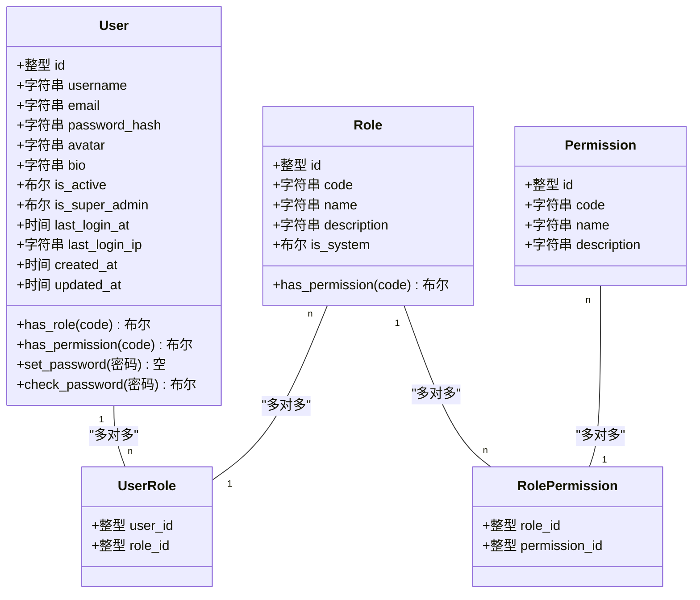
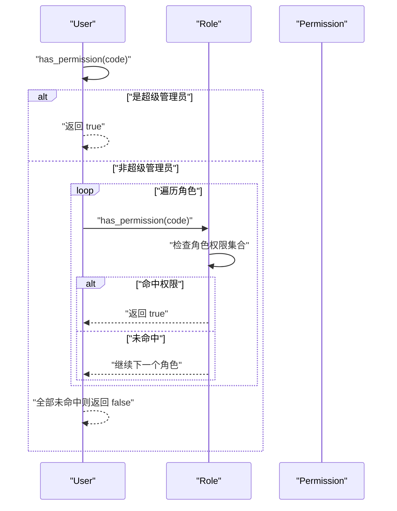
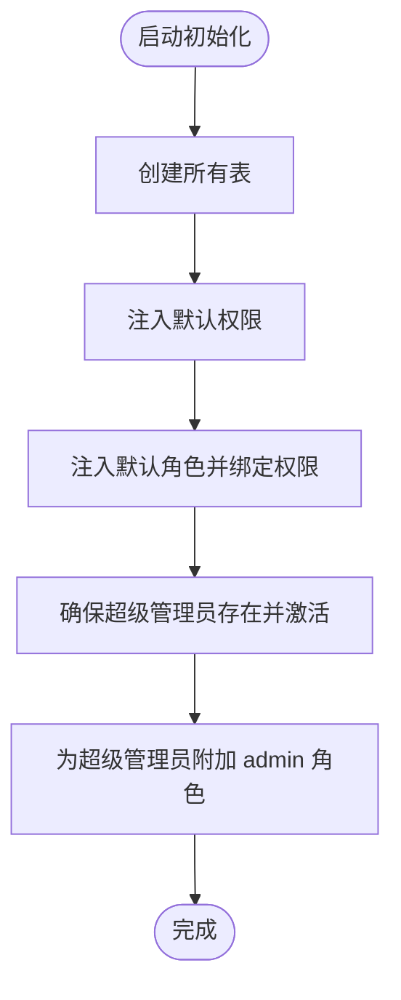
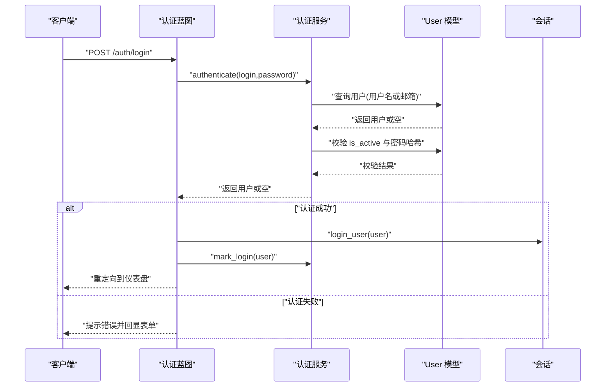

# 用户数据模型

<cite>
**本文引用的文件**
- [app/models/user.py](file://app/models/user.py)
- [app/models/__init__.py](file://app/models/__init__.py)
- [app/extensions.py](file://app/extensions.py)
- [app/config.py](file://app/config.py)
- [app/cli.py](file://app/cli.py)
- [app/services/auth_service.py](file://app/services/auth_service.py)
- [app/utils/decorators.py](file://app/utils/decorators.py)
- [app/blueprints/admin.py](file://app/blueprints/admin.py)
- [app/__init__.py](file://app/__init__.py)
- [scripts/init_db.py](file://scripts/init_db.py)
</cite>

## 目录
1. [简介](#简介)
2. [项目结构](#项目结构)
3. [核心组件](#核心组件)
4. [架构总览](#架构总览)
5. [详细组件分析](#详细组件分析)
6. [依赖分析](#依赖分析)
7. [性能考虑](#性能考虑)
8. [故障排查指南](#故障排查指南)
9. [结论](#结论)
10. [附录](#附录)

## 简介
本文件面向开发者与运维人员，系统化阐述用户数据模型的设计与实现，覆盖 User、Role、Permission 及其关联模型（UserRole、RolePermission）的字段定义、数据类型约束、业务规则与安全策略；解释多对多关系映射、密码哈希存储、角色继承机制、权限检查流程；提供模型关系图与数据表结构说明，并给出扩展指南与最佳实践建议。

## 项目结构
用户数据模型位于应用的模型层，采用 Flask-SQLAlchemy 的 ORM 映射，配合 Flask-Login 实现认证会话，配合自定义装饰器实现权限控制。初始化流程通过 CLI 命令与脚本完成默认角色/权限的注入与超级管理员账户的创建。

图表来源
- [app/__init__.py:11-28](file://app/__init__.py#L11-L28)
- [app/models/__init__.py:1-38](file://app/models/__init__.py#L1-L38)
- [app/models/user.py:10-103](file://app/models/user.py#L10-L103)
- [app/cli.py:61-95](file://app/cli.py#L61-L95)
- [scripts/init_db.py:23-47](file://scripts/init_db.py#L23-L47)

章节来源
- [app/__init__.py:11-28](file://app/__init__.py#L11-L28)
- [app/models/__init__.py:1-38](file://app/models/__init__.py#L1-L38)
- [app/models/user.py:10-103](file://app/models/user.py#L10-L103)
- [app/cli.py:61-95](file://app/cli.py#L61-L95)
- [scripts/init_db.py:23-47](file://scripts/init_db.py#L23-L47)

## 核心组件
本节聚焦 User、Role、Permission 及其关联模型的职责与交互。

- User：用户实体，负责身份标识、认证凭据、激活状态、登录信息、角色集合与权限检查。
- Role：角色实体，负责角色标识、名称描述、系统内置标记与权限集合。
- Permission：权限实体，负责权限标识码、名称与描述。
- UserRole：用户-角色关联表，实现用户与角色的多对多映射。
- RolePermission：角色-权限关联表，实现角色与权限的多对多映射。

章节来源
- [app/models/user.py:55-103](file://app/models/user.py#L55-L103)
- [app/models/user.py:33-52](file://app/models/user.py#L33-L52)
- [app/models/user.py:22-30](file://app/models/user.py#L22-L30)
- [app/models/user.py:10-13](file://app/models/user.py#L10-L13)
- [app/models/user.py:16-19](file://app/models/user.py#L16-L19)

## 架构总览
用户数据模型采用 RBAC（基于角色的访问控制）架构，通过多对多关系实现灵活的权限组合。User 持有 roles 关系，Role 持有 permissions 关系，User 的 has_permission 方法在检查自身 is_super_admin 后，遍历角色链路进行权限判定。

图表来源
- [app/models/user.py:55-103](file://app/models/user.py#L55-L103)
- [app/models/user.py:33-52](file://app/models/user.py#L33-L52)
- [app/models/user.py:22-30](file://app/models/user.py#L22-L30)
- [app/models/user.py:10-13](file://app/models/user.py#L10-L13)
- [app/models/user.py:16-19](file://app/models/user.py#L16-L19)

## 详细组件分析

### User 实体
- 字段与约束
  - 身份标识：id 主键；username、email 唯一且建立索引，便于登录与检索。
  - 凭据与安全：password_hash 存储哈希值；is_active 控制账户启用；is_super_admin 提供超级管理员豁免。
  - 登录追踪：last_login_at、last_login_ip 记录最近登录信息。
  - 时间戳：created_at 默认当前时间，updated_at 自动更新。
  - 属性：display_name 返回 username。
- 关系
  - roles：通过中间表 user_roles 与 Role 多对多关联，使用 joined 策略减少 N+1 查询。
- 权限与角色检查
  - has_role：按 code 判断是否拥有某角色。
  - has_permission：若 is_super_admin 则直接放行；否则遍历角色，调用角色的 has_permission 进行判定。
- 安全方法
  - set_password：使用 Werkzeug 生成密码哈希。
  - check_password：验证输入密码与哈希值。

章节来源
- [app/models/user.py:58-70](file://app/models/user.py#L58-L70)
- [app/models/user.py:72-77](file://app/models/user.py#L72-L77)
- [app/models/user.py:81-85](file://app/models/user.py#L81-L85)
- [app/models/user.py:87-96](file://app/models/user.py#L87-L96)
- [app/models/user.py:98-100](file://app/models/user.py#L98-L100)

### Role 实体
- 字段与约束
  - 标识：id 主键；code 唯一且建立索引；name 描述性名称；description 描述；is_system 标记系统内置角色。
- 关系
  - permissions：通过中间表 role_permissions 与 Permission 多对多关联，使用 joined 策略。
- 权限检查
  - has_permission：判断角色是否包含指定 code 的权限。

章节来源
- [app/models/user.py:35-39](file://app/models/user.py#L35-L39)
- [app/models/user.py:41-46](file://app/models/user.py#L41-L46)
- [app/models/user.py:48-49](file://app/models/user.py#L48-L49)

### Permission 实体
- 字段与约束
  - 标识：id 主键；code 唯一且建立索引；name 描述性名称；description 描述。
- 用途
  - 作为最小权限单元，被角色持有，最终由用户继承。

章节来源
- [app/models/user.py:24-27](file://app/models/user.py#L24-L27)

### 关联模型
- UserRole（用户-角色）
  - user_id、role_id 组成复合主键；外键级联删除保证数据一致性。
- RolePermission（角色-权限）
  - role_id、permission_id 组成复合主键；外键级联删除保证数据一致性。

章节来源
- [app/models/user.py:10-13](file://app/models/user.py#L10-L13)
- [app/models/user.py:16-19](file://app/models/user.py#L16-L19)

### 权限检查流程（序列图）

图表来源
- [app/models/user.py:90-96](file://app/models/user.py#L90-L96)
- [app/models/user.py:48-49](file://app/models/user.py#L48-L49)

### 数据表结构说明
- users 表
  - id、username（唯一+索引）、email（唯一+索引）、password_hash、avatar、bio、is_active、is_super_admin（索引）、last_login_at、last_login_ip、created_at、updated_at。
- roles 表
  - id、code（唯一+索引）、name、description、is_system。
- permissions 表
  - id、code（唯一+索引）、name、description。
- user_roles 表（中间表）
  - user_id（外键 users.id，级联删除）、role_id（外键 roles.id，级联删除）。
- role_permissions 表（中间表）
  - role_id（外键 roles.id，级联删除）、permission_id（外键 permissions.id，级联删除）。

章节来源
- [app/models/user.py:58-70](file://app/models/user.py#L58-L70)
- [app/models/user.py:35-39](file://app/models/user.py#L35-L39)
- [app/models/user.py:24-27](file://app/models/user.py#L24-L27)
- [app/models/user.py:10-13](file://app/models/user.py#L10-L13)
- [app/models/user.py:16-19](file://app/models/user.py#L16-L19)

### 初始化与默认数据（流程图）

图表来源
- [app/cli.py:61-95](file://app/cli.py#L61-L95)
- [app/cli.py:41-58](file://app/cli.py#L41-L58)
- [scripts/init_db.py:23-47](file://scripts/init_db.py#L23-L47)

### 权限装饰器与使用
- super_admin_required：仅允许 is_super_admin=True 的用户访问受保护视图。
- permission_required(code)：要求当前用户具备指定权限 code，超级管理员自动放行。
- 在蓝图中广泛用于路由保护，如管理员后台、用户管理、角色管理等。

章节来源
- [app/utils/decorators.py:8-18](file://app/utils/decorators.py#L8-L18)
- [app/utils/decorators.py:21-32](file://app/utils/decorators.py#L21-L32)
- [app/blueprints/admin.py:15-22](file://app/blueprints/admin.py#L15-L22)
- [app/blueprints/admin.py:90-117](file://app/blueprints/admin.py#L90-L117)

### 认证与登录流程（序列图）

图表来源
- [app/blueprints/auth.py:51-76](file://app/blueprints/auth.py#L51-L76)
- [app/services/auth_service.py:44-50](file://app/services/auth_service.py#L44-L50)
- [app/services/auth_service.py:53-56](file://app/services/auth_service.py#L53-L56)
- [app/__init__.py:48-53](file://app/__init__.py#L48-L53)

## 依赖分析
- 模型依赖
  - User 依赖 Role 与 Permission 的关系；Role 依赖 Permission 的关系；UserRole、RolePermission 作为中间表分别连接 User-Role、Role-Permission。
- 应用依赖
  - Flask-Login 提供 UserMixin 与会话管理；Werkzeug 提供密码哈希；Flask-SQLAlchemy 提供 ORM；Flask-Migrate 提供迁移能力。
- 初始化依赖
  - CLI 命令与独立脚本共同完成数据库初始化、默认角色/权限注入与超级管理员创建。

图表来源
- [app/models/user.py:55-103](file://app/models/user.py#L55-L103)
- [app/models/user.py:33-52](file://app/models/user.py#L33-L52)
- [app/models/user.py:22-30](file://app/models/user.py#L22-L30)
- [app/models/user.py:10-13](file://app/models/user.py#L10-L13)
- [app/models/user.py:16-19](file://app/models/user.py#L16-L19)

章节来源
- [app/models/user.py:55-103](file://app/models/user.py#L55-L103)
- [app/models/user.py:33-52](file://app/models/user.py#L33-L52)
- [app/models/user.py:22-30](file://app/models/user.py#L22-L30)
- [app/models/user.py:10-13](file://app/models/user.py#L10-L13)
- [app/models/user.py:16-19](file://app/models/user.py#L16-L19)

## 性能考虑
- 关系加载策略
  - 使用 joined 策略加载 roles 与 permissions，避免 N+1 查询问题，适合中等规模数据集。
- 索引优化
  - username、email、code 字段建立唯一索引，加速查找与去重。
- 密码哈希成本
  - 使用 Werkzeug 默认哈希算法，兼顾安全性与性能；如需更强安全可调整哈希参数（需在应用层扩展）。
- 批量操作
  - 初始化时使用 flush 与 commit 分离，减少重复提交开销。

[本节为通用指导，无需特定文件来源]

## 故障排查指南
- 登录失败
  - 检查用户是否存在、是否激活、密码是否正确；确认认证服务的查询逻辑与哈希校验。
- 权限不足
  - 确认用户是否为超级管理员；检查用户角色是否包含目标权限；确认权限 code 是否正确。
- 角色/权限缺失
  - 重新执行初始化命令或脚本，确保默认角色与权限已注入；检查数据库中是否存在重复 code 导致冲突。
- 会话异常
  - 检查 Flask-Login 的用户加载器是否正确返回用户对象；确认会话配置与 Cookie 设置。

章节来源
- [app/services/auth_service.py:44-50](file://app/services/auth_service.py#L44-L50)
- [app/models/user.py:90-96](file://app/models/user.py#L90-L96)
- [app/cli.py:61-95](file://app/cli.py#L61-L95)
- [app/__init__.py:48-53](file://app/__init__.py#L48-L53)

## 结论
本用户数据模型以清晰的 RBAC 设计实现了灵活的角色与权限体系：User 通过多对多关系继承角色，角色通过多对多关系继承权限，超级管理员拥有全局豁免权。配合 Flask-Login 与装饰器，形成从认证到授权的一体化安全框架。初始化流程确保系统在首次部署时具备可用的默认角色与权限，便于快速上线与后续扩展。

[本节为总结，无需特定文件来源]

## 附录

### 字段与约束一览（摘要）
- users
  - id（主键）、username（唯一+索引）、email（唯一+索引）、password_hash、avatar、bio、is_active、is_super_admin（索引）、last_login_at、last_login_ip、created_at、updated_at。
- roles
  - id（主键）、code（唯一+索引）、name、description、is_system。
- permissions
  - id（主键）、code（唯一+索引）、name、description。
- user_roles
  - user_id（外键 users.id，级联删除）、role_id（外键 roles.id，级联删除）。
- role_permissions
  - role_id（外键 roles.id，级联删除）、permission_id（外键 permissions.id，级联删除）。

章节来源
- [app/models/user.py:58-70](file://app/models/user.py#L58-L70)
- [app/models/user.py:35-39](file://app/models/user.py#L35-L39)
- [app/models/user.py:24-27](file://app/models/user.py#L24-L27)
- [app/models/user.py:10-13](file://app/models/user.py#L10-L13)
- [app/models/user.py:16-19](file://app/models/user.py#L16-L19)

### 最佳实践建议
- 权限设计
  - 将权限拆分为细粒度原子操作，通过角色聚合，避免在业务层硬编码权限判断。
- 角色继承
  - 使用系统内置角色作为基线，自定义角色仅叠加必要权限，降低维护复杂度。
- 安全加固
  - 强制启用 is_active 与 is_super_admin 字段；定期轮换超级管理员密码；限制登录失败次数与频率。
- 性能优化
  - 对高频查询字段建立索引；合理使用 joined 加载策略；避免在热路径上进行大量权限计算。
- 可观测性
  - 记录用户登录 IP 与时间；在权限拒绝处记录审计日志；监控角色/权限变更。
- 扩展指南
  - 新增权限：在 CLI 默认列表中添加，并在对应角色中绑定。
  - 新增角色：通过管理端或 CLI 创建，绑定所需权限。
  - 新增用户：通过 CLI 或管理端创建，分配基础角色。

[本节为通用指导，无需特定文件来源]