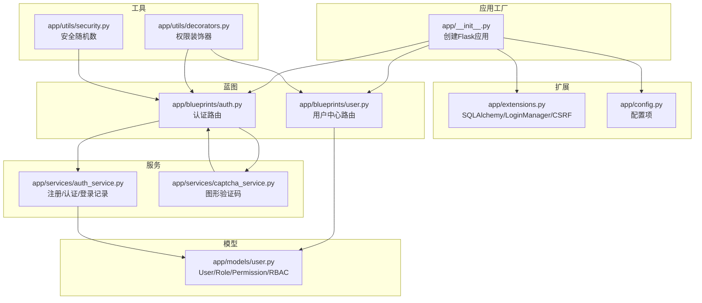
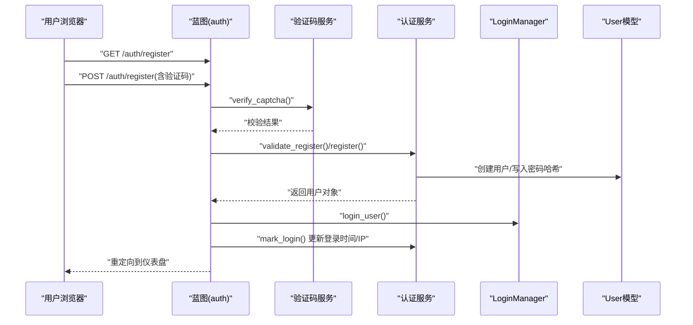
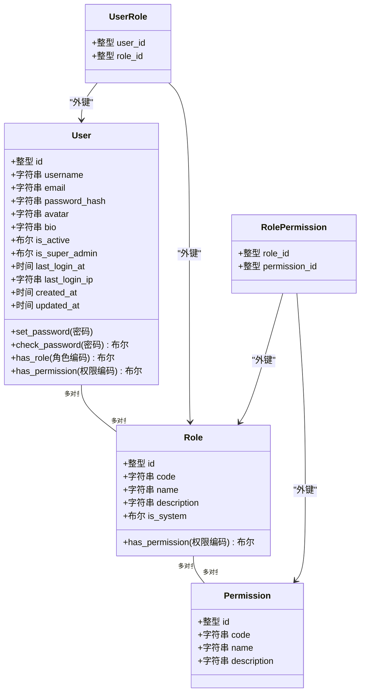
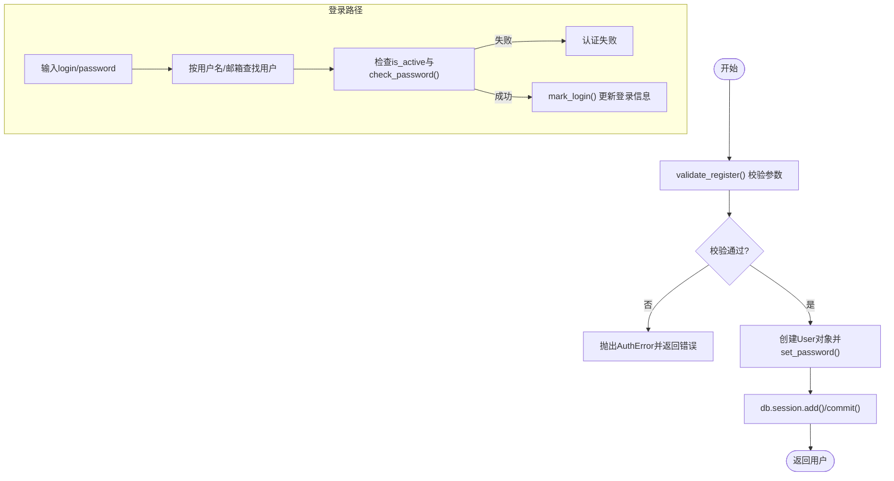
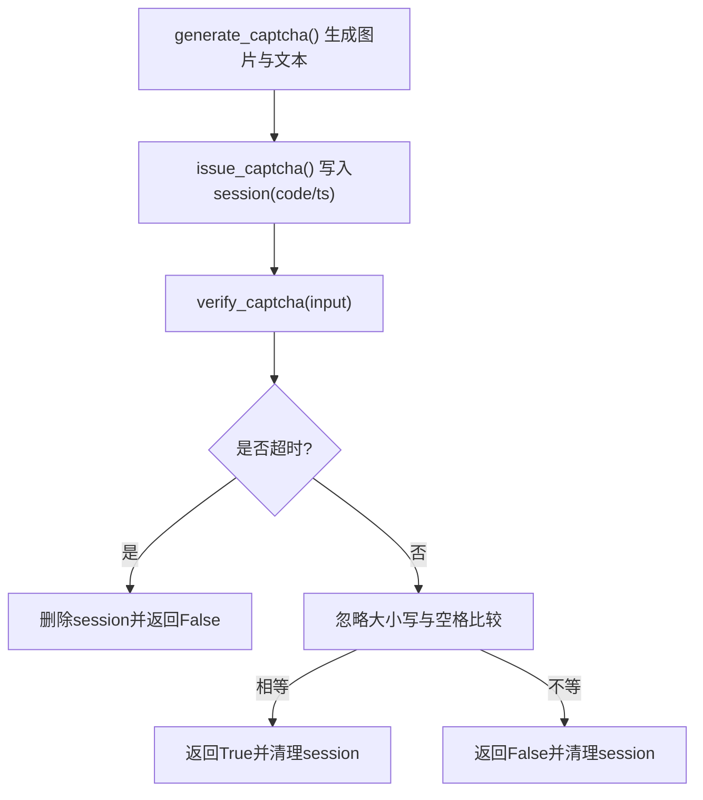
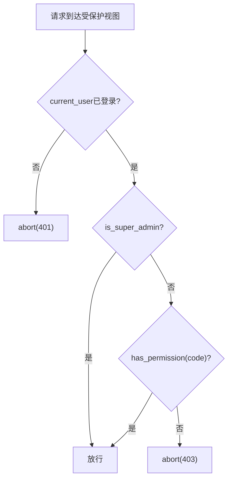
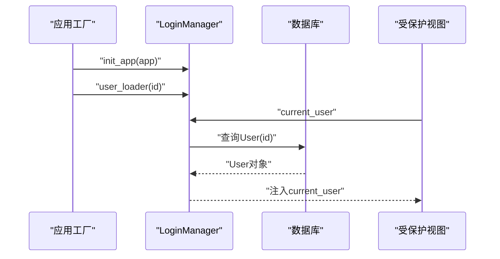
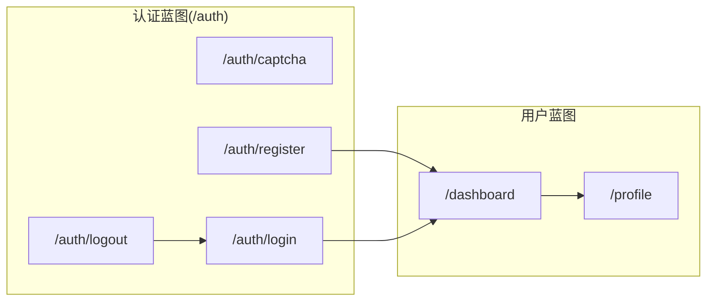
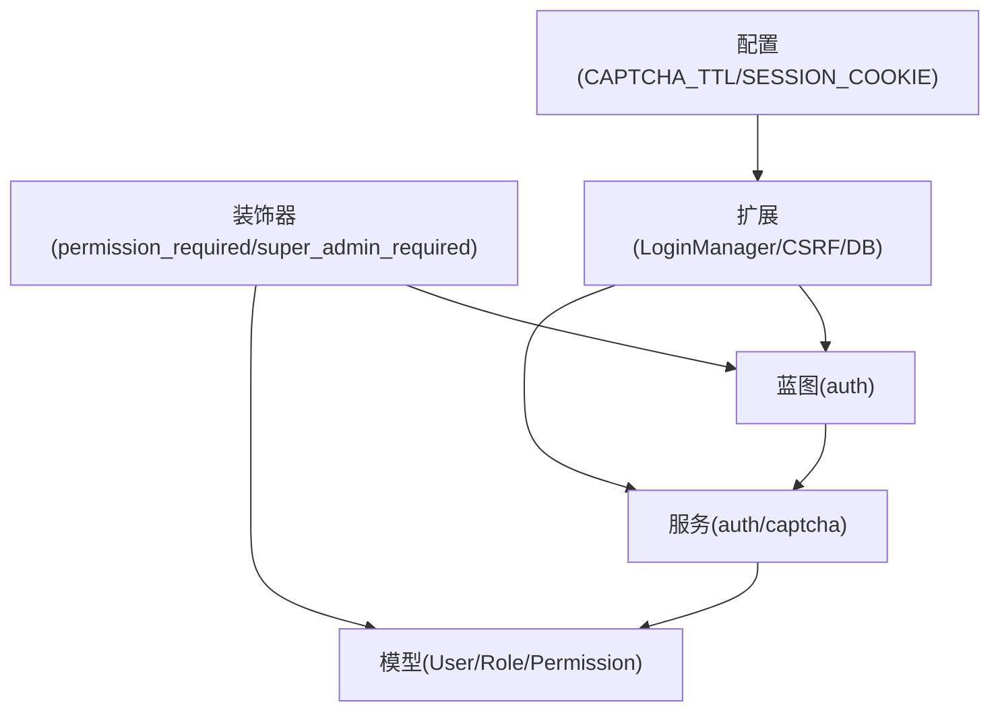

# 用户系统模块

<cite>
**本文引用的文件**
- [app/models/user.py](file://app/models/user.py)
- [app/services/auth_service.py](file://app/services/auth_service.py)
- [app/services/captcha_service.py](file://app/services/captcha_service.py)
- [app/blueprints/auth.py](file://app/blueprints/auth.py)
- [app/blueprints/user.py](file://app/blueprints/user.py)
- [app/utils/decorators.py](file://app/utils/decorators.py)
- [app/utils/security.py](file://app/utils/security.py)
- [app/extensions.py](file://app/extensions.py)
- [app/config.py](file://app/config.py)
- [app/__init__.py](file://app/__init__.py)
</cite>

## 目录
1. [简介](#简介)
2. [项目结构](#项目结构)
3. [核心组件](#核心组件)
4. [架构总览](#架构总览)
5. [详细组件分析](#详细组件分析)
6. [依赖分析](#依赖分析)
7. [性能考虑](#性能考虑)
8. [故障排查指南](#故障排查指南)
9. [结论](#结论)
10. [附录](#附录)

## 简介
本文件面向开发者与运维人员，系统化梳理用户系统模块的设计与实现，覆盖用户模型与RBAC权限模型、认证与会话管理、验证码服务、装饰器权限控制、以及与其他模块的集成方式。文档同时提供扩展指南与安全最佳实践，帮助在现有基础上进行二次开发与加固。

## 项目结构
用户系统相关代码主要分布在以下位置：
- 模型层：用户、角色、权限及其关联表
- 服务层：认证、验证码生成与校验
- 蓝图层：认证路由（注册/登录/登出/验证码）
- 工具层：权限装饰器、安全随机数
- 配置与初始化：应用工厂、扩展注册、登录管理器配置

图表来源
- [app/__init__.py:11-54](file://app/__init__.py#L11-L54)
- [app/extensions.py:8-16](file://app/extensions.py#L8-L16)
- [app/config.py:15-51](file://app/config.py#L15-L51)
- [app/blueprints/auth.py:1-85](file://app/blueprints/auth.py#L1-L85)
- [app/blueprints/user.py:1-35](file://app/blueprints/user.py#L1-L35)
- [app/services/auth_service.py:1-57](file://app/services/auth_service.py#L1-L57)
- [app/services/captcha_service.py:1-90](file://app/services/captcha_service.py#L1-L90)
- [app/models/user.py:10-104](file://app/models/user.py#L10-L104)
- [app/utils/decorators.py:1-33](file://app/utils/decorators.py#L1-L33)
- [app/utils/security.py:1-8](file://app/utils/security.py#L1-L8)

章节来源
- [app/__init__.py:11-74](file://app/__init__.py#L11-L74)
- [app/extensions.py:8-16](file://app/extensions.py#L8-L16)
- [app/config.py:15-51](file://app/config.py#L15-L51)

## 核心组件
- 用户模型与RBAC
  - 用户表包含基础字段、激活状态、超级管理员标记、登录时间与IP、创建/更新时间等；支持角色多对多与权限多对多。
  - 角色与权限通过中间表关联，支持按权限码快速判断。
- 认证服务
  - 注册参数校验、密码哈希存储、重复性检查；登录认证与登录信息记录。
- 图形验证码服务
  - 使用Pillow生成图片验证码，存入session并带过期控制。
- 权限装饰器
  - 提供超级管理员与细粒度权限控制装饰器，统一处理未登录与无权限场景。
- 登录管理与会话
  - Flask-Login负责会话与用户加载；配置了登录视图、消息与Cookie策略。

章节来源
- [app/models/user.py:55-104](file://app/models/user.py#L55-L104)
- [app/services/auth_service.py:21-57](file://app/services/auth_service.py#L21-L57)
- [app/services/captcha_service.py:32-90](file://app/services/captcha_service.py#L32-L90)
- [app/utils/decorators.py:8-33](file://app/utils/decorators.py#L8-L33)
- [app/extensions.py:14-16](file://app/extensions.py#L14-L16)

## 架构总览
用户系统围绕“蓝图-服务-模型-装饰器-扩展”的分层组织，认证流程通过蓝图路由进入服务层，服务层操作模型持久化，装饰器在视图层实施权限控制。

图表来源
- [app/blueprints/auth.py:19-48](file://app/blueprints/auth.py#L19-L48)
- [app/services/captcha_service.py:75-90](file://app/services/captcha_service.py#L75-L90)
- [app/services/auth_service.py:21-57](file://app/services/auth_service.py#L21-L57)
- [app/__init__.py:48-53](file://app/__init__.py#L48-L53)

## 详细组件分析

### 用户模型与RBAC
- 数据模型
  - 用户：唯一用户名/邮箱、头像、个人简介、激活状态、超级管理员标记、最近登录时间与IP、创建/更新时间。
  - 角色：唯一编码、名称、描述、是否系统内置。
  - 权限：唯一编码、名称、描述。
  - 关联表：用户-角色、角色-权限均为多对多。
- 权限判定
  - 用户具备超级管理员时拥有全部权限。
  - 否则遍历用户角色，检查角色是否包含目标权限码。
- 密码安全
  - 使用哈希存储，提供设置与校验方法。

图表来源
- [app/models/user.py:10-104](file://app/models/user.py#L10-L104)

章节来源
- [app/models/user.py:55-104](file://app/models/user.py#L55-L104)

### 认证服务
- 注册校验
  - 用户名长度与字符集、邮箱格式、密码长度与一致性、重复性检查。
- 注册执行
  - 创建用户实例、设置密码哈希、入库提交。
- 登录认证
  - 支持以用户名或邮箱登录，校验激活状态与密码。
- 登录记录
  - 写入最近登录时间与来源IP（优先取代理头）。

图表来源
- [app/services/auth_service.py:21-57](file://app/services/auth_service.py#L21-L57)

章节来源
- [app/services/auth_service.py:21-57](file://app/services/auth_service.py#L21-L57)

### 图形验证码服务
- 生成
  - 随机文本、背景点阵与干扰线、字符旋转与彩色填充。
- 存储
  - 将答案与时间戳存入session，支持自定义过期秒数。
- 校验
  - 忽略大小写与前后空格，一次性使用后自动清理。

图表来源
- [app/services/captcha_service.py:32-90](file://app/services/captcha_service.py#L32-L90)

章节来源
- [app/services/captcha_service.py:32-90](file://app/services/captcha_service.py#L32-L90)

### 权限装饰器
- 超级管理员装饰器
  - 仅允许is_super_admin=True的用户访问。
- 细粒度权限装饰器
  - 接收权限码，若当前用户具备该权限或为超级管理员则放行。
- 统一处理
  - 未登录返回401，无权限返回403。

图表来源
- [app/utils/decorators.py:8-33](file://app/utils/decorators.py#L8-L33)

章节来源
- [app/utils/decorators.py:8-33](file://app/utils/decorators.py#L8-L33)

### 登录管理与会话
- 应用工厂中注册LoginManager，并设置登录视图与消息。
- 用户加载器从数据库按主键加载用户对象。
- Cookie策略与Remember Me时长在配置中定义。

图表来源
- [app/__init__.py:48-53](file://app/__init__.py#L48-L53)
- [app/extensions.py:14-16](file://app/extensions.py#L14-L16)

章节来源
- [app/__init__.py:48-53](file://app/__init__.py#L48-L53)
- [app/extensions.py:14-16](file://app/extensions.py#L14-L16)

### 蓝图与路由
- 认证蓝图
  - /auth/captcha：生成验证码图片。
  - /auth/register：注册（含验证码校验与注册流程）。
  - /auth/login：登录（含验证码校验与登录流程）。
  - /auth/logout：登出。
- 用户蓝图
  - /dashboard：用户仪表盘（登录必需要求）。
  - /profile：用户资料页（登录必需要求）。

图表来源
- [app/blueprints/auth.py:10-85](file://app/blueprints/auth.py#L10-L85)
- [app/blueprints/user.py:12-35](file://app/blueprints/user.py#L12-L35)

章节来源
- [app/blueprints/auth.py:10-85](file://app/blueprints/auth.py#L10-L85)
- [app/blueprints/user.py:12-35](file://app/blueprints/user.py#L12-L35)

## 依赖分析
- 组件耦合
  - 蓝图依赖服务层；服务层依赖模型层与扩展；装饰器独立于具体业务但依赖current_user。
- 外部依赖
  - Flask-Login用于会话与用户加载；Flask-WTF-CSRF用于跨站防护；SQLAlchemy用于ORM；Pillow用于验证码生成。
- 配置影响
  - CAPTCHA_TTL_SECONDS影响验证码有效期；SESSION_COOKIE_*与REMEMBER_COOKIE_DURATION影响会话行为。

图表来源
- [app/blueprints/auth.py:1-85](file://app/blueprints/auth.py#L1-L85)
- [app/services/auth_service.py:1-57](file://app/services/auth_service.py#L1-L57)
- [app/services/captcha_service.py:1-90](file://app/services/captcha_service.py#L1-L90)
- [app/models/user.py:1-104](file://app/models/user.py#L1-L104)
- [app/utils/decorators.py:1-33](file://app/utils/decorators.py#L1-L33)
- [app/extensions.py:1-16](file://app/extensions.py#L1-L16)
- [app/config.py:49-51](file://app/config.py#L49-L51)

章节来源
- [app/extensions.py:8-16](file://app/extensions.py#L8-L16)
- [app/config.py:49-51](file://app/config.py#L49-L51)

## 性能考虑
- 数据库连接池
  - 配置了预检与回收策略，建议结合生产环境负载调整。
- 查询优化
  - 用户/邮箱字段建立索引，避免重复扫描。
- 缓存与会话
  - 验证码采用一次性使用与TTL控制，降低会话占用。
- 密码哈希
  - 使用标准哈希算法，注意在高并发下的CPU开销，必要时可引入异步或限流。

## 故障排查指南
- 登录失败
  - 检查用户名/邮箱是否存在、账户是否激活、密码是否正确。
  - 确认验证码是否正确且未过期。
- 注册失败
  - 校验用户名/邮箱唯一性、密码长度与一致性。
- 权限拒绝
  - 确认用户是否为超级管理员或具备所需权限码。
- 会话问题
  - 检查Cookie策略与Remember Me时长，确认LoginManager用户加载器正常工作。

章节来源
- [app/services/auth_service.py:44-57](file://app/services/auth_service.py#L44-L57)
- [app/services/captcha_service.py:75-90](file://app/services/captcha_service.py#L75-L90)
- [app/utils/decorators.py:8-33](file://app/utils/decorators.py#L8-L33)
- [app/__init__.py:48-53](file://app/__init__.py#L48-L53)

## 结论
用户系统采用清晰的分层设计：蓝图负责HTTP交互，服务层封装业务规则，模型层承载RBAC与用户数据，装饰器统一权限控制，扩展与配置保障运行时行为。整体实现简洁可靠，便于扩展与维护。

## 附录

### 用户数据模型字段说明
- 用户(User)
  - id：主键
  - username：唯一索引
  - email：唯一索引
  - password_hash：密码哈希
  - avatar/bio：头像与简介
  - is_active：激活状态
  - is_super_admin：超级管理员标记
  - last_login_at/last_login_ip：最近登录时间与IP
  - created_at/updated_at：创建与更新时间
- 角色(Role)
  - id：主键
  - code：唯一索引
  - name/description：名称与描述
  - is_system：是否系统内置
- 权限(Permission)
  - id：主键
  - code：唯一索引
  - name/description：名称与描述

章节来源
- [app/models/user.py:55-104](file://app/models/user.py#L55-L104)

### API接口文档
- GET /auth/captcha
  - 返回PNG验证码图片，设置禁止缓存响应头。
- POST /auth/register
  - 表单字段：username、email、password、password2、captcha。
  - 成功后登录并重定向至仪表盘。
- POST /auth/login
  - 表单字段：login（用户名或邮箱）、password、captcha、remember。
  - 成功后根据next参数或默认跳转至仪表盘。
- GET /auth/logout
  - 登出并返回登录页。

章节来源
- [app/blueprints/auth.py:10-85](file://app/blueprints/auth.py#L10-L85)

### 与其它模块的集成
- 权限验证与访问控制
  - 在蓝图视图上使用装饰器实现基于角色与权限的访问控制。
- 会话管理
  - LoginManager负责用户会话生命周期，配合CSRF保护与Cookie策略。
- 配置与部署
  - 通过配置类统一管理数据库、会话、验证码、上传等参数。

章节来源
- [app/utils/decorators.py:8-33](file://app/utils/decorators.py#L8-L33)
- [app/extensions.py:8-16](file://app/extensions.py#L8-L16)
- [app/config.py:15-51](file://app/config.py#L15-L51)

### 扩展指南与安全最佳实践
- 扩展建议
  - 新增权限码时同步在角色中赋权；新增角色时明确is_system标记。
  - 在注册/登录流程中增加频率限制与风控策略。
- 安全最佳实践
  - 强制HTTPS与安全Cookie；合理设置验证码TTL与尝试次数上限。
  - 对敏感操作增加二次确认与审计日志。
  - 定期轮换SECRET_KEY并妥善保管。