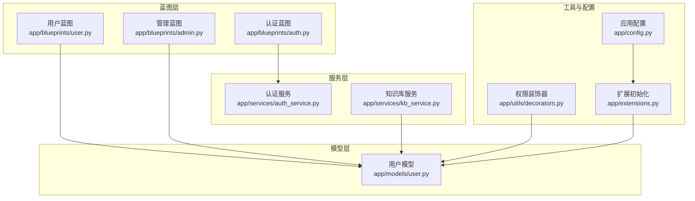
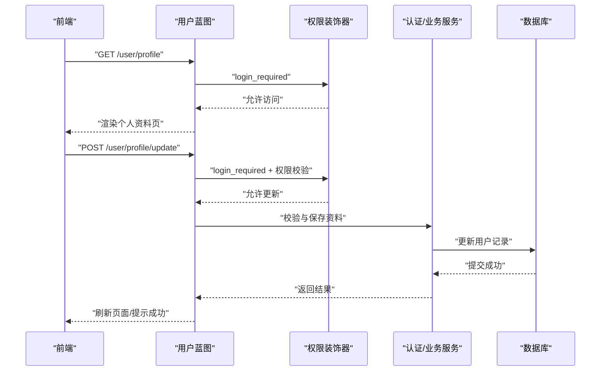
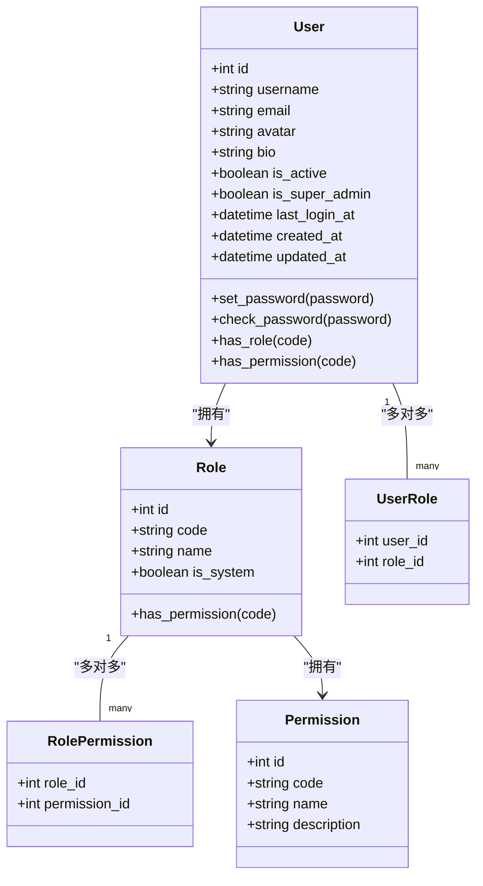
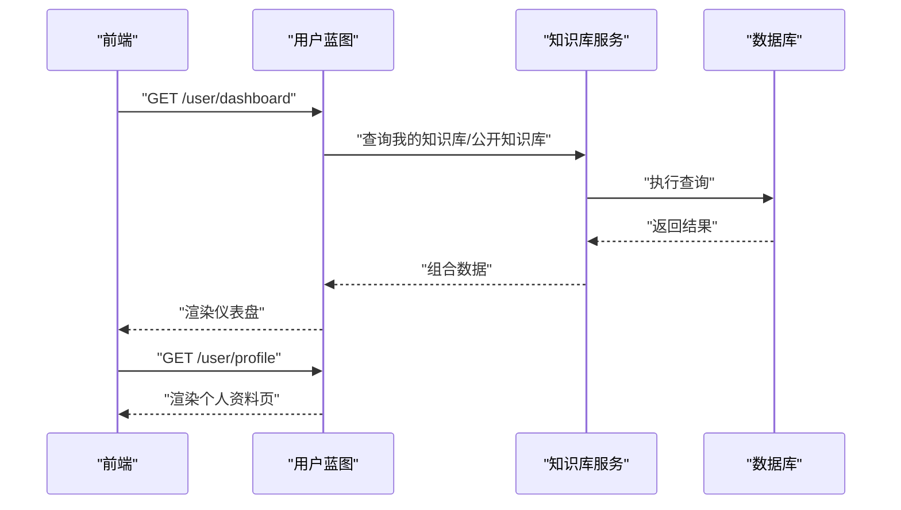
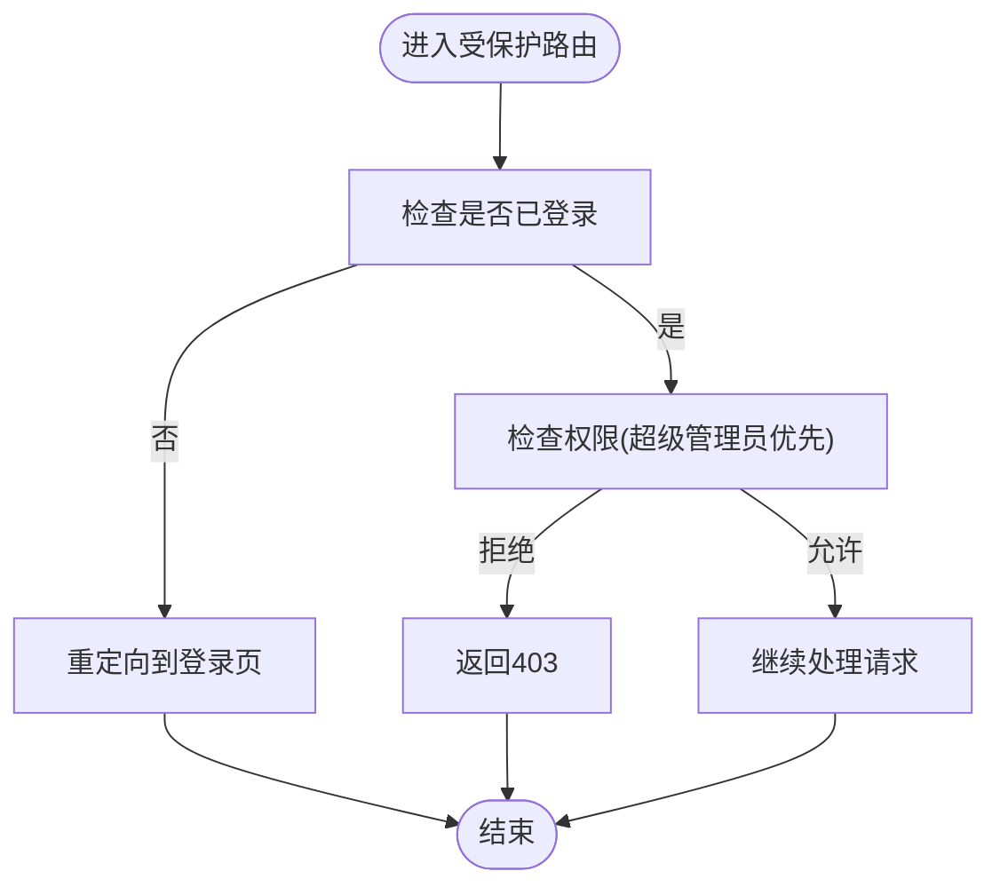
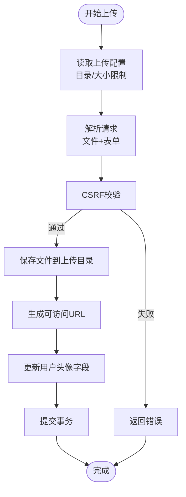
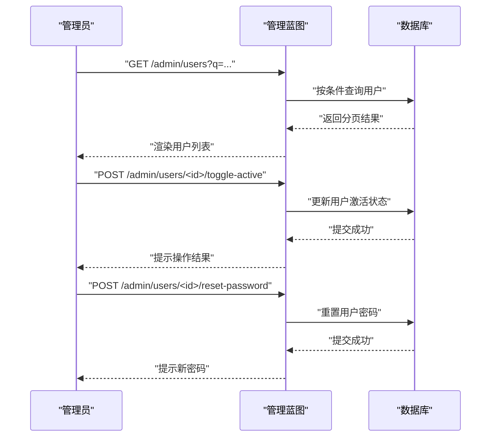
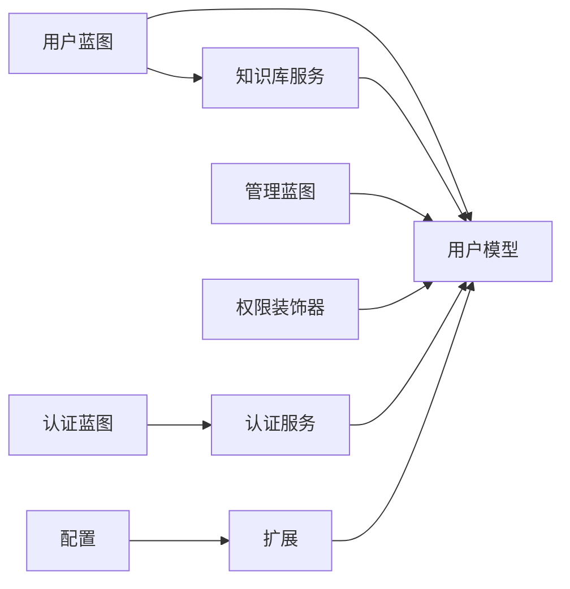

# 用户资料管理

<cite>
**本文引用的文件**
- [app/models/user.py](file://app/models/user.py)
- [app/blueprints/user.py](file://app/blueprints/user.py)
- [app/services/auth_service.py](file://app/services/auth_service.py)
- [app/utils/decorators.py](file://app/utils/decorators.py)
- [app/extensions.py](file://app/extensions.py)
- [app/config.py](file://app/config.py)
- [app/blueprints/admin.py](file://app/blueprints/admin.py)
- [app/services/kb_service.py](file://app/services/kb_service.py)
- [app/blueprints/auth.py](file://app/blueprints/auth.py)
</cite>

## 目录
1. [简介](#简介)
2. [项目结构](#项目结构)
3. [核心组件](#核心组件)
4. [架构总览](#架构总览)
5. [详细组件分析](#详细组件分析)
6. [依赖分析](#依赖分析)
7. [性能考虑](#性能考虑)
8. [故障排查指南](#故障排查指南)
9. [结论](#结论)
10. [附录](#附录)

## 简介
本文件围绕“用户资料管理”主题，系统梳理用户个人信息的CRUD能力、头像上传与资料更新流程、权限验证与安全检查机制，并解释用户资料与其他模块（知识库、文档等）的数据关联与影响。同时提供API接口文档与前端集成建议、隐私保护与数据安全最佳实践。

## 项目结构
- 蓝图层：用户相关路由集中在用户蓝图，提供仪表盘与个人资料页入口。
- 模型层：用户模型包含基础字段与角色权限扩展，支持超级管理员与权限校验。
- 服务层：认证服务负责注册与登录校验；知识库服务用于判断用户对知识库的访问/编辑/管理权限。
- 工具层：装饰器提供超级管理员与权限校验；配置与扩展统一管理数据库、CSRF、登录管理等。

**图表来源**
- [app/blueprints/user.py:1-35](file://app/blueprints/user.py#L1-L35)
- [app/blueprints/auth.py:1-65](file://app/blueprints/auth.py#L1-L65)
- [app/blueprints/admin.py:1-78](file://app/blueprints/admin.py#L1-L78)
- [app/services/auth_service.py:1-57](file://app/services/auth_service.py#L1-L57)
- [app/services/kb_service.py:1-80](file://app/services/kb_service.py#L1-L80)
- [app/models/user.py:1-104](file://app/models/user.py#L1-L104)
- [app/utils/decorators.py:1-33](file://app/utils/decorators.py#L1-L33)
- [app/extensions.py:1-17](file://app/extensions.py#L1-L17)
- [app/config.py:1-83](file://app/config.py#L1-L83)

**章节来源**
- [app/blueprints/user.py:1-35](file://app/blueprints/user.py#L1-L35)
- [app/models/user.py:55-104](file://app/models/user.py#L55-L104)
- [app/services/auth_service.py:1-57](file://app/services/auth_service.py#L1-L57)
- [app/services/kb_service.py:1-80](file://app/services/kb_service.py#L1-L80)
- [app/utils/decorators.py:1-33](file://app/utils/decorators.py#L1-L33)
- [app/extensions.py:1-17](file://app/extensions.py#L1-L17)
- [app/config.py:33-36](file://app/config.py#L33-L36)

## 核心组件
- 用户模型（User）
  - 字段：用户名、邮箱、密码哈希、头像、个人简介、激活状态、超级管理员标记、最近登录时间与IP、创建与更新时间。
  - 权限：支持超级管理员直通、基于角色的权限查询、角色与权限多对多关系。
- 用户蓝图（user）
  - 提供仪表盘与个人资料页路由，均要求登录。
- 认证服务（auth_service）
  - 注册参数校验（用户名、邮箱、密码一致性）、创建用户、登录认证、记录登录信息。
- 权限装饰器（decorators）
  - 超级管理员校验与按权限码校验的通用装饰器。
- 配置与扩展（config、extensions）
  - 上传目录与最大内容长度配置；SQLAlchemy、迁移、登录管理、CSRF保护初始化。

**章节来源**
- [app/models/user.py:55-104](file://app/models/user.py#L55-L104)
- [app/blueprints/user.py:12-34](file://app/blueprints/user.py#L12-L34)
- [app/services/auth_service.py:21-57](file://app/services/auth_service.py#L21-L57)
- [app/utils/decorators.py:8-33](file://app/utils/decorators.py#L8-L33)
- [app/config.py:33-36](file://app/config.py#L33-L36)
- [app/extensions.py:8-17](file://app/extensions.py#L8-L17)

## 架构总览
用户资料管理涉及前后端协作：前端提交资料更新请求，后端通过蓝图接收、装饰器进行权限校验、服务层执行业务逻辑、模型层持久化到数据库。上传头像属于文件上传范畴，受配置中的上传目录与大小限制约束。

**图表来源**
- [app/blueprints/user.py:12-34](file://app/blueprints/user.py#L12-L34)
- [app/utils/decorators.py:8-33](file://app/utils/decorators.py#L8-L33)
- [app/services/auth_service.py:21-57](file://app/services/auth_service.py#L21-L57)
- [app/models/user.py:55-104](file://app/models/user.py#L55-L104)

## 详细组件分析

### 用户模型与权限体系
- 角色与权限
  - 角色与权限通过中间表建立多对多关系；角色具备权限集合。
  - 用户具备多个角色，支持通过角色判断是否拥有某项权限。
  - 超级管理员拥有全部权限，绕过常规权限判断。
- 用户字段与行为
  - 头像与个人简介字段可用于资料展示与更新。
  - 密码采用哈希存储与校验；提供便捷方法设置与验证密码。
  - 登录信息（时间/IP）可被记录，便于审计与风控。

**图表来源**
- [app/models/user.py:10-104](file://app/models/user.py#L10-L104)

**章节来源**
- [app/models/user.py:55-104](file://app/models/user.py#L55-L104)

### 用户资料页与仪表盘
- 仪表盘
  - 展示当前用户的知识库、公开知识库、最近文档与AI知识库列表与统计。
  - 基于服务层提供的查询能力，聚合用户相关资源。
- 个人资料页
  - 渲染当前用户资料，供前端展示与编辑。

**图表来源**
- [app/blueprints/user.py:12-28](file://app/blueprints/user.py#L12-L28)
- [app/services/kb_service.py:48-62](file://app/services/kb_service.py#L48-L62)

**章节来源**
- [app/blueprints/user.py:12-34](file://app/blueprints/user.py#L12-L34)
- [app/services/kb_service.py:48-62](file://app/services/kb_service.py#L48-L62)

### 权限验证与安全检查
- 登录保护
  - 所有用户相关页面均使用登录保护装饰器，未登录用户跳转至登录页。
- 超级管理员与权限
  - 超级管理员可直接访问；普通用户需满足具体权限码。
- 登录审计
  - 认证服务在登录成功后记录时间与IP，便于追踪与风控。

**图表来源**
- [app/utils/decorators.py:8-33](file://app/utils/decorators.py#L8-L33)
- [app/services/auth_service.py:44-57](file://app/services/auth_service.py#L44-L57)

**章节来源**
- [app/utils/decorators.py:8-33](file://app/utils/decorators.py#L8-L33)
- [app/services/auth_service.py:44-57](file://app/services/auth_service.py#L44-L57)

### 头像上传与资料更新（实现要点）
- 文件上传配置
  - 上传目录与最大内容长度由配置提供，确保上传行为受控。
- 更新流程建议
  - 前端：表单提交头像文件与资料字段，启用CSRF保护。
  - 后端：蓝图接收请求，装饰器进行权限校验，服务层执行校验与保存，模型层持久化。
  - 安全：限制文件类型与大小，生成唯一文件名，避免路径穿越，仅暴露安全的访问URL。
- 与知识库的关系
  - 用户资料变更不影响其拥有的知识库所有权，但会影响展示名称与头像显示。

**图表来源**
- [app/config.py:33-36](file://app/config.py#L33-L36)
- [app/extensions.py:8-17](file://app/extensions.py#L8-L17)
- [app/models/user.py:62-63](file://app/models/user.py#L62-L63)

**章节来源**
- [app/config.py:33-36](file://app/config.py#L33-L36)
- [app/extensions.py:8-17](file://app/extensions.py#L8-L17)
- [app/models/user.py:62-63](file://app/models/user.py#L62-L63)

### 管理员视角下的用户资料
- 用户列表与筛选
  - 支持按用户名或邮箱模糊搜索，分页展示。
- 激活状态切换与密码重置
  - 禁止管理员对自己账户执行停用操作；提供密码重置入口。
- 角色分配
  - 管理员可为用户分配角色，间接影响其权限范围。

**图表来源**
- [app/blueprints/admin.py:39-78](file://app/blueprints/admin.py#L39-L78)

**章节来源**
- [app/blueprints/admin.py:39-78](file://app/blueprints/admin.py#L39-L78)

## 依赖分析
- 组件耦合
  - 用户蓝图依赖用户模型与知识库服务；认证服务依赖用户模型；权限装饰器依赖当前用户上下文。
- 外部依赖
  - 数据库：SQLAlchemy；迁移：Flask-Migrate；登录：Flask-Login；CSRF：Flask-WTF。
- 风险点
  - 若未启用CSRF保护或权限装饰器缺失，可能导致越权访问；上传未做严格校验可能引入安全风险。

**图表来源**
- [app/blueprints/user.py:1-35](file://app/blueprints/user.py#L1-L35)
- [app/blueprints/admin.py:1-78](file://app/blueprints/admin.py#L1-L78)
- [app/services/auth_service.py:1-57](file://app/services/auth_service.py#L1-L57)
- [app/services/kb_service.py:1-80](file://app/services/kb_service.py#L1-L80)
- [app/models/user.py:1-104](file://app/models/user.py#L1-L104)
- [app/utils/decorators.py:1-33](file://app/utils/decorators.py#L1-L33)
- [app/extensions.py:1-17](file://app/extensions.py#L1-L17)
- [app/config.py:1-83](file://app/config.py#L1-L83)

**章节来源**
- [app/blueprints/user.py:1-35](file://app/blueprints/user.py#L1-L35)
- [app/services/kb_service.py:1-80](file://app/services/kb_service.py#L1-L80)
- [app/utils/decorators.py:1-33](file://app/utils/decorators.py#L1-L33)
- [app/extensions.py:1-17](file://app/extensions.py#L1-L17)
- [app/config.py:1-83](file://app/config.py#L1-L83)

## 性能考虑
- 查询优化
  - 对用户资料相关查询使用索引字段（如用户名、邮箱、ID），减少全表扫描。
- 分页与限制
  - 列表查询配合分页与数量限制，避免一次性加载过多数据。
- 缓存策略
  - 对频繁读取的用户基本信息可采用短期缓存，降低数据库压力。
- 上传性能
  - 控制文件大小与并发上传数，结合CDN或对象存储提升头像访问速度。

## 故障排查指南
- 401 未登录
  - 确认登录保护装饰器是否生效，检查会话与Cookie配置。
- 403 权限不足
  - 检查当前用户是否为超级管理员或是否具备所需权限码。
- 上传失败
  - 检查上传目录是否存在且可写，确认文件大小未超过限制，CSRF令牌有效。
- 登录信息未更新
  - 确认认证服务在登录成功后调用了记录登录信息的方法。

**章节来源**
- [app/utils/decorators.py:8-33](file://app/utils/decorators.py#L8-L33)
- [app/services/auth_service.py:44-57](file://app/services/auth_service.py#L44-L57)
- [app/config.py:33-36](file://app/config.py#L33-L36)

## 结论
用户资料管理以用户模型为核心，结合蓝图路由、权限装饰器与服务层逻辑，形成完整的CRUD与安全控制闭环。头像上传与资料更新应遵循严格的配置与安全策略，确保数据与隐私安全。与其他模块（知识库、文档）的关联主要体现在访问控制与展示层面，实际所有权与归属不受用户资料直接影响。

## 附录

### 用户资料API接口文档（建议）
- 获取个人资料
  - 方法：GET
  - 路径：/user/profile
  - 认证：需要登录
  - 返回：用户资料（不含敏感字段）
- 更新个人资料
  - 方法：POST
  - 路径：/user/profile/update
  - 认证：需要登录
  - 表单字段：avatar（文件）、bio（文本）
  - 安全：启用CSRF，校验文件类型与大小，生成安全URL
  - 成功：返回更新后的用户资料或成功提示
- 更新密码（可选）
  - 方法：POST
  - 路径：/user/password/change
  - 认证：需要登录
  - 表单字段：old_password、new_password、confirm_new_password
  - 安全：旧密码校验，新密码强度校验

### 前端集成示例（建议）
- 表单设计
  - 使用隐藏CSRF令牌字段；头像上传使用文件输入框；个人简介使用文本域。
- 请求方式
  - 使用表单提交（multipart/form-data）上传头像；使用JSON提交其他字段（如需）。
- 错误处理
  - 捕获401/403响应，引导用户登录或提示权限不足；上传失败时提示具体原因（大小/类型）。
- 展示更新
  - 成功后刷新头像与简介，或局部更新DOM。

### 隐私保护与数据安全最佳实践
- 最小化收集
  - 仅收集必要字段，避免过度采集。
- 数据脱敏
  - 在API响应中隐藏敏感字段（如密码哈希、登录IP等）。
- 传输安全
  - 强制HTTPS，合理设置Cookie属性（HttpOnly、SameSite）。
- 存储安全
  - 头像文件命名唯一，避免路径穿越；定期清理无效文件。
- 权限最小化
  - 严格使用装饰器与权限校验，防止越权访问。
- 审计日志
  - 记录关键操作（登录、密码修改、头像更新）的时间与来源，便于追溯。