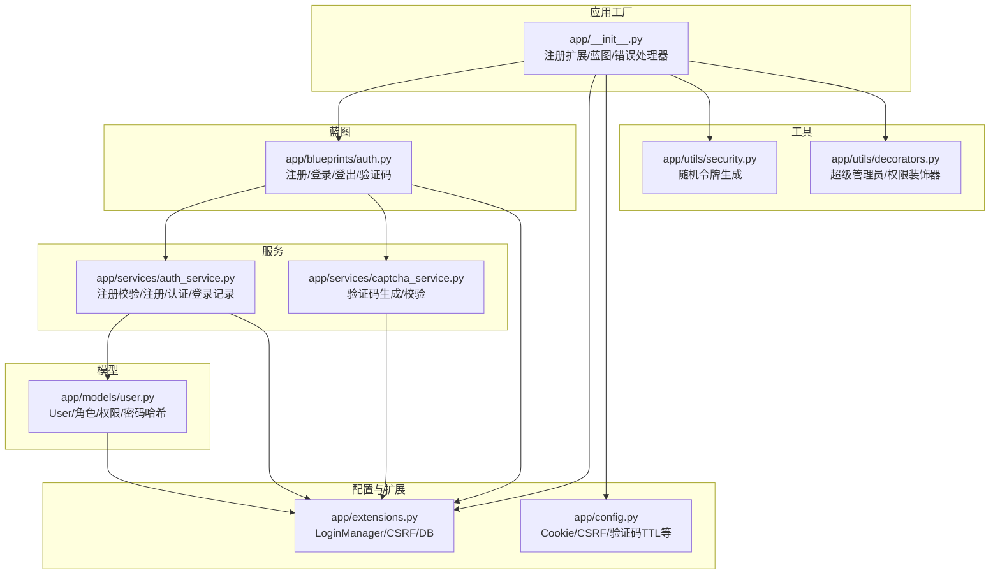
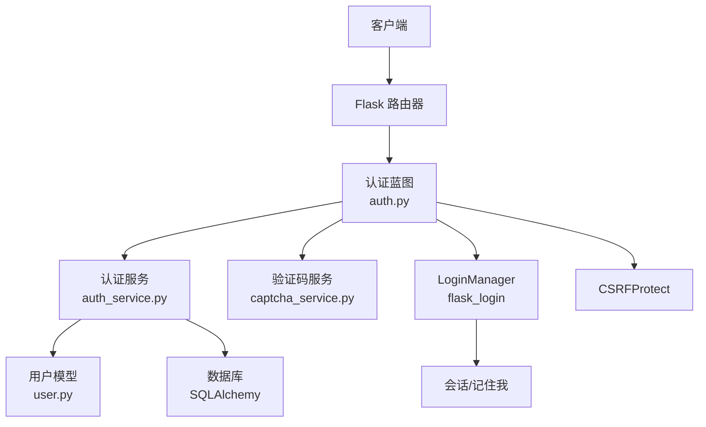
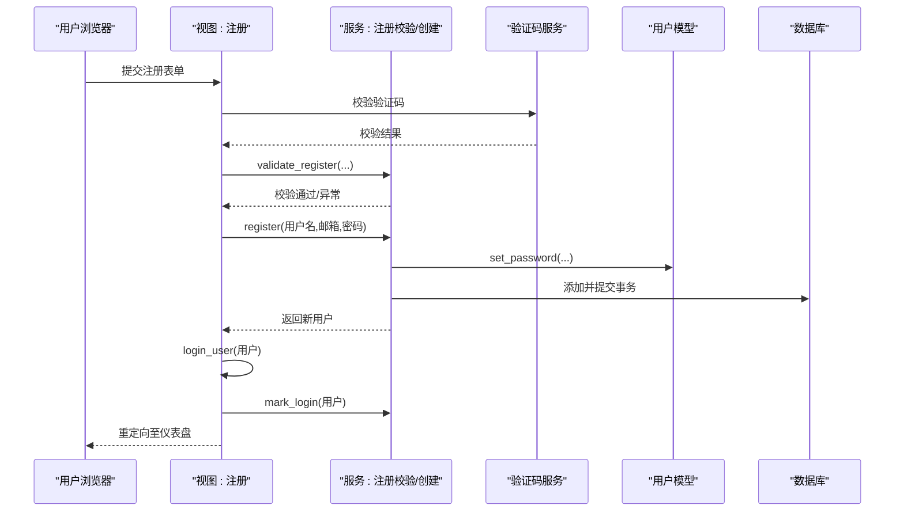
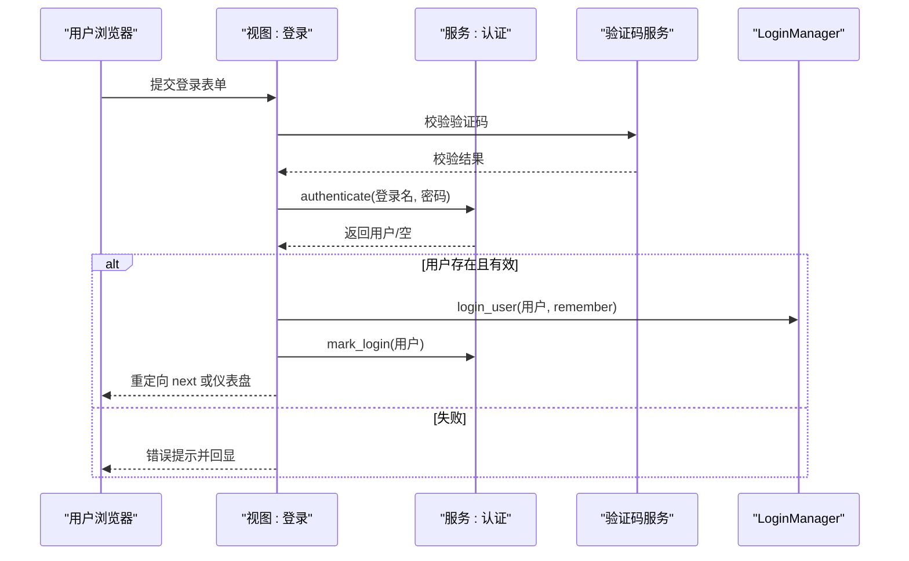
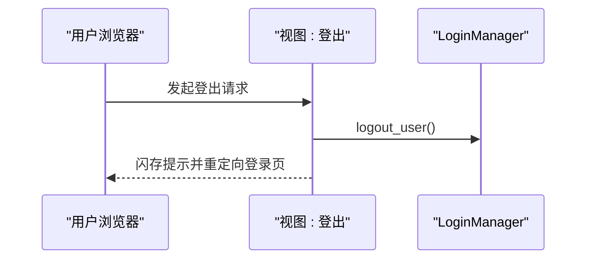
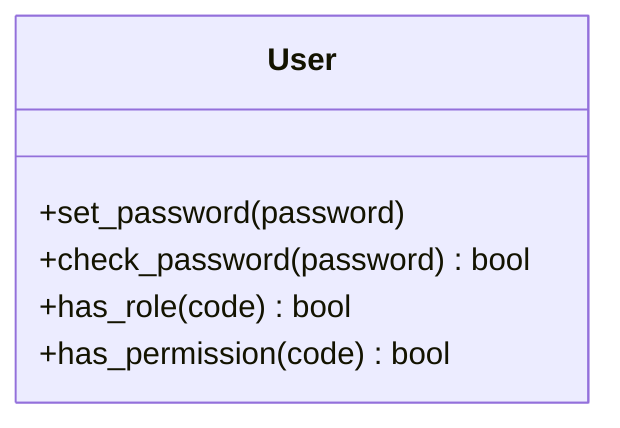
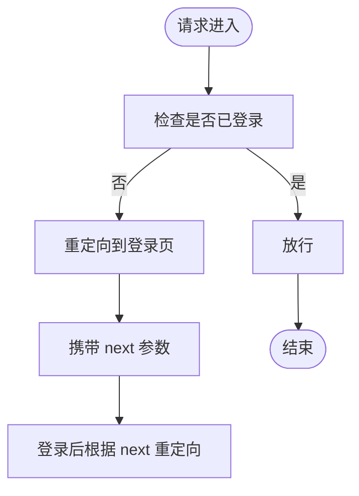
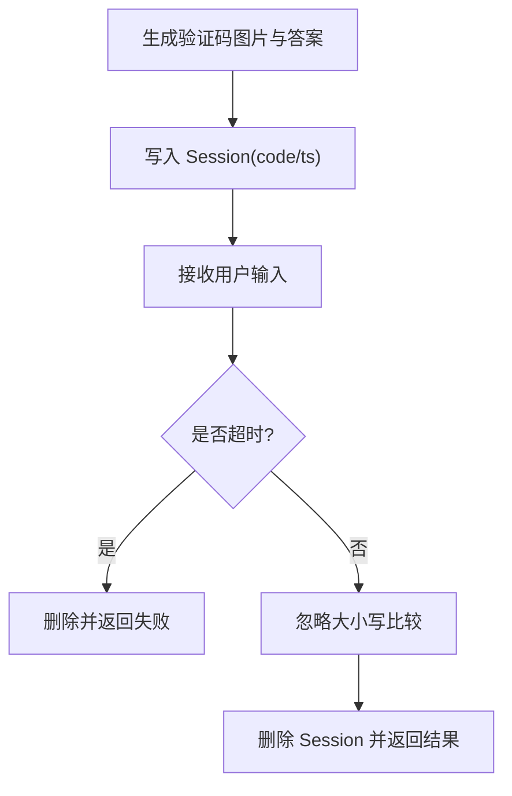
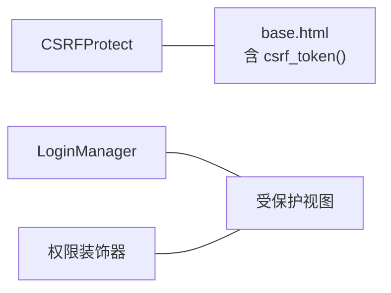
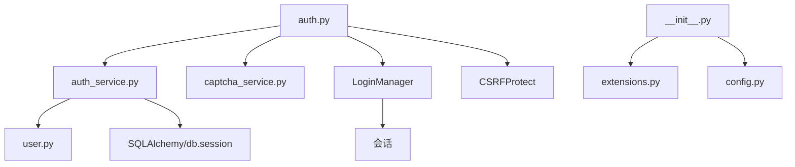

# 认证服务

<cite>
**本文引用的文件**
- [app/blueprints/auth.py](file://app/blueprints/auth.py)
- [app/services/auth_service.py](file://app/services/auth_service.py)
- [app/services/captcha_service.py](file://app/services/captcha_service.py)
- [app/models/user.py](file://app/models/user.py)
- [app/extensions.py](file://app/extensions.py)
- [app/__init__.py](file://app/__init__.py)
- [app/config.py](file://app/config.py)
- [app/utils/security.py](file://app/utils/security.py)
- [app/utils/decorators.py](file://app/utils/decorators.py)
- [app/templates/base.html](file://app/templates/base.html)
- [run.py](file://run.py)
- [requirements.txt](file://requirements.txt)
</cite>

## 目录
1. [简介](#简介)
2. [项目结构](#项目结构)
3. [核心组件](#核心组件)
4. [架构总览](#架构总览)
5. [详细组件分析](#详细组件分析)
6. [依赖分析](#依赖分析)
7. [性能考虑](#性能考虑)
8. [故障排查指南](#故障排查指南)
9. [结论](#结论)
10. [附录](#附录)

## 简介
本文件系统性梳理认证服务的设计与实现，覆盖用户注册、登录、登出的完整流程；解释验证码机制、密码加密存储、会话与“记住我”策略；阐述认证中间件与装饰器的安全策略；给出认证相关接口的使用说明与错误处理机制，并提供常见场景的最佳实践。

## 项目结构
认证相关代码主要分布在以下模块：
- 蓝图层：路由与视图（注册、登录、登出、验证码）
- 服务层：业务逻辑（注册校验、注册、认证、登录记录）
- 模型层：用户模型与密码哈希
- 配置与扩展：Cookie/Samesite、CSRF、Remember Me 时长等
- 工具与装饰器：通用安全辅助与权限装饰器
- 应用工厂：初始化扩展、注册蓝图、错误处理

图表来源
- [app/__init__.py:39-74](file://app/__init__.py#L39-L74)
- [app/blueprints/auth.py:1-85](file://app/blueprints/auth.py#L1-L85)
- [app/services/auth_service.py:1-57](file://app/services/auth_service.py#L1-L57)
- [app/services/captcha_service.py:1-90](file://app/services/captcha_service.py#L1-L90)
- [app/models/user.py:55-104](file://app/models/user.py#L55-L104)
- [app/config.py:28-51](file://app/config.py#L28-L51)
- [app/extensions.py:8-17](file://app/extensions.py#L8-L17)
- [app/utils/security.py:1-8](file://app/utils/security.py#L1-L8)
- [app/utils/decorators.py:1-33](file://app/utils/decorators.py#L1-L33)

章节来源
- [app/__init__.py:39-74](file://app/__init__.py#L39-L74)
- [app/config.py:28-51](file://app/config.py#L28-L51)

## 核心组件
- 蓝图路由：提供注册、登录、登出、验证码接口，统一由认证蓝图暴露
- 认证服务：负责输入校验、用户创建、凭据认证、登录信息记录
- 用户模型：基于 Flask-Login 的 UserMixin，提供密码哈希存取与权限判定
- 验证码服务：生成图片验证码并基于 Session 做一次性校验
- 安全扩展：LoginManager、CSRFProtect、Cookie 配置
- 权限装饰器：超级管理员与细粒度权限控制

章节来源
- [app/blueprints/auth.py:10-85](file://app/blueprints/auth.py#L10-L85)
- [app/services/auth_service.py:21-57](file://app/services/auth_service.py#L21-L57)
- [app/models/user.py:55-104](file://app/models/user.py#L55-L104)
- [app/services/captcha_service.py:65-90](file://app/services/captcha_service.py#L65-L90)
- [app/extensions.py:8-17](file://app/extensions.py#L8-L17)
- [app/utils/decorators.py:8-33](file://app/utils/decorators.py#L8-L33)

## 架构总览
认证系统采用“蓝图 + 服务 + 模型 + 扩展”的分层设计，遵循最小耦合原则：
- 视图层仅做参数收集与调用服务层
- 服务层封装业务规则与数据库操作
- 模型层承载数据结构与安全方法
- 扩展层提供会话、CSRF、登录状态管理等基础设施

图表来源
- [app/blueprints/auth.py:1-85](file://app/blueprints/auth.py#L1-L85)
- [app/services/auth_service.py:1-57](file://app/services/auth_service.py#L1-L57)
- [app/services/captcha_service.py:1-90](file://app/services/captcha_service.py#L1-L90)
- [app/models/user.py:55-104](file://app/models/user.py#L55-L104)
- [app/extensions.py:8-17](file://app/extensions.py#L8-L17)

## 详细组件分析

### 注册流程
- 输入参数：用户名、邮箱、密码、确认密码、验证码
- 流程要点：
  - 验证码校验：从 Session 中取出答案与时间戳，按配置的 TTL 判断是否过期
  - 服务校验：用户名、邮箱、密码长度与一致性、唯一性
  - 创建用户：设置密码哈希，持久化到数据库
  - 登录态：调用登录函数建立当前会话
  - 登录记录：更新最近登录时间与 IP

图表来源
- [app/blueprints/auth.py:19-48](file://app/blueprints/auth.py#L19-L48)
- [app/services/captcha_service.py:75-90](file://app/services/captcha_service.py#L75-L90)
- [app/services/auth_service.py:21-41](file://app/services/auth_service.py#L21-L41)
- [app/services/auth_service.py:53-57](file://app/services/auth_service.py#L53-L57)
- [app/models/user.py:81-85](file://app/models/user.py#L81-L85)

章节来源
- [app/blueprints/auth.py:19-48](file://app/blueprints/auth.py#L19-L48)
- [app/services/auth_service.py:21-41](file://app/services/auth_service.py#L21-L41)
- [app/services/captcha_service.py:65-90](file://app/services/captcha_service.py#L65-L90)

### 登录流程
- 输入参数：登录名（用户名或邮箱）、密码、验证码、记住我
- 流程要点：
  - 验证码校验：同上
  - 凭据认证：根据登录名查询用户，校验激活状态与密码
  - 登录态：login_user(user, remember=是否勾选)
  - 登录记录：更新最近登录时间与 IP
  - 重定向：next 参数存在则跳转，否则默认仪表盘

图表来源
- [app/blueprints/auth.py:51-77](file://app/blueprints/auth.py#L51-L77)
- [app/services/auth_service.py:44-50](file://app/services/auth_service.py#L44-L50)
- [app/services/auth_service.py:53-57](file://app/services/auth_service.py#L53-L57)
- [app/services/captcha_service.py:75-90](file://app/services/captcha_service.py#L75-L90)

章节来源
- [app/blueprints/auth.py:51-77](file://app/blueprints/auth.py#L51-L77)
- [app/services/auth_service.py:44-50](file://app/services/auth_service.py#L44-L50)

### 登出流程
- 登出：调用 logout_user 清理会话
- 结果：闪存提示并返回登录页

图表来源
- [app/blueprints/auth.py:79-85](file://app/blueprints/auth.py#L79-L85)

章节来源
- [app/blueprints/auth.py:79-85](file://app/blueprints/auth.py#L79-L85)

### JWT 说明
当前实现未使用 JWT。系统采用基于 Cookie 的会话与 Flask-Login 的用户加载机制，配合 CSRF 保护与 SameSite/Lax Cookie 策略保障安全。

章节来源
- [app/config.py:28-31](file://app/config.py#L28-L31)
- [app/extensions.py:14-16](file://app/extensions.py#L14-L16)

### 密码加密存储
- 存储：使用 Werkzeug 的 generate_password_hash 生成哈希
- 校验：使用 check_password_hash 进行比对
- 安全性：避免明文存储，降低泄露风险

图表来源
- [app/models/user.py:81-85](file://app/models/user.py#L81-L85)

章节来源
- [app/models/user.py:81-85](file://app/models/user.py#L81-L85)

### 会话管理与“记住我”
- 会话 Cookie：HttpOnly，SameSite=Lax
- 记住我：通过 LoginManager 的 remember 机制启用，时长由配置项控制
- 用户加载：应用工厂中注册 user_loader，从数据库加载当前用户

图表来源
- [app/config.py:28-31](file://app/config.py#L28-L31)
- [app/extensions.py:14-16](file://app/extensions.py#L14-L16)
- [app/__init__.py:48-54](file://app/__init__.py#L48-L54)

章节来源
- [app/config.py:28-31](file://app/config.py#L28-L31)
- [app/extensions.py:14-16](file://app/extensions.py#L14-L16)
- [app/__init__.py:48-54](file://app/__init__.py#L48-L54)

### 自动登录与“记住我”技术实现
- 自动登录：用户勾选“记住我”，下次访问可直接进入受保护资源
- 实现方式：LoginManager 的 remember 选项与配置的 REMEMBER_COOKIE_DURATION
- 注意事项：生产环境建议结合 HTTPS 与 Secure Cookie

章节来源
- [app/config.py:28-31](file://app/config.py#L28-L31)
- [app/extensions.py:14-16](file://app/extensions.py#L14-L16)

### 验证码机制
- 生成：随机字符、干扰点线、旋转字符、平滑滤镜，输出 PNG 字节流
- 存储：答案与时间戳写入 Session，带 TTL 控制
- 校验：忽略大小写与前后空白，一次性消费（校验后即删除）

图表来源
- [app/services/captcha_service.py:65-90](file://app/services/captcha_service.py#L65-L90)

章节来源
- [app/services/captcha_service.py:65-90](file://app/services/captcha_service.py#L65-L90)

### 认证中间件与安全策略
- CSRF 保护：全局启用 CSRFProtect，配合模板中的 CSRF Token
- 登录中间件：LoginManager 统一拦截未登录访问
- 权限装饰器：超级管理员与细粒度权限控制

图表来源
- [app/templates/base.html:6](file://app/templates/base.html#L6)
- [app/extensions.py:10](file://app/extensions.py#L10)
- [app/utils/decorators.py:8-33](file://app/utils/decorators.py#L8-L33)

章节来源
- [app/templates/base.html:6](file://app/templates/base.html#L6)
- [app/extensions.py:10](file://app/extensions.py#L10)
- [app/utils/decorators.py:8-33](file://app/utils/decorators.py#L8-L33)

### 认证 API 接口文档
- GET /auth/captcha
  - 功能：获取验证码图片
  - 响应：PNG 图片，附带缓存禁用头
  - 安全：验证码一次性，过期即失效
- GET /auth/register
  - 功能：显示注册页
- POST /auth/register
  - 参数：username、email、password、password2、captcha
  - 行为：验证码校验 → 服务校验 → 注册 → 登录 → 更新登录信息
- GET /auth/login
  - 功能：显示登录页
- POST /auth/login
  - 参数：login（用户名或邮箱）、password、captcha、remember
  - 行为：验证码校验 → 认证 → 登录 → 更新登录信息 → next 重定向
- GET/POST /auth/logout
  - 行为：登出并重定向登录页

章节来源
- [app/blueprints/auth.py:10-85](file://app/blueprints/auth.py#L10-L85)
- [app/services/captcha_service.py:65-72](file://app/services/captcha_service.py#L65-L72)

### 错误处理机制
- 登录/注册失败：闪存错误消息并回显表单
- 403/404/500：统一错误页面渲染
- 未登录访问受保护资源：LoginManager 重定向到登录页并提示

章节来源
- [app/blueprints/auth.py:31-40](file://app/blueprints/auth.py#L31-L40)
- [app/blueprints/auth.py:62-69](file://app/blueprints/auth.py#L62-L69)
- [app/__init__.py:76-87](file://app/__init__.py#L76-L87)
- [app/extensions.py:14-16](file://app/extensions.py#L14-L16)

### 常见认证场景与最佳实践
- 场景一：注册后立即登录并记录登录信息
  - 参考路径：[注册视图与服务调用:19-48](file://app/blueprints/auth.py#L19-L48)，[注册服务:36-41](file://app/services/auth_service.py#L36-L41)，[登录记录:53-57](file://app/services/auth_service.py#L53-L57)
- 场景二：登录时启用“记住我”
  - 参考路径：[登录视图 remember 参数](file://app/blueprints/auth.py#L60)，[LoginManager 配置:14-16](file://app/extensions.py#L14-L16)，[配置项:28-31](file://app/config.py#L28-L31)
- 场景三：防止暴力破解
  - 建议：限制同一 IP 的登录尝试次数（可在服务层增加计数与冷却），验证码 TTL 合理设置（参考配置项）
  - 参考路径：[验证码 TTL 配置](file://app/config.py#L50)，[验证码校验逻辑:75-90](file://app/services/captcha_service.py#L75-L90)
- 场景四：跨站请求伪造防护
  - 建议：所有表单均包含 CSRF Token，后端启用 CSRFProtect
  - 参考路径：[CSRF 启用](file://app/extensions.py#L10)，[模板中的 CSRF Token](file://app/templates/base.html#L6)
- 场景五：权限控制
  - 建议：使用装饰器限制访问
  - 参考路径：[超级管理员装饰器:8-18](file://app/utils/decorators.py#L8-L18)，[权限装饰器:21-33](file://app/utils/decorators.py#L21-L33)

## 依赖分析
- 组件内聚：认证相关逻辑集中在 auth 蓝图与 auth_service，职责清晰
- 外部依赖：Flask、Flask-Login、Flask-WTF、SQLAlchemy、Pillow
- 关键耦合点：
  - 蓝图依赖服务层与验证码服务
  - 服务层依赖模型层与数据库
  - 应用工厂负责扩展初始化与用户加载器注册

图表来源
- [app/blueprints/auth.py:1-85](file://app/blueprints/auth.py#L1-L85)
- [app/services/auth_service.py:1-57](file://app/services/auth_service.py#L1-L57)
- [app/services/captcha_service.py:1-90](file://app/services/captcha_service.py#L1-L90)
- [app/models/user.py:55-104](file://app/models/user.py#L55-L104)
- [app/extensions.py:8-17](file://app/extensions.py#L8-L17)
- [app/__init__.py:39-74](file://app/__init__.py#L39-L74)
- [app/config.py:28-51](file://app/config.py#L28-L51)

章节来源
- [requirements.txt:1-22](file://requirements.txt#L1-L22)
- [app/__init__.py:39-74](file://app/__init__.py#L39-L74)

## 性能考虑
- 数据库连接池：预检测与回收参数有助于连接复用
- 验证码生成：图片尺寸与抗锯齿处理应平衡质量与 CPU 开销
- 登录记录：仅在登录成功后更新，避免频繁写入
- CSRF 与会话：合理设置 Cookie 属性与生命周期，减少不必要的网络传输

章节来源
- [app/config.py:23-26](file://app/config.py#L23-L26)
- [app/services/captcha_service.py:32-62](file://app/services/captcha_service.py#L32-L62)
- [app/services/auth_service.py:53-57](file://app/services/auth_service.py#L53-L57)

## 故障排查指南
- 登录失败
  - 检查验证码是否过期或输入不一致
  - 确认用户是否被激活
  - 参考：[登录视图与认证服务:51-77](file://app/blueprints/auth.py#L51-L77)，[认证逻辑:44-50](file://app/services/auth_service.py#L44-L50)
- 未登录访问受限页面
  - 检查 LoginManager 是否正确初始化与用户加载器是否注册
  - 参考：[LoginManager 配置:14-16](file://app/extensions.py#L14-L16)，[用户加载器注册:48-54](file://app/__init__.py#L48-L54)
- CSRF 校验失败
  - 确保表单包含 CSRF Token，且模板正确渲染
  - 参考：[CSRF 启用](file://app/extensions.py#L10)，[模板 CSRF Token](file://app/templates/base.html#L6)
- 验证码无效
  - 检查 Session 是否存在、是否超时、是否被一次性消费
  - 参考：[验证码校验:75-90](file://app/services/captcha_service.py#L75-L90)

章节来源
- [app/blueprints/auth.py:51-77](file://app/blueprints/auth.py#L51-L77)
- [app/services/auth_service.py:44-50](file://app/services/auth_service.py#L44-L50)
- [app/extensions.py:14-16](file://app/extensions.py#L14-L16)
- [app/__init__.py:48-54](file://app/__init__.py#L48-L54)
- [app/services/captcha_service.py:75-90](file://app/services/captcha_service.py#L75-L90)
- [app/templates/base.html:6](file://app/templates/base.html#L6)

## 结论
本认证服务以 Flask-Login 为核心，结合 CSRF 保护与验证码机制，提供了完整的注册、登录、登出能力。密码采用安全哈希存储，会话与“记住我”策略通过配置与扩展统一管理。整体架构清晰、职责分离，便于扩展与维护。如需引入无状态认证，可在现有基础上叠加 JWT 适配层，但需同步完善密钥轮换与签名策略。

## 附录
- 快速启动
  - 设置环境变量并运行开发服务器
  - 参考：[运行入口:1-17](file://run.py#L1-L17)
- 依赖清单
  - 参考：[依赖列表:1-22](file://requirements.txt#L1-L22)