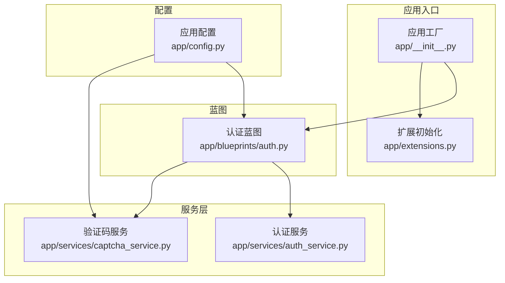
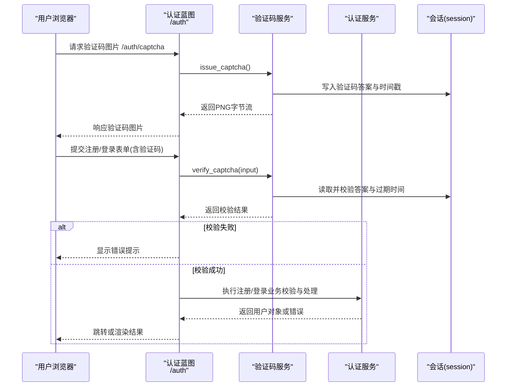
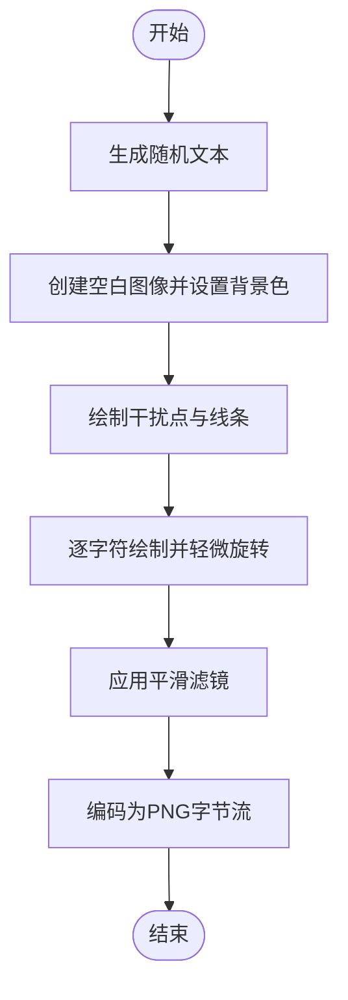
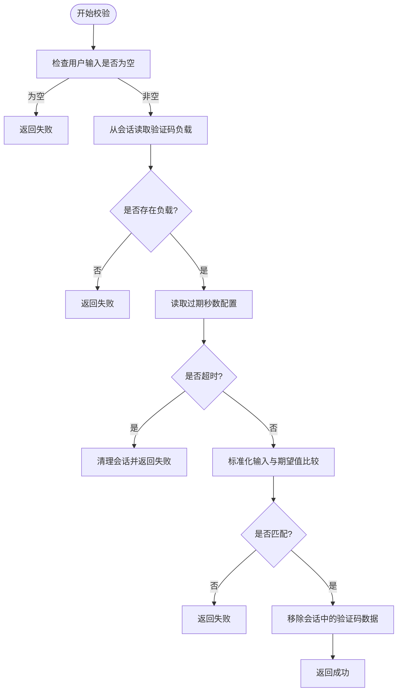
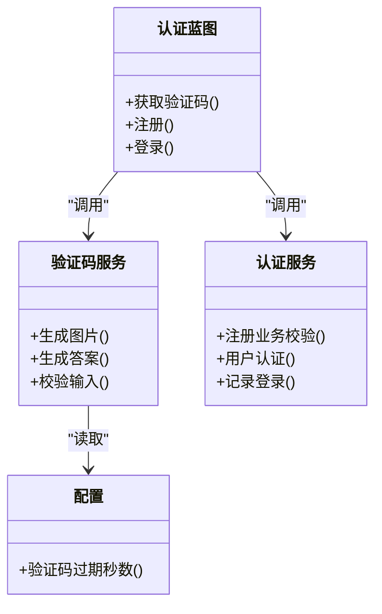
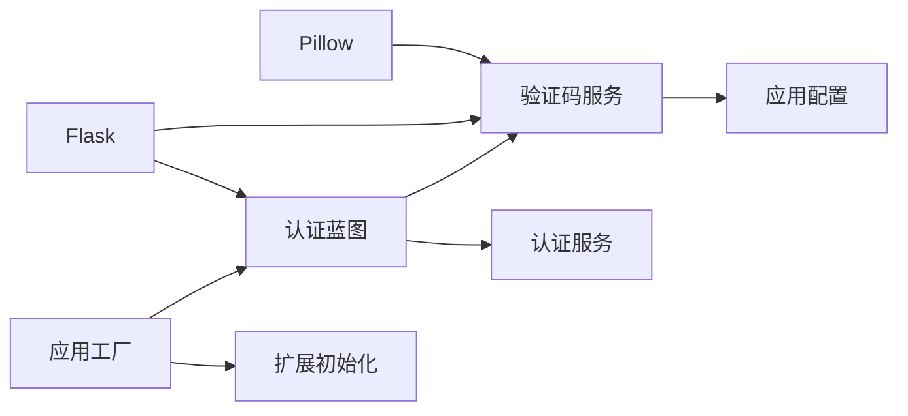

# 验证码服务

<cite>
**本文引用的文件**
- [app/services/captcha_service.py](file://app/services/captcha_service.py)
- [app/blueprints/auth.py](file://app/blueprints/auth.py)
- [app/config.py](file://app/config.py)
- [app/__init__.py](file://app/__init__.py)
- [app/extensions.py](file://app/extensions.py)
- [app/services/auth_service.py](file://app/services/auth_service.py)
- [requirements.txt](file://requirements.txt)
</cite>

## 目录
1. [简介](#简介)
2. [项目结构](#项目结构)
3. [核心组件](#核心组件)
4. [架构总览](#架构总览)
5. [详细组件分析](#详细组件分析)
6. [依赖分析](#依赖分析)
7. [性能考虑](#性能考虑)
8. [故障排除指南](#故障排除指南)
9. [结论](#结论)
10. [附录](#附录)

## 简介
本文件系统性阐述验证码服务的设计与实现，覆盖以下方面：
- 验证码生成算法与图形验证码实现细节
- 验证流程与会话存储机制
- 过期时间控制策略与安全防护
- API 接口设计与前端集成方案
- 在注册、登录等场景中的应用
- 配置参数、性能优化建议与故障排除

## 项目结构
验证码服务位于应用的服务层，通过蓝图暴露 HTTP 接口，并与认证服务协作完成用户注册与登录流程。

图表来源
- [app/__init__.py:11-28](file://app/__init__.py#L11-L28)
- [app/__init__.py:56-74](file://app/__init__.py#L56-L74)
- [app/blueprints/auth.py:1-16](file://app/blueprints/auth.py#L1-L16)
- [app/services/captcha_service.py:1-90](file://app/services/captcha_service.py#L1-L90)
- [app/services/auth_service.py:1-57](file://app/services/auth_service.py#L1-L57)
- [app/config.py:49-50](file://app/config.py#L49-L50)

章节来源
- [app/__init__.py:11-28](file://app/__init__.py#L11-L28)
- [app/__init__.py:56-74](file://app/__init__.py#L56-L74)
- [app/blueprints/auth.py:1-85](file://app/blueprints/auth.py#L1-L85)
- [app/services/captcha_service.py:1-90](file://app/services/captcha_service.py#L1-L90)
- [app/services/auth_service.py:1-57](file://app/services/auth_service.py#L1-L57)
- [app/config.py:49-50](file://app/config.py#L49-L50)

## 核心组件
- 验证码服务：负责生成图形验证码图片与答案、存储到会话、校验输入并过期清理。
- 认证蓝图：对外提供验证码图片接口以及注册/登录接口；在关键流程中调用验证码校验。
- 应用配置：集中管理验证码过期时长等参数。
- 认证服务：与验证码服务配合，完成注册/登录前的业务校验与用户状态更新。

章节来源
- [app/services/captcha_service.py:1-90](file://app/services/captcha_service.py#L1-L90)
- [app/blueprints/auth.py:1-85](file://app/blueprints/auth.py#L1-L85)
- [app/config.py:49-50](file://app/config.py#L49-L50)
- [app/services/auth_service.py:1-57](file://app/services/auth_service.py#L1-L57)

## 架构总览
验证码服务在认证流程中的交互如下：

图表来源
- [app/blueprints/auth.py:10-16](file://app/blueprints/auth.py#L10-L16)
- [app/blueprints/auth.py:19-48](file://app/blueprints/auth.py#L19-L48)
- [app/blueprints/auth.py:51-76](file://app/blueprints/auth.py#L51-L76)
- [app/services/captcha_service.py:65-72](file://app/services/captcha_service.py#L65-L72)
- [app/services/captcha_service.py:75-89](file://app/services/captcha_service.py#L75-L89)

## 详细组件分析

### 验证码生成与图形实现
- 字符集设计：剔除易混淆字符，限定可读字符集合，降低误识率。
- 图像绘制：背景色浅灰偏白，随机点阵与线条作为干扰元素，字符轻微旋转增加识别难度。
- 字体加载：优先使用常见系统字体，若不可用则回退至默认字体，保证跨平台可用性。
- 输出编码：生成 PNG 并启用优化压缩，返回二进制字节流供 HTTP 响应使用。

图表来源
- [app/services/captcha_service.py:32-62](file://app/services/captcha_service.py#L32-L62)

章节来源
- [app/services/captcha_service.py:14-19](file://app/services/captcha_service.py#L14-L19)
- [app/services/captcha_service.py:22-29](file://app/services/captcha_service.py#L22-L29)
- [app/services/captcha_service.py:32-62](file://app/services/captcha_service.py#L32-L62)

### 会话存储与验证逻辑
- 存储键名：统一使用内部常量标识会话键。
- 存储内容：保存答案（小写）与生成时间戳，便于后续校验与过期判断。
- 校验流程：空输入直接失败；从会话读取答案与时间戳；按配置的过期秒数判断是否超时；超时则清理并返回失败；否则比较输入（去空白、小写化）与期望值；无论成功与否，均一次性移除会话中的验证码数据，确保“一次有效”。

图表来源
- [app/services/captcha_service.py:75-89](file://app/services/captcha_service.py#L75-L89)
- [app/config.py:49-50](file://app/config.py#L49-L50)

章节来源
- [app/services/captcha_service.py:65-72](file://app/services/captcha_service.py#L65-L72)
- [app/services/captcha_service.py:75-89](file://app/services/captcha_service.py#L75-L89)
- [app/config.py:49-50](file://app/config.py#L49-L50)

### API 接口设计
- 获取验证码图片
  - 方法与路径：GET /auth/captcha
  - 响应类型：image/png
  - 缓存控制：禁止缓存，避免跨请求复用
  - 会话行为：生成新验证码并写入会话
- 注册接口
  - 方法与路径：POST /auth/register
  - 表单字段：username、email、password、password2、captcha
  - 校验顺序：先验证码校验，再业务校验，最后创建用户并登录
- 登录接口
  - 方法与路径：POST /auth/login
  - 表单字段：login、password、captcha、remember
  - 校验顺序：先验证码校验，再认证用户，最后登录并记录登录信息

章节来源
- [app/blueprints/auth.py:10-16](file://app/blueprints/auth.py#L10-L16)
- [app/blueprints/auth.py:19-48](file://app/blueprints/auth.py#L19-L48)
- [app/blueprints/auth.py:51-76](file://app/blueprints/auth.py#L51-L76)

### 前端集成方案
- 图片刷新：在验证码图片上添加时间戳查询参数或点击更换图标，避免浏览器缓存导致的旧图显示。
- 输入容错：提交前自动去除输入首尾空白，统一转换为小写，提升兼容性。
- 用户体验优化：
  - 提示文案明确“验证码错误或已过期”
  - 支持键盘快捷键（如回车提交）
  - 对移动端提供合适的触摸目标尺寸与间距
- 安全增强（建议）：
  - 使用 HTTPS 传输，防止中间人篡改
  - 限制同一 IP 的请求频率，结合后端限流策略
  - 可选引入更复杂的 CAPTCHA（如滑动拼图、点选）以对抗自动化攻击

章节来源
- [app/blueprints/auth.py:31-34](file://app/blueprints/auth.py#L31-L34)
- [app/blueprints/auth.py:62-64](file://app/blueprints/auth.py#L62-L64)

### 场景应用
- 注册场景：在提交注册表单前强制进行验证码校验，防止暴力注册。
- 登录场景：在提交登录表单前强制进行验证码校验，降低密码猜测风险。
- 密码重置：可在相应流程中复用验证码服务，以相同的一次性、限时机制保障安全性。

章节来源
- [app/blueprints/auth.py:19-48](file://app/blueprints/auth.py#L19-L48)
- [app/blueprints/auth.py:51-76](file://app/blueprints/auth.py#L51-L76)

### 数据模型与依赖
- 验证码服务依赖：
  - Flask 会话：用于存储验证码答案与时间戳
  - Pillow：用于生成图形验证码
  - 应用配置：读取验证码过期秒数
- 认证蓝图依赖：
  - 验证码服务：提供验证码生成与校验
  - 认证服务：执行注册/登录业务逻辑

图表来源
- [app/services/captcha_service.py:1-90](file://app/services/captcha_service.py#L1-L90)
- [app/blueprints/auth.py:1-85](file://app/blueprints/auth.py#L1-L85)
- [app/services/auth_service.py:1-57](file://app/services/auth_service.py#L1-L57)
- [app/config.py:49-50](file://app/config.py#L49-L50)

## 依赖分析
- 外部依赖
  - Pillow：用于图像生成与处理
  - Flask：会话、蓝图、响应头控制
- 内部依赖
  - 验证码服务依赖应用配置中的过期秒数
  - 认证蓝图依赖验证码服务与认证服务
  - 应用工厂负责注册蓝图与扩展

图表来源
- [requirements.txt:1-22](file://requirements.txt#L1-L22)
- [app/services/captcha_service.py:10-11](file://app/services/captcha_service.py#L10-L11)
- [app/blueprints/auth.py:2-5](file://app/blueprints/auth.py#L2-L5)
- [app/config.py:49-50](file://app/config.py#L49-L50)
- [app/__init__.py:56-74](file://app/__init__.py#L56-L74)
- [app/extensions.py:1-17](file://app/extensions.py#L1-L17)

章节来源
- [requirements.txt:1-22](file://requirements.txt#L1-L22)
- [app/services/captcha_service.py:10-11](file://app/services/captcha_service.py#L10-L11)
- [app/blueprints/auth.py:2-5](file://app/blueprints/auth.py#L2-L5)
- [app/config.py:49-50](file://app/config.py#L49-L50)
- [app/__init__.py:56-74](file://app/__init__.py#L56-L74)
- [app/extensions.py:1-17](file://app/extensions.py#L1-L17)

## 性能考虑
- 图像生成成本
  - 字体加载采用回退策略，避免因字体缺失导致异常开销
  - 干扰元素数量与滤镜强度适中，兼顾防伪与性能
- 会话读写
  - 仅存储答案与时间戳，内存占用极低
  - 校验后立即删除，避免长期驻留
- 缓存控制
  - 验证码图片响应头禁用缓存，减少无效缓存带来的额外请求
- 可扩展优化
  - 引入验证码缓存（如 Redis）以支持多实例部署与横向扩展
  - 对频繁刷新的请求实施限速策略，防止滥用
  - 将验证码答案改为哈希存储并结合一次性令牌，进一步降低会话压力

## 故障排除指南
- 常见问题与定位
  - 验证码图片无法显示：检查响应头是否正确设置为禁止缓存；确认会话可用且未被提前清理
  - 验证码错误或过期：核对输入是否区分大小写与空白；检查服务器时间同步；确认过期秒数配置合理
  - 会话未生效：确认会话存储后端（如 Redis）配置正确；检查 Cookie 相关安全属性（HttpOnly、SameSite）
- 排查步骤
  - 启用调试日志，观察验证码生成与校验过程的关键节点
  - 检查应用配置中的过期秒数是否符合预期
  - 在认证蓝图中增加对会话读写的日志输出，定位异常环节
- 安全加固建议
  - 限制同一 IP 的请求频率，结合速率限制中间件
  - 对注册/登录接口增加更严格的二次校验（如短信/邮件验证码）
  - 使用 HTTPS 与安全的 Cookie 属性，防止会话劫持

章节来源
- [app/blueprints/auth.py:10-16](file://app/blueprints/auth.py#L10-L16)
- [app/services/captcha_service.py:75-89](file://app/services/captcha_service.py#L75-L89)
- [app/config.py:49-50](file://app/config.py#L49-L50)

## 结论
本验证码服务以轻量、易用为目标，结合会话存储与一次性使用策略，在注册与登录等关键流程中提供基础的安全防护。通过合理的配置与前端集成，可在保证用户体验的同时提升抗自动化能力。对于高并发与分布式部署场景，建议引入外部缓存与更严格的限流与安全策略。

## 附录

### 配置参数清单
- 验证码过期秒数（CAPTCHA_TTL_SECONDS）：默认 300 秒，可在配置类中调整

章节来源
- [app/config.py:49-50](file://app/config.py#L49-L50)

### 依赖版本参考
- Pillow：用于图像生成与处理
- Flask：Web 框架与会话支持

章节来源
- [requirements.txt:1-22](file://requirements.txt#L1-L22)
- [app/services/captcha_service.py:10-11](file://app/services/captcha_service.py#L10-L11)
- [app/blueprints/auth.py:2-5](file://app/blueprints/auth.py#L2-L5)