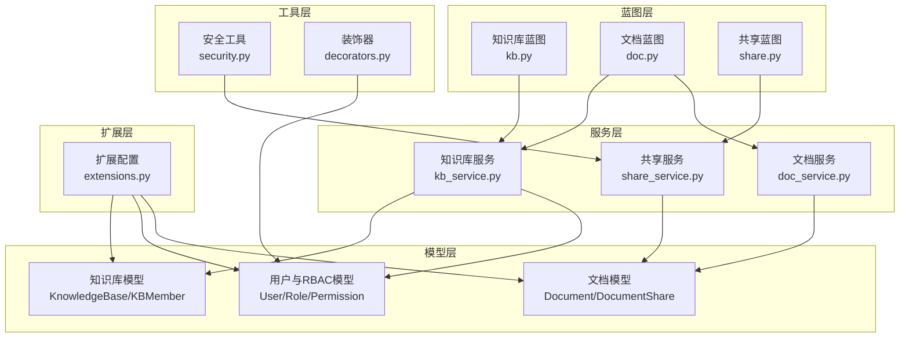
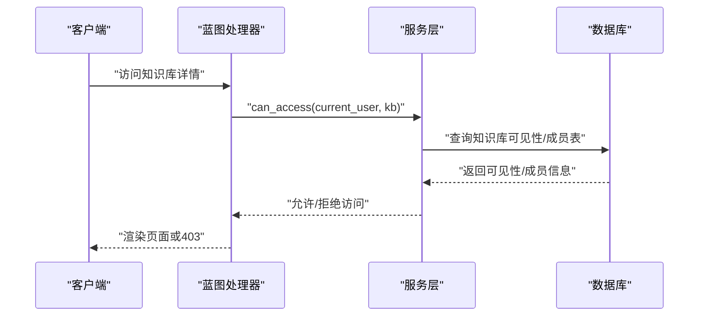
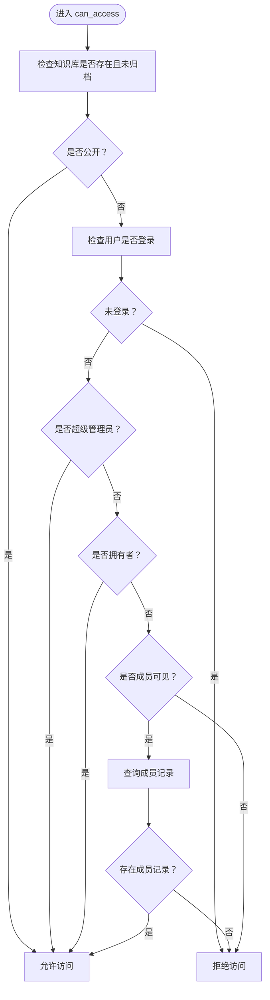
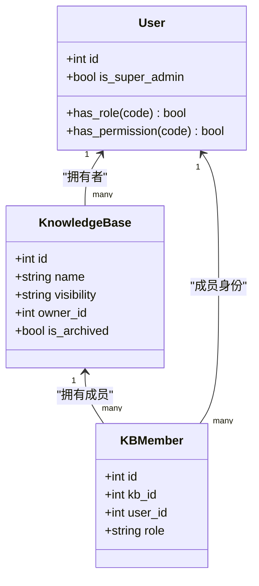
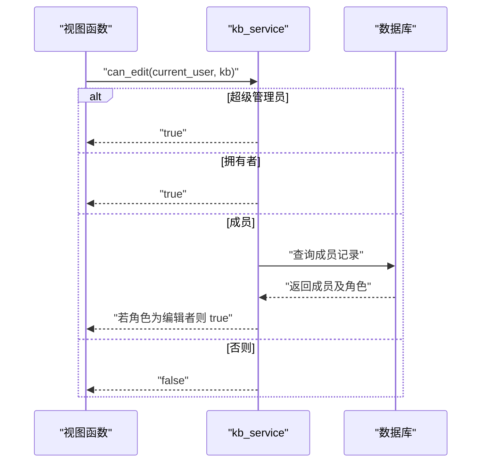
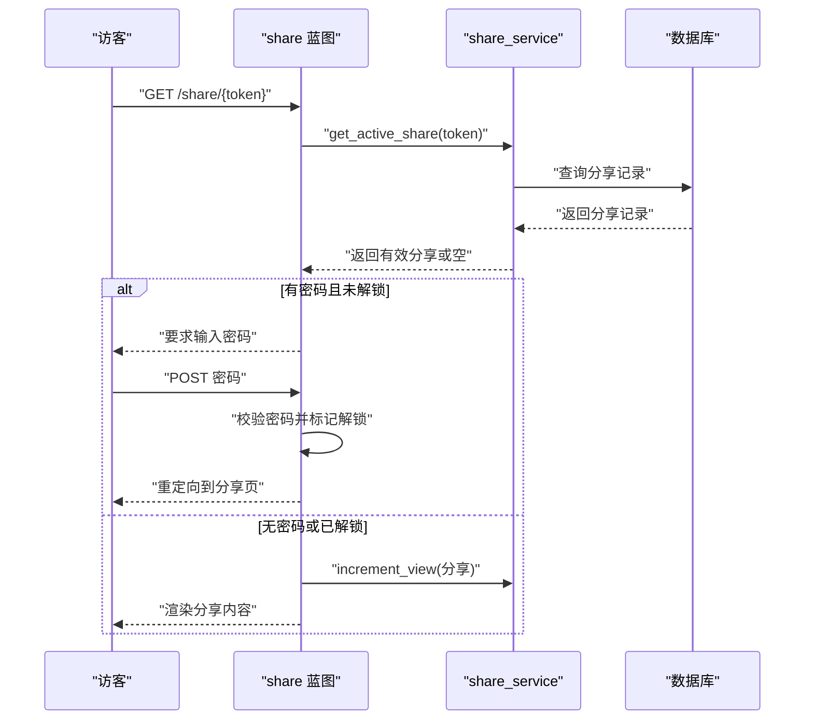
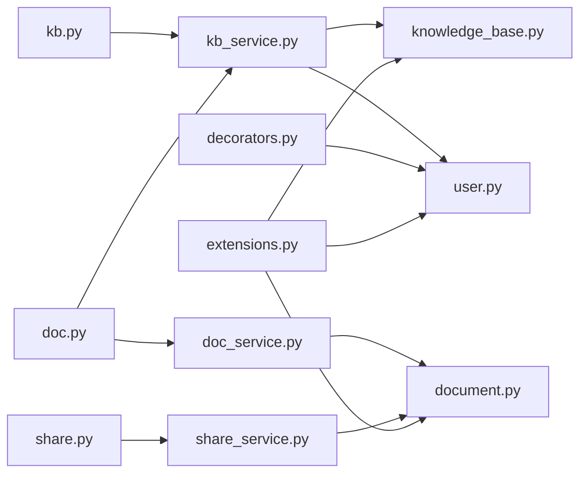

# 权限控制与访问管理

<cite>
**本文引用的文件列表**
- [知识库模型](file://app/models/knowledge_base.py)
- [用户与权限模型](file://app/models/user.py)
- [知识库服务](file://app/services/kb_service.py)
- [文档服务](file://app/services/doc_service.py)
- [共享服务](file://app/services/share_service.py)
- [知识库蓝图](file://app/blueprints/kb.py)
- [文档蓝图](file://app/blueprints/doc.py)
- [共享蓝图](file://app/blueprints/share.py)
- [通用安全工具](file://app/utils/security.py)
- [通用装饰器](file://app/utils/decorators.py)
- [应用扩展配置](file://app/extensions.py)
</cite>

## 目录
1. [简介](#简介)
2. [项目结构](#项目结构)
3. [核心组件](#核心组件)
4. [架构总览](#架构总览)
5. [详细组件分析](#详细组件分析)
6. [依赖关系分析](#依赖关系分析)
7. [性能考虑](#性能考虑)
8. [故障排查指南](#故障排查指南)
9. [结论](#结论)
10. [附录：扩展与自定义建议](#附录扩展与自定义建议)

## 简介
本文件系统性梳理知识库权限控制与访问管理的设计与实现，覆盖以下主题：
- 可见性控制机制（私有、成员可见、公开）的实现原理与应用场景
- 成员角色管理（Viewer、Editor）的权限分配与继承规则
- 权限验证流程、访问控制策略与安全边界设计
- 权限检查函数的实现细节、权限缓存机制与性能优化方案
- 权限相关的业务逻辑示例、错误处理策略与安全审计要点
- 面向开发者的权限扩展方法与自定义权限规则实现指导

## 项目结构
围绕权限控制的关键模块分布如下：
- 模型层：定义知识库可见性、成员角色、用户与RBAC权限等数据结构
- 服务层：封装权限判断、成员管理、文档与共享操作
- 蓝图层：对外暴露路由，调用服务层进行权限校验
- 工具层：提供安全令牌生成、视图装饰器等辅助能力
- 扩展层：集中初始化数据库、登录管理、CSRF保护等

图表来源
- [知识库模型:19-62](file://app/models/knowledge_base.py#L19-L62)
- [用户与权限模型:55-104](file://app/models/user.py#L55-L104)
- [知识库服务:10-80](file://app/services/kb_service.py#L10-L80)
- [文档服务:11-81](file://app/services/doc_service.py#L11-L81)
- [共享服务:15-49](file://app/services/share_service.py#L15-L49)
- [知识库蓝图:56-72](file://app/blueprints/kb.py#L56-L72)
- [文档蓝图:43-55](file://app/blueprints/doc.py#L43-L55)
- [共享蓝图:22-42](file://app/blueprints/share.py#L22-L42)
- [通用安全工具:5-7](file://app/utils/security.py#L5-L7)
- [通用装饰器:8-32](file://app/utils/decorators.py#L8-L32)
- [应用扩展配置:8-17](file://app/extensions.py#L8-L17)

章节来源
- [知识库模型:1-62](file://app/models/knowledge_base.py#L1-L62)
- [用户与权限模型:1-104](file://app/models/user.py#L1-L104)
- [知识库服务:1-80](file://app/services/kb_service.py#L1-L80)
- [文档服务:1-81](file://app/services/doc_service.py#L1-L81)
- [共享服务:1-49](file://app/services/share_service.py#L1-L49)
- [知识库蓝图:1-141](file://app/blueprints/kb.py#L1-L141)
- [文档蓝图:1-139](file://app/blueprints/doc.py#L1-L139)
- [共享蓝图:1-42](file://app/blueprints/share.py#L1-L42)
- [通用安全工具:1-8](file://app/utils/security.py#L1-L8)
- [通用装饰器:1-33](file://app/utils/decorators.py#L1-L33)
- [应用扩展配置:1-17](file://app/extensions.py#L1-L17)

## 核心组件
- 可见性枚举与成员角色
  - 可见性：私有（仅拥有者）、成员可见（拥有者+成员）、公开（任何人）
  - 成员角色：查看者（Viewer）、编辑者（Editor）
- 权限检查函数
  - 访问控制：can_access
  - 编辑权限：can_edit
  - 管理权限：can_manage
- RBAC权限体系
  - 用户具备多个角色，角色具备多个权限；超级管理员拥有全部权限
- 共享与安全
  - 文档分享支持密码保护、过期时间、会话解锁
  - 安全令牌生成用于分享链接

章节来源
- [知识库模型:8-17](file://app/models/knowledge_base.py#L8-L17)
- [知识库服务:10-46](file://app/services/kb_service.py#L10-L46)
- [用户与权限模型:33-96](file://app/models/user.py#L33-L96)
- [共享服务:15-49](file://app/services/share_service.py#L15-L49)
- [通用安全工具:5-7](file://app/utils/security.py#L5-L7)

## 架构总览
权限控制贯穿“蓝图-服务-模型”三层：
- 蓝图负责路由入口与上下文（当前用户、请求参数）
- 服务层执行权限判断与业务操作
- 模型层提供数据结构与关系约束

图表来源
- [知识库蓝图:56-72](file://app/blueprints/kb.py#L56-L72)
- [知识库服务:10-23](file://app/services/kb_service.py#L10-L23)

## 详细组件分析

### 可见性控制机制
- 私有：仅知识库拥有者可访问
- 成员可见：登录用户需为成员或拥有者
- 公开：任何登录用户可访问
- 归档状态：归档的知识库一律不可访问

图表来源
- [知识库服务:10-23](file://app/services/kb_service.py#L10-L23)

章节来源
- [知识库服务:10-23](file://app/services/kb_service.py#L10-L23)
- [知识库模型:19-42](file://app/models/knowledge_base.py#L19-L42)

### 成员角色与权限继承
- 角色定义：查看者（Viewer）与编辑者（Editor）
- 继承规则：
  - 拥有者始终拥有最高权限
  - 超级管理员拥有全部权限
  - 编辑者继承查看权限，并具备编辑/删除能力
  - 管理权限仅拥有者可执行（邀请/移除成员、修改可见性、删除知识库）

图表来源
- [知识库模型:19-62](file://app/models/knowledge_base.py#L19-L62)
- [用户与权限模型:55-104](file://app/models/user.py#L55-L104)

章节来源
- [知识库模型:14-17](file://app/models/knowledge_base.py#L14-L17)
- [知识库服务:26-46](file://app/services/kb_service.py#L26-L46)
- [用户与权限模型:87-96](file://app/models/user.py#L87-L96)

### 权限验证流程与访问控制策略
- 访问控制（can_access）
  - 优先级：公开 > 登录 > 超级管理员 > 拥有者 > 成员可见（成员）
- 编辑权限（can_edit）
  - 超级管理员 > 拥有者 > 成员（仅编辑者）
- 管理权限（can_manage）
  - 仅拥有者可执行成员管理、可见性变更、删除知识库

图表来源
- [知识库服务:26-36](file://app/services/kb_service.py#L26-L36)
- [知识库蓝图:75-91](file://app/blueprints/kb.py#L75-L91)

章节来源
- [知识库服务:10-46](file://app/services/kb_service.py#L10-L46)
- [知识库蓝图:56-103](file://app/blueprints/kb.py#L56-L103)

### 安全边界设计与共享机制
- 文档隐私
  - 常规（可分享）与私密（不可分享）
- 分享链接
  - 支持设置密码与过期时间
  - 使用安全令牌生成，避免可预测性
  - 会话级解锁，防止重复输入密码
- 共享有效性
  - 仅有效且未撤销的分享可访问
  - 访客访问时增加浏览计数

图表来源
- [共享蓝图:22-42](file://app/blueprints/share.py#L22-L42)
- [共享服务:39-49](file://app/services/share_service.py#L39-L49)
- [文档模型:56-98](file://app/models/document.py#L56-L98)

章节来源
- [文档模型:15-18](file://app/models/document.py#L15-L18)
- [共享服务:15-49](file://app/services/share_service.py#L15-L49)
- [共享蓝图:1-42](file://app/blueprints/share.py#L1-L42)
- [通用安全工具:5-7](file://app/utils/security.py#L5-L7)

### 权限检查函数实现细节
- can_access
  - 输入：当前用户、知识库对象
  - 返回：布尔值
  - 关键分支：公开、登录、超级管理员、拥有者、成员可见
- can_edit
  - 输入：当前用户、知识库对象
  - 返回：布尔值
  - 关键分支：超级管理员、拥有者、成员（编辑者）
- can_manage
  - 输入：当前用户、知识库对象
  - 返回：布尔值
  - 关键分支：仅拥有者

章节来源
- [知识库服务:10-46](file://app/services/kb_service.py#L10-L46)

### 权限缓存机制与性能优化
- 查询优化
  - 知识库可见性字段建立索引，加速 can_access 的可见性判断
  - 成员表按 kb_id、user_id 建立唯一约束与索引，加速成员查询
- 减少数据库往返
  - can_access 在成员可见场景下仅做一次成员查询
  - can_edit 在成员场景下仅做一次成员查询并读取角色
- 建议的缓存策略
  - 用户权限缓存：基于会话的短期缓存（如每用户最多缓存最近访问的N个知识库权限）
  - 成员角色缓存：按用户+知识库维度缓存角色，TTL建议与会话一致
  - 共享访问缓存：对有效分享记录进行短时缓存（如1分钟），降低DB压力
- 注意事项
  - 缓存失效时机：知识库可见性变更、成员加入/移除、角色调整、分享撤销/过期
  - 并发一致性：使用数据库事务保证权限变更与缓存更新的一致性

章节来源
- [知识库模型:28-33](file://app/models/knowledge_base.py#L28-L33)
- [知识库模型:47-58](file://app/models/knowledge_base.py#L47-L58)
- [知识库服务:10-46](file://app/services/kb_service.py#L10-L46)

### 权限相关的业务逻辑示例
- 创建知识库
  - 路由：POST /kb/new
  - 权限：登录用户
  - 行为：创建知识库并设为拥有者
- 查看知识库详情
  - 路由：GET /kb/{kb_id}
  - 权限：can_access
  - 行为：渲染页面并注入 can_edit/can_manage 标志
- 编辑知识库
  - 路由：GET/POST /kb/{kb_id}/edit
  - 权限：can_manage
  - 行为：更新名称、描述、图标、可见性
- 删除知识库
  - 路由：POST /kb/{kb_id}/delete
  - 权限：can_manage
  - 行为：归档知识库
- 成员管理
  - 路由：GET/POST /kb/{kb_id}/members
  - 权限：can_manage
  - 行为：添加/移除成员、调整角色
- 新建文档
  - 路由：POST /doc/new
  - 权限：can_edit（针对目标知识库）
  - 行为：创建文档并跳转编辑页
- 分享文档
  - 路由：GET/POST /doc/{doc_id}/share
  - 权限：can_edit（针对文档所属知识库）
  - 行为：创建分享链接（可选密码与过期时间）

章节来源
- [知识库蓝图:32-103](file://app/blueprints/kb.py#L32-L103)
- [文档蓝图:20-139](file://app/blueprints/doc.py#L20-L139)
- [共享蓝图:22-42](file://app/blueprints/share.py#L22-L42)

### 错误处理策略与安全审计要点
- 错误处理
  - 未登录：统一返回 401
  - 无权限：统一返回 403
  - 资源不存在或已归档：返回 404
  - 分享链接无效或过期：返回 410 或提示无效
- 安全审计
  - 记录关键权限变更事件：知识库可见性变更、成员角色调整、分享创建/撤销
  - 记录访问日志：分享链接访问次数、首次解锁时间
  - 异常捕获：对权限异常进行统一处理并记录上下文（用户、资源、时间、IP）

章节来源
- [通用装饰器:8-32](file://app/utils/decorators.py#L8-L32)
- [知识库蓝图:56-103](file://app/blueprints/kb.py#L56-L103)
- [文档蓝图:43-139](file://app/blueprints/doc.py#L43-L139)
- [共享蓝图:22-42](file://app/blueprints/share.py#L22-L42)

## 依赖关系分析
- 蓝图依赖服务层进行权限判断与业务操作
- 服务层依赖模型层的数据结构与关系
- 工具层提供通用安全与鉴权装饰器
- 扩展层集中初始化数据库、登录管理、CSRF保护

图表来源
- [知识库蓝图:1-141](file://app/blueprints/kb.py#L1-L141)
- [文档蓝图:1-139](file://app/blueprints/doc.py#L1-L139)
- [共享蓝图:1-42](file://app/blueprints/share.py#L1-L42)
- [知识库服务:1-80](file://app/services/kb_service.py#L1-L80)
- [文档服务:1-81](file://app/services/doc_service.py#L1-L81)
- [共享服务:1-49](file://app/services/share_service.py#L1-L49)
- [知识库模型:1-62](file://app/models/knowledge_base.py#L1-L62)
- [用户与权限模型:1-104](file://app/models/user.py#L1-L104)
- [文档模型:1-98](file://app/models/document.py#L1-L98)
- [通用装饰器:1-33](file://app/utils/decorators.py#L1-L33)
- [应用扩展配置:1-17](file://app/extensions.py#L1-L17)

章节来源
- [知识库蓝图:1-141](file://app/blueprints/kb.py#L1-L141)
- [文档蓝图:1-139](file://app/blueprints/doc.py#L1-L139)
- [共享蓝图:1-42](file://app/blueprints/share.py#L1-L42)
- [知识库服务:1-80](file://app/services/kb_service.py#L1-L80)
- [文档服务:1-81](file://app/services/doc_service.py#L1-L81)
- [共享服务:1-49](file://app/services/share_service.py#L1-L49)
- [知识库模型:1-62](file://app/models/knowledge_base.py#L1-L62)
- [用户与权限模型:1-104](file://app/models/user.py#L1-L104)
- [文档模型:1-98](file://app/models/document.py#L1-L98)
- [通用装饰器:1-33](file://app/utils/decorators.py#L1-L33)
- [应用扩展配置:1-17](file://app/extensions.py#L1-L17)

## 性能考虑
- 数据库层面
  - 对知识库可见性字段建立索引，提升 can_access 的过滤效率
  - 对成员表的 kb_id、user_id 建立唯一约束与索引，减少重复查询
- 代码层面
  - 将 can_access/can_edit 的分支合并为短路逻辑，减少不必要的数据库查询
  - 对频繁访问的权限结果进行会话级缓存
- 运维层面
  - 对分享访问量高的文档，采用CDN与静态化策略
  - 对权限变更热点（成员管理、可见性变更）进行批量写入与异步刷新

[本节为通用性能建议，不直接分析具体文件]

## 故障排查指南
- 无法访问知识库
  - 检查知识库是否归档
  - 检查可见性与登录状态
  - 检查是否为成员或拥有者
- 无法编辑知识库
  - 检查是否为拥有者或成员（编辑者）
  - 检查是否为超级管理员
- 无法分享文档
  - 检查文档隐私是否为常规
  - 检查分享创建时的异常（如私密文档不可分享）
- 分享链接无效
  - 检查分享是否已撤销或过期
  - 检查密码是否正确
  - 检查会话解锁状态

章节来源
- [知识库服务:10-46](file://app/services/kb_service.py#L10-L46)
- [共享服务:15-49](file://app/services/share_service.py#L15-L49)
- [共享蓝图:22-42](file://app/blueprints/share.py#L22-L42)

## 结论
本系统通过“可见性+成员角色”的双层权限模型，结合服务层的权限判断与蓝图层的路由控制，实现了清晰、可扩展的权限体系。配合文档隐私与分享机制，满足了从私有到公开的多样化访问需求。建议在生产环境中引入会话级权限缓存与完善的审计日志，以进一步提升性能与安全性。

[本节为总结性内容，不直接分析具体文件]

## 附录：扩展与自定义建议
- 自定义权限规则
  - 在用户模型中扩展 has_permission 方法，支持更复杂的权限组合（如基于资源属性的条件权限）
  - 引入权限矩阵：按资源类型与操作定义细粒度权限位
- 成员角色扩展
  - 新增角色类型（如只读、审阅者），并在 can_edit/can_manage 中补充对应分支
  - 支持层级权限：子知识库继承父知识库的部分权限
- 审计与合规
  - 记录每次权限变更的上下文（操作人、目标、原因、时间）
  - 提供权限审计报表接口，支持导出与归档
- 性能优化
  - 引入Redis缓存：用户权限、成员角色、分享有效性
  - 分布式锁：在高并发场景下保证权限变更的一致性
- 安全加固
  - 对敏感操作（删除知识库、撤销分享）增加二次确认与操作时限
  - 对分享链接进行水印或追踪，便于溯源

[本节为概念性建议，不直接分析具体文件]