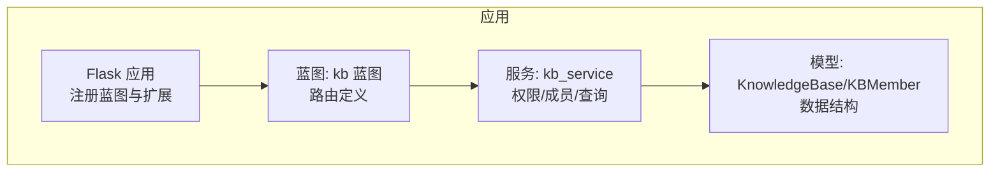
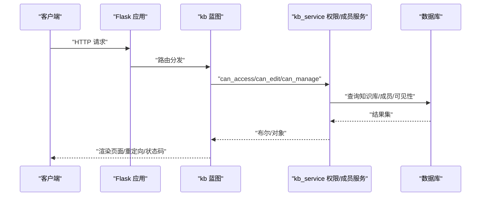
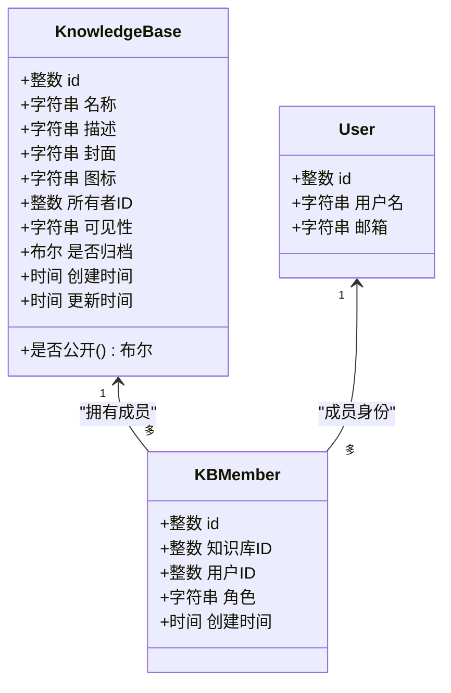
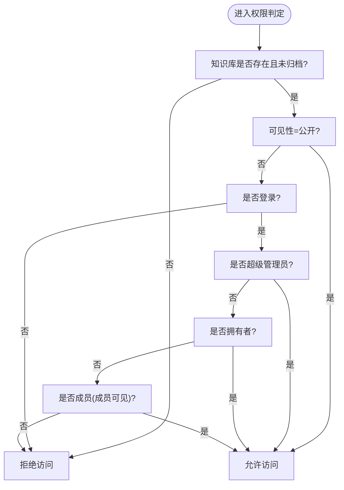
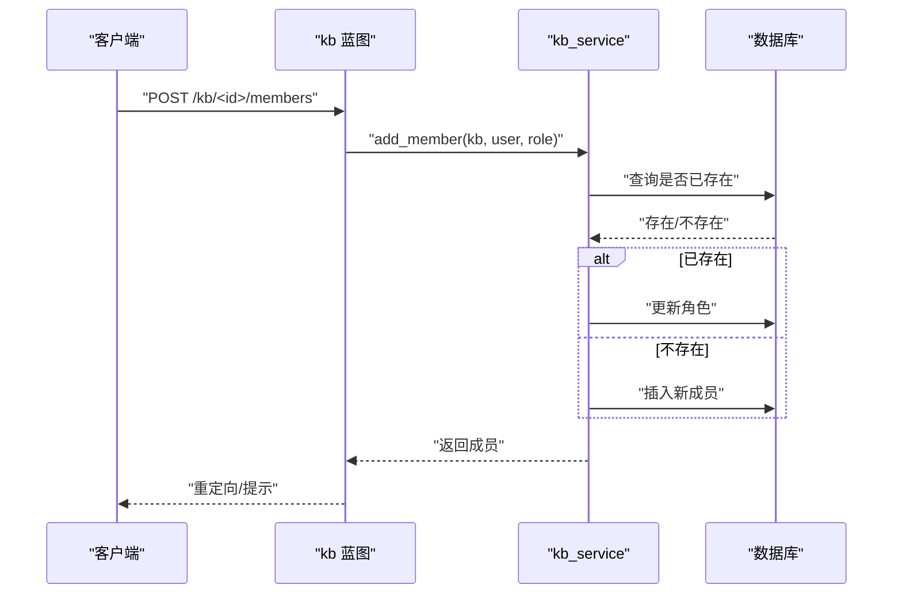
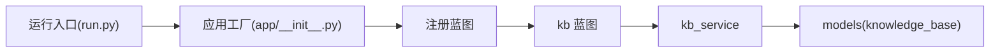

# 知识库CRUD接口

<cite>
**本文引用的文件**
- [app/blueprints/kb.py](file://app/blueprints/kb.py)
- [app/services/kb_service.py](file://app/services/kb_service.py)
- [app/models/knowledge_base.py](file://app/models/knowledge_base.py)
- [app/__init__.py](file://app/__init__.py)
- [app/utils/decorators.py](file://app/utils/decorators.py)
- [app/utils/security.py](file://app/utils/security.py)
- [run.py](file://run.py)
- [wsgi.py](file://wsgi.py)
</cite>

## 目录
1. [简介](#简介)
2. [项目结构](#项目结构)
3. [核心组件](#核心组件)
4. [架构总览](#架构总览)
5. [详细组件分析](#详细组件分析)
6. [依赖分析](#依赖分析)
7. [性能考虑](#性能考虑)
8. [故障排查指南](#故障排查指南)
9. [结论](#结论)
10. [附录](#附录)

## 简介
本文件面向前端与后端开发者，提供“知识库”模块的完整API文档与集成指南。当前代码库以Flask蓝图形式暴露了知识库的列表、详情、编辑、归档（删除）、成员管理等路由；这些路由均基于会话认证与权限控制，不直接提供纯JSON的REST API。本文将按以下维度展开：接口清单、认证与权限、请求/响应说明、错误处理、最佳实践与性能优化，并给出面向前端的集成建议。

## 项目结构
- 路由层：在知识库蓝图中定义各端点，使用登录保护装饰器与业务服务进行权限判定。
- 服务层：封装可见性判断、成员管理、查询聚合等业务逻辑。
- 模型层：定义知识库与成员关系的数据模型及枚举类型。
- 应用入口：注册蓝图并挂载全局错误处理器，统一返回HTML页面或错误页。

图表来源
- [app/__init__.py:56-74](file://app/__init__.py#L56-L74)
- [app/blueprints/kb.py:11](file://app/blueprints/kb.py#L11)
- [app/services/kb_service.py:1-80](file://app/services/kb_service.py#L1-L80)
- [app/models/knowledge_base.py:19-62](file://app/models/knowledge_base.py#L19-L62)

章节来源
- [app/__init__.py:56-74](file://app/__init__.py#L56-L74)
- [app/blueprints/kb.py:11](file://app/blueprints/kb.py#L11)

## 核心组件
- 蓝图路由：提供知识库的列表、新建、详情、编辑、归档、成员管理等端点。
- 权限服务：根据用户身份、知识库可见性、成员角色判定访问、编辑与管理权限。
- 数据模型：知识库实体与成员关系，含可见性与成员角色枚举。

章节来源
- [app/blueprints/kb.py:21-141](file://app/blueprints/kb.py#L21-L141)
- [app/services/kb_service.py:10-80](file://app/services/kb_service.py#L10-L80)
- [app/models/knowledge_base.py:8-62](file://app/models/knowledge_base.py#L8-L62)

## 架构总览
下图展示从浏览器到后端的关键交互路径：路由层接收请求，执行认证与权限校验，调用服务层完成业务处理，最终渲染模板或重定向。

图表来源
- [app/blueprints/kb.py:56-103](file://app/blueprints/kb.py#L56-L103)
- [app/services/kb_service.py:10-45](file://app/services/kb_service.py#L10-L45)

## 详细组件分析

### 认证与权限
- 认证方式：基于Flask-Login的会话认证，所有受保护路由均使用登录保护装饰器。
- 权限判定：
  - 可访问：公开知识库、超级管理员、拥有者、成员（成员可见）。
  - 可编辑：超级管理员、拥有者、成员且角色为编辑者。
  - 可管理：仅拥有者（邀请成员、变更可见性、归档）。
- 全局装饰器：提供超级管理员与细粒度权限装饰器，可复用到其他蓝图。

章节来源
- [app/blueprints/kb.py:22-29](file://app/blueprints/kb.py#L22-L29)
- [app/blueprints/kb.py:78-80](file://app/blueprints/kb.py#L78-L80)
- [app/blueprints/kb.py:97-99](file://app/blueprints/kb.py#L97-L99)
- [app/blueprints/kb.py:109-111](file://app/blueprints/kb.py#L109-L111)
- [app/services/kb_service.py:10-45](file://app/services/kb_service.py#L10-L45)
- [app/utils/decorators.py:8-33](file://app/utils/decorators.py#L8-L33)

### 知识库 CRUD 接口

- 列出知识库
  - 方法与路径：GET /kb/
  - 查询参数：
    - tab: mine 或 public（默认 mine）
  - 权限：登录用户
  - 响应：渲染知识库列表页面
  - 备注：当 tab=public 时返回公开知识库集合

- 新建知识库
  - 方法与路径：GET /kb/new, POST /kb/new
  - 表单字段：
    - name: 必填，去空白
    - description: 可选
    - visibility: 可选，默认 private；允许值来自可见性枚举
    - icon: 可选
  - 权限：登录用户
  - 响应：成功后重定向至知识库详情页；失败回显表单并提示

- 查看知识库详情
  - 方法与路径：GET /kb/<int:kb_id>
  - 参数：kb_id
  - 权限：满足可访问条件
  - 响应：渲染知识库详情页，包含文档树与首篇文档预览
  - 备注：若不可访问返回 403

- 编辑知识库
  - 方法与路径：GET /kb/<int:kb_id>/edit, POST /kb/<int:kb_id>/edit
  - 表单字段：
    - name/description/visibility/icon（同新建）
  - 权限：可管理（拥有者）
  - 响应：成功后重定向至详情页

- 归档（软删除）知识库
  - 方法与路径：POST /kb/<int:kb_id>/delete
  - 参数：kb_id
  - 权限：可管理（拥有者）
  - 响应：设置归档标志并重定向至列表页

- 成员管理
  - 列表与添加成员
    - 方法与路径：GET/POST /kb/<int:kb_id>/members
    - 表单字段：
      - user: 用户名或邮箱（模糊匹配）
      - role: 角色，默认 viewer；允许值来自成员角色枚举
    - 权限：可管理（拥有者）
    - 响应：添加成功后重定向回成员页；失败提示
  - 移除成员
    - 方法与路径：POST /kb/<int:kb_id>/members/<int:user_id>/delete
    - 权限：可管理（拥有者）
    - 响应：移除后重定向回成员页

章节来源
- [app/blueprints/kb.py:21-29](file://app/blueprints/kb.py#L21-L29)
- [app/blueprints/kb.py:32-53](file://app/blueprints/kb.py#L32-L53)
- [app/blueprints/kb.py:56-72](file://app/blueprints/kb.py#L56-L72)
- [app/blueprints/kb.py:75-91](file://app/blueprints/kb.py#L75-L91)
- [app/blueprints/kb.py:94-103](file://app/blueprints/kb.py#L94-L103)
- [app/blueprints/kb.py:106-129](file://app/blueprints/kb.py#L106-L129)
- [app/blueprints/kb.py:132-140](file://app/blueprints/kb.py#L132-L140)

### 数据模型与枚举

图表来源
- [app/models/knowledge_base.py:19-62](file://app/models/knowledge_base.py#L19-L62)

章节来源
- [app/models/knowledge_base.py:8-62](file://app/models/knowledge_base.py#L8-L62)

### 权限判定流程

图表来源
- [app/services/kb_service.py:10-23](file://app/services/kb_service.py#L10-L23)

章节来源
- [app/services/kb_service.py:10-45](file://app/services/kb_service.py#L10-L45)

### 成员管理流程

图表来源
- [app/blueprints/kb.py:112-125](file://app/blueprints/kb.py#L112-L125)
- [app/services/kb_service.py:65-74](file://app/services/kb_service.py#L65-L74)

章节来源
- [app/blueprints/kb.py:106-129](file://app/blueprints/kb.py#L106-L129)
- [app/services/kb_service.py:65-79](file://app/services/kb_service.py#L65-L79)

## 依赖分析
- 蓝图依赖服务层：所有路由在执行业务前先调用服务层进行权限判定与成员操作。
- 服务层依赖模型层：通过查询知识库、成员、用户等实体完成策略判断。
- 应用入口注册蓝图：统一挂载知识库蓝图，设置URL前缀与错误处理。

图表来源
- [run.py:7-16](file://run.py#L7-L16)
- [app/__init__.py:56-74](file://app/__init__.py#L56-L74)
- [app/blueprints/kb.py:11](file://app/blueprints/kb.py#L11)
- [app/services/kb_service.py:1-80](file://app/services/kb_service.py#L1-L80)
- [app/models/knowledge_base.py:19-62](file://app/models/knowledge_base.py#L19-L62)

章节来源
- [app/__init__.py:56-74](file://app/__init__.py#L56-L74)
- [app/blueprints/kb.py:11](file://app/blueprints/kb.py#L11)

## 性能考虑
- 查询优化
  - 知识库列表：对 owner_id 与 is_archived 建有索引，减少过滤成本。
  - 成员查询：对 kb_id 与 user_id 建有索引，避免全表扫描。
- 连接与事务
  - 单次请求内尽量合并数据库写入，减少提交次数。
- 渲染与缓存
  - 当前路由返回HTML页面，适合服务端渲染；如需前后端分离，可在现有服务层之上增加JSON接口层。
- 并发与锁
  - 成员添加采用唯一约束，避免重复；并发场景下建议在调用层做幂等处理。

章节来源
- [app/models/knowledge_base.py:28-33](file://app/models/knowledge_base.py#L28-L33)
- [app/models/knowledge_base.py:47-58](file://app/models/knowledge_base.py#L47-L58)
- [app/services/kb_service.py:48-54](file://app/services/kb_service.py#L48-L54)

## 故障排查指南
- 401 未认证
  - 现象：访问受保护路由但未登录
  - 处理：引导用户登录
- 403 禁止访问
  - 现象：无权限访问知识库或成员管理
  - 处理：检查当前用户与知识库关系、可见性与角色
- 404 资源不存在
  - 现象：知识库不存在或已被归档
  - 处理：提示用户资源不可用
- 500 服务器错误
  - 现象：内部异常
  - 处理：查看日志并修复

章节来源
- [app/blueprints/kb.py:14-18](file://app/blueprints/kb.py#L14-L18)
- [app/__init__.py:76-87](file://app/__init__.py#L76-L87)

## 结论
- 当前知识库模块以HTML页面为主，提供完整的CRUD与成员管理能力。
- 认证与权限体系清晰，可扩展为前后端分离的REST API。
- 建议在现有服务层基础上新增JSON接口，以便前端以标准REST方式集成。

## 附录

### 接口清单与规范

- 列出知识库
  - 方法：GET
  - 路径：/kb/
  - 查询参数：tab=mine|public
  - 权限：登录
  - 响应：HTML页面
  - 状态码：200/401/403

- 新建知识库
  - 方法：GET/POST
  - 路径：/kb/new
  - 表单字段：name（必填）、description、visibility、icon
  - 权限：登录
  - 响应：重定向至详情页或回显表单
  - 状态码：302/401/403

- 查看知识库详情
  - 方法：GET
  - 路径：/kb/<int:kb_id>
  - 参数：kb_id
  - 权限：满足可访问条件
  - 响应：HTML页面
  - 状态码：200/401/403/404

- 编辑知识库
  - 方法：GET/POST
  - 路径：/kb/<int:kb_id>/edit
  - 表单字段：name、description、visibility、icon
  - 权限：可管理（拥有者）
  - 响应：重定向至详情页
  - 状态码：302/401/403/404

- 归档知识库
  - 方法：POST
  - 路径：/kb/<int:kb_id>/delete
  - 参数：kb_id
  - 权限：可管理（拥有者）
  - 响应：重定向至列表页
  - 状态码：302/401/403/404

- 成员管理
  - 添加成员
    - 方法：POST
    - 路径：/kb/<int:kb_id>/members
    - 表单字段：user（用户名或邮箱）、role
    - 权限：可管理（拥有者）
    - 响应：重定向回成员页
    - 状态码：302/401/403/404
  - 移除成员
    - 方法：POST
    - 路径：/kb/<int:kb_id>/members/<int:user_id>/delete
    - 权限：可管理（拥有者）
    - 响应：重定向回成员页
    - 状态码：302/401/403/404

章节来源
- [app/blueprints/kb.py:21-141](file://app/blueprints/kb.py#L21-L141)

### 认证与权限最佳实践
- 登录态保持：确保Cookie安全与HttpOnly设置，避免XSS泄露。
- 权限最小化：仅授予必要角色（编辑者仅用于内容协作）。
- 幂等设计：成员添加接口建议支持重复添加时的幂等行为（更新角色）。
- 错误反馈：统一返回错误信息与状态码，便于前端提示与重试。

章节来源
- [app/utils/decorators.py:8-33](file://app/utils/decorators.py#L8-L33)
- [app/services/kb_service.py:10-45](file://app/services/kb_service.py#L10-L45)

### 前端集成指南
- 路由前缀：所有知识库相关路由均带有 /kb 前缀。
- 登录与会话：前端需维护登录态并在请求头携带会话Cookie。
- 表单提交：成员管理与知识库编辑使用表单提交，注意CSRF保护。
- 错误处理：监听401/403/404/500并引导用户处理。

章节来源
- [app/__init__.py:66-73](file://app/__init__.py#L66-L73)
- [app/blueprints/kb.py:106-140](file://app/blueprints/kb.py#L106-L140)

### 安全与令牌
- 安全工具：提供生成URL安全令牌的辅助函数，可用于分享链接等场景。
- CSRF保护：应用已启用CSRF扩展，前端提交表单时需配合CSRF Token。

章节来源
- [app/utils/security.py:5-7](file://app/utils/security.py#L5-L7)
- [app/__init__.py:42](file://app/__init__.py#L42)