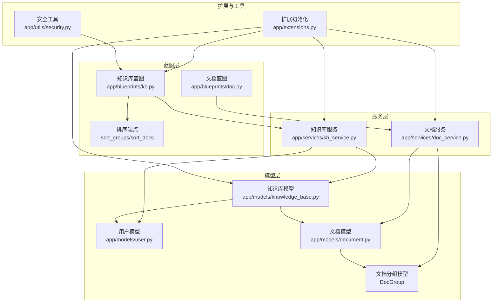
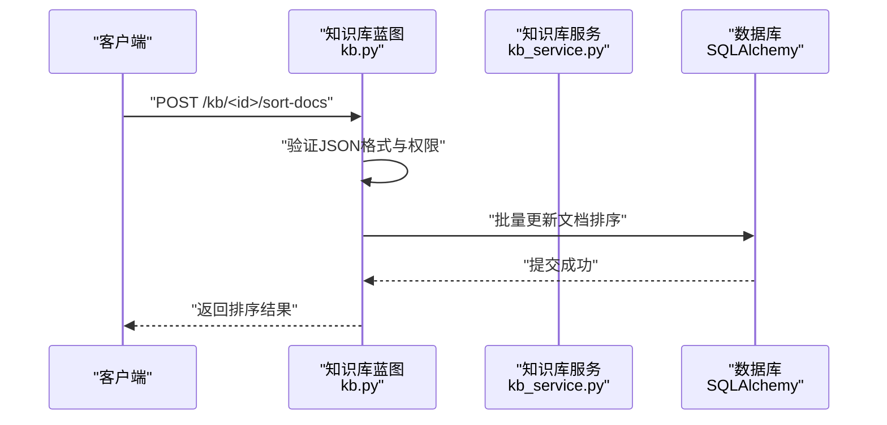
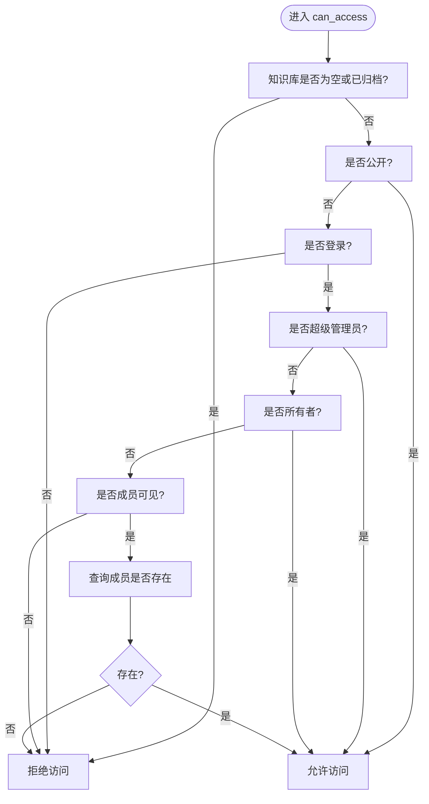
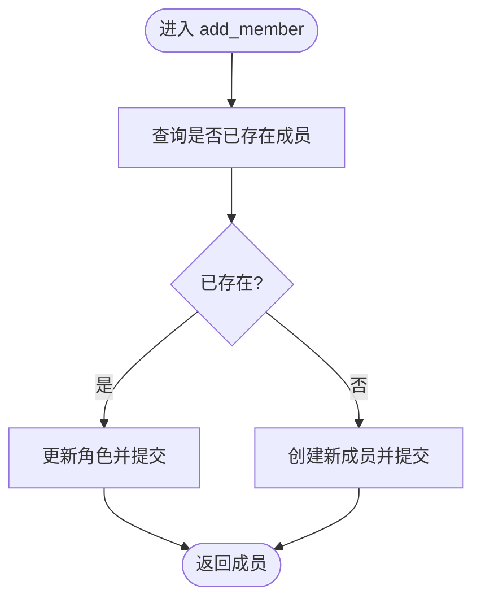
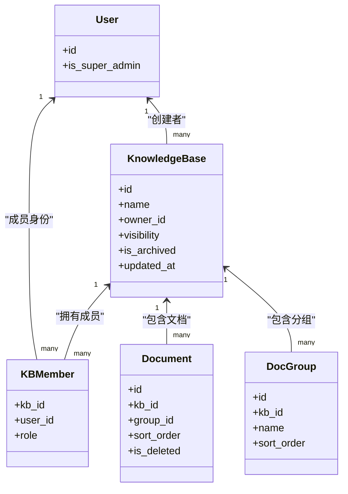
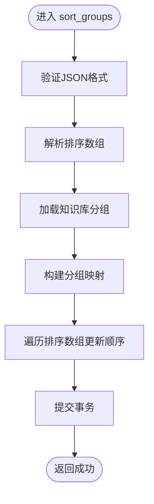
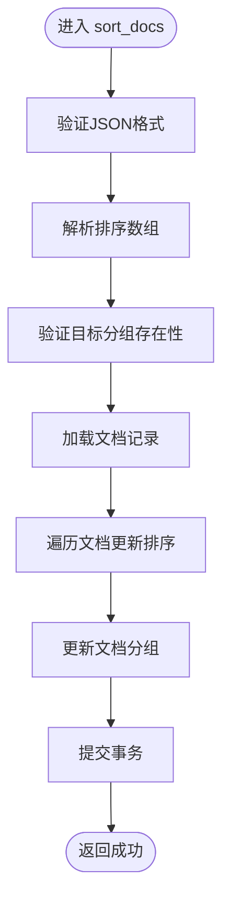
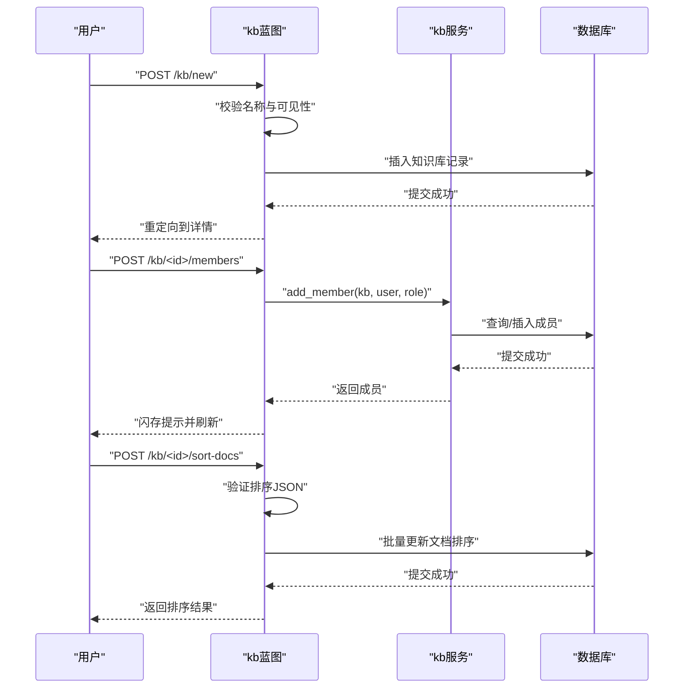
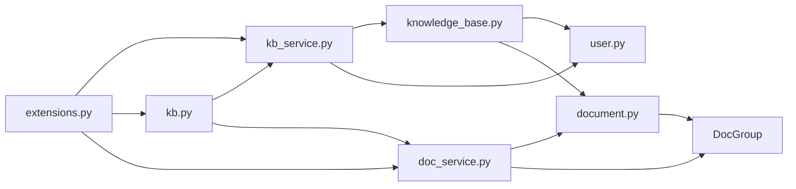

# 知识库业务逻辑

<cite>
**本文引用的文件**
- [app/services/kb_service.py](file://app/services/kb_service.py)
- [app/models/knowledge_base.py](file://app/models/knowledge_base.py)
- [app/models/user.py](file://app/models/user.py)
- [app/blueprints/kb.py](file://app/blueprints/kb.py)
- [app/models/document.py](file://app/models/document.py)
- [app/services/doc_service.py](file://app/services/doc_service.py)
- [app/extensions.py](file://app/extensions.py)
- [app/utils/security.py](file://app/utils/security.py)
- [app/cli.py](file://app/cli.py)
- [requirements.txt](file://requirements.txt)
</cite>

## 目录
1. [简介](#简介)
2. [项目结构](#项目结构)
3. [核心组件](#核心组件)
4. [架构总览](#架构总览)
5. [详细组件分析](#详细组件分析)
6. [依赖分析](#依赖分析)
7. [性能考虑](#性能考虑)
8. [故障排查指南](#故障排查指南)
9. [结论](#结论)
10. [附录](#附录)

## 简介
本文件聚焦于知识库服务层的业务逻辑，系统性阐述知识库生命周期管理、成员关系维护与权限验证的实现细节；解释事务处理、数据一致性与并发控制策略；梳理业务规则与输入校验、异常处理机制；说明服务层与数据模型的交互方式、缓存策略与性能优化技巧；并提供单元测试与集成测试方法及调试技巧，最后给出扩展与重构建议。

**更新** 本版本新增拖拽排序业务逻辑的详细实现，包括文档排序算法、跨组移动逻辑和排序状态管理。

## 项目结构
- 蓝图层负责请求路由、参数解析与响应渲染，调用服务层进行业务处理。
- 服务层封装领域规则与事务边界，屏蔽数据访问细节。
- 模型层定义实体、枚举与外键约束，确保数据库层面的一致性。
- 扩展模块集中初始化数据库、迁移、登录与CSRF等基础设施。

**图表来源**
- [app/blueprints/kb.py:1-291](file://app/blueprints/kb.py#L1-L291)
- [app/services/kb_service.py:1-115](file://app/services/kb_service.py#L1-L115)
- [app/services/doc_service.py:1-130](file://app/services/doc_service.py#L1-L130)
- [app/models/knowledge_base.py:1-62](file://app/models/knowledge_base.py#L1-L62)
- [app/models/user.py:1-104](file://app/models/user.py#L1-L104)
- [app/models/document.py:1-117](file://app/models/document.py#L1-L117)

**章节来源**
- [app/blueprints/kb.py:1-291](file://app/blueprints/kb.py#L1-L291)
- [app/services/kb_service.py:1-115](file://app/services/kb_service.py#L1-L115)
- [app/services/doc_service.py:1-130](file://app/services/doc_service.py#L1-L130)
- [app/models/knowledge_base.py:1-62](file://app/models/knowledge_base.py#L1-L62)
- [app/models/user.py:1-104](file://app/models/user.py#L1-L104)
- [app/models/document.py:1-117](file://app/models/document.py#L1-L117)

## 核心组件
- 权限判定函数族：can_access、can_edit、can_manage，统一处理公开可见、登录态、超级管理员、所有者与成员角色。
- 成员关系操作：add_member、remove_member，封装成员增删与角色更新。
- 列表查询：list_my_kbs、list_public_kbs，聚合拥有与加入的知识库集合。
- **排序功能**：sort_groups、sort_docs，实现分组排序与文档排序的复杂算法。
- 蓝图路由：创建、详情、编辑、归档、成员管理等端点，调用服务层执行业务规则。

**章节来源**
- [app/services/kb_service.py:10-115](file://app/services/kb_service.py#L10-L115)
- [app/blueprints/kb.py:244-291](file://app/blueprints/kb.py#L244-L291)

## 架构总览
服务层以"职责单一、事务边界清晰"为核心设计原则：
- 权限判定前置于所有写操作与敏感读取，避免越权访问。
- 成员关系与可见性通过模型级唯一约束与外键级联保障一致性。
- 事务在服务层内提交，蓝图仅负责参数校验与HTTP语义。
- **排序功能采用原子性事务处理，确保排序状态的一致性。**

**图表来源**
- [app/blueprints/kb.py:266-291](file://app/blueprints/kb.py#L266-L291)

## 详细组件分析

### 权限验证组件
- can_access：公开可见优先、登录态次之、超级管理员与所有者直接放行，成员可见时需检查成员表存在性。
- can_edit：编辑权限要求成员角色为编辑者，或所有者/超级管理员。
- can_manage：管理权限仅限所有者与超级管理员。

**图表来源**
- [app/services/kb_service.py:10-46](file://app/services/kb_service.py#L10-L46)

**章节来源**
- [app/services/kb_service.py:10-46](file://app/services/kb_service.py#L10-L46)

### 成员关系维护组件
- add_member：若成员已存在则更新角色，否则新增成员；均在单事务中提交。
- remove_member：按知识库与用户ID删除成员记录。

**图表来源**
- [app/services/kb_service.py:100-115](file://app/services/kb_service.py#L100-L115)

**章节来源**
- [app/services/kb_service.py:100-115](file://app/services/kb_service.py#L100-L115)

### 知识库列表与查询组件
- list_my_kbs：合并"我创建的未归档知识库"与"我加入的未归档知识库"，去重后按更新时间倒序。
- list_public_kbs：筛选公开且未归档的知识库，按更新时间倒序。

**图表来源**
- [app/models/knowledge_base.py:19-61](file://app/models/knowledge_base.py#L19-L61)
- [app/models/user.py:55-104](file://app/models/user.py#L55-L104)
- [app/models/document.py:37-72](file://app/models/document.py#L37-L72)

**章节来源**
- [app/services/kb_service.py:83-97](file://app/services/kb_service.py#L83-L97)

### 排序功能组件

#### 分组排序算法
- sort_groups：实现分组的重新排序，支持拖拽排序与批量更新。
- 算法特点：原子性事务、顺序一致性、边界检查。

**图表来源**
- [app/blueprints/kb.py:246-263](file://app/blueprints/kb.py#L246-L263)

#### 文档排序与跨组移动
- sort_docs：实现文档的重新排序，支持跨分组移动与排序状态管理。
- 复杂逻辑：文档排序、分组移动、顺序一致性保证。

**图表来源**
- [app/blueprints/kb.py:266-291](file://app/blueprints/kb.py#L266-L291)

**章节来源**
- [app/blueprints/kb.py:246-291](file://app/blueprints/kb.py#L246-L291)

### 蓝图与业务流程
- 新建知识库：校验必填字段与可见性枚举，创建后即为当前用户拥有。
- 详情页：根据can_access判断访问权限，渲染树形文档与默认打开首篇文档。
- 编辑知识库：仅管理权限可修改可见性等元信息。
- 删除知识库：归档而非物理删除，保持引用完整性。
- 成员管理：仅管理权限可邀请/移除成员，支持角色切换。
- **排序功能**：拖拽排序通过AJAX请求实时更新，支持跨分组移动与即时反馈。

**图表来源**
- [app/blueprints/kb.py:32-53](file://app/blueprints/kb.py#L32-L53)
- [app/blueprints/kb.py:106-129](file://app/blueprints/kb.py#L106-L129)
- [app/blueprints/kb.py:266-291](file://app/blueprints/kb.py#L266-L291)

**章节来源**
- [app/blueprints/kb.py:21-291](file://app/blueprints/kb.py#L21-L291)

### 文档与共享上下文
- 文档隐私与可分享性：文档隐私为普通时可生成分享链接；分享模型包含口令哈希、过期与撤销控制。
- 分享令牌生成：使用安全随机数生成URL安全令牌。
- **排序状态持久化**：文档排序状态存储在数据库中，支持实时拖拽排序与跨分组移动。

**章节来源**
- [app/models/document.py:75-117](file://app/models/document.py#L75-L117)
- [app/utils/security.py:5-8](file://app/utils/security.py#L5-L8)

## 依赖分析
- 服务层依赖模型层的枚举与实体，以及扩展模块的数据库会话。
- 蓝图层依赖服务层与文档服务，负责HTTP语义与模板渲染。
- 数据库层通过外键与唯一约束保证实体间关系与一致性。
- **排序功能依赖前端拖拽事件与AJAX请求，实现实时排序更新。**

**图表来源**
- [app/extensions.py:8-17](file://app/extensions.py#L8-L17)
- [app/services/kb_service.py:6-7](file://app/services/kb_service.py#L6-L7)
- [app/blueprints/kb.py:5-9](file://app/blueprints/kb.py#L5-L9)
- [app/services/doc_service.py:6-7](file://app/services/doc_service.py#L6-L7)
- [app/models/knowledge_base.py:1-62](file://app/models/knowledge_base.py#L1-L62)
- [app/models/user.py:1-104](file://app/models/user.py#L1-L104)
- [app/models/document.py:1-117](file://app/models/document.py#L1-L117)

**章节来源**
- [app/extensions.py:1-17](file://app/extensions.py#L1-L17)
- [app/services/kb_service.py:1-8](file://app/services/kb_service.py#L1-L8)
- [app/blueprints/kb.py:1-11](file://app/blueprints/kb.py#L1-L11)
- [app/services/doc_service.py:1-8](file://app/services/doc_service.py#L1-L8)

## 性能考虑
- 查询优化
  - 知识库与成员查询均使用索引列过滤，减少全表扫描。
  - 合并查询使用UNION并在内存中排序，避免复杂JOIN。
  - **排序功能使用批量更新，减少多次数据库往返。**
- 事务与并发
  - 单个业务操作内提交，减少长事务持有锁的时间。
  - 成员关系采用唯一约束，避免重复成员与脏写。
  - **排序操作在单个事务中完成，确保排序状态的一致性。**
- 缓存策略
  - 当前未见显式缓存实现；可在蓝图层对热点列表（如公共知识库）增加短期缓存，注意失效策略与一致性。
  - **排序状态可考虑短期缓存，但需注意与数据库状态的同步。**
- I/O与序列化
  - 文档内容为JSON大文本，建议在服务层做分页或懒加载，避免一次性传输大量内容。
  - **排序请求使用JSON格式，减少数据传输开销。**

## 故障排查指南
- 权限相关
  - 若出现403，检查can_access判定链：知识库状态、可见性、登录态、超级管理员、所有者、成员关系。
  - 确认枚举值校验：蓝图对可见性与角色进行合法性检查，非法值回退为默认值。
- 事务与一致性
  - 成员增删必须在单事务中完成，确保唯一约束不被并发破坏。
  - 归档知识库不会物理删除，仍保留成员与文档引用，避免级联删除引发的数据丢失。
  - **排序操作在单个事务中完成，确保排序状态的一致性。**
- 输入校验
  - 创建知识库时名称必填；编辑时可见性合法才更新。
  - 成员邀请时用户名或邮箱匹配唯一用户，且不能邀请所有者自身。
  - **排序请求验证JSON格式与排序数组类型，非法格式返回400错误。**
- 异常处理
  - 蓝图层对不存在或已归档知识库返回404；越权访问返回403。
  - 服务层异常通常由数据库约束或业务规则触发，建议在蓝图层捕获并反馈友好提示。
  - **排序功能对无效分组返回404，对非法排序格式返回400。**

**章节来源**
- [app/blueprints/kb.py:14-18](file://app/blueprints/kb.py#L14-L18)
- [app/blueprints/kb.py:35-43](file://app/blueprints/kb.py#L35-L43)
- [app/blueprints/kb.py:112-124](file://app/blueprints/kb.py#L112-L124)
- [app/blueprints/kb.py:255-256](file://app/blueprints/kb.py#L255-L256)
- [app/blueprints/kb.py:276-277](file://app/blueprints/kb.py#L276-L277)

## 结论
本知识库服务层以清晰的权限判定与成员关系维护为核心，结合模型层的唯一约束与外键级联，实现了高一致性的知识库生命周期管理。**新增的拖拽排序功能通过原子性事务处理，确保了排序状态的一致性和可靠性。蓝图层专注于HTTP语义与用户体验，服务层专注业务规则与事务边界。建议在保持现有事务边界的前提下，逐步引入缓存与异步任务，进一步提升性能与可扩展性。**

## 附录

### 单元测试示例思路
- 权限判定
  - 使用模拟用户对象与知识库对象，覆盖公开/私密/成员可见三种场景，验证can_access/can_edit/can_manage返回值。
- 成员关系
  - 测试add_member重复邀请更新角色、remove_member移除成员，断言数据库唯一约束与查询结果。
- 列表查询
  - 构造多角色与多归属场景，断言list_my_kbs返回集合的正确性与排序。
- **排序功能**
  - 测试sort_groups分组排序的原子性与一致性。
  - 测试sort_docs文档排序与跨组移动的复杂逻辑。
  - 断言排序状态的持久化与查询正确性。
- 蓝图端点
  - 使用Flask测试客户端发起POST请求，断言闪存消息与重定向目标。

### 集成测试方法
- 基于真实数据库的端到端测试：从蓝图路由到服务层再到数据库，验证完整流程。
- 并发场景：模拟多个线程同时邀请/移除成员，验证唯一约束与事务隔离。
- 权限回归：构造越权请求，确保蓝图返回403或404。
- **排序功能测试**：模拟拖拽排序场景，验证跨分组移动与排序状态更新。

### 调试技巧
- 在服务层关键路径打印事务提交前后状态，定位并发冲突。
- 使用数据库慢查询日志与索引使用情况，优化列表查询。
- 对外键错误（如违反唯一约束）进行捕获与日志输出，便于定位重复操作。
- **使用浏览器开发者工具监控排序AJAX请求，检查请求参数与响应状态。**

### 扩展与重构建议
- 权限体系扩展：引入RBAC权限码与角色权限映射，服务层统一通过has_permission判断。
- 成员角色细化：新增只读、协作者等角色，调整can_edit与can_manage分支。
- 缓存与搜索：对公共知识库列表与热门知识库详情增加缓存；对文档内容建立全文索引。
- 异步构建：将大型知识库的索引/向量化构建放入后台任务队列，避免阻塞请求。
- 安全加固：对成员邀请与角色变更增加审计日志与二次确认。
- **排序功能优化**：考虑添加排序历史记录与撤销功能，支持更复杂的排序场景。
- **性能优化**：为频繁排序操作添加数据库索引，优化批量更新性能。