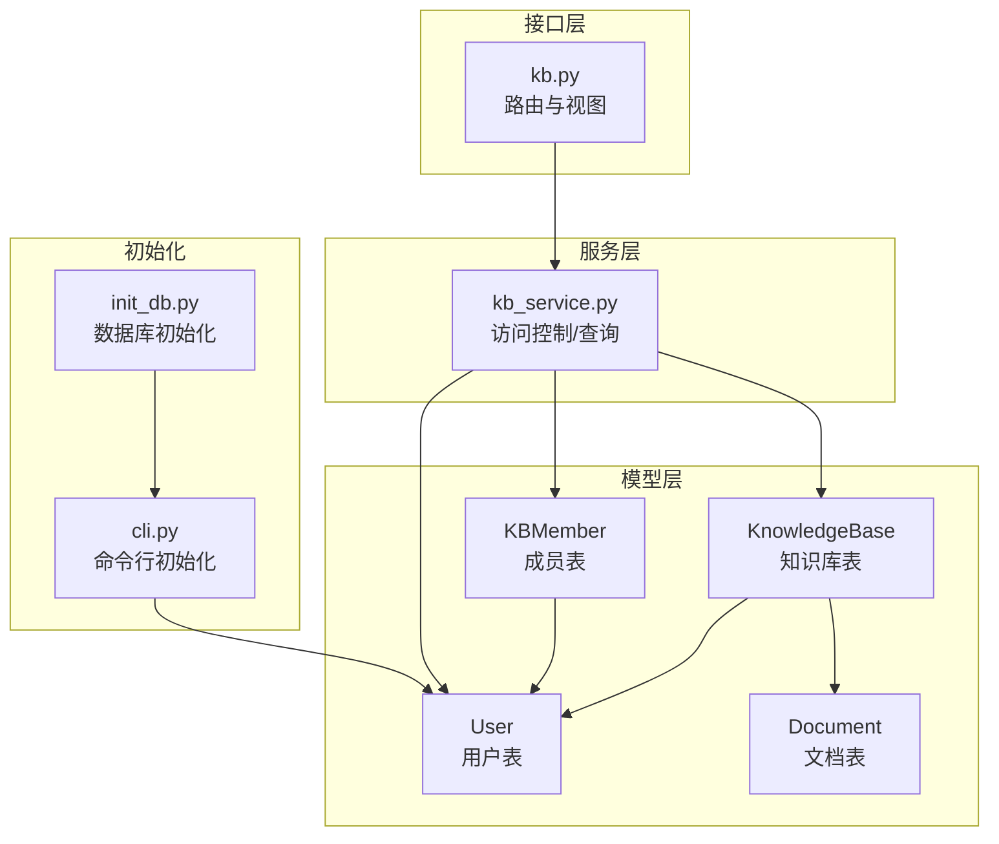
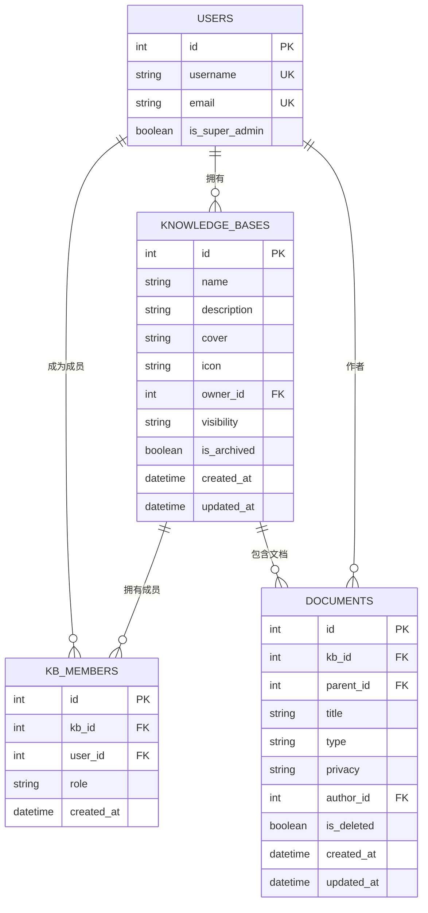
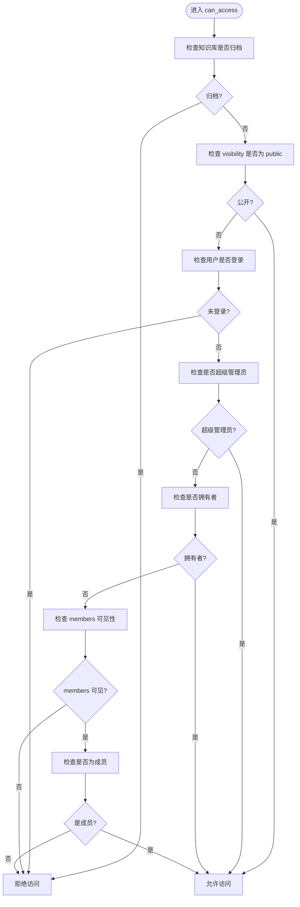
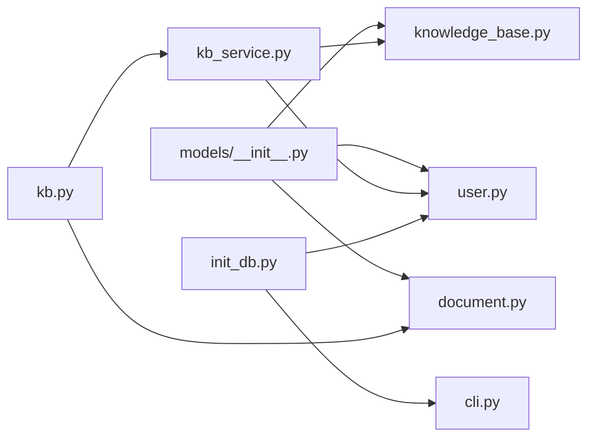

# 知识库数据模型

<cite>
**本文引用的文件**
- [knowledge_base.py](file://app/models/knowledge_base.py)
- [user.py](file://app/models/user.py)
- [document.py](file://app/models/document.py)
- [kb_service.py](file://app/services/kb_service.py)
- [kb.py](file://app/blueprints/kb.py)
- [__init__.py](file://app/models/__init__.py)
- [init_db.py](file://scripts/init_db.py)
- [cli.py](file://app/cli.py)
</cite>

## 目录
1. [简介](#简介)
2. [项目结构](#项目结构)
3. [核心组件](#核心组件)
4. [架构总览](#架构总览)
5. [详细组件分析](#详细组件分析)
6. [依赖关系分析](#依赖关系分析)
7. [性能考量](#性能考量)
8. [故障排查指南](#故障排查指南)
9. [结论](#结论)
10. [附录](#附录)

## 简介
本文件系统性梳理知识库数据模型，重点围绕 KnowledgeBase 和 KBMember 两大核心实体，解释其设计理念、字段语义、数据类型约束、外键关系与索引设计，并结合服务层访问控制逻辑，阐述可见性枚举（KBVisibility）与成员角色枚举（KBMemberRole）的使用场景与边界条件。文档同时给出查询优化技巧、数据完整性保障机制、扩展指导与最佳实践，帮助开发者在不直接阅读源码的情况下快速掌握模型用法与注意事项。

## 项目结构
知识库模型位于应用层 models 包中，配合服务层（services）、蓝图（blueprints）与 CLI 初始化脚本共同构成完整的知识库功能闭环。下图展示与知识库模型直接相关的模块与交互关系。

图表来源
- [knowledge_base.py:19-61](file://app/models/knowledge_base.py#L19-L61)
- [user.py:55-104](file://app/models/user.py#L55-L104)
- [document.py:20-46](file://app/models/document.py#L20-L46)
- [kb_service.py:10-80](file://app/services/kb_service.py#L10-L80)
- [kb.py:14-141](file://app/blueprints/kb.py#L14-L141)
- [init_db.py:23-47](file://scripts/init_db.py#L23-L47)
- [cli.py:61-80](file://app/cli.py#L61-L80)

章节来源
- [knowledge_base.py:1-62](file://app/models/knowledge_base.py#L1-L62)
- [user.py:1-104](file://app/models/user.py#L1-L104)
- [document.py:1-98](file://app/models/document.py#L1-L98)
- [kb_service.py:1-80](file://app/services/kb_service.py#L1-L80)
- [kb.py:1-141](file://app/blueprints/kb.py#L1-L141)
- [__init__.py:1-38](file://app/models/__init__.py#L1-L38)
- [init_db.py:1-51](file://scripts/init_db.py#L1-L51)
- [cli.py:47-80](file://app/cli.py#L47-L80)

## 核心组件
本节聚焦 KnowledgeBase 与 KBMember 的字段、约束、关系与行为，以及枚举类型 KBVisibility 与 KBMemberRole 的语义与使用。

- KnowledgeBase（知识库）
  - 表名：knowledge_bases
  - 主键：id（整型）
  - 关键字段：
    - name：字符串，长度上限 128，非空
    - description：字符串，长度上限 500，默认空串
    - cover：字符串，长度上限 255，默认空串
    - icon：字符串，长度上限 32，默认“book”
    - owner_id：整型，外键 users.id，级联删除，非空，建立索引
    - visibility：字符串，长度上限 16，默认“private”，非空，建立索引
    - is_archived：布尔，默认 false，非空
    - created_at / updated_at：时间戳，默认当前 UTC，更新时自动写入
  - 关系：
    - owner：指向 User 的反向关系，backref 名称 owned_kbs
    - documents：通过 Document.kb_id 外键反向关联（由 Document 模型定义）
  - 属性：
    - is_public：基于 visibility 判断是否公开

- KBMember（成员）
  - 表名：kb_members
  - 主键：id（整型）
  - 唯一约束：kb_id + user_id 组合唯一
  - 关键字段：
    - kb_id：整型，外键 knowledge_bases.id，级联删除，非空，建立索引
    - user_id：整型，外键 users.id，级联删除，非空，建立索引
    - role：字符串，长度上限 16，默认“viewer”，非空
    - created_at：时间戳，默认当前 UTC
  - 关系：
    - kb：指向 KnowledgeBase 的反向关系，backref 名称为 members；配置级联删除 orphan
    - user：指向 User 的反向关系，backref 名称为 kb_memberships

- 枚举类型
  - KBVisibility：private（仅拥有者）、members（拥有者+成员）、public（任何人）
  - KBMemberRole：viewer（只读）、editor（可编辑）

章节来源
- [knowledge_base.py:19-61](file://app/models/knowledge_base.py#L19-L61)
- [user.py:55-104](file://app/models/user.py#L55-L104)
- [document.py:20-46](file://app/models/document.py#L20-L46)
- [__init__.py:2-3](file://app/models/__init__.py#L2-L3)

## 架构总览
下图从数据模型角度展示知识库与其成员、文档、用户的关联关系，以及外键与索引的分布。

图表来源
- [knowledge_base.py:19-61](file://app/models/knowledge_base.py#L19-L61)
- [user.py:55-104](file://app/models/user.py#L55-L104)
- [document.py:20-46](file://app/models/document.py#L20-L46)

## 详细组件分析

### KnowledgeBase 类与字段语义
- 字段与约束
  - name/description/icon/cover：用于知识库元信息展示，长度限制与默认值确保前端渲染一致性与最小可用性
  - owner_id + visibility：组合决定访问控制策略；visibility 建立索引以支持按可见性过滤
  - is_archived：软删除标记，配合服务层与蓝图逻辑实现归档而非物理删除
  - created_at/updated_at：统一时间戳管理，便于排序与审计
- 关系与属性
  - owner 反向关系：通过 backref 访问 owned_kbs，便于统计或批量操作
  - is_public 属性：简化公共可见判断
- 使用场景
  - 创建：蓝图 POST /new 接收表单参数并持久化
  - 编辑：蓝图 POST /<id>/edit 更新 name/description/visibility/icon
  - 删除：蓝图 POST /<id>/delete 将 is_archived 设为 true
  - 列表：服务层 list_my_kbs 与 list_public_kbs 提供不同维度的查询

章节来源
- [knowledge_base.py:19-43](file://app/models/knowledge_base.py#L19-L43)
- [kb.py:32-91](file://app/blueprints/kb.py#L32-L91)
- [kb_service.py:48-62](file://app/services/kb_service.py#L48-L62)

### KBMember 类与成员管理
- 唯一约束与外键
  - uq_kb_user：kb_id + user_id 唯一，避免重复成员
  - kb_id/user_id 外键均配置 CASCADE，确保知识库或用户删除时级联清理成员记录
- 角色与权限
  - 默认 viewer；editor 仅在 can_edit 条件下具备编辑权限
- 关系与级联
  - kb.members 配置 cascade="all, delete-orphan"，当成员对象从集合移除时自动删除
  - user.kb_memberships 便于用户侧查询其所有知识库成员身份
- 使用场景
  - 添加成员：服务层 add_member 支持更新现有成员角色或新增
  - 移除成员：服务层 remove_member 删除指定成员
  - 成员列表：蓝图 GET /<id>/members 展示当前知识库成员

章节来源
- [knowledge_base.py:45-61](file://app/models/knowledge_base.py#L45-L61)
- [kb_service.py:65-79](file://app/services/kb_service.py#L65-L79)
- [kb.py:106-140](file://app/blueprints/kb.py#L106-L140)

### 访问控制与枚举使用
- 可见性枚举 KBVisibility
  - private：仅拥有者可见
  - members：拥有者与成员可见
  - public：任何登录用户可见
- 成员角色枚举 KBMemberRole
  - viewer：只读
  - editor：可编辑
- 控制逻辑
  - can_access：综合可见性、登录状态、超级管理员、拥有者身份与成员身份判定
  - can_edit：在 can_access 基础上进一步要求成员角色为 editor
  - can_manage：仅拥有者或超级管理员可执行管理操作（变更可见性、邀请/移除成员、删除知识库）

图表来源
- [kb_service.py:10-23](file://app/services/kb_service.py#L10-L23)

章节来源
- [kb_service.py:10-45](file://app/services/kb_service.py#L10-L45)
- [knowledge_base.py:8-17](file://app/models/knowledge_base.py#L8-L17)

### 数据完整性与级联策略
- 外键与级联
  - KnowledgeBase.owner_id -> users.id：ondelete=CASCADE，删除用户时级联删除其知识库
  - KBMember.kb_id -> knowledge_bases.id：ondelete=CASCADE，删除知识库时级联删除成员
  - KBMember.user_id -> users.id：ondelete=CASCADE，删除用户时级联删除其成员身份
  - Document.kb_id -> knowledge_bases.id：ondelete=CASCADE，删除知识库时级联删除文档
  - Document.author_id -> users.id：ondelete=SET NULL，删除用户时保留文档但清空作者
  - Document.parent_id -> documents.id：ondelete=SET NULL，删除父文档时子文档保留但断开父子关系
- 唯一约束
  - KBMember(uq_kb_user)：防止重复成员
  - DocumentShare(token)：分享令牌唯一
- 索引
  - KnowledgeBase(owner_id, visibility)：加速按拥有者与可见性筛选
  - KBMember(kb_id, user_id)：加速成员查询与去重
  - Document(author_id, kb_id, is_deleted)：加速文档树与作者筛选
  - DocumentShare(token)：加速令牌查找

章节来源
- [knowledge_base.py:28-29](file://app/models/knowledge_base.py#L28-L29)
- [knowledge_base.py:47-49](file://app/models/knowledge_base.py#L47-L49)
- [document.py:24-39](file://app/models/document.py#L24-L39)
- [document.py:56-71](file://app/models/document.py#L56-L71)

### 实例化与典型流程
- 创建知识库
  - 蓝图 POST /new 接收表单，校验可见性枚举，构造 KnowledgeBase 并持久化
  - 参考路径：[kb.py:32-53](file://app/blueprints/kb.py#L32-L53)
- 编辑知识库
  - 蓝图 POST /<id>/edit 更新 name/description/visibility/icon
  - 参考路径：[kb.py:75-91](file://app/blueprints/kb.py#L75-L91)
- 删除知识库
  - 蓝图 POST /<id>/delete 设置 is_archived=true
  - 参考路径：[kb.py:94-103](file://app/blueprints/kb.py#L94-L103)
- 成员管理
  - 添加成员：服务层 add_member，若存在则更新角色
  - 移除成员：服务层 remove_member
  - 参考路径：[kb_service.py:65-79](file://app/services/kb_service.py#L65-L79)，[kb.py:106-140](file://app/blueprints/kb.py#L106-L140)

章节来源
- [kb.py:32-103](file://app/blueprints/kb.py#L32-L103)
- [kb_service.py:65-79](file://app/services/kb_service.py#L65-L79)

## 依赖关系分析
- 模型导出
  - models/__init__.py 将 KnowledgeBase、KBMember、KBVisibility、KBMemberRole 导出，便于跨模块引用
- 服务层依赖
  - kb_service 依赖 KnowledgeBase、KBMember、User、KBVisibility、KBMemberRole 进行访问控制与查询
- 蓝图依赖
  - kb 蓝图依赖 kb_service 与 doc_service，调用 can_access/can_edit/can_manage 与文档树构建
- 初始化依赖
  - init_db 与 cli 在应用启动时创建表结构并初始化系统角色与超级管理员

图表来源
- [__init__.py:2-3](file://app/models/__init__.py#L2-L3)
- [kb_service.py:6-7](file://app/services/kb_service.py#L6-L7)
- [kb.py:6-9](file://app/blueprints/kb.py#L6-L9)
- [init_db.py:17-20](file://scripts/init_db.py#L17-L20)
- [cli.py:61-80](file://app/cli.py#L61-L80)

章节来源
- [__init__.py:1-38](file://app/models/__init__.py#L1-L38)
- [kb_service.py:1-8](file://app/services/kb_service.py#L1-L8)
- [kb.py:1-11](file://app/blueprints/kb.py#L1-L11)
- [init_db.py:1-51](file://scripts/init_db.py#L1-L51)
- [cli.py:47-80](file://app/cli.py#L47-L80)

## 性能考量
- 查询优化
  - 按拥有者与可见性筛选知识库：利用 owner_id 与 visibility 索引，避免全表扫描
  - 成员查询：利用 kb_id 与 user_id 索引，减少 JOIN 开销
  - 文档树与作者筛选：利用 author_id、kb_id、is_deleted 索引，提升排序与过滤效率
- 级联删除策略
  - 知识库删除时，成员与文档级联删除，避免悬挂数据；用户删除时，知识库与成员也级联删除，保持一致性
- 软删除与归档
  - is_archived 标记替代硬删除，降低重建成本；配合服务层与蓝图逻辑，避免误删
- 批量查询
  - list_my_kbs 使用 union 合并 own 与 joined 结果，减少多次往返与重复计算

章节来源
- [knowledge_base.py:28-29](file://app/models/knowledge_base.py#L28-L29)
- [knowledge_base.py:47-49](file://app/models/knowledge_base.py#L47-L49)
- [document.py:24-39](file://app/models/document.py#L24-L39)
- [kb_service.py:48-54](file://app/services/kb_service.py#L48-L54)

## 故障排查指南
- 访问被拒绝
  - 检查知识库是否归档（is_archived），归档状态下一律拒绝
  - 检查用户登录状态与是否超级管理员
  - 检查是否拥有者或成员身份，以及可见性设置
  - 参考路径：[kb_service.py:10-23](file://app/services/kb_service.py#L10-L23)
- 成员重复添加
  - 由于 uq_kb_user 唯一约束，重复添加会触发冲突；应先更新现有成员角色再提交
  - 参考路径：[knowledge_base.py:47-49](file://app/models/knowledge_base.py#L47-L49)，[kb_service.py:65-74](file://app/services/kb_service.py#L65-L74)
- 级联删除异常
  - 确认外键 ondelete 配置是否符合预期（CASCADE/SET NULL）
  - 参考路径：[knowledge_base.py:28-29](file://app/models/knowledge_base.py#L28-L29)，[document.py:24-39](file://app/models/document.py#L24-L39)
- 初始化失败
  - 确保数据库已创建表结构，且超级管理员账户存在
  - 参考路径：[init_db.py:23-47](file://scripts/init_db.py#L23-L47)，[cli.py:61-80](file://app/cli.py#L61-L80)

章节来源
- [kb_service.py:10-23](file://app/services/kb_service.py#L10-L23)
- [knowledge_base.py:47-49](file://app/models/knowledge_base.py#L47-L49)
- [document.py:24-39](file://app/models/document.py#L24-L39)
- [init_db.py:23-47](file://scripts/init_db.py#L23-L47)
- [cli.py:61-80](file://app/cli.py#L61-L80)

## 结论
知识库数据模型通过清晰的枚举体系、严格的外键与唯一约束、合理的索引与级联策略，实现了对知识库可见性与成员权限的细粒度控制。服务层与蓝图将这些模型能力转化为直观的业务流程，既保证了数据完整性，又兼顾了查询性能与扩展性。遵循本文的最佳实践与扩展指导，可在不破坏现有约束的前提下安全地演进知识库功能。

## 附录

### 字段与约束速查
- KnowledgeBase
  - owner_id：外键 users.id，CASCADE，非空，索引
  - visibility：字符串，枚举值之一，非空，索引
  - is_archived：布尔，非空
- KBMember
  - kb_id：外键 knowledge_bases.id，CASCADE，非空，索引
  - user_id：外键 users.id，CASCADE，非空，索引
  - 角色：枚举值之一，非空
  - 唯一约束：kb_id + user_id
- Document
  - kb_id：外键 knowledge_bases.id，CASCADE，非空，索引
  - author_id：外键 users.id，SET NULL，索引
  - parent_id：外键 documents.id，SET NULL，索引
  - is_deleted：布尔，非空，索引

章节来源
- [knowledge_base.py:19-61](file://app/models/knowledge_base.py#L19-L61)
- [document.py:20-46](file://app/models/document.py#L20-L46)

### 扩展指导与最佳实践
- 新增字段
  - 优先考虑是否需要索引；对高频查询列（如 visibility、owner_id、kb_id、user_id）建立索引
  - 若涉及级联删除，请明确 ondelete 策略（CASCADE/SET NULL），避免数据悬挂
- 新增枚举
  - 在 knowledge_base.py 中定义新枚举，确保服务层与蓝图校验逻辑覆盖
- 访问控制
  - 新增权限点时，先在服务层扩展 can_* 函数，再在蓝图中使用
- 性能优化
  - 对频繁过滤与排序的列建立复合索引；避免 N+1 查询，使用 join 或预加载
  - 使用软删除（is_archived）替代硬删除，减少重建成本
- 数据一致性
  - 严格遵守唯一约束；对外键进行单元测试覆盖
  - 在事务中批量提交，避免部分成功导致的数据不一致