# 知识库管理模块

<cite>
**本文档引用的文件**
- [knowledge_base.py](file://app/models/knowledge_base.py)
- [document.py](file://app/models/document.py)
- [kb.py](file://app/blueprints/kb.py)
- [doc.py](file://app/blueprints/doc.py)
- [kb_service.py](file://app/services/kb_service.py)
- [doc_service.py](file://app/services/doc_service.py)
- [ai_kb.py](file://app/models/ai_kb.py)
- [user.py](file://app/models/user.py)
- [ai_service.py](file://app/services/ai_service.py)
- [security.py](file://app/utils/security.py)
- [config.py](file://app/config.py)
- [detail.html](file://app/templates/kb/detail.html)
- [view.html](file://app/templates/doc/view.html)
- [app.js](file://app/static/js/app.js)
</cite>

## 更新摘要
**所做更改**
- 新增交互式分组管理界面的详细文档
- 添加拖拽排序功能的技术实现说明
- 更新分组管理的前端交互流程
- 增强文档树构建算法以支持拖拽排序
- 补充分组操作的API接口文档

## 目录
1. [简介](#简介)
2. [项目结构](#项目结构)
3. [核心组件](#核心组件)
4. [架构概览](#架构概览)
5. [详细组件分析](#详细组件分析)
6. [依赖关系分析](#依赖关系分析)
7. [性能考虑](#性能考虑)
8. [故障排除指南](#故障排除指南)
9. [结论](#结论)

## 简介

知识库管理模块是 my_wiki 项目的核心功能之一，它提供了完整的知识库生命周期管理能力。该模块实现了基于 Flask 的 Web 应用程序，支持知识库的创建、编辑、删除和共享功能，同时集成了文档管理系统和 AI 知识库功能。

**更新** 新增了增强的分组管理功能，包括交互式分组管理界面和改进的拖拽排序功能，显著提升了知识库的组织能力和用户体验。

本模块采用分层架构设计，包括数据模型层、服务层、蓝图路由层和工具层，确保了良好的代码组织和可维护性。系统支持多种可见性级别（私有、成员可见、公开），并实现了细粒度的权限控制机制。

## 项目结构

知识库管理模块遵循典型的 Flask 应用程序结构，主要由以下几个核心部分组成：

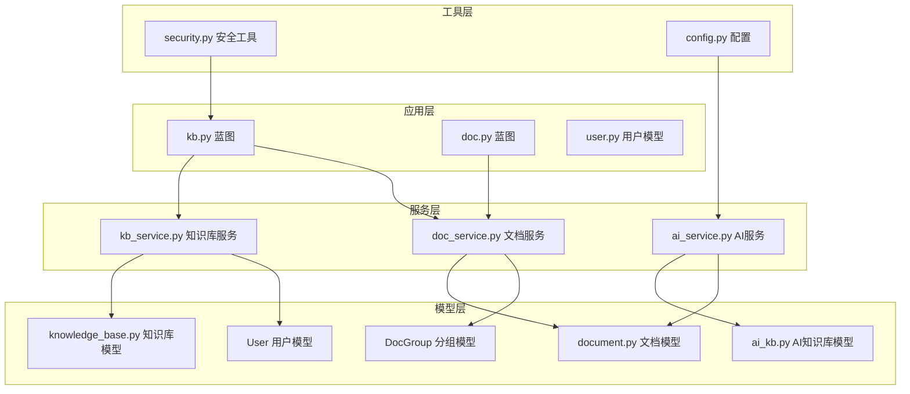

**图表来源**
- [kb.py:1-291](file://app/blueprints/kb.py#L1-L291)
- [doc.py:1-190](file://app/blueprints/doc.py#L1-L190)
- [kb_service.py:1-80](file://app/services/kb_service.py#L1-L80)
- [doc_service.py:1-130](file://app/services/doc_service.py#L1-L130)
- [document.py:1-117](file://app/models/document.py#L1-L117)

**章节来源**
- [kb.py:1-291](file://app/blueprints/kb.py#L1-L291)
- [kb_service.py:1-80](file://app/services/kb_service.py#L1-L80)
- [document.py:1-117](file://app/models/document.py#L1-L117)

## 核心组件

### 数据模型设计

知识库管理模块的核心数据模型包括四个主要实体：

#### 知识库模型 (KnowledgeBase)
- **主键**: `id` (整数)
- **基础属性**: `name` (名称), `description` (描述), `cover` (封面), `icon` (图标)
- **所有权**: `owner_id` 外键关联到用户表
- **可见性**: `visibility` 字符串字段，支持私有、成员、公开三种模式
- **状态**: `is_archived` (归档状态), `created_at/updated_at` 时间戳
- **关系**: 与用户的一对多关系，与文档的多对一关系

#### 成员模型 (KBMember)
- **主键**: `id` (整数)
- **唯一约束**: `(kb_id, user_id)` 确保用户只能成为知识库一次
- **属性**: `role` (角色，默认查看者), `created_at` (加入时间)
- **关系**: 与知识库和用户的多对一关系

#### 文档模型 (Document)
- **主键**: `id` (整数)
- **层级关系**: 支持父子文档嵌套结构
- **类型**: `type` (文档/表格)
- **隐私**: `privacy` (正常/私有)，影响分享功能
- **内容**: `content_json` (Editor.js JSON), `plain_text` (纯文本)
- **索引**: `sort_order` (排序), `is_deleted` (软删除)
- **分组**: `group_id` 外键关联到 DocGroup

#### 分组模型 (DocGroup)
- **主键**: `id` (字符串)
- **知识库关联**: `kb_id` 外键关联到知识库表
- **属性**: `name` (分组名称), `sort_order` (排序), `created_at` (创建时间)
- **关系**: 与知识库的一对多关系，与文档的多对一关系

**章节来源**
- [knowledge_base.py:19-61](file://app/models/knowledge_base.py#L19-L61)
- [document.py:11-72](file://app/models/document.py#L11-L72)

### 权限控制机制

系统实现了多层次的权限控制体系：

#### 可见性级别
1. **私有 (PRIVATE)**: 仅所有者可见
2. **成员 (MEMBERS)**: 所有者 + 已授权成员可见
3. **公开 (PUBLIC)**: 任何人都可以访问

#### 角色分配
- **查看者 (VIEWER)**: 只读访问权限
- **编辑者 (EDITOR)**: 读写权限，可编辑文档内容

#### 访问控制策略
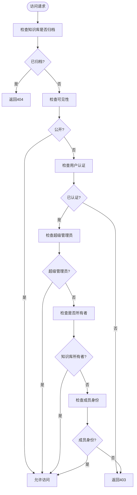

**图表来源**
- [kb_service.py:10-23](file://app/services/kb_service.py#L10-L23)

**章节来源**
- [kb_service.py:10-45](file://app/services/kb_service.py#L10-L45)

## 架构概览

知识库管理模块采用经典的 MVC 架构模式，通过蓝图进行功能模块化：

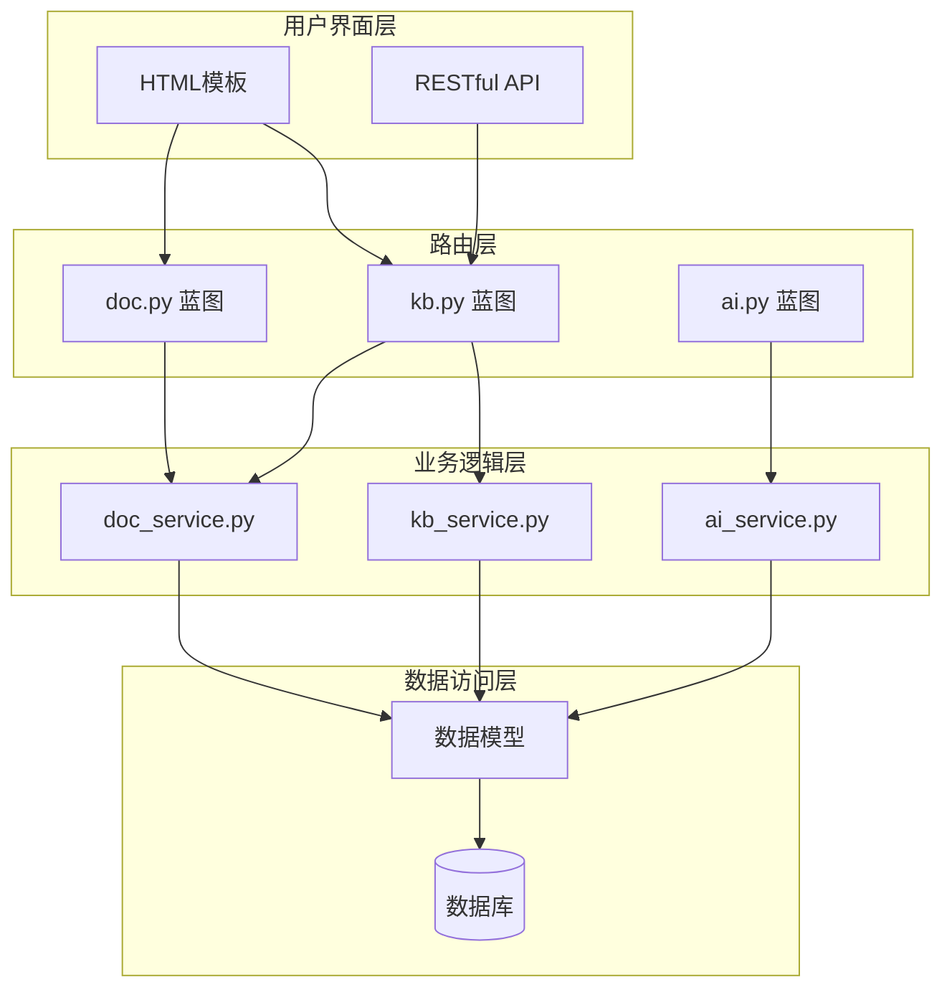

**图表来源**
- [kb.py:1-291](file://app/blueprints/kb.py#L1-L291)
- [doc.py:1-190](file://app/blueprints/doc.py#L1-L190)
- [kb_service.py:1-80](file://app/services/kb_service.py#L1-L80)
- [doc_service.py:1-130](file://app/services/doc_service.py#L1-L130)

### API 接口文档

#### 知识库管理 API

| 方法 | 路径 | 描述 | 权限要求 |
|------|------|------|----------|
| GET | `/kb/` | 获取知识库列表 | 登录用户 |
| POST | `/kb/new` | 创建新知识库 | 登录用户 |
| GET | `/kb/<int:kb_id>` | 获取知识库详情 | 可访问用户 |
| POST | `/kb/<int:kb_id>/edit` | 编辑知识库 | 管理员 |
| POST | `/kb/<int:kb_id>/delete` | 删除知识库 | 管理员 |
| GET | `/kb/<int:kb_id>/members` | 获取成员列表 | 管理员 |
| POST | `/kb/<int:kb_id>/members` | 添加成员 | 管理员 |
| POST | `/kb/<int:kb_id>/members/<int:user_id>/delete` | 移除成员 | 管理员 |

#### 分组管理 API

| 方法 | 路径 | 描述 | 权限要求 |
|------|------|------|----------|
| POST | `/kb/<int:kb_id>/groups/new` | 创建新分组 | 编辑者 |
| POST | `/kb/<int:kb_id>/groups/<int:group_id>/rename` | 重命名分组 | 编辑者 |
| POST | `/kb/<int:kb_id>/groups/<int:group_id>/delete` | 删除分组 | 编辑者 |
| POST | `/kb/<int:kb_id>/docs/<int:doc_id>/move-group` | 移动文档到分组 | 编辑者 |
| POST | `/kb/<int:kb_id>/sort-groups` | 重新排序分组 | 编辑者 |
| POST | `/kb/<int:kb_id>/sort-docs` | 重新排序文档 | 编辑者 |

#### 文档管理 API

| 方法 | 路径 | 描述 | 权限要求 |
|------|------|------|----------|
| GET | `/doc/<int:doc_id>/tree` | 获取文档树 | 可编辑用户 |
| POST | `/doc/<int:kb_id>/create` | 创建文档 | 编辑者 |
| PUT | `/doc/<int:doc_id>/content` | 更新文档内容 | 编辑者 |
| POST | `/doc/<int:doc_id>/delete` | 删除文档 | 编辑者 |

**章节来源**
- [kb.py:173-291](file://app/blueprints/kb.py#L173-L291)
- [doc.py:57-190](file://app/blueprints/doc.py#L57-L190)

## 详细组件分析

### 知识库服务层

知识库服务层负责处理业务逻辑，包括权限验证、查询操作和成员管理：

#### 权限验证函数

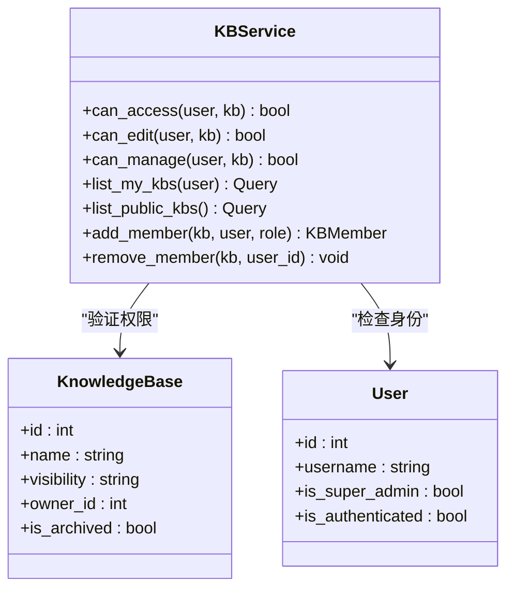

**图表来源**
- [kb_service.py:10-80](file://app/services/kb_service.py#L10-L80)
- [knowledge_base.py:19-42](file://app/models/knowledge_base.py#L19-L42)
- [user.py:55-104](file://app/models/user.py#L55-L104)

#### 成员管理流程

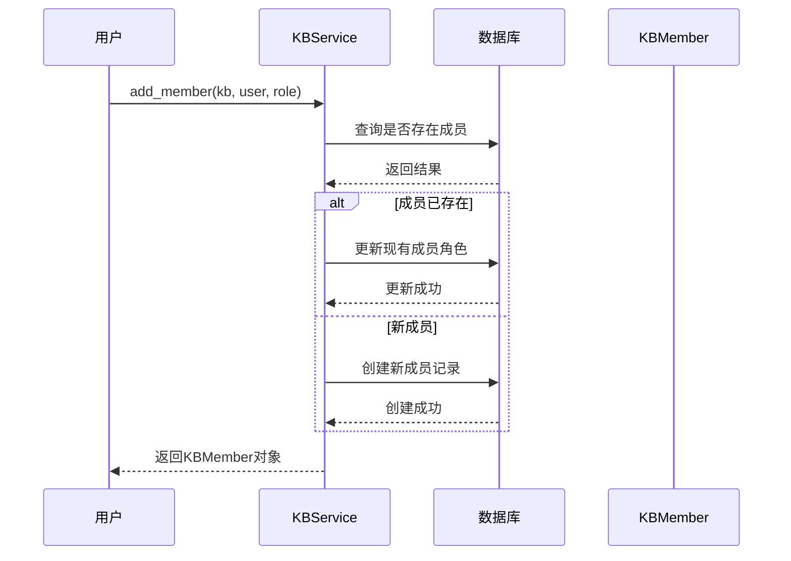

**图表来源**
- [kb_service.py:65-74](file://app/services/kb_service.py#L65-L74)

**章节来源**
- [kb_service.py:10-80](file://app/services/kb_service.py#L10-L80)

### 文档服务层

文档服务层处理文档的创建、更新和查询操作，现已支持分组功能：

#### 文档树构建算法

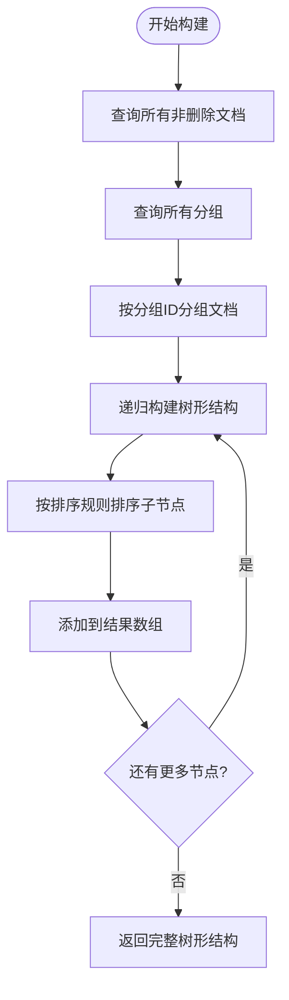

**图表来源**
- [doc_service.py:11-72](file://app/services/doc_service.py#L11-L72)

#### 分组文档树结构

文档树现在支持分组结构，返回格式如下：

```json
[
  {
    "group": null,
    "docs": [
      {"id": "1", "title": "未分组文档", "type": "doc", "privacy": "normal", "children": []}
    ]
  },
  {
    "group": {"id": "2", "name": "分组名称"},
    "docs": [
      {"id": "3", "title": "分组文档", "type": "doc", "privacy": "normal", "children": []}
    ]
  }
]
```

**章节来源**
- [doc_service.py:11-130](file://app/services/doc_service.py#L11-L130)

### 分组管理功能

#### 分组模型设计

DocGroup 模型提供了完整的分组管理功能：

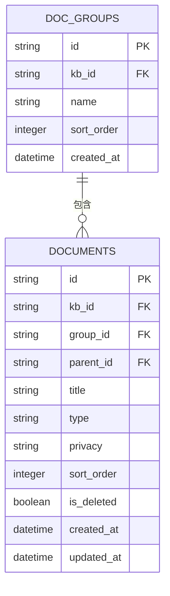

**图表来源**
- [document.py:11-72](file://app/models/document.py#L11-L72)

#### 分组操作流程

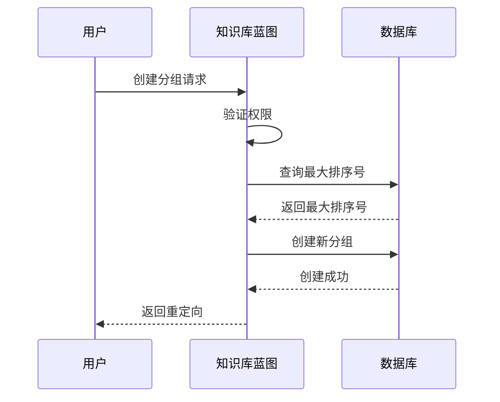

**图表来源**
- [kb.py:175-187](file://app/blueprints/kb.py#L175-L187)

#### 交互式分组管理界面

**更新** 新增了完整的交互式分组管理界面，支持拖拽排序和实时更新。

##### 分组界面元素

分组管理界面包含以下关键元素：

1. **分组头部区域**：显示分组名称、操作按钮
2. **展开/折叠控制**：使用 Alpine.js 实现的交互式展开折叠
3. **拖拽句柄**：支持分组级别的拖拽排序
4. **文档列表**：显示分组内的文档，支持拖拽移动
5. **操作按钮**：重命名、删除分组等

##### 拖拽排序实现

**更新** 新增了完整的拖拽排序功能，支持文档和分组的双向拖拽：

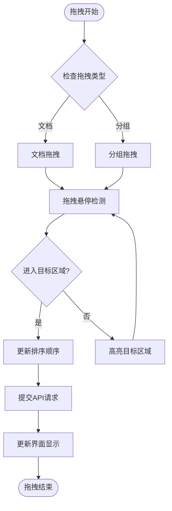

**图表来源**
- [detail.html:190-388](file://app/templates/kb/detail.html#L190-L388)
- [view.html:277-467](file://app/templates/doc/view.html#L277-L467)

##### 拖拽事件处理

前端 JavaScript 实现了完整的拖拽事件处理：

1. **文档拖拽**：
   - `dragstart`: 标记拖拽状态，添加视觉反馈
   - `dragover`: 检测拖拽位置，更新高亮效果
   - `drop`: 提交排序更新到服务器

2. **分组拖拽**：
   - 支持分组间的重新排序
   - 实时更新分组顺序

3. **跨区域拖拽**：
   - 支持文档在不同分组间移动
   - 自动更新文档的分组归属

**章节来源**
- [kb.py:173-291](file://app/blueprints/kb.py#L173-L291)
- [document.py:11-25](file://app/models/document.py#L11-L25)
- [detail.html:90-151](file://app/templates/kb/detail.html#L90-L151)
- [view.html:73-125](file://app/templates/doc/view.html#L73-L125)

### AI知识库集成

系统集成了基于 Karpathy LLM Wiki 方法论的 AI 知识库功能：

#### AI知识库数据模型

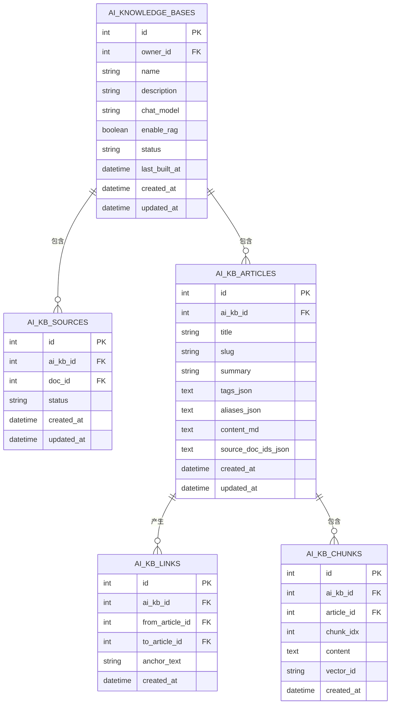

**图表来源**
- [ai_kb.py:22-121](file://app/models/ai_kb.py#L22-L121)

#### Wiki 构建流程

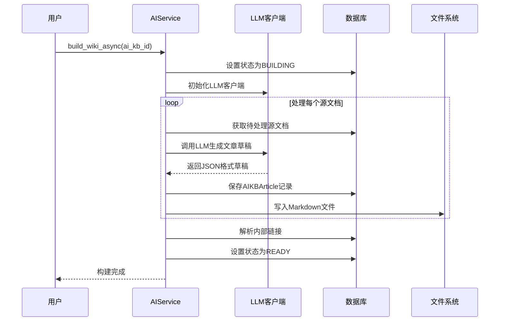

**图表来源**
- [ai_service.py:313-345](file://app/services/ai_service.py#L313-L345)

**章节来源**
- [ai_kb.py:1-121](file://app/models/ai_kb.py#L1-L121)
- [ai_service.py:1-408](file://app/services/ai_service.py#L1-L408)

## 依赖关系分析

知识库管理模块的依赖关系清晰且层次分明：

```mermaid
graph TB
subgraph "外部依赖"
FLASK[Flask框架]
SQLALCHEMY[SQLAlchemy ORM]
OPENAI[OpenAI SDK]
SLUGIFY[python-slugify]
ALPINEJS[Alpine.js]
END
subgraph "内部模块"
KB_BP[kb.py]
DOC_BP[doc.py]
KB_SERVICE[kb_service.py]
DOC_SERVICE[doc_service.py]
MODELS[models/*]
SERVICES[services/*]
UTILS[utils/*]
end
FLASK --> KB_BP
FLASK --> DOC_BP
SQLALCHEMY --> MODELS
OPENAI --> SERVICES
SLUGIFY --> SERVICES
KB_BP --> KB_SERVICE
DOC_BP --> DOC_SERVICE
KB_SERVICE --> MODELS
DOC_SERVICE --> MODELS
SERVICES --> MODELS
MODELS --> UTILS
KB_BP -.-> SERVICES
DOC_BP -.-> SERVICES
SERVICES -.-> UTILS
```

**图表来源**
- [kb.py:1-10](file://app/blueprints/kb.py#L1-L10)
- [doc.py:1-14](file://app/blueprints/doc.py#L1-L14)
- [kb_service.py:1-8](file://app/services/kb_service.py#L1-L8)
- [doc_service.py:1-8](file://app/services/doc_service.py#L1-L8)
- [ai_service.py:26-41](file://app/services/ai_service.py#L26-L41)

### 关键依赖特性

#### 数据库连接池配置
- **预检查**: `pool_pre_ping=True` 确保连接有效性
- **回收机制**: `pool_recycle=280` 避免长时间连接导致的问题
- **引擎选项**: 优化 MySQL 连接性能

#### AI 功能配置
- **模型选择**: 支持多种 OpenAI 兼容 API
- **向量化存储**: 可选的 ChromaDB 向量数据库
- **异步处理**: 使用线程池处理耗时的 AI 构建任务

#### 前端交互框架
- **Alpine.js**: 提供响应式 UI 组件
- **拖拽 API**: 原生 HTML5 拖拽功能
- **CSRF 保护**: 自动注入 CSRF 令牌

**章节来源**
- [config.py:18-26](file://app/config.py#L18-L26)
- [config.py:37-47](file://app/config.py#L37-L47)
- [app.js:1-32](file://app/static/js/app.js#L1-L32)

## 性能考虑

### 查询优化策略

1. **索引设计**
   - 知识库: `owner_id`, `visibility`, `is_archived` 索引
   - 成员表: `(kb_id, user_id)` 唯一索引
   - 文档: `kb_id`, `parent_id`, `is_deleted`, `group_id` 索引
   - 分组: `kb_id`, `sort_order` 索引

2. **查询优化**
   - 使用 `union` 合并拥有和加入的知识库查询
   - 限制查询结果数量避免内存溢出
   - 使用 `lazy="dynamic"` 实现延迟加载
   - 分组查询按排序字段排序

3. **缓存策略**
   - AI 知识库状态缓存
   - 文档树结构缓存
   - 用户权限缓存

### 并发处理

系统采用异步方式处理 AI 构建任务，避免阻塞主线程：

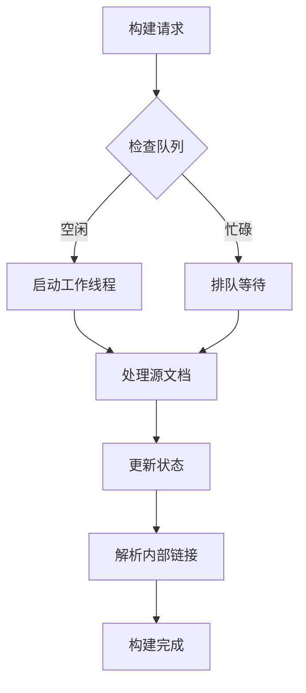

**图表来源**
- [ai_service.py:313-345](file://app/services/ai_service.py#L313-L345)

### 安全考虑

1. **输入验证**
   - 知识库名称不能为空
   - 可见性参数必须在有效范围内
   - 用户名/邮箱查找使用安全查询
   - 分组名称长度限制

2. **权限控制**
   - 所有操作都经过权限验证
   - 超级管理员拥有最高权限
   - 成员权限根据角色动态调整
   - 分组操作仅限编辑者

3. **数据保护**
   - 使用外键约束保证数据完整性
   - 软删除避免数据丢失
   - 密码哈希存储
   - 分组删除时自动处理文档归属

4. **拖拽安全**
   - CSRF 令牌验证
   - 分组 ID 验证
   - 排序顺序验证
   - 跨分组移动权限检查

**章节来源**
- [kb.py:35-52](file://app/blueprints/kb.py#L35-L52)
- [kb.py:175-291](file://app/blueprints/kb.py#L175-L291)
- [kb_service.py:10-45](file://app/services/kb_service.py#L10-L45)

## 故障排除指南

### 常见问题及解决方案

#### 知识库访问权限问题
**症状**: 用户无法访问知识库
**可能原因**:
- 知识库已被归档
- 用户未登录
- 权限不足
- 知识库可见性设置为私有

**解决步骤**:
1. 检查知识库状态: `kb.is_archived`
2. 验证用户认证状态
3. 确认用户角色和权限
4. 检查可见性设置

#### 成员管理异常
**症状**: 添加/移除成员失败
**可能原因**:
- 用户不存在
- 用户已是所有者
- 数据库约束冲突

**解决步骤**:
1. 验证用户存在性
2. 检查用户与知识库关系
3. 处理唯一约束冲突

#### 分组管理异常
**症状**: 分组创建/删除失败
**可能原因**:
- 权限不足（需要编辑者权限）
- 分组名称为空
- 分组不存在
- 分组内有文档但未正确处理

**解决步骤**:
1. 验证用户权限
2. 检查分组名称有效性
3. 确认分组存在性
4. 处理分组内的文档归属

#### 拖拽排序异常
**症状**: 拖拽排序功能失效
**可能原因**:
- JavaScript 错误
- CSRF 令牌缺失
- 分组 ID 无效
- 权限不足

**解决步骤**:
1. 检查浏览器控制台错误
2. 验证 CSRF 令牌注入
3. 确认分组 ID 有效性
4. 检查用户编辑权限

#### 文档树构建异常
**症状**: 文档树显示不正确
**可能原因**:
- 分组ID不匹配
- 文档层级关系错误
- 数据库查询异常

**解决步骤**:
1. 检查分组与文档的关联关系
2. 验证文档的父子关系
3. 确认数据库查询结果

#### AI 构建失败
**症状**: AI 知识库构建过程中断
**可能原因**:
- LLM API 调用失败
- 源文档缺失
- 文件系统权限问题

**解决步骤**:
1. 检查 LLM API 配置
2. 验证源文档状态
3. 检查文件系统权限

**章节来源**
- [kb_service.py:10-80](file://app/services/kb_service.py#L10-L80)
- [kb.py:175-291](file://app/blueprints/kb.py#L175-L291)
- [doc_service.py:11-130](file://app/services/doc_service.py#L11-L130)
- [ai_service.py:296-344](file://app/services/ai_service.py#L296-L344)

### 调试技巧

1. **日志记录**
   - 记录关键业务操作
   - 捕获异常信息
   - 监控性能指标

2. **测试策略**
   - 单元测试覆盖核心逻辑
   - 集成测试验证端到端流程
   - 性能测试评估负载能力

3. **监控指标**
   - 数据库查询响应时间
   - AI 构建任务完成率
   - 用户活跃度统计

## 结论

知识库管理模块是一个功能完整、架构清晰的知识管理系统。它成功地将传统的知识库管理与现代的 AI 技术相结合，为用户提供了一个强大的个人知识管理平台。

**更新** 新增的分组管理功能显著提升了知识库的组织能力和用户体验，特别是交互式分组管理界面和拖拽排序功能，为大型知识库的管理提供了直观高效的解决方案。

### 主要优势

1. **模块化设计**: 清晰的分层架构便于维护和扩展
2. **灵活的权限控制**: 支持多种可见性和角色配置
3. **高性能实现**: 优化的查询和异步处理机制
4. **AI 集成**: 基于 Karpathy 方法论的智能知识库构建
5. **安全性保障**: 完善的权限验证和数据保护机制
6. **交互式界面**: 增强的分组管理功能，支持拖拽排序
7. **实时更新**: 拖拽操作即时同步到服务器

### 扩展建议

1. **功能增强**
   - 添加知识库搜索功能
   - 实现版本控制机制
   - 支持知识库导入导出
   - 增加分组层级结构

2. **性能优化**
   - 实现更高效的文档树缓存
   - 优化 AI 构建任务调度
   - 添加数据库查询优化
   - 实现分组缓存机制

3. **用户体验**
   - 改进移动端适配
   - 添加实时协作功能
   - 优化编辑器体验
   - 增加分组拖拽排序功能

4. **技术升级**
   - 集成 WebSocket 实现实时更新
   - 添加分组模板功能
   - 支持分组标签系统
   - 实现分组共享权限

该模块为开发者提供了一个坚实的基础，可以根据具体需求进行定制和扩展，满足不同场景下的知识管理需求。