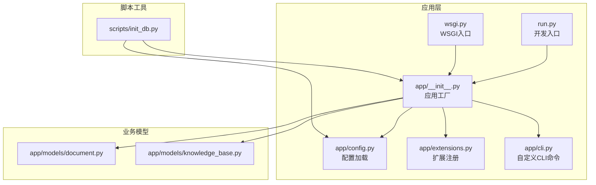
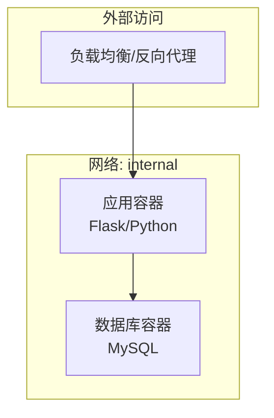
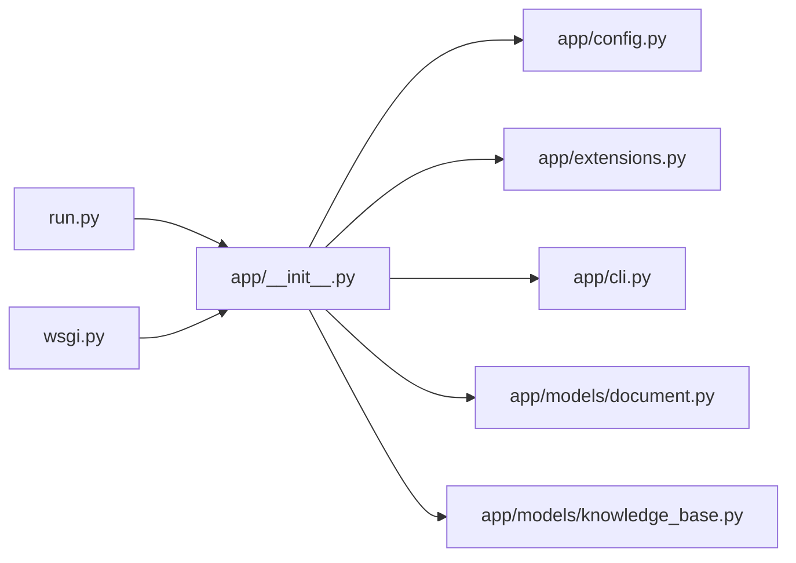

# 容器化部署

<cite>
**本文引用的文件**
- [README.md](file://README.md)
- [requirements.txt](file://requirements.txt)
- [run.py](file://run.py)
- [wsgi.py](file://wsgi.py)
- [app/config.py](file://app/config.py)
- [app/__init__.py](file://app/__init__.py)
- [app/extensions.py](file://app/extensions.py)
- [app/cli.py](file://app/cli.py)
- [scripts/init_db.py](file://scripts/init_db.py)
- [app/blueprints/main.py](file://app/blueprints/main.py)
- [app/models/document.py](file://app/models/document.py)
- [app/models/knowledge_base.py](file://app/models/knowledge_base.py)
</cite>

## 目录
1. [简介](#简介)
2. [项目结构](#项目结构)
3. [核心组件](#核心组件)
4. [架构总览](#架构总览)
5. [详细组件分析](#详细组件分析)
6. [依赖分析](#依赖分析)
7. [性能考虑](#性能考虑)
8. [故障排查指南](#故障排查指南)
9. [结论](#结论)
10. [附录](#附录)

## 简介
本指南面向将 My Wiki 项目进行 Docker 容器化与编排部署，覆盖以下主题：
- Dockerfile 编写规范与镜像构建流程
- docker-compose 多容器编排与服务依赖管理
- 数据库容器（MySQL）与应用容器（Python/Flask）配置要点
- 网络与存储（数据持久化）策略
- 容器监控、日志收集与健康检查
- 安全配置、资源限制与运行时最佳实践

## 项目结构
My Wiki 是一个基于 Flask 的 Python 应用，采用模块化蓝图组织业务功能，并通过 SQLAlchemy 进行数据库建模与迁移。项目入口点提供开发与生产两种模式，环境变量驱动配置与数据库连接。

图表来源
- [run.py:1-17](file://run.py#L1-L17)
- [wsgi.py:1-10](file://wsgi.py#L1-L10)
- [app/__init__.py:1-101](file://app/__init__.py#L1-L101)
- [app/config.py:1-83](file://app/config.py#L1-L83)
- [app/extensions.py:1-17](file://app/extensions.py#L1-L17)
- [app/cli.py:1-114](file://app/cli.py#L1-L114)
- [scripts/init_db.py:1-52](file://scripts/init_db.py#L1-L52)
- [app/models/document.py:1-98](file://app/models/document.py#L1-L98)
- [app/models/knowledge_base.py:1-62](file://app/models/knowledge_base.py#L1-L62)

章节来源
- [README.md:1-3](file://README.md#L1-L3)
- [requirements.txt:1-22](file://requirements.txt#L1-L22)
- [run.py:1-17](file://run.py#L1-L17)
- [wsgi.py:1-10](file://wsgi.py#L1-L10)
- [app/__init__.py:1-101](file://app/__init__.py#L1-L101)
- [app/config.py:1-83](file://app/config.py#L1-L83)
- [app/extensions.py:1-17](file://app/extensions.py#L1-L17)
- [app/cli.py:1-114](file://app/cli.py#L1-L114)
- [scripts/init_db.py:1-52](file://scripts/init_db.py#L1-L52)
- [app/models/document.py:1-98](file://app/models/document.py#L1-L98)
- [app/models/knowledge_base.py:1-62](file://app/models/knowledge_base.py#L1-L62)

## 核心组件
- 配置体系：通过环境变量驱动数据库连接、会话 Cookie、上传目录、AI 与 RAG 功能开关等。
- 应用工厂：集中初始化扩展、注册蓝图、错误处理、上下文处理器与 CLI 命令。
- 扩展注册：SQLAlchemy、Flask-Migrate、Flask-Login、CSRF 保护。
- CLI 工具：提供初始化数据库、创建默认角色权限、创建超级管理员等命令。
- 入口点：开发模式与生产模式分别由 run.py 与 wsgi.py 提供。

章节来源
- [app/config.py:15-83](file://app/config.py#L15-L83)
- [app/__init__.py:11-101](file://app/__init__.py#L11-L101)
- [app/extensions.py:8-17](file://app/extensions.py#L8-L17)
- [app/cli.py:61-96](file://app/cli.py#L61-L96)
- [run.py:11-17](file://run.py#L11-L17)
- [wsgi.py:9](file://wsgi.py#L9)

## 架构总览
下图展示容器化部署的典型拓扑：前端 Nginx（可选）反向代理至应用容器；应用容器通过环境变量连接 MySQL 容器；应用容器挂载上传目录与 AI 知识库目录以实现持久化；数据库容器独立运行并持久化到卷。

图表来源
- [app/config.py:18-26](file://app/config.py#L18-L26)
- [app/__init__.py:39-44](file://app/__init__.py#L39-L44)

## 详细组件分析

### 数据库容器配置（MySQL）
- 连接参数：应用通过 DATABASE_URL 环境变量读取数据库连接串，默认指向本地 127.0.0.1:3306，需在 compose 中映射端口并确保网络互通。
- 初始化：首次启动后可通过应用内置 CLI 或独立脚本初始化数据库表与默认数据。
- 持久化：将 MySQL 数据目录映射到宿主机或 Docker 卷，避免容器删除导致数据丢失。
- 安全：设置 root 密码与仅允许内网访问；如启用 RAG，注意开放必要端口与网络策略。

章节来源
- [app/config.py:18-26](file://app/config.py#L18-L26)
- [scripts/init_db.py:23-47](file://scripts/init_db.py#L23-L47)

### 应用容器配置（Flask/Python）
- 入口点：生产模式使用 WSGI 入口；开发模式使用 run.py。
- 环境变量：SECRET_KEY、DATABASE_URL、UPLOAD_DIR、MAX_CONTENT_LENGTH、OPENAI_*、ENABLE_RAG、EMBEDDING_MODEL、CHROMA_PATH 等。
- 目录结构：应用工厂会在 instance 目录下创建上传与 AI 知识库目录，需确保挂载持久化。
- 扩展与蓝图：SQLAlchemy、Migrate、Login、CSRF 注册；各业务蓝图按前缀注册。
- CLI：提供 init-db、create-user 等命令，便于初始化与运维。

章节来源
- [wsgi.py:9](file://wsgi.py#L9)
- [run.py:12-16](file://run.py#L12-L16)
- [app/config.py:15-54](file://app/config.py#L15-L54)
- [app/__init__.py:31-44](file://app/__init__.py#L31-L44)
- [app/__init__.py:56-74](file://app/__init__.py#L56-L74)
- [app/cli.py:61-96](file://app/cli.py#L61-L96)

### 网络与存储
- 网络：应用容器与数据库容器置于同一 Docker 网络，通过服务名解析；反向代理容器与应用容器同网段。
- 存储：挂载上传目录与 AI 知识库目录到宿主机或卷；数据库数据目录持久化。
- 端口：应用容器暴露 Web 端口；数据库容器暴露 MySQL 端口；反向代理容器暴露 80/443。

章节来源
- [app/config.py:34-47](file://app/config.py#L34-L47)
- [app/__init__.py:31-36](file://app/__init__.py#L31-L36)

### 健康检查与运行时
- 健康检查：建议对应用容器执行 HTTP GET / 以判断存活；对数据库容器执行 mysqladmin ping。
- 日志：应用容器输出标准输出/错误；数据库容器输出慢查询与错误日志；反向代理记录访问日志。
- 资源限制：为应用容器设置 CPU/内存上限；为数据库容器设置足够内存与连接数上限。

章节来源
- [app/config.py:28-32](file://app/config.py#L28-L32)

## 依赖分析
应用依赖关系围绕配置、扩展与蓝图展开，形成清晰的单向依赖链：入口脚本 → 应用工厂 → 配置与扩展 → 模型与蓝图。

图表来源
- [run.py:7-9](file://run.py#L7-L9)
- [wsgi.py:7-9](file://wsgi.py#L7-L9)
- [app/__init__.py:7-28](file://app/__init__.py#L7-L28)
- [app/config.py:7-83](file://app/config.py#L7-L83)
- [app/extensions.py:8-11](file://app/extensions.py#L8-L11)
- [app/cli.py:4-6](file://app/cli.py#L4-L6)
- [app/models/document.py:7](file://app/models/document.py#L7)
- [app/models/knowledge_base.py:5](file://app/models/knowledge_base.py#L5)

章节来源
- [requirements.txt:1-22](file://requirements.txt#L1-L22)
- [app/__init__.py:11-28](file://app/__init__.py#L11-L28)
- [app/config.py:15-83](file://app/config.py#L15-L83)
- [app/extensions.py:8-11](file://app/extensions.py#L8-L11)
- [app/cli.py:61-96](file://app/cli.py#L61-L96)
- [app/models/document.py:20-53](file://app/models/document.py#L20-L53)
- [app/models/knowledge_base.py:19-42](file://app/models/knowledge_base.py#L19-L42)

## 性能考虑
- 数据库连接池：开启 pool_pre_ping 并合理设置 pool_recycle，减少断连与回收开销。
- 上传与缓存：将上传目录与 AI 知识库目录挂载到高性能存储；控制最大上传大小以避免内存压力。
- 反向代理：启用静态资源缓存与压缩；限制并发连接数与请求体大小。
- 资源分配：为应用容器设置 CPU/内存配额；为数据库容器预留足够内存与连接数。

章节来源
- [app/config.py:23-26](file://app/config.py#L23-L26)
- [app/config.py:34-35](file://app/config.py#L34-L35)

## 故障排查指南
- 数据库连接失败：检查 DATABASE_URL 是否正确、网络是否可达、数据库是否已初始化。
- 权限与角色缺失：使用 init-db 命令初始化默认权限与角色，并确保超级管理员存在。
- 上传目录不可写：确认挂载路径存在且权限正确；应用工厂会在启动时创建目录。
- 反向代理 502/504：检查应用容器健康状态与日志；确认端口映射与网络策略。

章节来源
- [app/config.py:18-26](file://app/config.py#L18-L26)
- [app/cli.py:67-95](file://app/cli.py#L67-L95)
- [app/__init__.py:31-36](file://app/__init__.py#L31-L36)
- [scripts/init_db.py:23-47](file://scripts/init_db.py#L23-L47)

## 结论
通过将 My Wiki 容器化并结合 docker-compose 实现多容器编排，可实现数据库与应用的解耦、配置与数据的持久化以及部署与运维的标准化。建议在生产环境中配合反向代理、健康检查、日志与监控体系，确保高可用与可维护性。

## 附录

### Dockerfile 编写规范
- 基础镜像：选择官方 Python 运行时作为基础镜像，确保二进制与依赖兼容。
- 工作目录：在镜像中创建应用工作目录并设置为工作目录。
- 依赖安装：使用 requirements.txt 安装生产所需依赖；如需编译依赖，确保安装对应 build 包。
- 非特权用户：以非 root 用户运行应用，降低安全风险。
- 环境变量：在镜像构建阶段设置最小必要环境变量，敏感信息通过 secrets/挂载注入。
- 健康检查：在镜像层面定义健康检查命令，便于容器编排工具识别容器状态。

### 镜像构建流程
- 构建：在项目根目录执行镜像构建命令，指定上下文与目标文件。
- 标签：为镜像打上语义化标签，便于版本管理与回滚。
- 推送：将镜像推送到私有或公有仓库，支持 CI/CD 自动化部署。

### docker-compose.yml 配置要点
- 服务定义：分别为应用容器与数据库容器定义服务，设置镜像、环境变量、端口映射与卷挂载。
- 依赖关系：使用 depends_on 确保数据库容器先于应用容器启动；通过 healthcheck 与 restart 策略增强健壮性。
- 网络：创建自定义网络，使服务间通过服务名互相发现。
- 挂载：挂载上传目录与 AI 知识库目录到宿主机或卷；挂载数据库数据目录到卷。
- 重启策略：设置合理的 restart 策略，避免频繁重启影响业务。

### 多容器编排与服务依赖管理
- 启动顺序：数据库容器先启动并初始化完成后，再启动应用容器。
- 依赖检测：应用容器通过健康检查确认数据库可用后再对外提供服务。
- 服务发现：在同一网络内的服务通过服务名进行通信，避免硬编码 IP。

### 数据库容器配置
- 初始化：首次启动后执行数据库初始化脚本或 CLI 命令，创建表结构与默认数据。
- 备份策略：定期备份数据库数据目录，确保灾难恢复能力。
- 性能调优：根据业务量调整数据库连接数、缓冲区大小与查询缓存。

### 应用容器配置
- 环境变量：通过 .env 文件或环境变量注入，包括数据库连接、AI 与 RAG 开关、上传目录等。
- 日志：将应用日志输出到标准输出/错误，便于集中收集与分析。
- 更新策略：采用滚动更新方式，确保更新过程中业务连续性。

### 网络设置
- 内部网络：应用与数据库位于同一内部网络，仅暴露必要端口给反向代理。
- 外部访问：反向代理负责 SSL 终止、静态资源缓存与请求转发。
- 安全组：限制外部访问端口，仅开放必要的 Web 端口。

### 容器监控、日志收集与数据持久化
- 监控：采集应用与数据库的 CPU、内存、磁盘与网络指标，设置告警阈值。
- 日志：集中收集应用与数据库日志，保留关键字段以便审计与问题定位。
- 持久化：将数据库数据目录与应用上传目录、AI 知识库目录持久化到卷或宿主机。

### 容器安全配置、资源限制与健康检查
- 安全：使用非 root 用户运行；限制容器能力；启用只读根文件系统；使用 secrets 管理敏感信息。
- 资源限制：为应用与数据库容器设置 CPU/内存上限与下限，防止资源争抢。
- 健康检查：应用容器执行 HTTP 健康检查；数据库容器执行数据库连接检查；失败时自动重启或标记不健康。