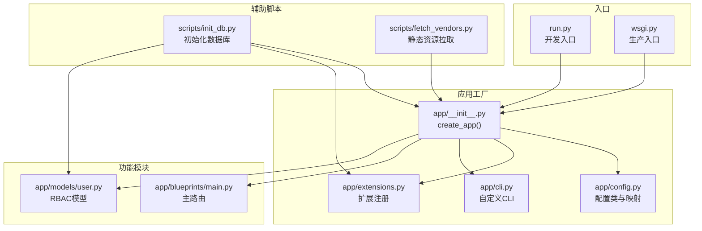
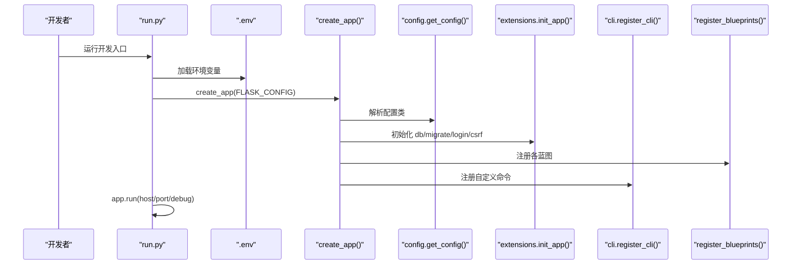
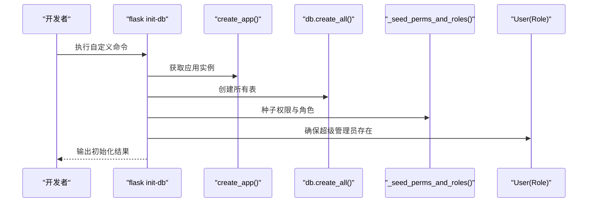
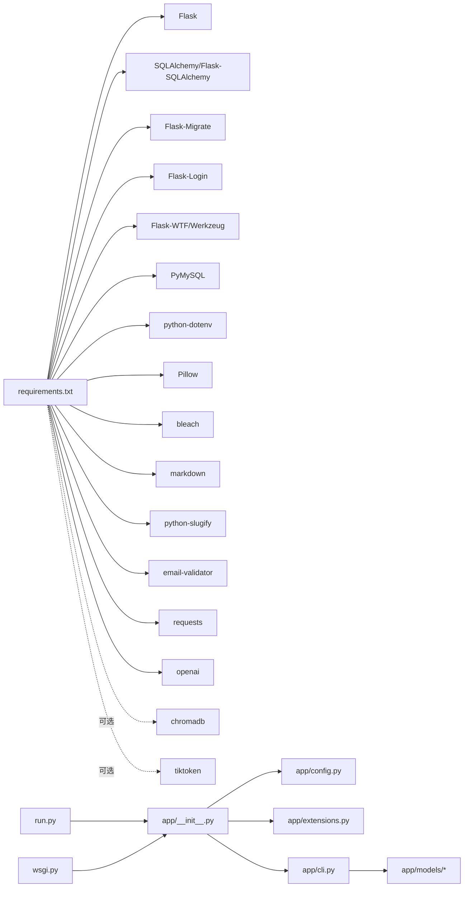

# 开发环境部署

<cite>
**本文引用的文件**
- [README.md](file://README.md)
- [requirements.txt](file://requirements.txt)
- [run.py](file://run.py)
- [wsgi.py](file://wsgi.py)
- [app/config.py](file://app/config.py)
- [app/__init__.py](file://app/__init__.py)
- [app/cli.py](file://app/cli.py)
- [app/extensions.py](file://app/extensions.py)
- [scripts/init_db.py](file://scripts/init_db.py)
- [scripts/fetch_vendors.py](file://scripts/fetch_vendors.py)
- [app/blueprints/main.py](file://app/blueprints/main.py)
- [app/models/user.py](file://app/models/user.py)
</cite>

## 目录
1. [简介](#简介)
2. [项目结构](#项目结构)
3. [核心组件](#核心组件)
4. [架构总览](#架构总览)
5. [详细组件分析](#详细组件分析)
6. [依赖分析](#依赖分析)
7. [性能考虑](#性能考虑)
8. [故障排查指南](#故障排查指南)
9. [结论](#结论)
10. [附录](#附录)

## 简介
本指南面向希望在本地搭建 My Wiki 开发环境的开发者，覆盖 Python 版本要求、虚拟环境创建、依赖安装、Flask 配置与调试、开发服务器启动、环境变量配置、Flask CLI 使用、代码热重载与开发工具建议，以及常见问题排查与调试技巧。

## 项目结构
My Wiki 采用 Flask 应用工厂模式组织代码，核心目录与入口如下：
- 应用工厂与配置：app/__init__.py、app/config.py
- 生产与开发入口：run.py（开发）、wsgi.py（生产）
- 自定义 CLI 命令：app/cli.py
- 扩展注册：app/extensions.py
- 蓝图与模型示例：app/blueprints/main.py、app/models/user.py
- 初始化数据库脚本：scripts/init_db.py
- 静态资源拉取脚本：scripts/fetch_vendors.py
- 依赖声明：requirements.txt

图表来源
- [run.py:1-17](file://run.py#L1-L17)
- [wsgi.py:1-10](file://wsgi.py#L1-L10)
- [app/__init__.py:11-28](file://app/__init__.py#L11-L28)
- [app/config.py:56-83](file://app/config.py#L56-L83)
- [app/extensions.py:8-17](file://app/extensions.py#L8-L17)
- [app/cli.py:61-95](file://app/cli.py#L61-L95)
- [app/blueprints/main.py:10-16](file://app/blueprints/main.py#L10-L16)
- [app/models/user.py:55-104](file://app/models/user.py#L55-L104)
- [scripts/init_db.py:23-47](file://scripts/init_db.py#L23-L47)
- [scripts/fetch_vendors.py:74-92](file://scripts/fetch_vendors.py#L74-L92)

章节来源
- [README.md:1-3](file://README.md#L1-L3)
- [requirements.txt:1-22](file://requirements.txt#L1-L22)
- [run.py:1-17](file://run.py#L1-L17)
- [wsgi.py:1-10](file://wsgi.py#L1-L10)
- [app/__init__.py:11-28](file://app/__init__.py#L11-L28)
- [app/config.py:56-83](file://app/config.py#L56-L83)
- [app/extensions.py:8-17](file://app/extensions.py#L8-L17)
- [app/cli.py:61-95](file://app/cli.py#L61-L95)
- [scripts/init_db.py:23-47](file://scripts/init_db.py#L23-L47)
- [scripts/fetch_vendors.py:74-92](file://scripts/fetch_vendors.py#L74-L92)

## 核心组件
- 应用工厂 create_app：集中初始化配置、扩展、蓝图、错误处理、上下文处理器与 CLI。
- 配置体系：BaseConfig 提供默认值，DevelopmentConfig/ProductionConfig/TestingConfig 定义不同运行模式。
- 扩展注册：SQLAlchemy、Migrate、LoginManager、CSRFProtect 在应用中统一初始化。
- 自定义 CLI：提供数据库初始化、种子数据与用户创建等命令。
- 入口脚本：run.py 启动开发服务器；wsgi.py 用于生产部署。

章节来源
- [app/__init__.py:11-28](file://app/__init__.py#L11-L28)
- [app/config.py:15-83](file://app/config.py#L15-L83)
- [app/extensions.py:8-17](file://app/extensions.py#L8-L17)
- [app/cli.py:61-95](file://app/cli.py#L61-L95)
- [run.py:9-16](file://run.py#L9-L16)
- [wsgi.py:9](file://wsgi.py#L9)

## 架构总览
下图展示从入口到应用工厂、配置与扩展的整体调用关系：

图表来源
- [run.py:5-16](file://run.py#L5-L16)
- [app/__init__.py:11-28](file://app/__init__.py#L11-L28)
- [app/config.py:80-83](file://app/config.py#L80-L83)
- [app/extensions.py:8-17](file://app/extensions.py#L8-L17)
- [app/cli.py:98-114](file://app/cli.py#L98-L114)

## 详细组件分析

### 配置与环境变量
- 配置类与映射
  - BaseConfig 提供默认键值，如数据库连接、会话与 Cookie、上传目录、AI/OpenAI 相关参数、分页与 RAG 开关等。
  - DevelopmentConfig/ProductionConfig/TestingConfig 分别控制 DEBUG 与测试数据库。
  - get_config 根据 FLASK_CONFIG 决定加载哪一类配置，默认 development。
- 环境变量优先级
  - run.py/wsgi.py 通过 os.getenv("FLASK_CONFIG", ...) 读取配置模式。
  - run.py 通过 os.getenv("FLASK_RUN_HOST"/"FLASK_RUN_PORT") 控制监听地址与端口。
  - app/config.py 中大量配置项来自 os.getenv(...)，便于在不同环境覆盖默认值。
- 关键配置要点
  - 数据库：支持 DATABASE_URL 或默认 MySQL 连接串；生产环境建议使用外部数据库服务。
  - AI：OPENAI_BASE_URL、OPENAI_API_KEY、CHAT_MODEL、ENABLE_RAG、EMBEDDING_MODEL、CHROMA_PATH 等。
  - 上传与容量：UPLOAD_DIR、MAX_CONTENT_LENGTH。
  - 调试：DevelopmentConfig.DEBUG = True；ProductionConfig.DEBUG = False。

章节来源
- [app/config.py:15-83](file://app/config.py#L15-L83)
- [run.py:9-16](file://run.py#L9-L16)
- [wsgi.py:9](file://wsgi.py#L9)

### 应用工厂与扩展
- create_app 流程
  - 创建 Flask 实例，开启 instance_relative_config。
  - 从对象加载配置类，确保实例目录存在，注册扩展、蓝图、错误处理、上下文处理器与 CLI。
- 扩展初始化
  - db、migrate、login_manager、csrf 在 extensions.py 中定义单例，并在 create_app 中绑定到 app。
  - 登录管理器设置登录视图与消息类别。
- 蓝图注册
  - 主页、认证、用户、管理、知识库、文档、分享、AI 等蓝图按需注册，部分带 url_prefix。

章节来源
- [app/__init__.py:11-28](file://app/__init__.py#L11-L28)
- [app/__init__.py:39-74](file://app/__init__.py#L39-L74)
- [app/extensions.py:8-17](file://app/extensions.py#L8-L17)

### 自定义 CLI 与数据库初始化
- init-db 命令
  - 创建表、填充权限与角色、确保超级管理员存在并附加管理员角色。
  - 支持通过命令行参数指定管理员用户名、邮箱与密码。
- create-user 命令
  - 创建普通用户并分配“user”角色。
- 脚本化初始化
  - scripts/init_db.py 提供独立脚本入口，加载 .env 并执行相同初始化流程。

图表来源
- [app/cli.py:67-95](file://app/cli.py#L67-L95)
- [scripts/init_db.py:23-47](file://scripts/init_db.py#L23-L47)

章节来源
- [app/cli.py:61-95](file://app/cli.py#L61-L95)
- [scripts/init_db.py:23-47](file://scripts/init_db.py#L23-L47)

### 静态资源与第三方库
- fetch_vendors.py
  - 下载 Tailwind、Alpine.js、Editor.js 及插件、highlight.js、Lucide 图标、Inter 字体等至 app/static/vendor/。
  - 使用 requests 直接下载，避免运行时网络依赖。
- 依赖安装
  - requirements.txt 列出 Flask 生态与 AI/数据库/验证等依赖，包括可选 RAG 组件注释。

章节来源
- [scripts/fetch_vendors.py:23-62](file://scripts/fetch_vendors.py#L23-L62)
- [requirements.txt:1-22](file://requirements.txt#L1-L22)

## 依赖分析
- 外部依赖
  - Web 框架与 ORM：Flask、SQLAlchemy、Flask-SQLAlchemy
  - 迁移与登录：Flask-Migrate、Flask-Login
  - 表单与安全：Flask-WTF、Werkzeug、CSRFProtect
  - 数据库驱动：PyMySQL
  - 工具与验证：python-dotenv、Pillow、bleach、markdown、python-slugify、email-validator、requests
  - AI：openai；可选 RAG：chromadb、tiktoken
- 内部耦合
  - run.py/wsgi.py 仅负责加载 .env 与调用 create_app，耦合度低。
  - app/__init__.py 将配置、扩展、蓝图、CLI 聚合，保持清晰职责边界。
  - app/cli.py 依赖 models 与 extensions，形成初始化闭环。

图表来源
- [requirements.txt:1-22](file://requirements.txt#L1-L22)
- [run.py:7-9](file://run.py#L7-L9)
- [wsgi.py:7-9](file://wsgi.py#L7-L9)
- [app/__init__.py:11-28](file://app/__init__.py#L11-L28)
- [app/config.py:15-83](file://app/config.py#L15-L83)
- [app/extensions.py:8-17](file://app/extensions.py#L8-L17)
- [app/cli.py:61-95](file://app/cli.py#L61-L95)

章节来源
- [requirements.txt:1-22](file://requirements.txt#L1-L22)
- [run.py:7-9](file://run.py#L7-L9)
- [wsgi.py:7-9](file://wsgi.py#L7-L9)
- [app/__init__.py:11-28](file://app/__init__.py#L11-L28)
- [app/config.py:15-83](file://app/config.py#L15-L83)
- [app/extensions.py:8-17](file://app/extensions.py#L8-L17)
- [app/cli.py:61-95](file://app/cli.py#L61-L95)

## 性能考虑
- 数据库连接池
  - BaseConfig 设置 pool_pre_ping 与 pool_recycle，有助于维持长连接稳定性。
- 调试与日志
  - DevelopmentConfig.DEBUG = True，便于开发调试；生产关闭调试。
- 静态资源
  - fetch_vendors.py 将第三方库缓存到本地 vendor 目录，减少运行时网络请求。

章节来源
- [app/config.py:23-26](file://app/config.py#L23-L26)
- [app/config.py:56-61](file://app/config.py#L56-L61)
- [scripts/fetch_vendors.py:74-92](file://scripts/fetch_vendors.py#L74-L92)

## 故障排查指南
- 环境变量未生效
  - 确认 .env 文件位于项目根目录，run.py/wsgi.py 会在启动时加载。
  - 检查 FLASK_CONFIG 是否正确设置为 development/production/testing。
- 数据库连接失败
  - 核对 DATABASE_URL 或默认 MySQL 连接串；确认数据库服务可用与凭据正确。
- OpenAI/RAG 相关错误
  - 若启用 RAG，需确保 OPENAI_API_KEY、OPENAI_BASE_URL、EMBEDDING_MODEL、CHROMA_PATH 正确配置。
- 权限与角色初始化异常
  - 使用 flask init-db 或 scripts/init_db.py 重新初始化；检查数据库是否已有表结构。
- 静态资源缺失
  - 运行 scripts/fetch_vendors.py 下载 vendor 资源；若网络受限，可手动放置到 app/static/vendor/ 对应路径。

章节来源
- [run.py:5-9](file://run.py#L5-L9)
- [wsgi.py:5-9](file://wsgi.py#L5-L9)
- [app/config.py:18-47](file://app/config.py#L18-L47)
- [app/cli.py:67-95](file://app/cli.py#L67-L95)
- [scripts/init_db.py:23-47](file://scripts/init_db.py#L23-L47)
- [scripts/fetch_vendors.py:74-92](file://scripts/fetch_vendors.py#L74-L92)

## 结论
通过应用工厂与配置分离、CLI 命令与脚本化初始化、入口脚本与环境变量协同，My Wiki 提供了清晰、可维护且易于扩展的开发环境。遵循本指南可快速完成本地部署与日常开发工作流。

## 附录

### Python 版本与虚拟环境
- Python 版本
  - 项目使用 Flask 3.x 与 SQLAlchemy 2.x，建议使用 Python 3.10–3.12 以获得最佳兼容性。
- 虚拟环境
  - 推荐使用 venv 或 conda 创建隔离环境，再进行依赖安装。

### 依赖安装与开发工具
- 安装依赖
  - 使用 pip 安装 requirements.txt 中列出的包。
- 开发工具建议
  - 编辑器：VS Code/PyCharm，启用 Python LSP、Flake8/Black/Pylance。
  - 调试：利用 run.py 的 debug 参数或 IDE 断点。
  - 数据库：本地 MySQL 或 Docker Compose 部署数据库服务。

### 开发服务器启动与调试
- 开发入口
  - 运行 python run.py 启动开发服务器，默认监听 0.0.0.0:5000。
- 环境变量
  - FLASK_CONFIG：选择 development/production/testing。
  - FLASK_RUN_HOST/FLASK_RUN_PORT：覆盖主机与端口。
  - DATABASE_URL：覆盖数据库连接串。
  - OPENAI_*、ENABLE_RAG、CHROMA_PATH 等：AI/RAG 相关配置。
- 调试模式
  - DevelopmentConfig.DEBUG = True，run.py 读取 app.config.get("DEBUG") 并传递给 app.run(debug=...)。

章节来源
- [run.py:9-16](file://run.py#L9-L16)
- [app/config.py:56-61](file://app/config.py#L56-L61)
- [app/config.py:18-47](file://app/config.py#L18-L47)

### Flask CLI 命令
- 初始化数据库
  - flask init-db：创建表、填充权限与角色、确保超级管理员存在。
- 创建普通用户
  - flask create-user <username> <email> <password>：创建用户并分配“user”角色。
- 脚本化初始化
  - python scripts/init_db.py：无需 Flask CLI 的替代方案。

章节来源
- [app/cli.py:67-114](file://app/cli.py#L67-L114)
- [scripts/init_db.py:23-47](file://scripts/init_db.py#L23-L47)

### 代码热重载与 IDE 集成
- 热重载
  - DevelopmentConfig.DEBUG = True 时，Flask 内置 reloader 会监控文件变更自动重启。
- IDE 集成
  - VS Code：配置 launch.json 调用 python run.py，设置环境变量与断点。
  - PyCharm：通过“Edit Configurations”添加 Python 启动项，勾选“Run with Python interpreter”。

### 示例：最小化开发环境准备清单
- 准备 .env（至少包含 FLASK_CONFIG、DATABASE_URL、OPENAI_API_KEY 等）
- 安装依赖：pip install -r requirements.txt
- 拉取静态资源：python scripts/fetch_vendors.py
- 初始化数据库：flask init-db 或 python scripts/init_db.py
- 启动开发服务器：python run.py

章节来源
- [requirements.txt:1-22](file://requirements.txt#L1-L22)
- [scripts/fetch_vendors.py:74-92](file://scripts/fetch_vendors.py#L74-L92)
- [app/cli.py:67-95](file://app/cli.py#L67-L95)
- [scripts/init_db.py:23-47](file://scripts/init_db.py#L23-L47)
- [run.py:9-16](file://run.py#L9-L16)