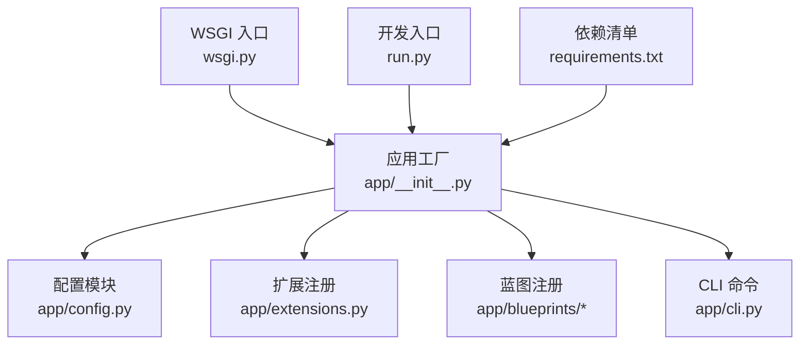
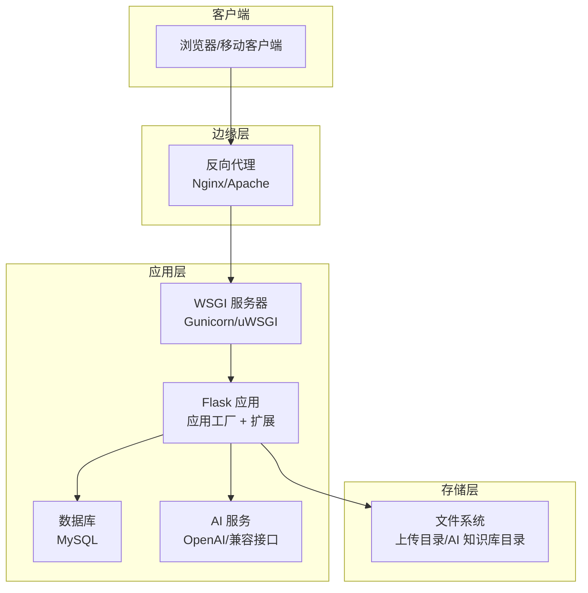
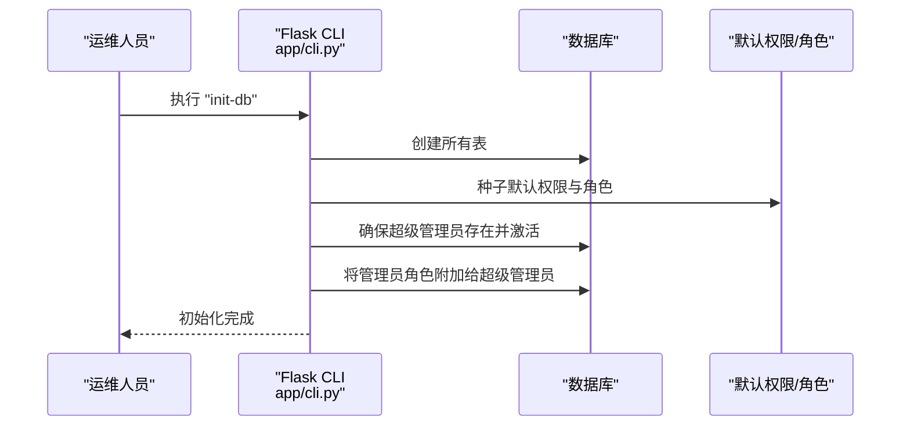
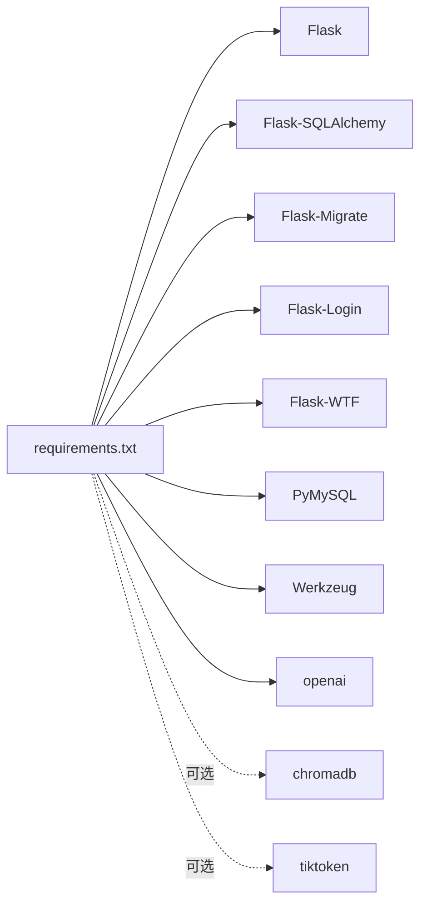

# 生产环境部署

<cite>
**本文档引用的文件**
- [app/config.py](file://app/config.py)
- [app/__init__.py](file://app/__init__.py)
- [app/extensions.py](file://app/extensions.py)
- [app/cli.py](file://app/cli.py)
- [wsgi.py](file://wsgi.py)
- [run.py](file://run.py)
- [requirements.txt](file://requirements.txt)
- [scripts/init_db.py](file://scripts/init_db.py)
- [README.md](file://README.md)
</cite>

## 目录
1. [简介](#简介)
2. [项目结构](#项目结构)
3. [核心组件](#核心组件)
4. [架构总览](#架构总览)
5. [详细组件分析](#详细组件分析)
6. [依赖分析](#依赖分析)
7. [性能考虑](#性能考虑)
8. [故障排除指南](#故障排除指南)
9. [结论](#结论)
10. [附录](#附录)

## 简介
本指南面向生产环境部署 My Wiki，涵盖配置要求、WSGI 服务器部署（Gunicorn/uWSGI）、反向代理（Nginx/Apache）与 SSL 证书配置、数据库初始化、静态文件处理、日志配置、进程管理、负载均衡与健康检查、自动重启策略、安全最佳实践、性能调优与监控告警等。文档基于仓库现有代码进行分析与提炼，确保部署流程可执行、可维护。

## 项目结构
My Wiki 采用 Flask 应用工厂模式，核心入口通过应用工厂函数创建应用实例，并注册扩展、蓝图、CLI 命令与错误处理器。WSGI 入口与开发入口分别位于独立文件中，便于在不同运行环境中选择合适的入口点。

图表来源
- [app/__init__.py:11-28](file://app/__init__.py#L11-L28)
- [app/config.py:15-82](file://app/config.py#L15-L82)
- [app/extensions.py:1-17](file://app/extensions.py#L1-L17)
- [wsgi.py:1-10](file://wsgi.py#L1-L10)
- [run.py:1-17](file://run.py#L1-L17)
- [requirements.txt:1-22](file://requirements.txt#L1-L22)

章节来源
- [app/__init__.py:11-28](file://app/__init__.py#L11-L28)
- [app/config.py:15-82](file://app/config.py#L15-L82)
- [wsgi.py:1-10](file://wsgi.py#L1-L10)
- [run.py:1-17](file://run.py#L1-L17)
- [requirements.txt:1-22](file://requirements.txt#L1-L22)

## 核心组件
- 应用工厂：负责创建 Flask 实例、加载配置、注册扩展、蓝图、错误处理器与 CLI。
- 配置模块：定义基础配置类与开发/生产/测试配置映射，支持从环境变量读取数据库连接、上传路径、AI 相关参数等。
- 扩展注册：集中管理 SQLAlchemy、Flask-Migrate、LoginManager、CSRFProtect。
- CLI 命令：提供数据库初始化、默认权限与角色种子数据、创建普通用户等命令。
- WSGI 入口：生产环境入口，加载 .env 并创建生产配置的应用实例。
- 开发入口：本地开发入口，支持主机、端口与调试开关。

章节来源
- [app/__init__.py:11-28](file://app/__init__.py#L11-L28)
- [app/config.py:15-82](file://app/config.py#L15-L82)
- [app/extensions.py:1-17](file://app/extensions.py#L1-L17)
- [app/cli.py:61-96](file://app/cli.py#L61-L96)
- [wsgi.py:1-10](file://wsgi.py#L1-L10)
- [run.py:1-17](file://run.py#L1-L17)

## 架构总览
下图展示生产环境典型部署架构：反向代理（Nginx/Apache）接收外部请求，转发至 WSGI 服务器（Gunicorn/uWSGI），WSGI 服务器再调用应用工厂创建的应用实例；应用通过扩展访问数据库与 AI 服务；静态资源由反向代理提供或由应用提供。

图表来源
- [wsgi.py:1-10](file://wsgi.py#L1-L10)
- [app/__init__.py:11-28](file://app/__init__.py#L11-L28)
- [app/extensions.py:1-17](file://app/extensions.py#L1-L17)
- [app/config.py:18-26](file://app/config.py#L18-L26)
- [app/config.py:38-47](file://app/config.py#L38-L47)

## 详细组件分析

### 配置与环境变量
- 数据库连接：支持通过 DATABASE_URL 环境变量覆盖默认 MySQL 连接字符串；启用连接池预检查与回收策略。
- 会话与 Cookie：启用 HttpOnly，SameSite=Lax，设置记住登录时长。
- 上传与大小限制：通过 UPLOAD_DIR 与 MAX_CONTENT_LENGTH 控制上传目录与最大请求体大小。
- AI 与 RAG：支持 OpenAI 基础地址、API Key、模型名称；可选启用 RAG，配置嵌入模型与 Chroma 向量存储路径。
- 分页与验证码：默认分页大小与验证码过期时间。
- 配置映射：开发、生产、测试三种配置，生产配置关闭调试。

章节来源
- [app/config.py:15-82](file://app/config.py#L15-L82)

### 应用工厂与扩展
- 应用工厂：创建 Flask 实例，加载配置，确保实例目录与上传/AI 目录存在，注册扩展、蓝图、错误处理器、上下文处理器与 CLI。
- 扩展：SQLAlchemy、Flask-Migrate、LoginManager、CSRFProtect；登录视图指向认证蓝图的登录页面。
- 用户加载器：通过用户 ID 从数据库加载用户对象。

章节来源
- [app/__init__.py:11-28](file://app/__init__.py#L11-L28)
- [app/__init__.py:31-54](file://app/__init__.py#L31-L54)
- [app/extensions.py:1-17](file://app/extensions.py#L1-L17)

### CLI 初始化流程
- 数据库初始化：创建所有表、填充默认权限与角色、确保超级管理员存在并附加管理员角色。
- 创建普通用户：通过命令行参数创建用户并分配默认角色。
- 脚本化初始化：提供独立脚本以替代 Flask CLI 的数据库初始化流程。

图表来源
- [app/cli.py:61-96](file://app/cli.py#L61-L96)
- [scripts/init_db.py:23-47](file://scripts/init_db.py#L23-L47)

章节来源
- [app/cli.py:61-96](file://app/cli.py#L61-L96)
- [scripts/init_db.py:23-47](file://scripts/init_db.py#L23-L47)

### WSGI 与开发入口
- WSGI 入口：加载 .env，创建生产配置的应用实例，供 Gunicorn/uWSGI 调用。
- 开发入口：加载 .env，创建开发配置的应用实例，支持主机、端口与调试开关。

章节来源
- [wsgi.py:1-10](file://wsgi.py#L1-L10)
- [run.py:1-17](file://run.py#L1-17)

### 静态文件与上传目录
- 静态文件：应用工厂指定静态目录为应用内 static 文件夹。
- 上传目录：通过配置项 UPLOAD_DIR 指定，默认位于 instance/uploads；首次启动会自动创建。
- AI 知识库目录：通过 AI_WIKI_DIR 指定，默认位于 instance/ai_wiki；首次启动会自动创建。

章节来源
- [app/__init__.py:14-16](file://app/__init__.py#L14-L16)
- [app/__init__.py:31-36](file://app/__init__.py#L31-L36)
- [app/config.py:34-42](file://app/config.py#L34-L42)

### 安全与 CSRF
- CSRF 保护：通过 Flask-WTF 的 CSRFProtect 对表单提交进行防护。
- 登录管理：LoginManager 设置登录视图与消息类别，统一处理未登录访问。
- Cookie 安全：HttpOnly 与 SameSite=Lax 减少 XSS 与 CSRF 风险。

章节来源
- [app/extensions.py:10-16](file://app/extensions.py#L10-L16)
- [app/config.py:29-31](file://app/config.py#L29-L31)

## 依赖分析
- Python 依赖：Flask、Flask-SQLAlchemy、Flask-Migrate、Flask-Login、Flask-WTF、PyMySQL、Werkzeug、openai 等。
- 可选依赖：当启用 RAG 时需要 chromadb 与 tiktoken，当前 requirements 中注释说明。
- 运行时依赖：WSGI 服务器（Gunicorn/uWSGI）、反向代理（Nginx/Apache）、数据库（MySQL）、AI 服务（OpenAI）。

图表来源
- [requirements.txt:1-22](file://requirements.txt#L1-L22)

章节来源
- [requirements.txt:1-22](file://requirements.txt#L1-L22)

## 性能考虑
- 数据库连接池：启用 pool_pre_ping 与 pool_recycle，提升连接稳定性与回收效率。
- 会话与 Cookie：合理设置 SameSite 与 HttpOnly，降低会话劫持风险。
- 上传大小限制：通过 MAX_CONTENT_LENGTH 控制请求体大小，避免内存压力。
- AI 与 RAG：根据业务需求调整模型与向量存储路径，必要时启用 RAG 并配置嵌入模型。
- 反向代理缓存：对静态资源与非敏感响应进行缓存，减轻应用压力。

章节来源
- [app/config.py:23-26](file://app/config.py#L23-L26)
- [app/config.py:29-31](file://app/config.py#L29-L31)
- [app/config.py:35](file://app/config.py#L35)
- [app/config.py:45-47](file://app/config.py#L45-L47)

## 故障排除指南
- 数据库连接失败：检查 DATABASE_URL 环境变量是否正确，确认数据库可达与凭据有效。
- 初始化失败：确认数据库已连通，执行初始化命令或脚本，确保超级管理员账户创建成功。
- 上传失败：检查 UPLOAD_DIR 权限与磁盘空间，确认 MAX_CONTENT_LENGTH 是否过小。
- AI 接口异常：核对 OPENAI_BASE_URL、OPENAI_API_KEY 与 CHAT_MODEL 配置，确保网络可达。
- CSRF 错误：确认前端表单包含 CSRF Token，或在开发环境临时禁用 CSRF 校验（仅限测试）。

章节来源
- [app/config.py:18-21](file://app/config.py#L18-L21)
- [app/cli.py:67-95](file://app/cli.py#L67-L95)
- [app/config.py:34-41](file://app/config.py#L34-L41)
- [app/extensions.py:10-11](file://app/extensions.py#L10-L11)

## 结论
本指南基于仓库现有代码，提供了 My Wiki 生产环境部署的完整路径：从配置与初始化到 WSGI 服务器与反向代理部署，再到安全、性能与运维层面的最佳实践。建议在正式上线前完成环境验证、安全审计与性能压测，并建立完善的监控与告警体系。

## 附录

### A. 生产环境部署步骤
- 准备服务器与系统：安装 Python、MySQL、Git，准备域名与 SSL 证书。
- 克隆与安装依赖：克隆仓库，安装 requirements.txt 中的依赖。
- 配置环境变量：设置 DATABASE_URL、SECRET_KEY、UPLOAD_DIR、MAX_CONTENT_LENGTH、OPENAI_* 等。
- 初始化数据库：执行数据库初始化命令或脚本，创建表、默认权限与角色、超级管理员。
- 收集静态文件：在应用工厂中配置静态目录，确保反向代理或应用可提供静态资源。
- 部署 WSGI 服务器：使用 Gunicorn/uWSGI 加载 WSGI 入口，配置进程数与并发。
- 配置反向代理：Nginx/Apache 转发至 WSGI 服务器，配置 SSL 证书与压缩。
- 进程管理与自启：使用 systemd 或类似工具管理进程，设置自动重启策略。
- 负载均衡与健康检查：多实例部署，配置健康检查端点，实现自动故障转移。
- 监控与告警：采集应用日志、指标与错误，设置阈值告警。

### B. 关键配置清单
- 数据库：DATABASE_URL（必填）
- 安全：SECRET_KEY（必改）、SESSION_COOKIE_HTTPONLY、SESSION_COOKIE_SAMESITE
- 上传：UPLOAD_DIR、MAX_CONTENT_LENGTH
- AI：OPENAI_BASE_URL、OPENAI_API_KEY、CHAT_MODEL、ENABLE_RAG、EMBEDDING_MODEL、CHROMA_PATH
- 分页与验证码：DEFAULT_PAGE_SIZE、CAPTCHA_TTL_SECONDS

章节来源
- [app/config.py:18-53](file://app/config.py#L18-L53)