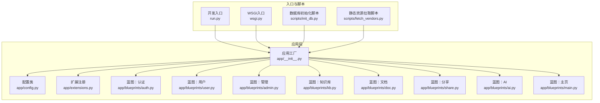
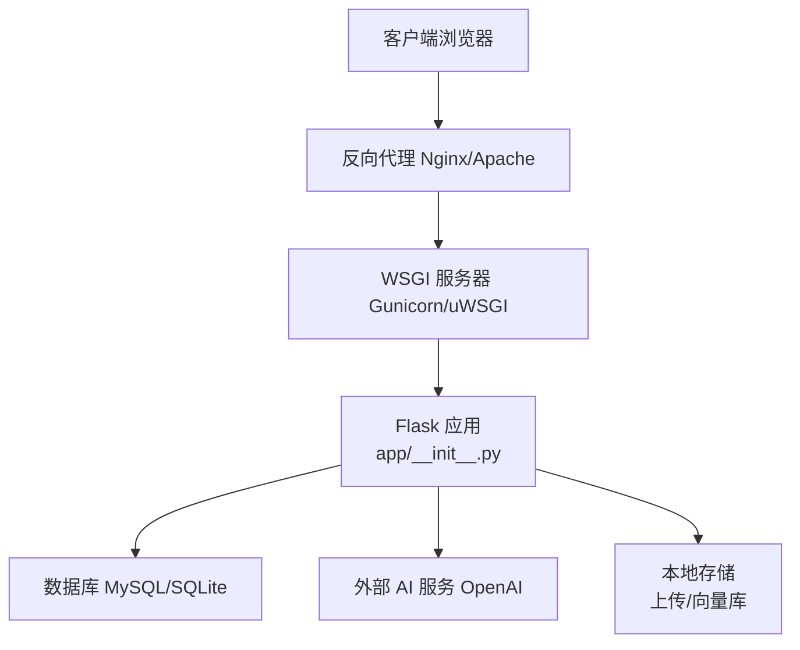
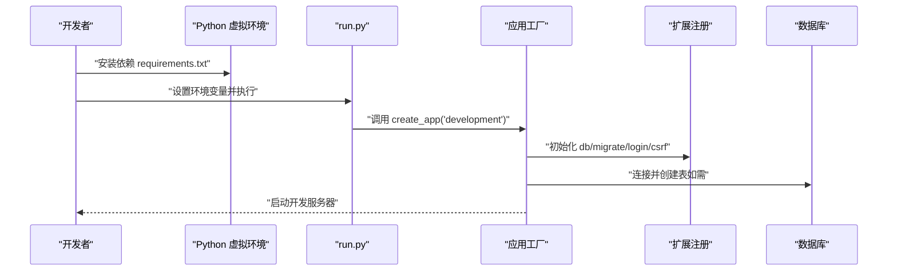
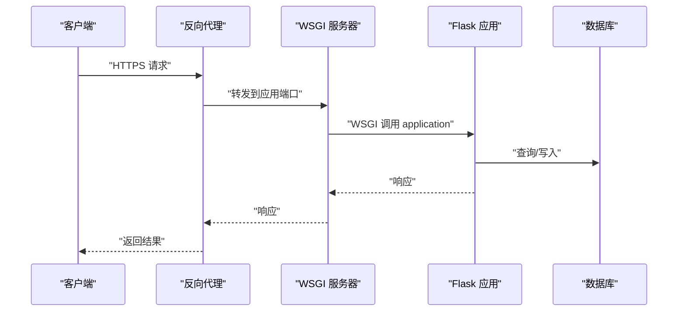
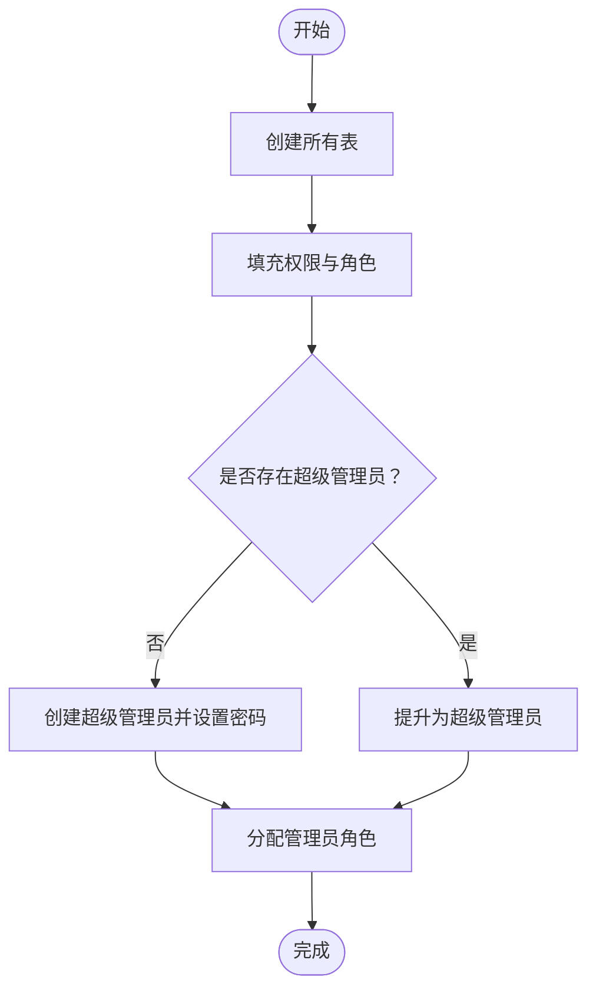
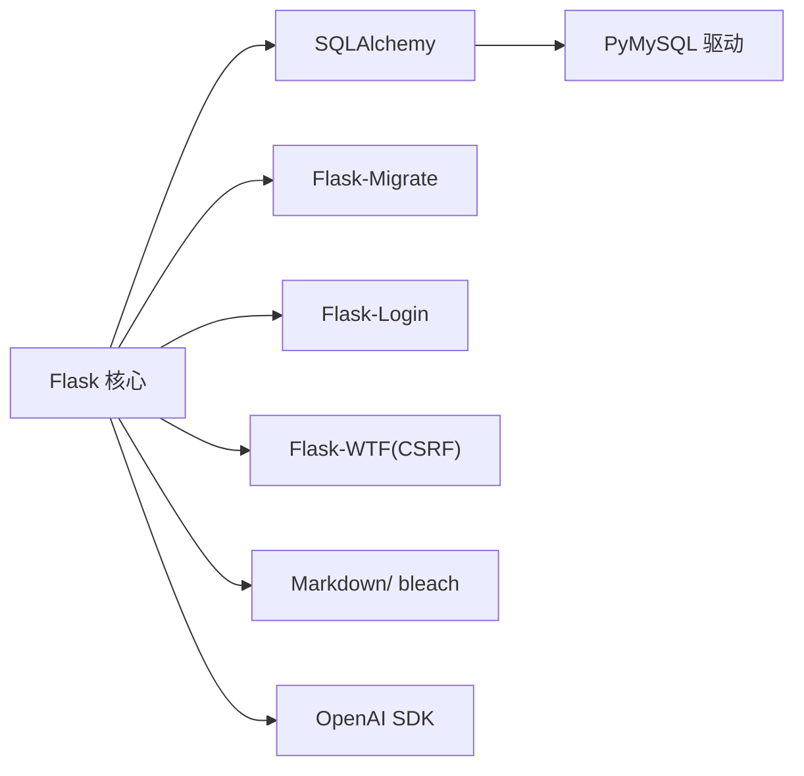

# 部署指南

<cite>
**本文引用的文件**
- [README.md](file://README.md)
- [requirements.txt](file://requirements.txt)
- [run.py](file://run.py)
- [wsgi.py](file://wsgi.py)
- [app/config.py](file://app/config.py)
- [app/__init__.py](file://app/__init__.py)
- [app/extensions.py](file://app/extensions.py)
- [scripts/init_db.py](file://scripts/init_db.py)
- [scripts/fetch_vendors.py](file://scripts/fetch_vendors.py)
</cite>

## 目录
1. [简介](#简介)
2. [项目结构](#项目结构)
3. [核心组件](#核心组件)
4. [架构总览](#架构总览)
5. [详细组件分析](#详细组件分析)
6. [依赖分析](#依赖分析)
7. [性能考虑](#性能考虑)
8. [故障排查指南](#故障排查指南)
9. [结论](#结论)
10. [附录](#附录)

## 简介
本指南面向运维与开发团队，提供 My Wiki 的完整部署方案，覆盖开发环境与生产环境的搭建步骤、WSGI 服务与反向代理配置、数据库迁移与静态资源处理、Docker 容器化与 Kubernetes 集群部署思路、日志与监控、备份与故障恢复、性能优化与安全加固等。内容基于仓库中的实际代码与脚本进行梳理，确保可执行性与可追溯性。

## 项目结构
My Wiki 采用 Flask 应用工厂模式组织代码，核心模块包括：
- 应用工厂与配置：通过工厂函数创建应用实例，按环境加载配置类，并注册蓝图、扩展与错误处理器。
- 扩展与模型：集中管理 SQLAlchemy、Flask-Migrate、Flask-Login、CSRFProtect 等扩展。
- 蓝图：按功能划分认证、用户、管理、知识库、文档、分享、AI、主页等蓝图。
- CLI 与脚本：提供数据库初始化与种子数据、第三方静态资源拉取等工具脚本。
- 入口点：开发与生产分别使用独立入口文件，统一从应用工厂加载配置。

**图表来源**
- [app/__init__.py:11-28](file://app/__init__.py#L11-L28)
- [app/config.py:15-83](file://app/config.py#L15-L83)
- [app/extensions.py:8-17](file://app/extensions.py#L8-L17)
- [run.py:7-16](file://run.py#L7-L16)
- [wsgi.py:7-9](file://wsgi.py#L7-L9)
- [scripts/init_db.py:23-47](file://scripts/init_db.py#L23-L47)
- [scripts/fetch_vendors.py:74-92](file://scripts/fetch_vendors.py#L74-L92)

**章节来源**
- [README.md:1-3](file://README.md#L1-L3)
- [requirements.txt:1-22](file://requirements.txt#L1-L22)
- [app/__init__.py:11-28](file://app/__init__.py#L11-L28)
- [app/config.py:15-83](file://app/config.py#L15-L83)
- [app/extensions.py:8-17](file://app/extensions.py#L8-L17)
- [run.py:7-16](file://run.py#L7-L16)
- [wsgi.py:7-9](file://wsgi.py#L7-L9)
- [scripts/init_db.py:23-47](file://scripts/init_db.py#L23-L47)
- [scripts/fetch_vendors.py:74-92](file://scripts/fetch_vendors.py#L74-L92)

## 核心组件
- 应用工厂 create_app：负责实例化 Flask、加载配置、创建实例目录、注册扩展、蓝图、错误处理器、上下文变量与 CLI。
- 配置系统：BaseConfig 提供通用配置项（数据库、会话、上传、AI、分页等），并区分 development/production/testing 三类配置。
- 扩展注册：SQLAlchemy、Flask-Migrate、Flask-Login、CSRFProtect 在应用中集中初始化。
- 入口点：run.py 用于开发；wsgi.py 用于生产 WSGI。
- 数据库初始化：scripts/init_db.py 支持创建表、种子权限角色与超级管理员。
- 静态资源：scripts/fetch_vendors.py 拉取第三方前端资源至本地 vendor 目录。

**章节来源**
- [app/__init__.py:11-28](file://app/__init__.py#L11-L28)
- [app/config.py:15-83](file://app/config.py#L15-L83)
- [app/extensions.py:8-17](file://app/extensions.py#L8-L17)
- [run.py:7-16](file://run.py#L7-L16)
- [wsgi.py:7-9](file://wsgi.py#L7-L9)
- [scripts/init_db.py:23-47](file://scripts/init_db.py#L23-L47)
- [scripts/fetch_vendors.py:74-92](file://scripts/fetch_vendors.py#L74-L92)

## 架构总览
下图展示从客户端到应用、数据库与外部服务的整体交互路径，以及开发与生产的入口差异。

**图表来源**
- [wsgi.py:7-9](file://wsgi.py#L7-L9)
- [app/config.py:18-26](file://app/config.py#L18-L26)
- [app/config.py:38-47](file://app/config.py#L38-L47)
- [app/__init__.py:39-54](file://app/__init__.py#L39-L54)

## 详细组件分析

### 开发环境部署
- 基础环境
  - Python 版本与虚拟环境：在项目根目录创建并激活虚拟环境，使用 pip 安装 requirements.txt 中的依赖。
  - 环境变量：根据需要设置 FLASK_CONFIG、FLASK_RUN_HOST、FLASK_RUN_PORT、SECRET_KEY、DATABASE_URL 等。
- 初始化步骤
  - 创建实例目录：应用工厂会在启动时自动创建上传、AI 知识库与实例目录。
  - 拉取静态资源：运行 scripts/fetch_vendors.py 将第三方前端资源下载到本地 vendor 目录。
  - 数据库初始化：运行 scripts/init_db.py 或通过 CLI 命令初始化数据库并创建超级管理员。
- 启动开发服务器
  - 使用 run.py 启动 Flask 开发服务器，默认监听 0.0.0.0:5000，可通过环境变量调整主机与端口。

**图表来源**
- [requirements.txt:1-22](file://requirements.txt#L1-L22)
- [run.py:7-16](file://run.py#L7-L16)
- [app/__init__.py:11-28](file://app/__init__.py#L11-L28)
- [app/__init__.py:39-54](file://app/__init__.py#L39-L54)
- [scripts/fetch_vendors.py:74-92](file://scripts/fetch_vendors.py#L74-L92)
- [scripts/init_db.py:23-47](file://scripts/init_db.py#L23-L47)

**章节来源**
- [requirements.txt:1-22](file://requirements.txt#L1-L22)
- [run.py:7-16](file://run.py#L7-L16)
- [app/__init__.py:11-28](file://app/__init__.py#L11-L28)
- [app/__init__.py:31-36](file://app/__init__.py#L31-L36)
- [scripts/fetch_vendors.py:74-92](file://scripts/fetch_vendors.py#L74-L92)
- [scripts/init_db.py:23-47](file://scripts/init_db.py#L23-L47)

### 生产环境部署
- WSGI 入口与应用
  - 使用 wsgi.py 作为生产 WSGI 入口，加载生产配置并导出 application 对象。
- 反向代理
  - Nginx/Apache 将请求转发至后端 WSGI 服务器（如 Gunicorn/uWSGI），静态资源由反向代理直接提供。
- 数据库与迁移
  - 通过 Flask-Migrate 进行数据库迁移；首次部署时执行初始化脚本或 CLI 命令创建表与种子数据。
- 静态文件处理
  - 前端静态资源应由反向代理提供；若需本地托管，可将静态目录映射到应用静态文件。
- SSL/TLS
  - 在反向代理层启用 HTTPS，配置证书与私钥；确保后端仅监听内网地址或通过防火墙限制外网访问。

**图表来源**
- [wsgi.py:7-9](file://wsgi.py#L7-L9)
- [app/__init__.py:11-28](file://app/__init__.py#L11-L28)
- [app/config.py:18-26](file://app/config.py#L18-L26)

**章节来源**
- [wsgi.py:7-9](file://wsgi.py#L7-L9)
- [app/__init__.py:11-28](file://app/__init__.py#L11-L28)
- [app/config.py:18-26](file://app/config.py#L18-L26)

### 数据库初始化与迁移
- 初始化脚本
  - scripts/init_db.py 在应用上下文中创建所有表、填充权限与角色、创建或提升超级管理员账号。
- 迁移与升级
  - 使用 Flask-Migrate 进行数据库版本控制与升级；生产环境应在维护窗口执行迁移。

**图表来源**
- [scripts/init_db.py:23-47](file://scripts/init_db.py#L23-L47)

**章节来源**
- [scripts/init_db.py:23-47](file://scripts/init_db.py#L23-L47)
- [app/extensions.py:9](file://app/extensions.py#L9)

### 静态资源与前端构建
- 第三方资源拉取
  - scripts/fetch_vendors.py 将 Tailwind、Alpine.js、Editor.js、highlight.js、图标库与字体等资源下载到 app/static/vendor/，避免运行时网络依赖。
- 静态文件托管
  - 生产环境中建议由反向代理直接提供静态资源，减少应用负载。

**章节来源**
- [scripts/fetch_vendors.py:23-62](file://scripts/fetch_vendors.py#L23-L62)
- [scripts/fetch_vendors.py:74-92](file://scripts/fetch_vendors.py#L74-L92)

### Docker 容器化部署（思路）
- 镜像构建
  - 基于官方 Python 基础镜像，复制 requirements.txt 并安装依赖，复制源码，预热静态资源。
- 环境变量
  - 设置 FLASK_CONFIG、SECRET_KEY、DATABASE_URL、OPENAI_* 等关键变量。
- 健康检查与启动
  - 使用 WSGI 入口启动服务；在容器内执行数据库迁移与初始化脚本。
- 卷与持久化
  - 将上传目录、AI 知识库目录、实例目录挂载为卷，确保重启不丢失数据。
- 反向代理
  - 在容器外部署 Nginx/Apache，将 HTTPS 终止并转发至容器内的 WSGI 服务。

[本节为概念性说明，未直接分析具体文件，故无“章节来源”]

### Kubernetes 集群部署（思路）
- Deployment
  - 定义副本数、资源限制、探针与滚动更新策略。
- Service
  - 暴露应用端口，支持 ClusterIP/NodePort/LoadBalancer。
- ConfigMap/Secret
  - 存放非敏感配置与密钥（如数据库凭据、OpenAI 凭据）。
- PersistentVolumeClaim
  - 为上传与 AI 知识库目录提供持久化存储。
- Ingress
  - 配置 TLS 证书与路由规则，实现 HTTPS 终止与流量分发。

[本节为概念性说明，未直接分析具体文件，故无“章节来源”]

## 依赖分析
- 应用依赖
  - Flask 核心框架、SQLAlchemy ORM、Flask-Migrate 迁移、Flask-Login 认证、Flask-WTF 表单与 CSRF、PyMySQL 驱动、Werkzeug 工具集、python-dotenv 环境变量、Markdown 处理、OpenAI SDK（可选）。
- 运行时耦合
  - 应用通过工厂函数与配置类解耦，扩展在应用初始化阶段注入，降低模块间耦合度。
- 外部接口
  - 数据库驱动（MySQL）、外部 AI 服务（OpenAI）。

**图表来源**
- [requirements.txt:1-22](file://requirements.txt#L1-L22)
- [app/extensions.py:8-11](file://app/extensions.py#L8-L11)

**章节来源**
- [requirements.txt:1-22](file://requirements.txt#L1-L22)
- [app/extensions.py:8-11](file://app/extensions.py#L8-L11)

## 性能考虑
- 数据库连接池
  - 配置 pool_pre_ping 与 pool_recycle，提升连接稳定性与回收效率。
- 会话与 Cookie
  - 启用 HttpOnly 与 SameSite=Lax，合理设置 remember cookie 有效期，降低会话劫持风险。
- 上传与容量
  - 通过 MAX_CONTENT_LENGTH 控制上传大小，结合反向代理层限制，防止资源滥用。
- 静态资源
  - 将第三方资源本地化，减少网络抖动对首屏的影响；由反向代理提供静态文件。
- WSGI 与并发
  - 在生产环境选择合适的 WSGI 服务器与进程/线程配置，结合反向代理实现高可用与水平扩展。

[本节提供一般性指导，未直接分析具体文件，故无“章节来源”]

## 故障排查指南
- 启动失败
  - 检查环境变量是否正确加载（FLASK_CONFIG、DATABASE_URL、SECRET_KEY 等）。
  - 确认数据库可达且凭据正确。
- 数据库问题
  - 使用 Flask-Migrate 检查迁移状态；必要时回滚或重建数据库。
  - 通过 scripts/init_db.py 重新初始化表与超级管理员。
- 权限与会话
  - 确保会话 Cookie 配置符合生产要求；检查登录视图与消息提示。
- 静态资源缺失
  - 重新运行 scripts/fetch_vendors.py，确认 vendor 目录存在且非空。
- 日志与监控
  - 在反向代理与 WSGI 层开启访问与错误日志；结合应用内部错误处理器输出 4xx/5xx 页面。

**章节来源**
- [app/config.py:18-35](file://app/config.py#L18-L35)
- [app/config.py:29-31](file://app/config.py#L29-L31)
- [app/config.py:56-61](file://app/config.py#L56-L61)
- [app/__init__.py:76-87](file://app/__init__.py#L76-L87)
- [scripts/fetch_vendors.py:74-92](file://scripts/fetch_vendors.py#L74-L92)
- [scripts/init_db.py:23-47](file://scripts/init_db.py#L23-L47)

## 结论
本指南基于仓库中的应用工厂、配置系统、扩展注册、入口脚本与初始化脚本，给出了从开发到生产的完整部署路径。建议在生产环境中结合反向代理、WSGI 服务器、数据库迁移与静态资源本地化策略，配合 SSL/TLS、日志监控与备份恢复机制，确保系统的稳定性与安全性。

## 附录
- 环境变量清单（示例）
  - FLASK_CONFIG：development/production/testing
  - FLASK_RUN_HOST/FLASK_RUN_PORT：开发服务器绑定地址与端口
  - SECRET_KEY：应用密钥
  - DATABASE_URL：数据库连接字符串
  - OPENAI_BASE_URL/OPENAI_API_KEY/CHAT_MODEL：AI 相关配置
  - UPLOAD_DIR/MAX_CONTENT_LENGTH：上传目录与大小限制
  - ENABLE_RAG/EMBEDDING_MODEL/CHROMA_PATH：RAG 功能相关
  - INIT_ADMIN_*：初始化超级管理员用户名、邮箱、密码

**章节来源**
- [app/config.py:15-83](file://app/config.py#L15-L83)
- [scripts/init_db.py:28-30](file://scripts/init_db.py#L28-L30)