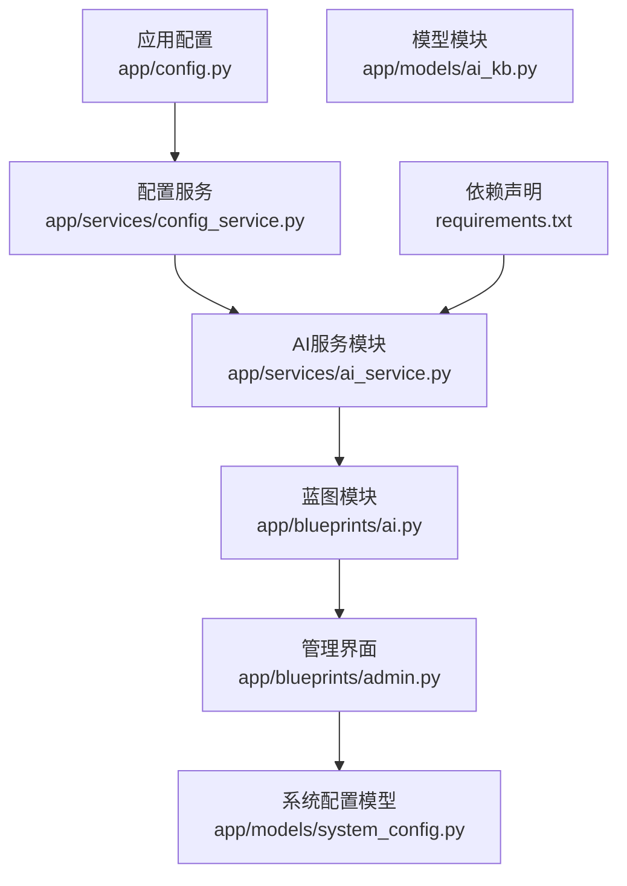
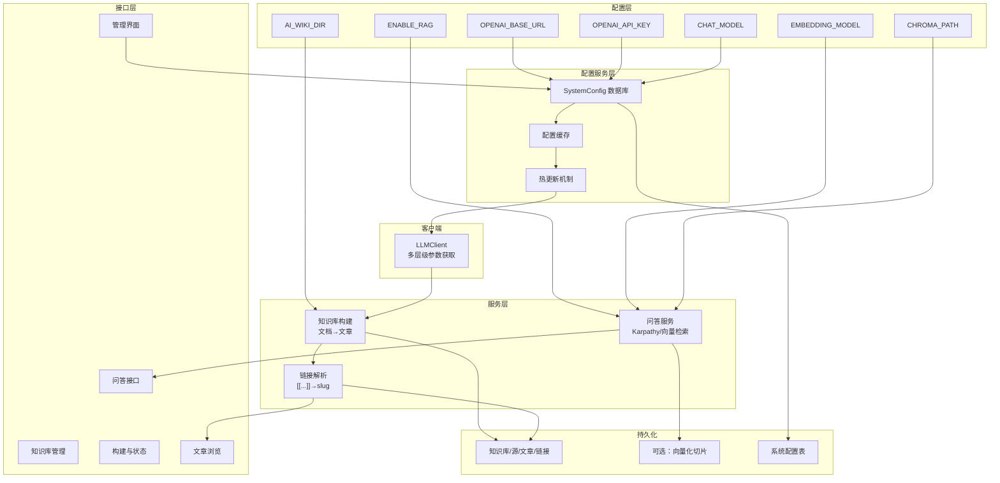
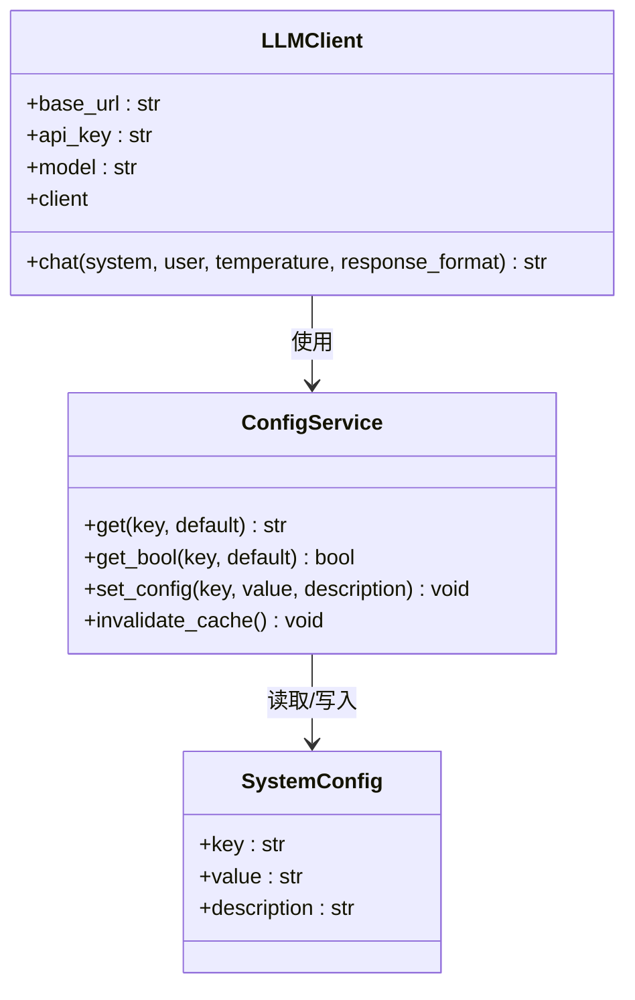
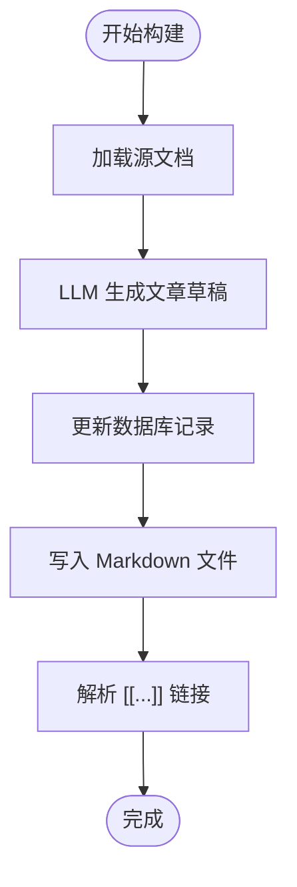
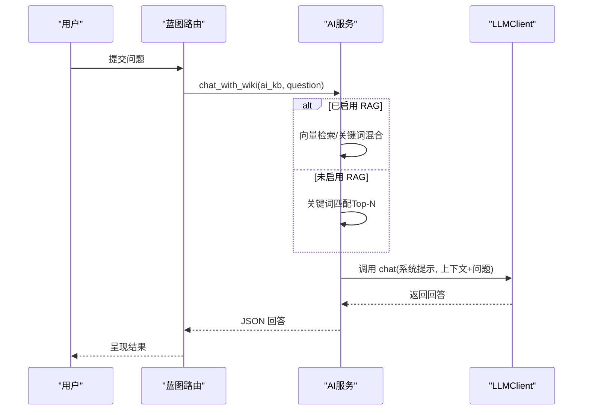
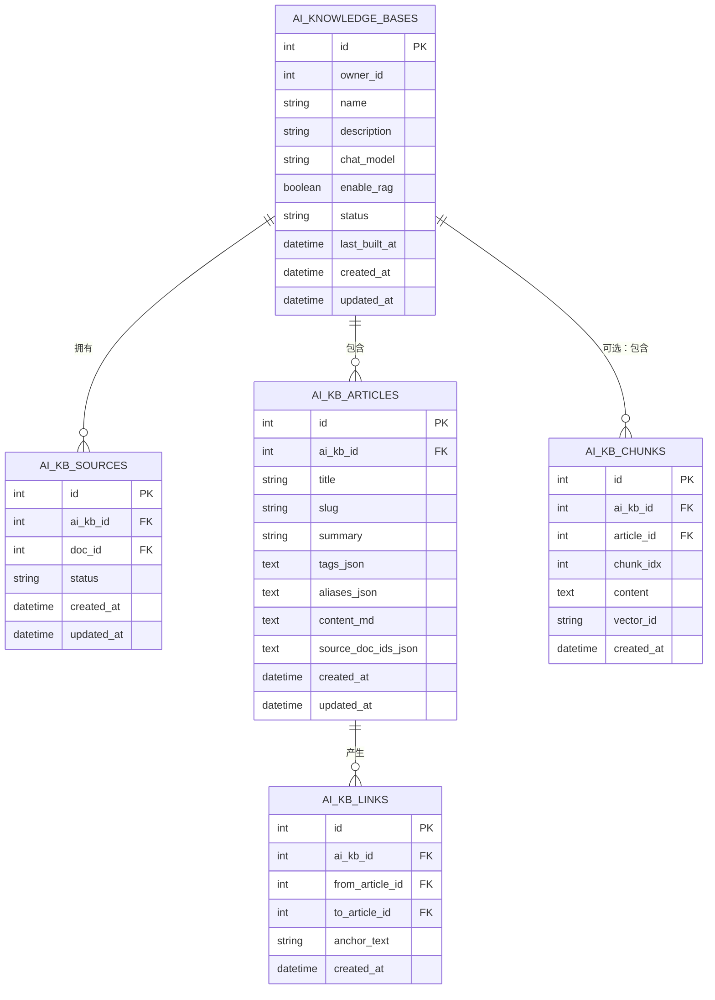
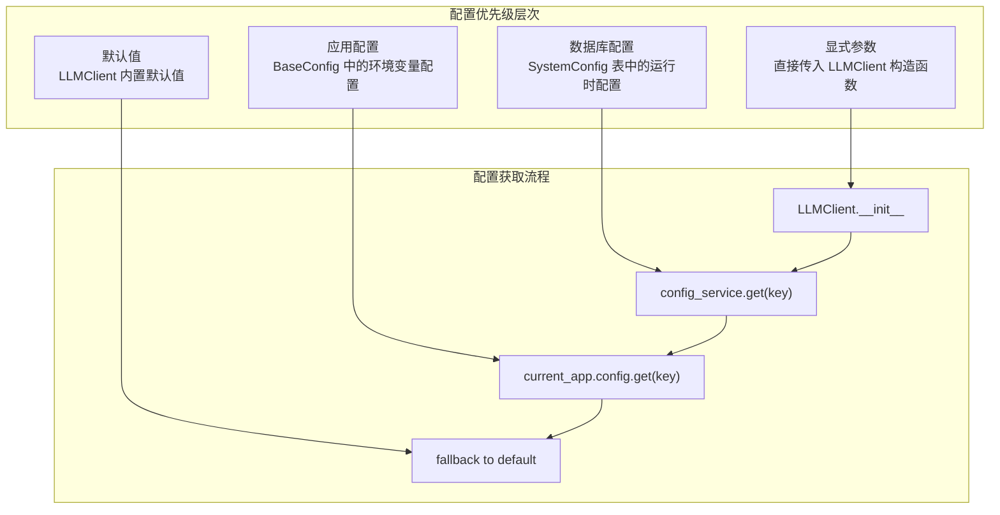
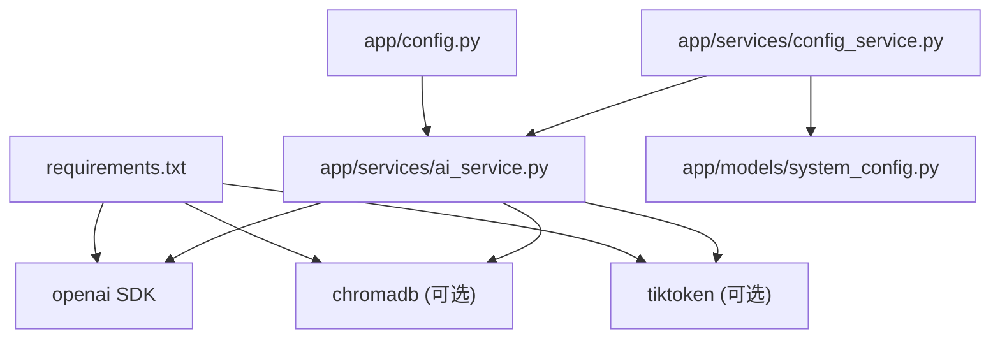

# AI服务配置

<cite>
**本文档引用的文件**
- [app/config.py](file://app/config.py)
- [app/services/ai_service.py](file://app/services/ai_service.py)
- [app/services/config_service.py](file://app/services/config_service.py)
- [app/models/system_config.py](file://app/models/system_config.py)
- [app/blueprints/ai.py](file://app/blueprints/ai.py)
- [app/blueprints/admin.py](file://app/blueprints/admin.py)
- [app/models/ai_kb.py](file://app/models/ai_kb.py)
- [app/templates/admin/settings.html](file://app/templates/admin/settings.html)
- [requirements.txt](file://requirements.txt)
</cite>

## 更新摘要
**变更内容**
- 新增配置优先级层次系统，支持多层级配置参数获取
- LLMClient现在支持从数据库配置系统动态获取参数
- 新增SystemConfig数据库配置表和admin管理界面
- 增强了API端点和模型选择的动态配置能力
- 完善了配置验证和热更新机制

## 目录
1. [简介](#简介)
2. [项目结构](#项目结构)
3. [核心组件](#核心组件)
4. [架构总览](#架构总览)
5. [详细组件分析](#详细组件分析)
6. [配置优先级系统](#配置优先级系统)
7. [依赖分析](#依赖分析)
8. [性能考虑](#性能考虑)
9. [故障排查指南](#故障排查指南)
10. [结论](#结论)
11. [附录](#附录)

## 简介
本文件面向 My Wiki 的 AI 服务配置，重点说明与 OpenAI 兼容的 LLM 集成方式及可选的 RAG 能力。内容涵盖：
- OPENAI_BASE_URL、OPENAI_API_KEY、CHAT_MODEL 等 AI 相关配置项的设置方法与作用范围
- AI_WIKI_DIR 与知识库文件存储路径的配置与落地位置
- ENABLE_RAG 开关与 RAG 功能的配置选项（EMBEDDING_MODEL、CHROMA_PATH）
- 配置优先级层次系统（显式参数 > 数据库配置 > 应用配置 > 默认值）
- 动态模型选择和API端点配置能力
- 不同模型的配置示例与性能对比建议
- API 密钥安全管理与配置验证方法

## 项目结构
围绕 AI 服务的核心文件与职责如下：
- 配置层：集中于应用配置类，定义所有环境变量默认值与类型转换逻辑
- 配置服务层：提供数据库配置管理，支持运行时热更新
- 服务层：封装 LLM 客户端、知识库构建流程、可选 RAG 对话能力
- 蓝图层：对外暴露知识库管理、构建、浏览与问答接口
- 模型层：持久化 AI 知识库、源文档、文章与链接等实体

**图表来源**
- [app/config.py:37-47](file://app/config.py#L37-L47)
- [app/services/config_service.py:1-82](file://app/services/config_service.py#L1-L82)
- [app/services/ai_service.py:47-86](file://app/services/ai_service.py#L47-L86)
- [app/blueprints/ai.py:15](file://app/blueprints/ai.py#L15)
- [app/blueprints/admin.py:270-289](file://app/blueprints/admin.py#L270-L289)
- [app/models/ai_kb.py:22-121](file://app/models/ai_kb.py#L22-L121)
- [app/models/system_config.py:1-18](file://app/models/system_config.py#L1-L18)
- [requirements.txt:18](file://requirements.txt#L18)

**章节来源**
- [app/config.py:37-47](file://app/config.py#L37-L47)
- [app/services/config_service.py:1-82](file://app/services/config_service.py#L1-L82)
- [app/services/ai_service.py:47-86](file://app/services/ai_service.py#L47-L86)
- [app/blueprints/ai.py:15](file://app/blueprints/ai.py#L15)
- [app/blueprints/admin.py:270-289](file://app/blueprints/admin.py#L270-L289)
- [app/models/ai_kb.py:22-121](file://app/models/ai_kb.py#L22-L121)
- [app/models/system_config.py:1-18](file://app/models/system_config.py#L1-L18)
- [requirements.txt:18](file://requirements.txt#L18)

## 核心组件
- 应用配置类 BaseConfig：集中定义所有 AI 相关环境变量及其默认值，包括基础 LLM 参数与可选 RAG 参数
- 配置服务 ConfigService：提供数据库配置管理，支持运行时热更新和缓存机制
- LLM 客户端 LLMClient：封装 OpenAI 兼容 SDK，支持多层级配置参数获取
- AI 知识库服务：负责文档到 Wiki 文章的构建、链接解析、异步构建与可选 RAG 对话
- 蓝图路由：提供知识库 CRUD、构建状态查询、文章浏览、图谱展示与问答接口
- 管理界面：提供可视化配置管理，支持实时修改和验证
- 数据模型：持久化 AI 知识库、源文档、文章、链接与可选的向量化切片

**章节来源**
- [app/config.py:37-47](file://app/config.py#L37-L47)
- [app/services/config_service.py:1-82](file://app/services/config_service.py#L1-L82)
- [app/services/ai_service.py:47-86](file://app/services/ai_service.py#L47-L86)
- [app/blueprints/ai.py:27-85](file://app/blueprints/ai.py#L27-L85)
- [app/blueprints/admin.py:270-289](file://app/blueprints/admin.py#L270-L289)
- [app/models/ai_kb.py:22-121](file://app/models/ai_kb.py#L22-L121)

## 架构总览
AI 服务整体由"配置 → 配置服务 → 客户端 → 服务 → 蓝图 → 持久化"构成，支持两种问答模式：
- 纯文本检索（Karpathy 风格）：不依赖向量库，基于关键词匹配选择上下文
- 向量检索增强（RAG）：可选开启，结合嵌入模型与向量数据库提升召回质量

**图表来源**
- [app/config.py:37-47](file://app/config.py#L37-L47)
- [app/services/config_service.py:1-82](file://app/services/config_service.py#L1-L82)
- [app/services/ai_service.py:47-86](file://app/services/ai_service.py#L47-L86)
- [app/blueprints/ai.py:27-85](file://app/blueprints/ai.py#L27-L85)
- [app/blueprints/admin.py:270-289](file://app/blueprints/admin.py#L270-L289)
- [app/models/ai_kb.py:22-121](file://app/models/ai_kb.py#L22-L121)
- [app/models/system_config.py:1-18](file://app/models/system_config.py#L1-L18)

## 详细组件分析

### 配置项详解与设置方法
- OPENAI_BASE_URL
  - 作用：指定 OpenAI 兼容服务的 API 基础地址，默认指向官方 v1 接口
  - 设置方法：通过环境变量覆盖，支持代理、本地服务或第三方厂商
  - 默认值：见配置文件中的默认值
- OPENAI_API_KEY
  - 作用：调用 LLM 所需的认证密钥
  - 设置方法：通过环境变量注入；若为空，客户端仍初始化，但外部调用可能失败
- CHAT_MODEL
  - 作用：默认对话模型名称，可在知识库级别覆盖
  - 设置方法：通过环境变量设置全局默认；也可在创建/编辑知识库时单独指定
- AI_WIKI_DIR
  - 作用：知识库文章文件的输出根目录
  - 默认值：项目 instance 目录下的 ai_wiki 子目录
  - 文件落盘：每个知识库对应一个子目录，文章以 slug.md 写入
- ENABLE_RAG
  - 作用：是否启用 RAG 增强问答
  - 默认值：False（关闭）
  - 影响：开启后可使用向量检索与嵌入模型，需要额外依赖
- EMBEDDING_MODEL
  - 作用：嵌入模型名称，用于将文本转为向量
  - 默认值：text-embedding-3-small
- CHROMA_PATH
  - 作用：向量数据库（Chroma）持久化路径
  - 默认值：项目 instance 目录下的 chroma 子目录

**章节来源**
- [app/config.py:37-47](file://app/config.py#L37-L47)
- [app/services/ai_service.py:190-202](file://app/services/ai_service.py#L190-L202)
- [app/models/ai_kb.py:30](file://app/models/ai_kb.py#L30)

### LLM 客户端与模型选择
- LLMClient
  - 支持从配置读取 base_url、api_key、model
  - 配置优先级：显式参数 > 数据库配置 > 应用配置 > 默认值
  - 若未显式传入 model，则回退至配置中的 CHAT_MODEL
  - 使用 OpenAI 兼容 SDK，可适配多种厂商或本地代理
- 模型选择优先级
  - 知识库级别：若知识库设置了 chat_model，则优先使用该模型
  - 配置级别：否则使用 CHAT_MODEL
  - 降级策略：若均未设置，使用 gpt-4o-mini

**图表来源**
- [app/services/ai_service.py:47-86](file://app/services/ai_service.py#L47-L86)
- [app/services/config_service.py:1-82](file://app/services/config_service.py#L1-L82)
- [app/models/system_config.py:1-18](file://app/models/system_config.py#L1-L18)

**章节来源**
- [app/services/ai_service.py:47-86](file://app/services/ai_service.py#L47-L86)
- [app/services/config_service.py:1-82](file://app/services/config_service.py#L1-L82)
- [app/models/system_config.py:1-18](file://app/models/system_config.py#L1-L18)
- [app/models/ai_kb.py:30](file://app/models/ai_kb.py#L30)

### 知识库构建与文件存储
- 构建流程
  - 读取源文档，调用 LLM 生成文章草稿（JSON Schema）
  - 将草稿写入数据库并同步生成 Markdown 文件
  - 解析文章中的 [[...]] 链接，建立反向链接表
- 文件存储
  - 目录：AI_WIKI_DIR / ai_kb_id / slug.md
  - 文件内容：带 YAML 头信息的 Markdown 文档

**图表来源**
- [app/services/ai_service.py:147-231](file://app/services/ai_service.py#L147-L231)
- [app/services/ai_service.py:190-202](file://app/services/ai_service.py#L190-L202)
- [app/services/ai_service.py:251-278](file://app/services/ai_service.py#L251-L278)

**章节来源**
- [app/services/ai_service.py:147-231](file://app/services/ai_service.py#L147-L231)
- [app/services/ai_service.py:190-202](file://app/services/ai_service.py#L190-L202)
- [app/services/ai_service.py:251-278](file://app/services/ai_service.py#L251-L278)

### 问答接口与 RAG 配置
- Karpathy 风格问答
  - 基于关键词重叠选择 Top-N 文章，拼接全文作为上下文
  - 使用 LLM 生成最终回答
- RAG 增强问答
  - 仅当知识库启用 RAG 时生效
  - 需要嵌入模型与向量数据库（Chroma）配合
  - 依赖项：见 requirements 注释中可选依赖

**图表来源**
- [app/blueprints/ai.py:265-278](file://app/blueprints/ai.py#L265-L278)
- [app/services/ai_service.py:391-408](file://app/services/ai_service.py#L391-L408)
- [app/services/ai_service.py:47-86](file://app/services/ai_service.py#L47-L86)

**章节来源**
- [app/blueprints/ai.py:265-278](file://app/blueprints/ai.py#L265-L278)
- [app/services/ai_service.py:391-408](file://app/services/ai_service.py#L391-L408)
- [app/services/ai_service.py:47-86](file://app/services/ai_service.py#L47-L86)

### 数据模型与文件落盘
- 知识库与文章
  - AIKnowledgeBase：名称、描述、聊天模型、RAG 开关、状态与时间戳
  - AIKBArticle：标题、slug、摘要、标签、别名、内容、源文档 ID 列表
- 链接与可选向量化
  - AIKBLink：文章间链接（含红链）
  - AIKBChunk：可选的切片与向量 ID（向量本体由外部向量库管理）

**图表来源**
- [app/models/ai_kb.py:22-121](file://app/models/ai_kb.py#L22-L121)

**章节来源**
- [app/models/ai_kb.py:22-121](file://app/models/ai_kb.py#L22-L121)

## 配置优先级系统

### 多层级配置架构
My Wiki 实现了完整的配置优先级层次系统，确保参数获取的灵活性和可控性：

**图表来源**
- [app/services/ai_service.py:53-63](file://app/services/ai_service.py#L53-L63)
- [app/services/config_service.py:40-44](file://app/services/config_service.py#L40-L44)

### 配置服务与缓存机制
- ConfigService 提供线程安全的配置缓存，避免重复数据库查询
- 配置变更时自动失效缓存，确保新值立即生效
- 支持布尔值解析和类型转换

### 管理界面与热更新
- 管理员可通过 Web 界面实时修改配置
- 修改后的配置立即生效，无需重启服务
- 支持密码字段的安全显示（仅显示部分字符）

**章节来源**
- [app/services/ai_service.py:53-63](file://app/services/ai_service.py#L53-L63)
- [app/services/config_service.py:1-82](file://app/services/config_service.py#L1-L82)
- [app/blueprints/admin.py:270-289](file://app/blueprints/admin.py#L270-L289)
- [app/templates/admin/settings.html:1-66](file://app/templates/admin/settings.html#L1-L66)

## 依赖分析
- 运行时依赖
  - Flask、SQLAlchemy、openai SDK：核心运行与 LLM 调用
  - 可选依赖：当 ENABLE_RAG=true 时，需要 chromadb 与 tiktoken
- 配置与服务耦合
  - LLMClient 依赖配置中的 OPENAI_BASE_URL、OPENAI_API_KEY、CHAT_MODEL
  - 知识库构建与文件落盘依赖 AI_WIKI_DIR
  - RAG 能力依赖 ENABLE_RAG、EMBEDDING_MODEL、CHROMA_PATH
  - 配置服务依赖 SystemConfig 数据库表

**图表来源**
- [requirements.txt:18](file://requirements.txt#L18)
- [app/config.py:37-47](file://app/config.py#L37-L47)
- [app/services/config_service.py:1-82](file://app/services/config_service.py#L1-L82)
- [app/services/ai_service.py:47-86](file://app/services/ai_service.py#L47-L86)
- [app/models/system_config.py:1-18](file://app/models/system_config.py#L1-L18)

**章节来源**
- [requirements.txt:18](file://requirements.txt#L18)
- [app/config.py:37-47](file://app/config.py#L37-L47)
- [app/services/config_service.py:1-82](file://app/services/config_service.py#L1-L82)
- [app/services/ai_service.py:47-86](file://app/services/ai_service.py#L47-L86)
- [app/models/system_config.py:1-18](file://app/models/system_config.py#L1-L18)

## 性能考虑
- 模型选择与成本
  - gpt-4o-mini：性价比高，适合通用问答与知识库构建
  - 更大模型：在复杂推理与长上下文场景更优，但成本更高
- RAG 开关权衡
  - 关闭：无需向量库与嵌入计算，部署简单，延迟低
  - 开启：提升召回质量，但需要额外存储与计算资源
- 向量库与嵌入
  - EMBEDDING_MODEL 选择：更细粒度的模型通常召回更准，但向量维度更大
  - CHROMA_PATH：确保磁盘空间充足，定期备份与清理
- 并发与异步
  - 构建采用后台线程，避免阻塞请求；建议在生产环境配合队列或进程池
- 配置缓存优化
  - 配置服务使用进程内缓存减少数据库访问
  - 热更新机制确保配置变更的及时生效

## 故障排查指南
- API 密钥无效或为空
  - 现象：初始化 LLMClient 成功，但调用外部接口报错
  - 排查：确认 OPENAI_API_KEY 是否正确设置；必要时在本地开发环境使用占位值进行测试
- 模型不可用或名称错误
  - 现象：调用 chat 接口报模型不存在
  - 排查：检查 CHAT_MODEL 或知识库 chat_model 是否正确；确认供应商支持该模型
- RAG 未生效
  - 现象：开启 ENABLE_RAG 后仍按关键词检索
  - 排查：确认可选依赖已安装；检查 EMBEDDING_MODEL 与 CHROMA_PATH 配置；确认知识库已构建并包含向量化切片
- 文件写入失败
  - 现象：文章生成但文件未落盘
  - 排查：确认 AI_WIKI_DIR 可写；检查权限与磁盘空间
- 配置不生效
  - 现象：修改配置后未见效果
  - 排查：确认配置已保存到数据库；检查配置缓存是否失效；验证配置优先级顺序
- 管理界面配置异常
  - 现象：Web 界面无法修改配置
  - 排查：确认管理员权限；检查 CSRF 验证；查看数据库连接状态

**章节来源**
- [app/services/ai_service.py:62-70](file://app/services/ai_service.py#L62-L70)
- [app/services/ai_service.py:391-408](file://app/services/ai_service.py#L391-L408)
- [app/services/ai_service.py:190-202](file://app/services/ai_service.py#L190-L202)
- [app/services/config_service.py:33-38](file://app/services/config_service.py#L33-L38)

## 结论
- OPENAI_BASE_URL、OPENAI_API_KEY、CHAT_MODEL 是接入 OpenAI 兼容服务的关键参数，可通过环境变量灵活配置
- 新的配置优先级系统提供了更强大的参数管理能力，支持多层级配置和热更新
- AI_WIKI_DIR 控制知识库文章文件的落盘位置，便于离线浏览与版本管理
- ENABLE_RAG、EMBEDDING_MODEL、CHROMA_PATH 提供可选的向量检索能力，适合对召回质量有更高要求的场景
- 管理界面支持实时配置管理，无需重启服务即可生效
- 建议在开发与生产环境中分别采用不同的模型与开关策略，并做好依赖与存储规划

## 附录

### 配置项一览与默认值
- OPENAI_BASE_URL：默认官方 v1 地址
- OPENAI_API_KEY：默认空字符串
- CHAT_MODEL：默认 gpt-4o-mini
- AI_WIKI_DIR：默认项目 instance/ai_wiki
- ENABLE_RAG：默认 False
- EMBEDDING_MODEL：默认 text-embedding-3-small
- CHROMA_PATH：默认项目 instance/chroma

**章节来源**
- [app/config.py:37-47](file://app/config.py#L37-L47)

### 配置优先级详细说明
- 显式参数：直接传入 LLMClient 构造函数的参数具有最高优先级
- 数据库配置：SystemConfig 表中的运行时配置次之
- 应用配置：BaseConfig 中的环境变量配置再次之
- 默认值：LLMClient 内置的默认值具有最低优先级

**章节来源**
- [app/services/ai_service.py:53-63](file://app/services/ai_service.py#L53-L63)
- [app/services/config_service.py:40-44](file://app/services/config_service.py#L40-L44)

### 不同模型的配置示例与对比要点
- 示例一：OpenAI 官方
  - OPENAI_BASE_URL：官方 v1
  - CHAT_MODEL：gpt-4o-mini 或更高规格模型
- 示例二：国内兼容服务
  - OPENAI_BASE_URL：服务商提供的 v1 地址
  - CHAT_MODEL：根据服务商支持的模型列表选择
- 示例三：本地代理
  - OPENAI_BASE_URL：本地代理地址
  - CHAT_MODEL：本地模型名称
- 对比要点
  - 响应速度：本地/代理通常更快
  - 准确性：官方模型普遍更优
  - 成本：本地/代理更低
  - RAG：取决于嵌入模型与向量库部署

**章节来源**
- [app/services/ai_service.py:47-86](file://app/services/ai_service.py#L47-L86)
- [app/config.py:37-47](file://app/config.py#L37-L47)

### API 密钥安全与配置验证
- 安全管理
  - 使用环境变量注入密钥，避免硬编码
  - 在 CI/CD 中使用受控的密钥管理服务
  - 限制密钥权限与有效期
  - 管理界面支持密码字段的安全显示
- 配置验证
  - 初始化 LLMClient：若未提供 api_key，客户端仍可创建，但外部调用会失败
  - 建议在启动阶段增加一次轻量调用（如列举模型）以验证连通性
  - 对于 RAG：在启用前检查可选依赖是否安装与向量库可用
  - 配置变更后可通过管理界面进行验证

**章节来源**
- [app/services/ai_service.py:62-70](file://app/services/ai_service.py#L62-L70)
- [requirements.txt:19-21](file://requirements.txt#L19-L21)
- [app/templates/admin/settings.html:29-35](file://app/templates/admin/settings.html#L29-L35)