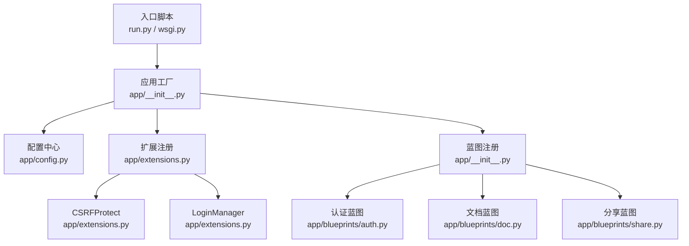
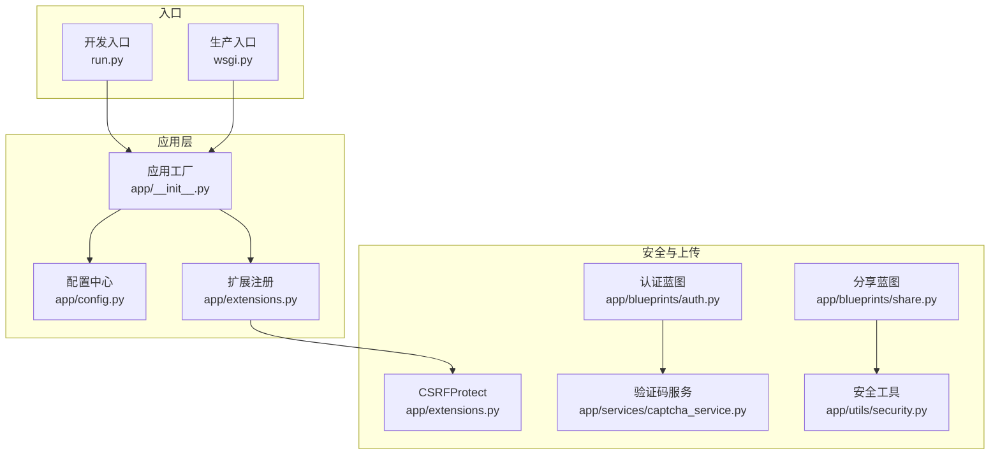
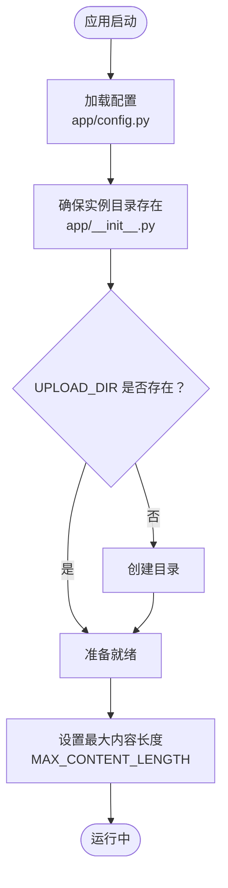
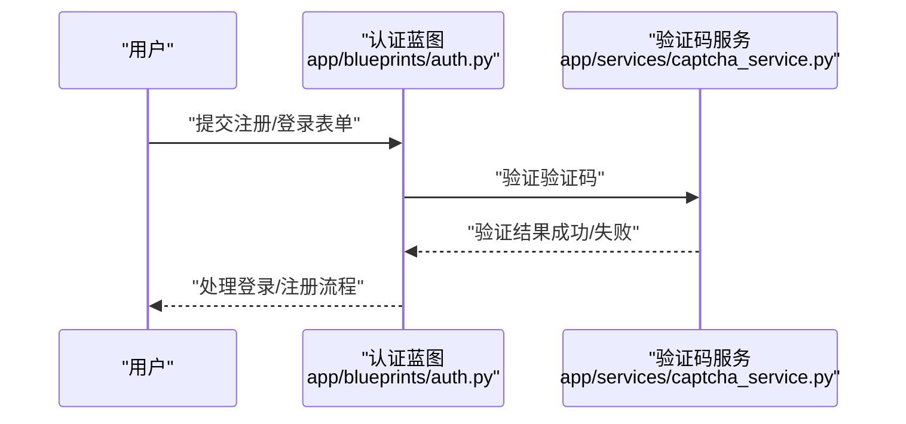
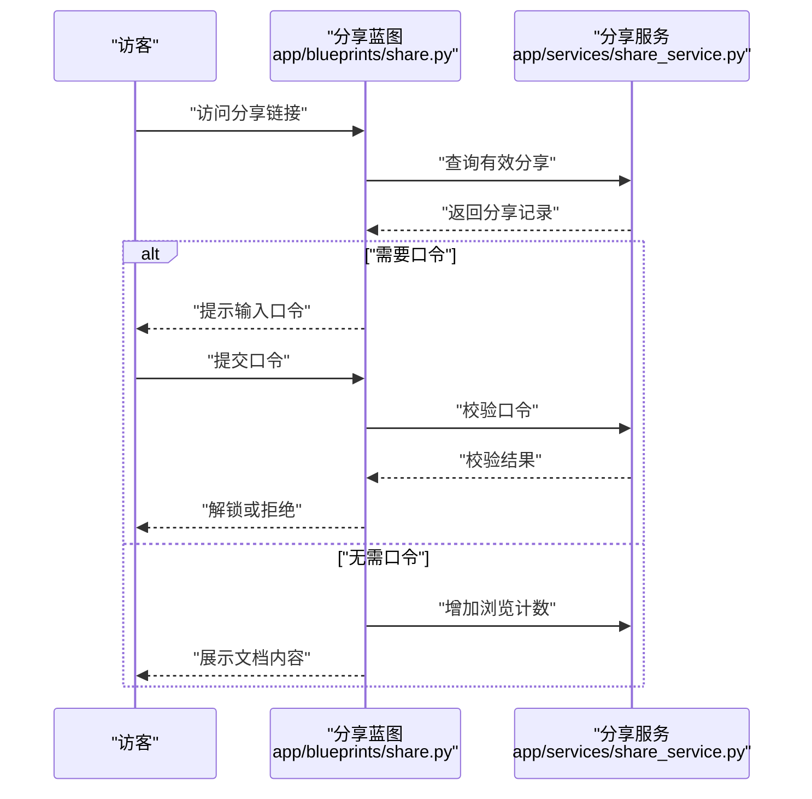
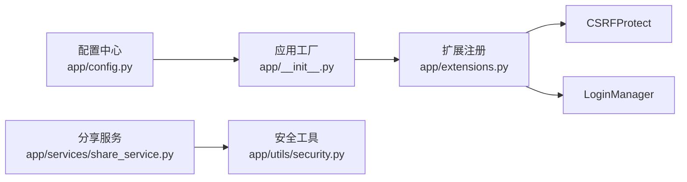

# 上传与安全配置

<cite>
**本文档引用的文件**
- [app/config.py](file://app/config.py)
- [app/__init__.py](file://app/__init__.py)
- [app/extensions.py](file://app/extensions.py)
- [app/blueprints/auth.py](file://app/blueprints/auth.py)
- [app/blueprints/doc.py](file://app/blueprints/doc.py)
- [app/blueprints/share.py](file://app/blueprints/share.py)
- [app/services/captcha_service.py](file://app/services/captcha_service.py)
- [app/services/share_service.py](file://app/services/share_service.py)
- [app/utils/security.py](file://app/utils/security.py)
- [run.py](file://run.py)
- [wsgi.py](file://wsgi.py)
</cite>

## 目录
1. [简介](#简介)
2. [项目结构](#项目结构)
3. [核心组件](#核心组件)
4. [架构总览](#架构总览)
5. [详细组件分析](#详细组件分析)
6. [依赖分析](#依赖分析)
7. [性能考虑](#性能考虑)
8. [故障排查指南](#故障排查指南)
9. [结论](#结论)
10. [附录](#附录)

## 简介
本文件聚焦于 My Wiki 的“上传与安全配置”，系统性说明以下内容：
- 上传目录与大小限制：UPLOAD_DIR 与 MAX_CONTENT_LENGTH 的配置方式与默认值
- Cookie 安全：SESSION_COOKIE_HTTPONLY、SESSION_COOKIE_SAMESITE、REMEMBER_COOKIE_DURATION 的作用与建议
- 文件上传安全最佳实践：类型校验、大小限制、存储安全
- 跨站脚本攻击（XSS）与 CSRF 防护现状与建议
- 分享与会话安全：分享口令、会话解锁机制与有效期控制

## 项目结构
围绕上传与安全配置的关键文件与职责如下：
- 应用工厂与初始化：创建应用实例、注册扩展、确保实例目录存在
- 配置中心：集中管理上传、Cookie、CSRF、验证码等安全相关参数
- 扩展注册：CSRFProtect、LoginManager、SQLAlchemy、Migrate
- 蓝图：认证、文档、分享等业务蓝图
- 服务层：验证码、分享、安全工具等
- 入口脚本：开发与生产入口

图表来源
- [app/__init__.py:11-28](file://app/__init__.py#L11-L28)
- [app/config.py:15-54](file://app/config.py#L15-L54)
- [app/extensions.py:8-16](file://app/extensions.py#L8-L16)
- [run.py:9](file://run.py#L9)
- [wsgi.py:9](file://wsgi.py#L9)

章节来源
- [app/__init__.py:11-28](file://app/__init__.py#L11-L28)
- [app/config.py:15-54](file://app/config.py#L15-L54)
- [app/extensions.py:8-16](file://app/extensions.py#L8-L16)
- [run.py:9](file://run.py#L9)
- [wsgi.py:9](file://wsgi.py#L9)

## 核心组件
- 上传与大小限制
  - 上传目录：通过环境变量 UPLOAD_DIR 指定，默认位于 instance/uploads
  - 最大内容长度：通过环境变量 MAX_CONTENT_LENGTH 指定，默认约 32MB
  - 实例目录确保：应用启动时自动创建上传目录与 AI 目录
- Cookie 安全
  - SESSION_COOKIE_HTTPONLY：启用后禁止 JavaScript 访问 Cookie，降低 XSS 盗取风险
  - SESSION_COOKIE_SAMESITE：默认 Lax，可有效缓解 CSRF 攻击
  - REMEMBER_COOKIE_DURATION：记住登录状态的持续时间（秒）
- CSRF 防护
  - 已注册 CSRFProtect，需配合表单令牌使用
- 验证码与会话
  - 验证码 TTL 与一次性验证机制，防止暴力破解
  - 分享口令解锁采用会话前缀标记，避免明文泄露

章节来源
- [app/config.py:28-35](file://app/config.py#L28-L35)
- [app/__init__.py:31-36](file://app/__init__.py#L31-L36)
- [app/extensions.py:14-16](file://app/extensions.py#L14-L16)
- [app/services/captcha_service.py:75-89](file://app/services/captcha_service.py#L75-L89)
- [app/blueprints/share.py:11-19](file://app/blueprints/share.py#L11-L19)

## 架构总览
下图展示上传与安全配置在应用中的位置与交互：

图表来源
- [app/config.py:15-54](file://app/config.py#L15-L54)
- [app/__init__.py:11-28](file://app/__init__.py#L11-L28)
- [app/extensions.py:8-16](file://app/extensions.py#L8-L16)
- [app/blueprints/auth.py:10-16](file://app/blueprints/auth.py#L10-L16)
- [app/blueprints/share.py:22-41](file://app/blueprints/share.py#L22-L41)
- [app/services/captcha_service.py:75-89](file://app/services/captcha_service.py#L75-L89)
- [app/utils/security.py:5-7](file://app/utils/security.py#L5-L7)
- [run.py:9](file://run.py#L9)
- [wsgi.py:9](file://wsgi.py#L9)

## 详细组件分析

### 上传目录与大小限制配置
- 上传目录（UPLOAD_DIR）
  - 默认值：项目根目录下的 instance/uploads
  - 设置方式：通过环境变量覆盖
  - 启动时行为：应用工厂在启动时确保该目录存在
- 最大内容长度（MAX_CONTENT_LENGTH）
  - 默认值：约 32MB
  - 设置方式：通过环境变量覆盖
  - 生效范围：全局请求体大小限制，超出将触发异常

图表来源
- [app/config.py:33-35](file://app/config.py#L33-L35)
- [app/__init__.py:31-36](file://app/__init__.py#L31-L36)

章节来源
- [app/config.py:33-35](file://app/config.py#L33-L35)
- [app/__init__.py:31-36](file://app/__init__.py#L31-L36)

### Cookie 安全配置
- SESSION_COOKIE_HTTPONLY
  - 作用：阻止客户端脚本读取 Cookie，降低 XSS 成功概率
  - 建议：保持开启，除非有特殊需求
- SESSION_COOKIE_SAMESITE
  - 作用：限制跨站携带 Cookie，缓解 CSRF 攻击
  - 建议：生产环境可考虑更严格策略（如 Strict），但需评估用户体验
- REMEMBER_COOKIE_DURATION
  - 作用：记住登录状态的持续时间（秒）
  - 建议：根据业务安全策略调整，较短周期更安全

章节来源
- [app/config.py:28-31](file://app/config.py#L28-L31)

### CSRF 防护
- 已注册 CSRFProtect，用于保护表单提交
- 使用建议：
  - 在模板中渲染 CSRF 令牌
  - 对所有修改型请求（POST/PUT/DELETE）启用校验
  - 测试环境可按需关闭（如测试配置中已禁用）

章节来源
- [app/extensions.py:10-11](file://app/extensions.py#L10-L11)
- [app/config.py:67](file://app/config.py#L67)

### 验证码与会话安全
- 验证码
  - TTL：由配置项控制，默认约 300 秒
  - 一次性验证：验证后立即失效，防止重放
- 分享口令解锁
  - 采用会话前缀标记，仅在当前会话内有效
  - 支持设置口令，进一步限制访问

图表来源
- [app/blueprints/auth.py:24-46](file://app/blueprints/auth.py#L24-L46)
- [app/services/captcha_service.py:75-89](file://app/services/captcha_service.py#L75-L89)

章节来源
- [app/services/captcha_service.py:75-89](file://app/services/captcha_service.py#L75-L89)
- [app/blueprints/auth.py:24-46](file://app/blueprints/auth.py#L24-L46)

### 分享与访问控制
- 分享口令
  - 生成：使用安全随机数生成 token
  - 有效期：可选设置小时级过期时间
  - 密码保护：可选设置访问口令
- 会话解锁
  - 采用会话键前缀进行解锁标记
  - 仅在当前会话有效，提升安全性

图表来源
- [app/blueprints/share.py:22-41](file://app/blueprints/share.py#L22-L41)
- [app/services/share_service.py:15-31](file://app/services/share_service.py#L15-L31)

章节来源
- [app/services/share_service.py:15-31](file://app/services/share_service.py#L15-L31)
- [app/blueprints/share.py:22-41](file://app/blueprints/share.py#L22-L41)

### 文件上传安全最佳实践
- 类型验证
  - 在服务端严格校验文件 MIME 或扩展名白名单
  - 对富媒体内容（如 HTML、JS）一律拒绝
- 大小限制
  - 结合 MAX_CONTENT_LENGTH 与业务自定义阈值
  - 对批量上传场景设置并发与速率限制
- 存储安全
  - 上传目录独立且权限最小化（仅应用进程可写）
  - 文件名混淆或重命名，避免路径穿越
  - 静态资源与动态内容分离，禁止执行权限
- 内容扫描
  - 集成病毒扫描与敏感内容检测
- 日志审计
  - 记录上传操作、失败原因与来源 IP

（本节为通用安全建议，不直接对应具体源码实现）

## 依赖分析
- 配置到应用工厂
  - 应用工厂从配置类加载参数，并确保实例目录存在
- 扩展到蓝图
  - CSRFProtect、LoginManager 注册后，蓝图可直接使用
- 服务层到工具
  - 分享服务依赖安全工具生成 token

图表来源
- [app/config.py:15-54](file://app/config.py#L15-L54)
- [app/__init__.py:11-28](file://app/__init__.py#L11-L28)
- [app/extensions.py:8-16](file://app/extensions.py#L8-L16)
- [app/services/share_service.py:8](file://app/services/share_service.py#L8)
- [app/utils/security.py:5-7](file://app/utils/security.py#L5-L7)

章节来源
- [app/config.py:15-54](file://app/config.py#L15-L54)
- [app/__init__.py:11-28](file://app/__init__.py#L11-L28)
- [app/extensions.py:8-16](file://app/extensions.py#L8-L16)
- [app/services/share_service.py:8](file://app/services/share_service.py#L8)
- [app/utils/security.py:5-7](file://app/utils/security.py#L5-L7)

## 性能考虑
- 上传性能
  - 合理设置 MAX_CONTENT_LENGTH，避免内存压力
  - 对大文件采用分块上传与断点续传（如后续扩展）
- Cookie 与会话
  - 减少会话数据体积，避免频繁序列化
  - 使用高效缓存存储会话（如 Redis），降低数据库压力
- CSRF 与验证码
  - 验证码缓存与过期策略应平衡安全与性能

（本节为通用指导，不直接对应具体源码实现）

## 故障排查指南
- 上传失败或超时
  - 检查 UPLOAD_DIR 权限与磁盘空间
  - 确认 MAX_CONTENT_LENGTH 是否过小
  - 查看服务器日志定位异常
- CSRF 校验失败
  - 确认表单中包含 CSRF 令牌
  - 检查 SameSite 与浏览器兼容性
- 登录状态异常
  - 检查 REMEMBER_COOKIE_DURATION 与浏览器 Cookie 设置
  - 确认 SESSION_COOKIE_SAMESITE 配置是否影响跨站访问
- 分享链接无效
  - 检查分享口令是否正确、是否过期或已被撤销
  - 确认文档隐私级别允许分享

章节来源
- [app/config.py:28-35](file://app/config.py#L28-L35)
- [app/extensions.py:14-16](file://app/extensions.py#L14-L16)
- [app/services/share_service.py:39-43](file://app/services/share_service.py#L39-L43)
- [app/blueprints/share.py:22-41](file://app/blueprints/share.py#L22-L41)

## 结论
- 上传与安全配置集中在配置中心与应用工厂中，具备明确的默认值与环境变量覆盖能力
- Cookie 安全与 CSRF 防护已具备基础能力，建议结合业务场景优化策略
- 分享与会话安全通过服务层与工具层协同实现，具备口令与有效期控制
- 文件上传安全建议遵循类型验证、大小限制与存储安全的最佳实践

（本节为总结性内容，不直接分析具体文件）

## 附录
- 环境变量与默认值
  - UPLOAD_DIR：默认 instance/uploads
  - MAX_CONTENT_LENGTH：默认约 32MB
  - SESSION_COOKIE_HTTPONLY：True
  - SESSION_COOKIE_SAMESITE：Lax
  - REMEMBER_COOKIE_DURATION：约 7 天（秒）
  - CAPTCHA_TTL_SECONDS：约 300 秒
- 入口脚本
  - 开发：run.py
  - 生产：wsgi.py

章节来源
- [app/config.py:28-50](file://app/config.py#L28-L50)
- [run.py:9](file://run.py#L9)
- [wsgi.py:9](file://wsgi.py#L9)