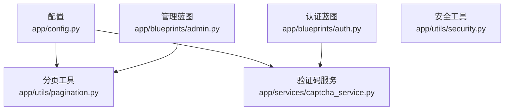
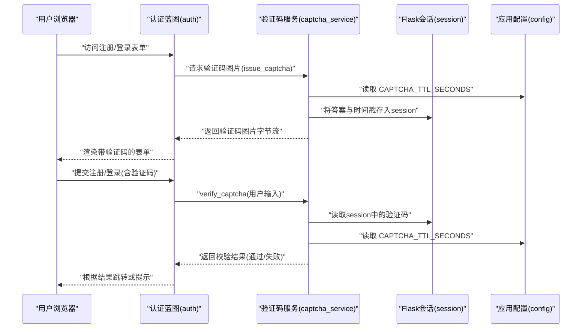
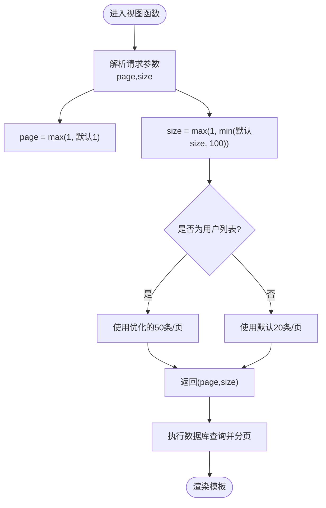
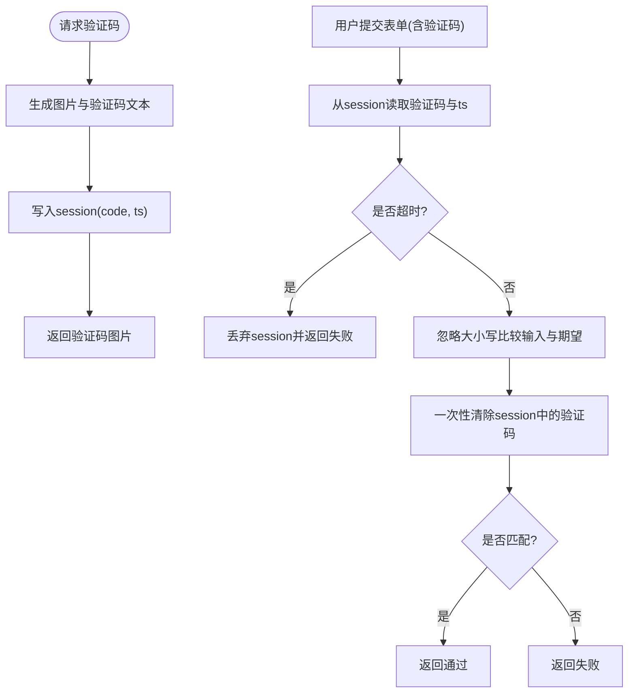
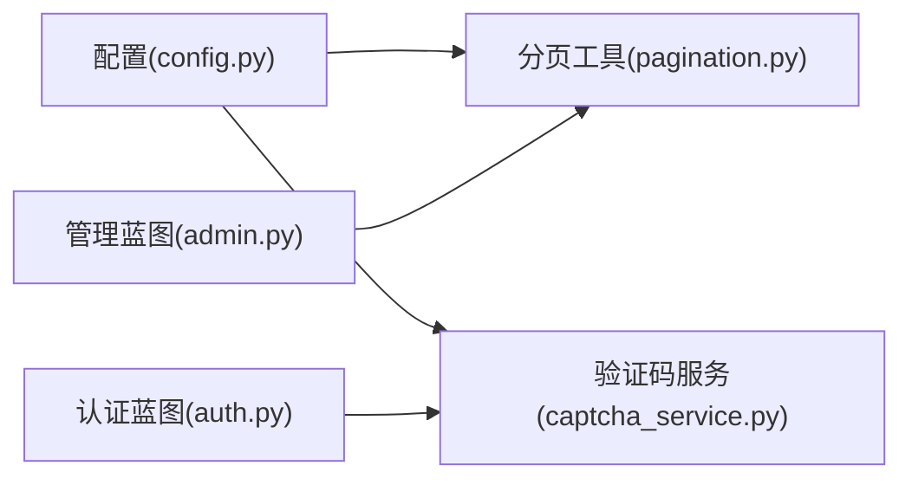

# 分页与验证码配置

<cite>
**本文引用的文件**
- [app/config.py](file://app/config.py)
- [app/utils/pagination.py](file://app/utils/pagination.py)
- [app/services/captcha_service.py](file://app/services/captcha_service.py)
- [app/blueprints/auth.py](file://app/blueprints/auth.py)
- [app/blueprints/admin.py](file://app/blueprints/admin.py)
- [app/utils/security.py](file://app/utils/security.py)
- [app/templates/admin/users.html](file://app/templates/admin/users.html)
</cite>

## 更新摘要
**变更内容**
- 更新了管理员用户列表的分页配置，采用优化的默认分页大小 50 条/页
- 补充了 DEFAULT_PAGE_SIZE 配置的详细说明
- 增强了分页性能优化的最佳实践建议

## 目录
1. [简介](#简介)
2. [项目结构](#项目结构)
3. [核心组件](#核心组件)
4. [架构总览](#架构总览)
5. [详细组件分析](#详细组件分析)
6. [依赖分析](#依赖分析)
7. [性能考虑](#性能考虑)
8. [故障排查指南](#故障排查指南)
9. [结论](#结论)
10. [附录](#附录)

## 简介
本文件聚焦于 My Wiki 的"分页"与"验证码"两大配置主题，围绕以下目标展开：
- 解释 DEFAULT_PAGE_SIZE 分页大小配置及其对用户体验与性能的影响，并给出不同场景下的分页大小建议。
- 详解 CAPTCHA_TTL_SECONDS 验证码有效期设置，涵盖验证码生成、存储与过期机制。
- 提供验证码安全配置建议与防刷机制设置思路。
- 给出分页与验证码在不同页面中的使用示例与最佳实践。

## 项目结构
与分页和验证码直接相关的模块分布如下：
- 配置层：集中于配置类，定义 DEFAULT_PAGE_SIZE 与 CAPTCHA_TTL_SECONDS。
- 工具层：分页工具函数，负责从请求参数解析 page 与 size。
- 服务层：验证码服务，负责生成图片、存储答案与校验过期。
- 蓝图层：认证蓝图提供验证码接口与表单校验；管理蓝图展示大量数据时使用分页。
- 安全工具：提供安全令牌生成能力，可用于分享链接等场景的安全加固。

**图表来源**
- [app/config.py:50-55](file://app/config.py#L50-L55)
- [app/utils/pagination.py:5-9](file://app/utils/pagination.py#L5-L9)
- [app/services/captcha_service.py:65-89](file://app/services/captcha_service.py#L65-L89)
- [app/blueprints/auth.py:10-16](file://app/blueprints/auth.py#L10-L16)
- [app/blueprints/admin.py:39-47](file://app/blueprints/admin.py#L39-L47)
- [app/utils/security.py:5-7](file://app/utils/security.py#L5-L7)

**章节来源**
- [app/config.py:50-55](file://app/config.py#L50-L55)
- [app/utils/pagination.py:5-9](file://app/utils/pagination.py#L5-L9)
- [app/services/captcha_service.py:65-89](file://app/services/captcha_service.py#L65-L89)
- [app/blueprints/auth.py:10-16](file://app/blueprints/auth.py#L10-L16)
- [app/blueprints/admin.py:39-47](file://app/blueprints/admin.py#L39-L47)
- [app/utils/security.py:5-7](file://app/utils/security.py#L5-L7)

## 核心组件
- DEFAULT_PAGE_SIZE：默认分页大小，用于控制列表类页面每页显示数量，默认值为 20。
- CAPTCHA_TTL_SECONDS：验证码有效期（秒），用于限制验证码可用时间窗口，默认 300 秒。
- get_page_args：从请求参数解析 page 与 size，并进行边界约束。
- issue_captcha / verify_captcha：生成验证码图片并将答案写入会话，校验用户输入并处理过期与一次性使用。

**章节来源**
- [app/config.py:54-55](file://app/config.py#L54-L55)
- [app/utils/pagination.py:5-9](file://app/utils/pagination.py#L5-L9)
- [app/services/captcha_service.py:65-89](file://app/services/captcha_service.py#L65-L89)

## 架构总览
分页与验证码在系统中的交互路径如下：

**图表来源**
- [app/blueprints/auth.py:10-16](file://app/blueprints/auth.py#L10-L16)
- [app/blueprints/auth.py:29-46](file://app/blueprints/auth.py#L29-L46)
- [app/services/captcha_service.py:65-89](file://app/services/captcha_service.py#L65-L89)
- [app/config.py:50-51](file://app/config.py#L50-L51)

## 详细组件分析

### 分页配置与实现
- 默认分页大小 DEFAULT_PAGE_SIZE：在配置中设定默认值为 20，作为 get_page_args 的默认参数。
- 参数解析 get_page_args：
  - page：默认从请求参数 page 获取，若为空或无效则默认为 1。
  - size：默认使用 DEFAULT_PAGE_SIZE，最大不超过 100。
  - 返回 page 与 size，确保最小为 1。
- 在管理蓝图中广泛使用：
  - 用户列表、公开知识库列表、公开文档列表等均调用 get_page_args 并结合 paginate 执行分页查询。
  - **管理员用户列表**特别优化：使用 `get_page_args(default_size=50)` 提升大数据集下的性能表现。

**图表来源**
- [app/utils/pagination.py:5-9](file://app/utils/pagination.py#L5-L9)
- [app/blueprints/admin.py:39-47](file://app/blueprints/admin.py#L39-L47)
- [app/blueprints/admin.py:172-179](file://app/blueprints/admin.py#L172-L179)
- [app/blueprints/admin.py:194-205](file://app/blueprints/admin.py#L194-L205)

**章节来源**
- [app/config.py:54-55](file://app/config.py#L54-L55)
- [app/utils/pagination.py:5-9](file://app/utils/pagination.py#L5-L9)
- [app/blueprints/admin.py:39-47](file://app/blueprints/admin.py#L39-L47)
- [app/blueprints/admin.py:172-179](file://app/blueprints/admin.py#L172-L179)
- [app/blueprints/admin.py:194-205](file://app/blueprints/admin.py#L194-L205)

### 验证码配置与实现
- 配置项 CAPTCHA_TTL_SECONDS：默认 300 秒（5 分钟），用于限制验证码的有效时间窗口。
- 生成与存储：
  - issue_captcha：生成图片字节流与验证码文本，将答案与当前时间戳写入 session。
  - 图片生成逻辑包含随机字符、字体加载、装饰点线与旋转字符等，最终输出 PNG 字节流。
- 校验与过期处理：
  - verify_captcha：从 session 读取验证码与时间戳，比较输入是否一致；若超时则丢弃并返回失败；无论成功与否均一次性清除 session 中的验证码信息。
- 认证蓝图集成：
  - 注册/登录路由在提交时调用 verify_captcha，失败则提示"验证码错误或已过期"。

**图表来源**
- [app/services/captcha_service.py:65-89](file://app/services/captcha_service.py#L65-L89)
- [app/blueprints/auth.py:29-46](file://app/blueprints/auth.py#L29-L46)
- [app/config.py:50-51](file://app/config.py#L50-L51)

**章节来源**
- [app/config.py:50-51](file://app/config.py#L50-L51)
- [app/services/captcha_service.py:32-62](file://app/services/captcha_service.py#L32-L62)
- [app/services/captcha_service.py:65-89](file://app/services/captcha_service.py#L65-L89)
- [app/blueprints/auth.py:10-16](file://app/blueprints/auth.py#L10-L16)
- [app/blueprints/auth.py:29-46](file://app/blueprints/auth.py#L29-L46)

### 安全令牌与分享链接
- 安全工具 generate_token：提供 URL 安全的随机令牌，适用于分享链接等需要防猜测的场景。
- 建议：在生成分享链接时结合该令牌，并与数据库中的 DocumentShare 记录关联，实现一次性或限时访问。

**章节来源**
- [app/utils/security.py:5-7](file://app/utils/security.py#L5-L7)

## 依赖分析
- 分页依赖关系：
  - 管理蓝图依赖分页工具解析参数，并与 SQLAlchemy 查询配合使用 paginate。
  - **管理员用户列表**特别优化：直接使用 50 条/页的分页大小。
- 验证码依赖关系：
  - 认证蓝图依赖验证码服务生成与校验；验证码服务依赖 Flask current_app 配置与 session。
- 配置依赖关系：
  - 分页工具默认使用配置中的 DEFAULT_PAGE_SIZE。
  - 验证码服务读取配置中的 CAPTCHA_TTL_SECONDS。

**图表来源**
- [app/config.py:54-55](file://app/config.py#L54-L55)
- [app/utils/pagination.py:5-9](file://app/utils/pagination.py#L5-L9)
- [app/services/captcha_service.py:81](file://app/services/captcha_service.py#L81)
- [app/blueprints/auth.py:31](file://app/blueprints/auth.py#L31)
- [app/blueprints/admin.py:40](file://app/blueprints/admin.py#L40)

**章节来源**
- [app/config.py:54-55](file://app/config.py#L54-L55)
- [app/utils/pagination.py:5-9](file://app/utils/pagination.py#L5-L9)
- [app/services/captcha_service.py:81](file://app/services/captcha_service.py#L81)
- [app/blueprints/auth.py:31](file://app/blueprints/auth.py#L31)
- [app/blueprints/admin.py:40](file://app/blueprints/admin.py#L40)

## 性能考虑
- 分页大小对性能的影响
  - 较小的分页大小（如 10–20）：提升首屏加载速度，降低单次查询与序列化开销；但增加翻页请求次数，可能带来更高的请求量与数据库连接压力。
  - **优化的中等分页大小（如 20–50）**：平衡加载速度与请求次数，适合大多数列表场景。
  - **大数据集优化（如 50–100）**：针对管理员用户列表等大数据场景，减少请求次数，但会增加单次响应体积与数据库扫描成本。
  - **管理员用户列表优化**：采用 50 条/页的分页大小，在大数据集下显著提升性能表现。
- 建议
  - 列表页：优先使用默认值 20，结合前端虚拟滚动优化长列表体验。
  - **管理员用户列表**：使用优化的 50 条/页分页大小，提升大数据集下的响应速度。
  - 搜索/筛选场景：适当增大分页大小（如 30–50），减少多次请求带来的抖动。
  - 移动端或弱网环境：建议使用较小分页大小（如 10–20）并启用懒加载。
- 验证码性能与安全
  - CAPTCHA_TTL_SECONDS 过短会频繁要求重新获取验证码，影响体验；过长则增加会话占用与潜在泄露风险。
  - 建议默认 300 秒，结合 IP/会话限速策略，避免暴力破解。

## 故障排查指南
- 验证码错误或已过期
  - 现象：注册/登录提交后提示"验证码错误或已过期"。
  - 排查要点：
    - 确认会话是否正确写入与读取。
    - 检查 CAPTCHA_TTL_SECONDS 是否被覆盖为过短值。
    - 确认前端提交的验证码大小写是否被忽略（服务端已统一转小写）。
    - 确认验证码接口返回的缓存头设置（no-store, no-cache）。
- 分页异常
  - 现象：分页参数非法导致默认值异常或越界。
  - 排查要点：
    - 确认请求参数 page 与 size 的类型转换与边界约束。
    - 确认 DEFAULT_PAGE_SIZE 与 max_size 的合理性。
    - **管理员用户列表**：确认是否使用了正确的 50 条/页分页大小。
    - 检查数据库排序字段与索引，避免大偏移量导致的慢查询。

**章节来源**
- [app/services/captcha_service.py:75-89](file://app/services/captcha_service.py#L75-L89)
- [app/blueprints/auth.py:31-34](file://app/blueprints/auth.py#L31-L34)
- [app/utils/pagination.py:5-9](file://app/utils/pagination.py#L5-L9)
- [app/blueprints/admin.py:39-47](file://app/blueprints/admin.py#L39-L47)

## 结论
- DEFAULT_PAGE_SIZE 与 CAPTCHA_TTL_SECONDS 是影响用户体验与系统性能的关键配置。
- **管理员用户列表采用了 50 条/页的优化分页策略**，在大数据集场景下显著提升了性能表现。
- 合理的分页大小应结合业务场景、网络环境与硬件资源进行权衡。
- 验证码的有效期应兼顾安全性与易用性，并配合会话与限速策略提升抗攻击能力。
- 在实际页面中，分页与验证码的使用应遵循统一的参数解析与错误处理流程，确保一致性与可维护性。

## 附录
- 使用示例与最佳实践
  - 分页在管理蓝图中的使用
    - 用户列表：解析 page/size，按主键倒序分页，支持关键词搜索。**特别优化：使用 50 条/页分页大小**。
      - 参考路径：[app/blueprints/admin.py:39-47](file://app/blueprints/admin.py#L39-L47)
    - 公开知识库列表：按更新时间倒序分页，支持名称模糊搜索。
      - 参考路径：[app/blueprints/admin.py:172-179](file://app/blueprints/admin.py#L172-L179)
    - 公开文档列表：跨表过滤与排序，按更新时间倒序分页，支持标题模糊搜索。
      - 参考路径：[app/blueprints/admin.py:194-205](file://app/blueprints/admin.py#L194-L205)
  - 验证码在认证蓝图中的使用
    - 验证码接口：生成图片并设置缓存头，禁止缓存。
      - 参考路径：[app/blueprints/auth.py:10-16](file://app/blueprints/auth.py#L10-L16)
    - 注册/登录：提交时调用 verify_captcha，失败提示"验证码错误或已过期"，成功后继续后续流程。
      - 参考路径：[app/blueprints/auth.py:29-46](file://app/blueprints/auth.py#L29-L46)
  - 安全令牌与分享链接
    - 使用 generate_token 生成 URL 安全的随机令牌，结合数据库记录实现一次性或限时访问。
      - 参考路径：[app/utils/security.py:5-7](file://app/utils/security.py#L5-L7)

**章节来源**
- [app/blueprints/admin.py:39-47](file://app/blueprints/admin.py#L39-L47)
- [app/blueprints/admin.py:172-179](file://app/blueprints/admin.py#L172-L179)
- [app/blueprints/admin.py:194-205](file://app/blueprints/admin.py#L194-L205)
- [app/blueprints/auth.py:10-16](file://app/blueprints/auth.py#L10-L16)
- [app/blueprints/auth.py:29-46](file://app/blueprints/auth.py#L29-L46)
- [app/utils/security.py:5-7](file://app/utils/security.py#L5-L7)