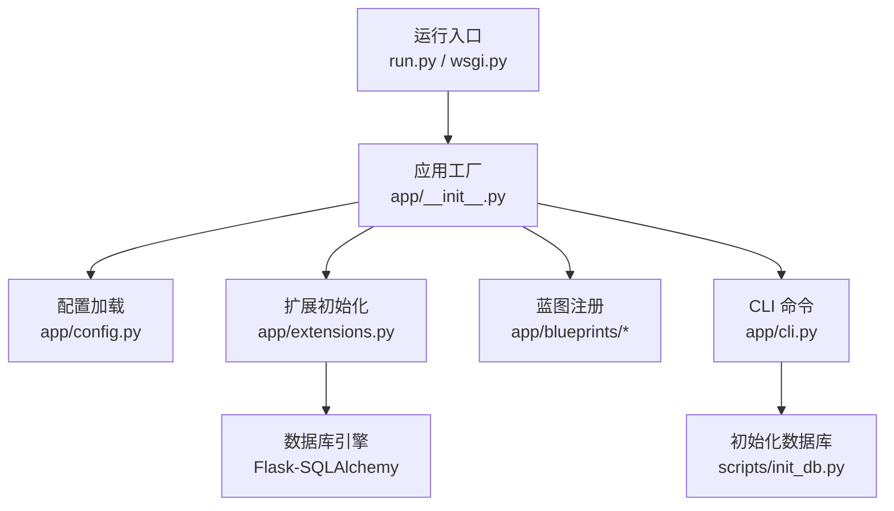
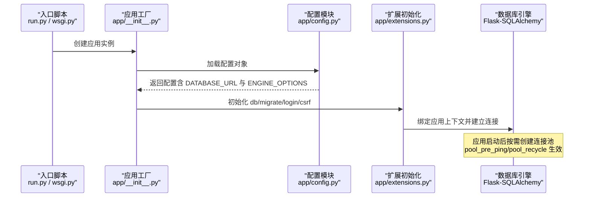
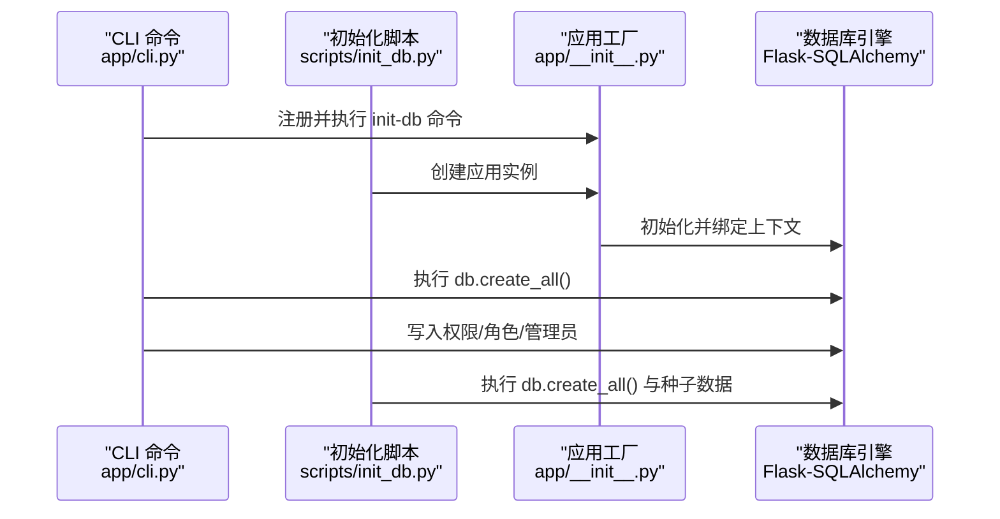
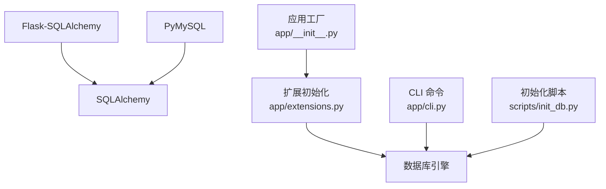

# 数据库配置

<cite>
**本文引用的文件**
- [app/config.py](file://app/config.py)
- [app/extensions.py](file://app/extensions.py)
- [app/__init__.py](file://app/__init__.py)
- [app/cli.py](file://app/cli.py)
- [scripts/init_db.py](file://scripts/init_db.py)
- [requirements.txt](file://requirements.txt)
- [run.py](file://run.py)
- [wsgi.py](file://wsgi.py)
</cite>

## 目录
1. [简介](#简介)
2. [项目结构](#项目结构)
3. [核心组件](#核心组件)
4. [架构总览](#架构总览)
5. [详细组件分析](#详细组件分析)
6. [依赖分析](#依赖分析)
7. [性能考虑与连接池调优](#性能考虑与连接池调优)
8. [故障排查指南](#故障排查指南)
9. [结论](#结论)
10. [附录](#附录)

## 简介
本文件聚焦于 My Wiki 的数据库配置，围绕以下主题展开：
- SQLALCHEMY_DATABASE_URI 的配置格式与支持的数据库类型
- MySQL 连接配置参数（主机、端口、用户名、密码、数据库名、字符集）
- SQLALCHEMY_ENGINE_OPTIONS 中连接池参数（pool_pre_ping、pool_recycle）的作用与调优
- 数据库连接字符串的多种格式与示例
- MySQL 与 SQLite 的配置差异
- 性能优化建议与连接池调优参数

## 项目结构
My Wiki 使用 Flask + Flask-SQLAlchemy 构建，数据库配置集中在配置模块中，并通过应用工厂在启动时加载。初始化脚本与 CLI 命令用于创建表结构与种子数据。

图表来源
- [run.py:1-17](file://run.py#L1-L17)
- [wsgi.py:1-10](file://wsgi.py#L1-L10)
- [app/__init__.py:11-28](file://app/__init__.py#L11-L28)
- [app/config.py:15-26](file://app/config.py#L15-L26)
- [app/extensions.py:8-11](file://app/extensions.py#L8-L11)
- [app/cli.py:61-95](file://app/cli.py#L61-L95)
- [scripts/init_db.py:23-47](file://scripts/init_db.py#L23-L47)

章节来源
- [run.py:1-17](file://run.py#L1-L17)
- [wsgi.py:1-10](file://wsgi.py#L1-L10)
- [app/__init__.py:11-28](file://app/__init__.py#L11-L28)
- [app/config.py:15-26](file://app/config.py#L15-L26)
- [app/extensions.py:8-11](file://app/extensions.py#L8-L11)
- [app/cli.py:61-95](file://app/cli.py#L61-L95)
- [scripts/init_db.py:23-47](file://scripts/init_db.py#L23-L47)

## 核心组件
- 配置基类与环境变量覆盖
  - 默认数据库连接字符串与连接池选项均来自配置基类，可通过环境变量覆盖。
  - 测试环境默认使用内存型 SQLite，便于快速测试。
- 扩展初始化
  - SQLAlchemy 实例在应用初始化阶段绑定到应用上下文。
- 初始化流程
  - CLI 命令与独立脚本均可触发表创建与种子数据写入。

章节来源
- [app/config.py:15-26](file://app/config.py#L15-L26)
- [app/config.py:64-70](file://app/config.py#L64-L70)
- [app/extensions.py:8-11](file://app/extensions.py#L8-L11)
- [app/__init__.py:39-43](file://app/__init__.py#L39-L43)
- [app/cli.py:67-69](file://app/cli.py#L67-L69)
- [scripts/init_db.py:25-27](file://scripts/init_db.py#L25-L27)

## 架构总览
下图展示了从应用启动到数据库连接的关键路径，以及连接池参数在生命周期中的作用位置。

图表来源
- [run.py:8-9](file://run.py#L8-L9)
- [wsgi.py:8-9](file://wsgi.py#L8-L9)
- [app/__init__.py:18-19](file://app/__init__.py#L18-L19)
- [app/config.py:18-26](file://app/config.py#L18-L26)
- [app/extensions.py:40-43](file://app/extensions.py#L40-L43)

## 详细组件分析

### SQLALCHEMY_DATABASE_URI 配置与支持的数据库类型
- 默认值与来源
  - 默认连接字符串定义在配置基类中，若未设置环境变量则使用默认值。
  - 测试配置覆盖了默认连接字符串为内存型 SQLite。
- 支持的数据库类型
  - 代码中使用了 MySQL 方言与 PyMySQL 驱动，表明 MySQL 是主要支持的数据库类型之一。
  - 测试配置明确使用了 SQLite 内存数据库，表明 SQLite 同样受支持。
- 环境变量覆盖
  - 开发与生产配置通过环境变量进行覆盖，便于在不同环境中切换数据库。

章节来源
- [app/config.py:18-21](file://app/config.py#L18-L21)
- [app/config.py:68-70](file://app/config.py#L68-L70)
- [requirements.txt:7](file://requirements.txt#L7)

### MySQL 连接配置参数详解
- 参数构成
  - 方言与驱动：MySQL 方言 + PyMySQL 驱动
  - 用户名与密码：通过连接字符串中的认证信息指定
  - 主机与端口：通过连接字符串中的主机与端口字段指定
  - 数据库名：连接字符串路径部分指定
  - 字符集：查询参数中指定字符集
- 示例与变体
  - 默认连接字符串包含上述所有要素；实际部署中可根据需要调整各参数。
  - 可通过环境变量覆盖连接字符串，从而在不修改代码的情况下切换数据库。

章节来源
- [app/config.py:18-21](file://app/config.py#L18-L21)
- [app/config.py:18-21](file://app/config.py#L18-L21)

### SQLite 配置与差异
- 测试专用
  - 测试配置使用内存型 SQLite，适合单元测试与快速验证。
- 行为差异
  - SQLite 无需网络连接，适合开发与测试场景。
  - 在生产中通常使用 MySQL 或其他关系型数据库。

章节来源
- [app/config.py:68-70](file://app/config.py#L68-L70)

### SQLALCHEMY_ENGINE_OPTIONS 连接池参数
- pool_pre_ping
  - 作用：在每次获取连接前执行“预检查”，确保连接可用，自动处理断线与服务器重启导致的连接失效。
  - 在配置中启用，有助于提升连接稳定性。
- pool_recycle
  - 作用：设定连接最大存活时间，到期后会回收并重建新连接，避免长时间连接导致的资源泄漏或异常。
  - 在配置中设置了回收时间，建议结合业务并发与数据库超时策略进行调优。
- 其他常见参数（概述）
  - pool_size、max_overflow、pool_timeout、echo 等，可在应用配置中进一步扩展，以满足不同负载需求。

章节来源
- [app/config.py:23-26](file://app/config.py#L23-L26)

### 数据库连接字符串格式与示例
- 通用格式
  - 方言+驱动://用户名:密码@主机:端口/数据库?参数键值对
- MySQL 示例（基于默认配置）
  - 包含用户名、密码、主机、端口、数据库名与字符集参数
- SQLite 示例（测试配置）
  - 使用内存型 SQLite，适合测试与开发
- 覆盖方式
  - 通过环境变量覆盖默认连接字符串，实现多环境灵活切换

章节来源
- [app/config.py:18-21](file://app/config.py#L18-L21)
- [app/config.py:68-70](file://app/config.py#L68-L70)

### 初始化流程与数据库使用
- CLI 初始化
  - 通过命令创建表结构、填充权限与角色、确保超级管理员存在
- 独立脚本初始化
  - 提供不依赖 CLI 的初始化方式，同样创建表并写入种子数据
- 模型层使用
  - 所有模型均通过统一的 SQLAlchemy 实例进行声明与操作

图表来源
- [app/cli.py:67-69](file://app/cli.py#L67-L69)
- [scripts/init_db.py:25-27](file://scripts/init_db.py#L25-L27)
- [app/__init__.py:39-43](file://app/__init__.py#L39-L43)

章节来源
- [app/cli.py:61-95](file://app/cli.py#L61-L95)
- [scripts/init_db.py:23-47](file://scripts/init_db.py#L23-L47)
- [app/__init__.py:39-43](file://app/__init__.py#L39-L43)

## 依赖分析
- 外部依赖
  - Flask-SQLAlchemy 与 SQLAlchemy 提供 ORM 与连接池能力
  - PyMySQL 作为 MySQL 驱动
- 内部依赖
  - 应用工厂负责加载配置并初始化扩展
  - CLI 与脚本依赖扩展以执行数据库初始化

图表来源
- [requirements.txt:2](file://requirements.txt#L2)
- [requirements.txt:9](file://requirements.txt#L9)
- [requirements.txt:7](file://requirements.txt#L7)
- [app/__init__.py:39-43](file://app/__init__.py#L39-L43)
- [app/extensions.py:8-11](file://app/extensions.py#L8-L11)
- [app/cli.py:67-69](file://app/cli.py#L67-L69)
- [scripts/init_db.py:25-27](file://scripts/init_db.py#L25-L27)

章节来源
- [requirements.txt:1-22](file://requirements.txt#L1-L22)
- [app/__init__.py:39-43](file://app/__init__.py#L39-L43)
- [app/extensions.py:8-11](file://app/extensions.py#L8-L11)
- [app/cli.py:67-69](file://app/cli.py#L67-L69)
- [scripts/init_db.py:25-27](file://scripts/init_db.py#L25-L27)

## 性能考虑与连接池调优
- 连接池参数建议
  - pool_pre_ping：建议开启，提高连接可用性与稳定性
  - pool_recycle：根据数据库超时与业务峰值调整，避免过短导致频繁重建、过长导致资源泄漏
  - pool_size 与 max_overflow：根据并发与数据库承载能力设定，避免连接不足或过度占用
  - echo：仅在调试阶段开启，生产环境关闭以减少日志开销
- 运行环境差异
  - 开发环境可使用较宽松的连接池参数
  - 生产环境应结合监控指标与压测结果进行精细化调优
- 其他优化方向
  - 合理设计索引与查询，避免慢查询拖垮连接池
  - 使用事务批处理减少连接占用时间
  - 对只读查询与写入操作分离，降低锁竞争

[本节为通用性能建议，不直接分析具体文件，故无章节来源]

## 故障排查指南
- 连接失败
  - 检查连接字符串是否正确（方言、主机、端口、数据库、字符集）
  - 确认环境变量覆盖是否生效
- 连接不稳定
  - 检查 pool_pre_ping 是否启用
  - 观察 pool_recycle 设置是否合理
- 初始化失败
  - 确认应用上下文已正确初始化
  - 检查 CLI 命令或脚本执行是否成功
- 测试异常
  - 确认测试配置使用的是内存型 SQLite
  - 检查测试环境变量是否正确

章节来源
- [app/config.py:18-21](file://app/config.py#L18-L21)
- [app/config.py:23-26](file://app/config.py#L23-L26)
- [app/config.py:68-70](file://app/config.py#L68-L70)
- [app/__init__.py:39-43](file://app/__init__.py#L39-L43)
- [app/cli.py:67-69](file://app/cli.py#L67-L69)
- [scripts/init_db.py:25-27](file://scripts/init_db.py#L25-L27)

## 结论
- My Wiki 的数据库配置以 Flask-SQLAlchemy 为核心，通过配置基类集中管理连接字符串与连接池参数
- 默认使用 MySQL（PyMySQL 驱动），测试环境使用 SQLite 内存数据库
- 推荐开启 pool_pre_ping 并根据生产环境特征调整 pool_recycle 与其他连接池参数
- 通过环境变量覆盖连接字符串，可实现多环境无缝切换

[本节为总结性内容，不直接分析具体文件，故无章节来源]

## 附录
- 关键配置项速览
  - SQLALCHEMY_DATABASE_URI：数据库连接字符串
  - SQLALCHEMY_ENGINE_OPTIONS：连接池参数集合
- 常用环境变量
  - DATABASE_URL：覆盖默认连接字符串
  - TEST_DATABASE_URL：覆盖测试环境连接字符串
  - FLASK_CONFIG：选择配置环境（development/production/testing）

章节来源
- [app/config.py:18-21](file://app/config.py#L18-L21)
- [app/config.py:68-70](file://app/config.py#L68-L70)
- [app/config.py:80-82](file://app/config.py#L80-L82)