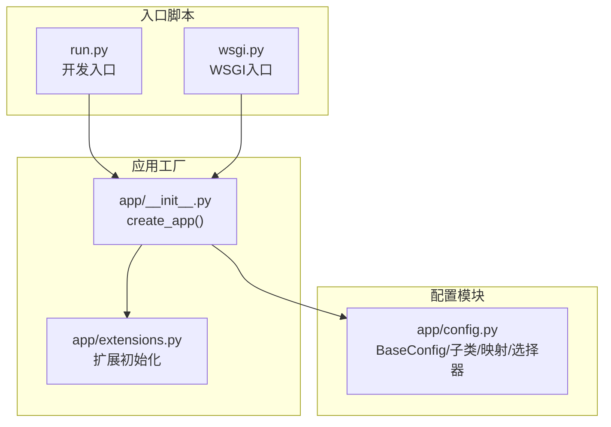
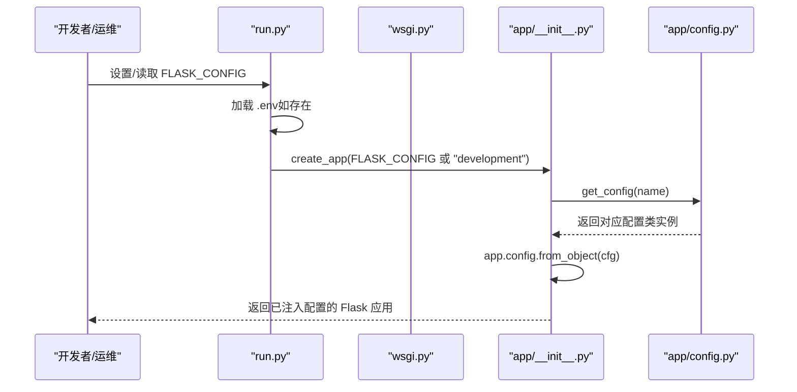
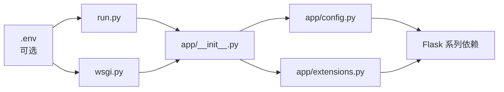

# 环境配置

<cite>
**本文引用的文件**
- [app/config.py](file://app/config.py)
- [run.py](file://run.py)
- [wsgi.py](file://wsgi.py)
- [app/__init__.py](file://app/__init__.py)
- [app/extensions.py](file://app/extensions.py)
- [requirements.txt](file://requirements.txt)
</cite>

## 目录
1. [简介](#简介)
2. [项目结构](#项目结构)
3. [核心组件](#核心组件)
4. [架构总览](#架构总览)
5. [详细组件分析](#详细组件分析)
6. [依赖分析](#依赖分析)
7. [性能考虑](#性能考虑)
8. [故障排查指南](#故障排查指南)
9. [结论](#结论)
10. [附录](#附录)

## 简介
本文件面向 My Wiki 的环境配置，系统性说明开发（development）、测试（testing）与生产（production）三类环境的配置差异与最佳实践。重点覆盖：
- BaseConfig 基类中的通用配置项与默认值来源
- DevelopmentConfig、ProductionConfig、TestingConfig 的具体设置与用途
- FLASK_CONFIG 环境变量的作用与配置选择逻辑
- 配置验证方法与常见错误排查

## 项目结构
My Wiki 的配置体系围绕一个集中式配置模块展开，并通过应用工厂在启动时按需加载对应配置对象。入口脚本通过环境变量控制运行模式，应用工厂再将配置注入到 Flask 应用实例中。

图表来源
- [run.py:1-17](file://run.py#L1-L17)
- [wsgi.py:1-10](file://wsgi.py#L1-L10)
- [app/__init__.py:11-28](file://app/__init__.py#L11-L28)
- [app/config.py:15-83](file://app/config.py#L15-L83)
- [app/extensions.py:1-17](file://app/extensions.py#L1-L17)

章节来源
- [app/config.py:15-83](file://app/config.py#L15-L83)
- [run.py:1-17](file://run.py#L1-L17)
- [wsgi.py:1-10](file://wsgi.py#L1-L10)
- [app/__init__.py:11-28](file://app/__init__.py#L11-L28)
- [app/extensions.py:1-17](file://app/extensions.py#L1-L17)

## 核心组件
- BaseConfig：定义所有环境共享的基础配置项，包括数据库连接、会话与 Cookie、上传目录与大小限制、AI 服务相关参数、可选 RAG 功能、验证码 TTL、分页等。
- DevelopmentConfig：启用调试模式，便于本地开发与快速迭代。
- ProductionConfig：关闭调试模式，强调安全与稳定性。
- TestingConfig：启用测试模式、调试模式、禁用 CSRF 校验，并使用内存型数据库用于单元测试隔离。
- CONFIG_MAP：将字符串键映射到具体配置类，支持 development、production、testing。
- get_config：根据传入名称或环境变量选择配置对象，默认 fallback 到 development。

章节来源
- [app/config.py:15-83](file://app/config.py#L15-L83)

## 架构总览
下图展示从入口脚本到应用工厂再到配置模块的整体流程，以及配置选择逻辑。

图表来源
- [run.py:1-17](file://run.py#L1-L17)
- [wsgi.py:1-10](file://wsgi.py#L1-L10)
- [app/__init__.py:11-28](file://app/__init__.py#L11-L28)
- [app/config.py:80-83](file://app/config.py#L80-L83)

## 详细组件分析

### BaseConfig 基类
- 作用：提供所有环境的通用默认值，确保应用在任何环境下都能正常启动。
- 关键点：
  - SECRET_KEY：从环境变量读取，未设置时提供开发用默认值。
  - 数据库连接：优先使用 DATABASE_URL；未设置时提供本地 MySQL 默认连接串。
  - SQLALCHEMY 引擎选项：启用连接池预检查与回收策略，提升连接稳定性。
  - 会话与 Cookie：启用 HttpOnly、设置 SameSite=Lax、记住登录时长。
  - 上传：默认上传目录位于 instance 目录下，最大内容长度默认 32MB。
  - AI 服务：默认 OpenAI 基础地址、模型名、AI 知识库目录等。
  - 可选 RAG：通过布尔转换函数读取 ENABLE_RAG，决定是否启用向量化检索；嵌入模型与 Chroma 向量库路径默认位于 instance 下。
  - 验证码：TTL 默认 300 秒。
  - 分页：默认每页条目数 20。

章节来源
- [app/config.py:15-54](file://app/config.py#L15-L54)

### DevelopmentConfig
- 作用：本地开发环境，开启调试模式，便于快速迭代与问题定位。
- 特征：仅设置 DEBUG=True。

章节来源
- [app/config.py:56-58](file://app/config.py#L56-L58)

### ProductionConfig
- 作用：生产环境，强调安全性与稳定性，关闭调试模式。
- 特征：DEBUG=False。

章节来源
- [app/config.py:60-62](file://app/config.py#L60-L62)

### TestingConfig
- 作用：测试环境，用于单元测试与集成测试，隔离数据库与 CSRF 校验。
- 特征：
  - TESTING=True
  - DEBUG=True
  - WTF_CSRF_ENABLED=False
  - 使用内存型数据库作为测试数据库

章节来源
- [app/config.py:64-71](file://app/config.py#L64-L71)

### FLASK_CONFIG 与配置选择逻辑
- 作用：控制应用加载哪一类配置。入口脚本在启动时读取该环境变量，若未设置则：
  - 开发入口默认使用 development
  - WSGI 入口默认使用 production
- 选择器 get_config：
  - 优先使用传入名称
  - 其次读取环境变量 FLASK_CONFIG
  - 最后回退到 development
  - 若名称不在映射表中，则回退到 DevelopmentConfig

章节来源
- [app/config.py:73-83](file://app/config.py#L73-L83)
- [run.py:9](file://run.py#L9)
- [wsgi.py:9](file://wsgi.py#L9)

### 应用工厂与配置注入
- 应用工厂 create_app 接收可选的配置名称，调用 get_config 获取配置类，然后通过 app.config.from_object(cfg) 将配置注入到 Flask 实例。
- 同时完成实例目录创建、扩展初始化、蓝图注册、错误处理、上下文处理器与 CLI 注册。

章节来源
- [app/__init__.py:11-28](file://app/__init__.py#L11-L28)

## 依赖分析
- 配置模块依赖：
  - os：读取环境变量
  - pathlib.Path：构建 instance 目录路径
  - python-dotenv：在入口脚本中加载 .env 文件（如存在）
- 运行时依赖：
  - Flask、Flask-SQLAlchemy、Flask-Migrate、Flask-Login、Flask-WTF 等
  - 可选 RAG 依赖（当 ENABLE_RAG=true 时）

图表来源
- [run.py:1-17](file://run.py#L1-L17)
- [wsgi.py:1-10](file://wsgi.py#L1-L10)
- [app/__init__.py:11-28](file://app/__init__.py#L11-L28)
- [app/config.py:15-83](file://app/config.py#L15-L83)
- [app/extensions.py:1-17](file://app/extensions.py#L1-L17)
- [requirements.txt:1-22](file://requirements.txt#L1-L22)

章节来源
- [requirements.txt:1-22](file://requirements.txt#L1-L22)

## 性能考虑
- 数据库连接池：通过引擎选项启用连接预检查与回收，有助于减少无效连接与超时问题。
- 上传大小限制：默认 32MB，可根据实际业务调整，避免过大请求导致内存压力。
- 调试模式：开发环境开启，生产环境关闭，避免调试信息泄露与额外开销。
- RAG 功能：仅在启用时加载相关依赖，避免不必要的资源消耗。

## 故障排查指南
- 环境变量未生效
  - 检查是否正确设置了 FLASK_CONFIG，入口脚本会据此选择配置类
  - 确认 .env 文件存在且被入口脚本加载
- 数据库连接失败
  - 检查 DATABASE_URL 是否正确，或确认默认连接串是否可达
  - 如使用内存数据库，请确认测试配置已启用
- 上传目录权限问题
  - 确认 UPLOAD_DIR/AI_WIKI_DIR 对应目录存在且具备写权限
- CSRF 校验失败（测试环境）
  - 测试配置已禁用 CSRF，若仍失败，检查测试客户端是否正确模拟请求
- 调试模式与日志级别
  - 生产环境应关闭 DEBUG，避免敏感信息泄露
- RAG 功能异常
  - 当 ENABLE_RAG=true 时，确认相关可选依赖已安装

章节来源
- [app/config.py:15-83](file://app/config.py#L15-L83)
- [run.py:1-17](file://run.py#L1-L17)
- [wsgi.py:1-10](file://wsgi.py#L1-L10)
- [app/__init__.py:31-36](file://app/__init__.py#L31-L36)

## 结论
My Wiki 的配置系统采用“基类 + 子类 + 映射 + 选择器”的清晰架构，结合入口脚本的环境变量驱动，实现了开发、测试与生产的无缝切换。通过合理设置 FLASK_CONFIG 与环境变量，可在不同环境中获得一致且安全的运行体验。建议在生产环境严格管理 SECRET_KEY、数据库凭据与上传目录权限，并在开发环境启用调试模式以便快速迭代。

## 附录

### 不同环境下的配置示例与最佳实践
- 开发环境（development）
  - 设置 FLASK_CONFIG=development
  - 在 .env 中提供 SECRET_KEY、DATABASE_URL、上传目录、AI 服务相关参数
  - 可开启 ENABLE_RAG 并准备向量库路径
- 测试环境（testing）
  - 设置 FLASK_CONFIG=testing
  - 使用内存数据库，禁用 CSRF 校验，便于自动化测试
- 生产环境（production）
  - 设置 FLASK_CONFIG=production
  - 使用强随机 SECRET_KEY，配置生产数据库连接，关闭 DEBUG
  - 确保上传目录与向量库目录具备最小权限原则

### 配置验证方法
- 启动应用后，检查 app.config 中的关键键值是否符合预期（如 DEBUG、SQLALCHEMY_DATABASE_URI、UPLOAD_DIR 等）
- 在开发环境执行一次数据库迁移，确认连接与权限正确
- 在测试环境运行最小化测试集，验证 CSRF 与数据库行为