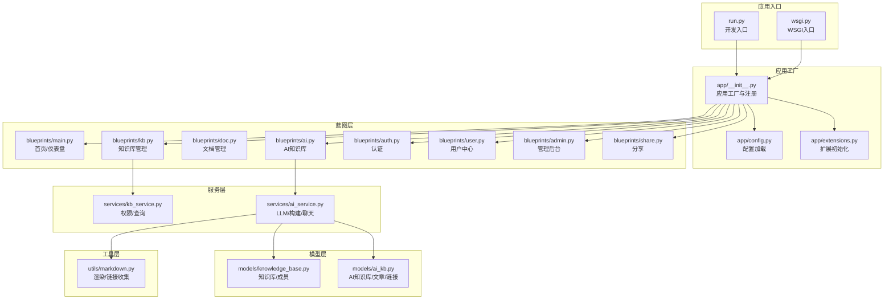
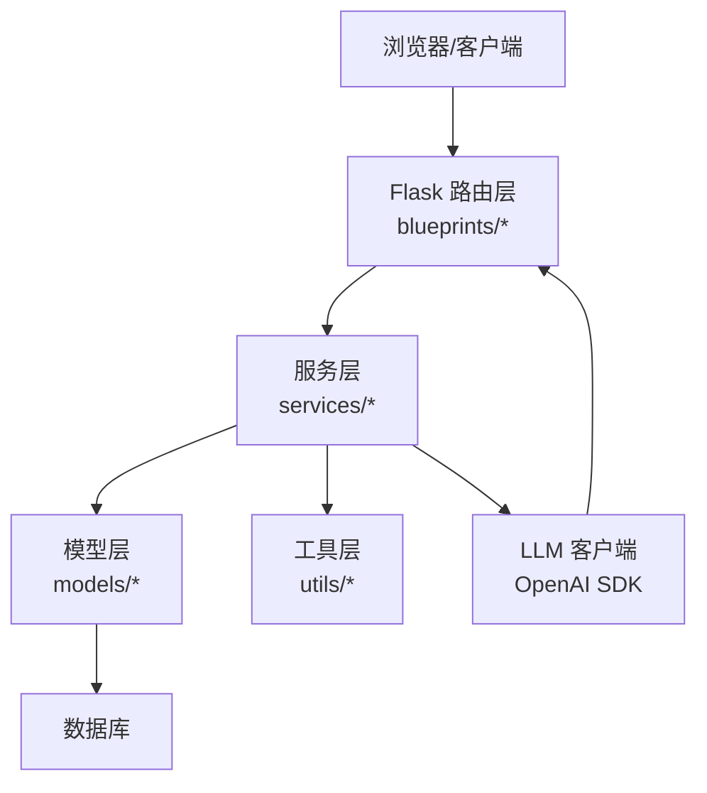
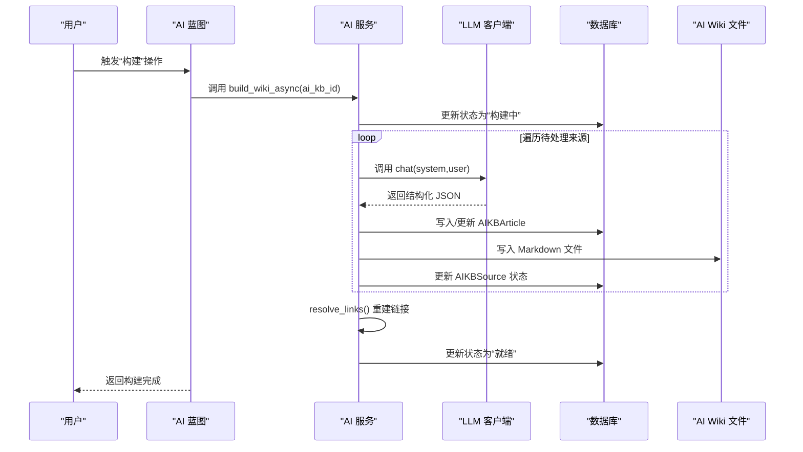
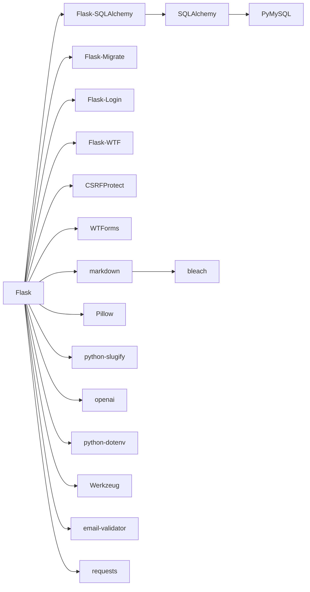

# 项目概述

<cite>
**本文引用的文件**
- [README.md](file://README.md)
- [requirements.txt](file://requirements.txt)
- [run.py](file://run.py)
- [wsgi.py](file://wsgi.py)
- [app/__init__.py](file://app/__init__.py)
- [app/config.py](file://app/config.py)
- [app/extensions.py](file://app/extensions.py)
- [app/blueprints/main.py](file://app/blueprints/main.py)
- [app/blueprints/kb.py](file://app/blueprints/kb.py)
- [app/blueprints/ai.py](file://app/blueprints/ai.py)
- [app/models/knowledge_base.py](file://app/models/knowledge_base.py)
- [app/models/ai_kb.py](file://app/models/ai_kb.py)
- [app/services/kb_service.py](file://app/services/kb_service.py)
- [app/services/ai_service.py](file://app/services/ai_service.py)
- [app/utils/markdown.py](file://app/utils/markdown.py)
</cite>

## 目录
1. [简介](#简介)
2. [项目结构](#项目结构)
3. [核心组件](#核心组件)
4. [架构总览](#架构总览)
5. [详细组件分析](#详细组件分析)
6. [依赖分析](#依赖分析)
7. [性能考虑](#性能考虑)
8. [故障排查指南](#故障排查指南)
9. [结论](#结论)
10. [附录](#附录)

## 简介
My Wiki 是一个基于 Flask 的全栈个人知识库管理系统，旨在为用户提供两类知识库能力：
- 传统文档知识库：以“知识库-文档树”的方式组织文档，支持权限控制、成员协作与公开共享。
- AI 智能知识库：遵循 Karpathy LLM Wiki 方法论，将源文档转化为结构化 Markdown 条目，构建双向链接的 Wiki 图谱，并支持可选的 RAG 增强问答。

项目的核心价值主张在于：
- 低门槛：无需复杂配置即可运行，支持本地部署与私有化使用。
- 双模融合：既能满足传统知识沉淀，也能通过 LLM 将文档升级为可检索、可链接的智能 Wiki。
- 开放生态：通过可插拔的 LLM 客户端，兼容多种 OpenAI 兼容服务。
- 可扩展性：模块化蓝图与服务层设计，便于二次开发与功能扩展。

## 项目结构
项目采用典型的 Flask 分层架构：
- 应用工厂与配置：通过应用工厂创建 Flask 实例，集中注册扩展、蓝图与 CLI。
- 蓝图层：按功能拆分为认证、用户、管理、知识库、文档、分享、AI 等蓝图，路由清晰、职责单一。
- 模型层：使用 SQLAlchemy 定义知识库、文档、AI 知识库及关联实体。
- 服务层：封装业务逻辑，如权限判断、AI 构建流程、Markdown 渲染与链接解析。
- 工具层：提供 Markdown 渲染、安全过滤、分页、装饰器等通用能力。
- 运行入口：开发环境通过 run.py 启动，生产环境通过 wsgi.py 提供给 WSGI 服务器。

图表来源
- [app/__init__.py:11-28](file://app/__init__.py#L11-L28)
- [app/config.py:80-83](file://app/config.py#L80-L83)
- [app/extensions.py:8-17](file://app/extensions.py#L8-L17)
- [app/blueprints/main.py:10-16](file://app/blueprints/main.py#L10-L16)
- [app/blueprints/kb.py:21-29](file://app/blueprints/kb.py#L21-L29)
- [app/blueprints/ai.py:27-32](file://app/blueprints/ai.py#L27-L32)
- [app/models/knowledge_base.py:19-43](file://app/models/knowledge_base.py#L19-L43)
- [app/models/ai_kb.py:22-44](file://app/models/ai_kb.py#L22-L44)
- [app/services/kb_service.py:10-24](file://app/services/kb_service.py#L10-L24)
- [app/services/ai_service.py:47-86](file://app/services/ai_service.py#L47-L86)
- [app/utils/markdown.py:31-66](file://app/utils/markdown.py#L31-L66)

章节来源
- [app/__init__.py:11-28](file://app/__init__.py#L11-L28)
- [app/config.py:80-83](file://app/config.py#L80-L83)
- [app/extensions.py:8-17](file://app/extensions.py#L8-L17)
- [run.py:1-17](file://run.py#L1-L17)
- [wsgi.py:1-10](file://wsgi.py#L1-L10)

## 核心组件
- 应用工厂与生命周期
  - 应用工厂负责创建 Flask 实例、加载配置、确保实例目录、注册扩展、蓝图、错误处理器、上下文变量与 CLI。
  - 登录扩展提供用户加载回调，CSRF 保护默认启用。
- 蓝图与路由
  - 主页蓝图：根据登录状态重定向到仪表盘或展示公开知识库。
  - 知识库蓝图：创建/编辑/删除知识库，成员管理，权限控制。
  - AI 知识库蓝图：创建/编辑/删除 AI 知识库，选择源文档，异步构建 Wiki，链接解析，图谱可视化，可选聊天。
- 模型与权限
  - 知识库模型定义可见性与成员角色，服务层提供访问、编辑、管理权限判定。
  - AI 知识库模型定义条目、来源、链接与可选分片表，支持 RAG。
- 服务与工具
  - AI 服务封装 LLM 客户端、文章构建、链接解析、异步构建与聊天。
  - Markdown 工具提供安全渲染与 Wiki 链接收集/替换。

章节来源
- [app/__init__.py:31-54](file://app/__init__.py#L31-L54)
- [app/blueprints/main.py:10-16](file://app/blueprints/main.py#L10-L16)
- [app/blueprints/kb.py:21-29](file://app/blueprints/kb.py#L21-L29)
- [app/blueprints/ai.py:27-32](file://app/blueprints/ai.py#L27-L32)
- [app/models/knowledge_base.py:8-43](file://app/models/knowledge_base.py#L8-L43)
- [app/models/ai_kb.py:8-121](file://app/models/ai_kb.py#L8-L121)
- [app/services/kb_service.py:10-80](file://app/services/kb_service.py#L10-L80)
- [app/services/ai_service.py:47-86](file://app/services/ai_service.py#L47-L86)
- [app/utils/markdown.py:31-87](file://app/utils/markdown.py#L31-L87)

## 架构总览
系统采用“应用工厂 + 蓝图 + 服务层 + 模型层”的分层设计，结合 Flask 扩展实现数据库、迁移、登录与 CSRF 保护。AI 知识库通过 LLM 将文档转换为结构化条目，构建 Wiki 并生成反向链接，支持可选 RAG 增强问答。

图表来源
- [app/__init__.py:56-74](file://app/__init__.py#L56-L74)
- [app/services/ai_service.py:47-86](file://app/services/ai_service.py#L47-L86)
- [app/models/ai_kb.py:22-44](file://app/models/ai_kb.py#L22-L44)

## 详细组件分析

### 应用工厂与配置
- 应用工厂
  - 创建 Flask 实例，加载配置，确保实例目录（上传与 AI Wiki 目录），注册扩展与蓝图，注册错误处理与上下文变量，注册 CLI。
  - 用户加载回调从数据库获取当前用户，支持登录状态。
- 配置
  - 支持开发/生产/测试三种配置，统一读取环境变量，包括数据库连接、会话 Cookie、上传目录、AI 模型参数、可选 RAG 参数等。
- 扩展
  - 初始化 SQLAlchemy、Flask-Migrate、LoginManager、CSRFProtect，并设置登录视图与消息。

章节来源
- [app/__init__.py:11-28](file://app/__init__.py#L11-L28)
- [app/__init__.py:31-54](file://app/__init__.py#L31-L54)
- [app/config.py:15-54](file://app/config.py#L15-L54)
- [app/extensions.py:8-17](file://app/extensions.py#L8-L17)

### 蓝图与路由
- 主页蓝图
  - 未登录跳转到公开知识库列表，登录后跳转到用户仪表盘。
- 知识库蓝图
  - 列表、新建、详情、编辑、删除、成员管理，均受权限控制。
- AI 知识库蓝图
  - 列表、新建、详情、编辑、删除、源文档选择、异步构建、状态查询、Wiki 浏览、图谱、可选聊天。

章节来源
- [app/blueprints/main.py:10-16](file://app/blueprints/main.py#L10-L16)
- [app/blueprints/kb.py:21-141](file://app/blueprints/kb.py#L21-L141)
- [app/blueprints/ai.py:27-279](file://app/blueprints/ai.py#L27-L279)

### 模型与权限
- 知识库模型
  - 定义可见性（私有/成员/公开）与成员角色（只读/编辑），支持归档与索引。
- AI 知识库模型
  - 定义状态（空闲/构建中/就绪/失败）、来源状态、文章、链接与可选分片表。
- 权限服务
  - 访问：公开可见、超级管理员、所有者、成员。
  - 编辑：超级管理员、所有者、成员且角色为编辑。
  - 管理：仅所有者或超级管理员。

章节来源
- [app/models/knowledge_base.py:8-62](file://app/models/knowledge_base.py#L8-L62)
- [app/models/ai_kb.py:8-121](file://app/models/ai_kb.py#L8-L121)
- [app/services/kb_service.py:10-80](file://app/services/kb_service.py#L10-L80)

### AI 服务与构建流程
- LLM 客户端
  - 包装 OpenAI SDK，支持自定义 base_url 与 api_key，适配多种兼容服务。
- 文章构建
  - 使用提示模板将源文档转换为结构化 JSON，再生成 Markdown 条目，写入文件并入库。
- 链接解析
  - 解析 [[Title]] 占位符，构建正向与反向链接，支持别名与 slug。
- 异步构建
  - 后台线程遍历待处理来源，逐条构建并更新状态，完成后进行链接解析。
- 可选聊天
  - 基于关键词匹配选取 Top-N 文章作为上下文，调用 LLM 回答并引用来源。

图表来源
- [app/blueprints/ai.py:143-157](file://app/blueprints/ai.py#L143-L157)
- [app/services/ai_service.py:313-345](file://app/services/ai_service.py#L313-L345)
- [app/services/ai_service.py:296-311](file://app/services/ai_service.py#L296-L311)
- [app/services/ai_service.py:391-408](file://app/services/ai_service.py#L391-L408)

章节来源
- [app/services/ai_service.py:47-86](file://app/services/ai_service.py#L47-L86)
- [app/services/ai_service.py:147-162](file://app/services/ai_service.py#L147-L162)
- [app/services/ai_service.py:204-231](file://app/services/ai_service.py#L204-L231)
- [app/services/ai_service.py:251-279](file://app/services/ai_service.py#L251-L279)
- [app/services/ai_service.py:313-345](file://app/services/ai_service.py#L313-L345)
- [app/services/ai_service.py:391-408](file://app/services/ai_service.py#L391-L408)

### Markdown 渲染与链接处理
- 渲染
  - 使用 Markdown 扩展与 Bleach 清洗，保留常用标签与属性，确保安全输出。
- Wiki 链接
  - 将 [[Title]] 替换为占位锚点，交由路由层重写为实际 URL；未命中的链接标记为红链。

章节来源
- [app/utils/markdown.py:31-66](file://app/utils/markdown.py#L31-L66)
- [app/utils/markdown.py:69-87](file://app/utils/markdown.py#L69-L87)

## 依赖分析
- 技术栈概览
  - Web 框架：Flask
  - ORM：SQLAlchemy + Flask-SQLAlchemy
  - 数据库迁移：Flask-Migrate
  - 认证与会话：Flask-Login
  - 表单与 CSRF：Flask-WTF + CSRFProtect
  - 数据库驱动：PyMySQL
  - 加密：cryptography
  - Markdown：markdown + bleach
  - 图像处理：Pillow
  - 工具：python-slugify
  - LLM：openai（可替换为兼容服务）
  - 可选 RAG：chromadb、tiktoken（需开启 ENABLE_RAG）

图表来源
- [requirements.txt:1-22](file://requirements.txt#L1-L22)

章节来源
- [requirements.txt:1-22](file://requirements.txt#L1-L22)

## 性能考虑
- 数据库连接池
  - 启用 pool_pre_ping 与合理的 pool_recycle，降低连接失效导致的异常。
- 异步构建
  - AI 构建在后台线程执行，避免阻塞请求；建议在高并发场景下配合队列或进程池。
- Markdown 处理
  - 对大文档进行长度限制与清洗，减少渲染压力。
- RAG 可选
  - 默认不启用向量化存储，仅在需要增强问答时开启，避免额外依赖与资源消耗。

## 故障排查指南
- 403/404/500 错误页面
  - 应用已注册常见错误处理器，返回相应模板。
- 权限问题
  - 检查用户是否登录、是否为超级管理员、是否为知识库所有者或成员，成员角色是否具备编辑权限。
- AI 构建失败
  - 查看来源状态与错误信息，确认 LLM 配置正确、网络可达；必要时重试或清理失败状态。
- 上传与目录
  - 确认上传目录与 AI Wiki 目录存在且可写。

章节来源
- [app/__init__.py:76-88](file://app/__init__.py#L76-L88)
- [app/services/kb_service.py:10-80](file://app/services/kb_service.py#L10-L80)
- [app/blueprints/ai.py:143-157](file://app/blueprints/ai.py#L143-L157)

## 结论
My Wiki 以 Flask 为核心，结合蓝图与服务层实现了“传统知识库 + AI 智能知识库”的双模能力。其设计理念强调易用性与可扩展性，既适合个人知识管理，也为团队协作与智能化检索提供了基础。通过可插拔的 LLM 客户端与可选 RAG，项目在功能与性能之间取得平衡，为不同需求提供了灵活的落地路径。

## 附录
- 运行入口
  - 开发：通过 run.py 启动，默认读取 .env 环境变量，支持主机与端口配置。
  - 生产：通过 wsgi.py 提供 WSGI 应用，交由服务器托管。
- 配置要点
  - 数据库连接、会话 Cookie、上传目录、AI 模型与 RAG 参数均可通过环境变量配置。
- 项目名称
  - 项目名为“个人知识库”，体现其定位与愿景。

章节来源
- [run.py:1-17](file://run.py#L1-L17)
- [wsgi.py:1-10](file://wsgi.py#L1-L10)
- [app/config.py:15-54](file://app/config.py#L15-L54)
- [README.md:1-3](file://README.md#L1-L3)